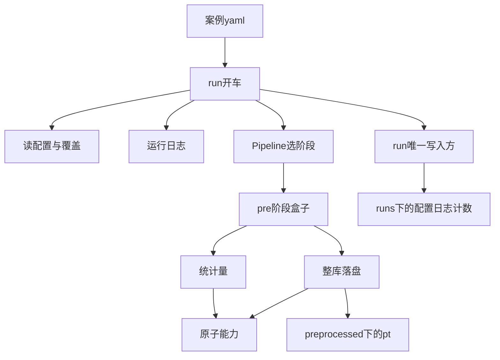

> 2026-09-07 实施修订：原计划的张量/统计和配置/Stage/Pipeline/run 入口已交付并保留。前处理 build=standard、pre 内批量循环、依赖名称后缀的分组、删除旧目录后提交以及扫描猜测统计目录的部分，已由本次“前处理架构与张量交付优化”替代。现行行为以 abilities/applications/run/recipe PRD 为准；recipe 展示可见业务步骤，run 执行样本循环，同组身份强制校验，写入支持备份恢复，统计仅消费本次结果。


# ShapeNet-Car 前处理 recipe 落地

### 业务描述总结

- **做什么**
  - 给走 AB-UPT / ShapeNet-Car 的研究员一条案例入口：原始数据已经在盘上，读案例配置就能整库校验或写出训练张量，并拿到统计量路径。
  - 做成后：对本机 `/Users/zonghui/work/datasets/shapenet_car_cfd/mlcfd_data/training_data` 直接前处理；张量落在同套数据根下的 `preprocessed/`；一次运行另有开车记录（展开配置、日志、计数）。
- **怎么做**
  - 原子能力继续只做抽洗、几何、编码、写出、累计矩。**本次不下载、不解官方包、不删样本目录。**
  - 外流 `pre` 装配交出一条阶段：整库落盘 → 统计量。这是封装对象，不是入口。
  - `run` 包负责开车：读配置、建本次运行、打运行日志、调用管道、由唯一写入方记下配置与日志。它不认压力/速度怎么算。
  - 案例层只声明路径、排除名单、对照表、开关，并选择标准装配。入口不含循环或张量运算。
  - `.pt` 仍写到数据目录的 `preprocessed/`，不是 run 产物。

### 讨论

- **第 1 项下载不做**
  - 原始树已经在 `/Users/zonghui/work/datasets/shapenet_car_cfd/mlcfd_data/training_data`。
  - 本次入口只做前处理（功能表 2–25 的「已有原始数据」侧）。不下载 zip、不解 `param*.tar.gz`、不删除四个缺 VTK 目录。排除仍靠配置名单跳过，不改磁盘上的原始树。

- **Stage 是干什么的**
  - Stage（阶段）是**一条业务阶段的盒子**，例如前处理、建模、训练、后处理各一盒。盒子里是若干可调用步骤，执行时只做一件事：`x = step(x)`。
  - 它不管「谁按下运行」、不管日志目录、不管 Hydra。它回答：这一段业务按什么顺序调用已有封装。
  - 外流前处理的标准装配 `standard(cfg)` 的产出就是一个名为 `pre` 的阶段，里面是「整库物化、再定统计量」。换案例只换配置，不换这个盒子的形状。
  - Pipeline（阶段管道）再按 yaml 里的 `pipeline.stages` 决定这次打开哪几盒。本次只打开 `pre`。
  - 本次步骤是**作业级**（整库一次），上下文是作业映射（配置、路径、计数），还不是样本对象。日后同一阶段类型可再挂样本级步骤，recipe 入口形状不变。

- **`run` 包装的是开车的底层，不是业务算法**
  - 你的判断对了一半：`packages/ai4e-core/run/` 应当是**一次运行怎么被驱动**——读配置、建运行目录、接日志、把管道跑起来、把这次输入记下来。
  - 架构里它和 Stage 必须分开：Stage / Pipeline 在 `applications/base`（怎么装配业务阶段）；`run` 是运行时底座（怎么把一次作业开起来并记下来）。不能把「前处理有哪几步」写进 run，否则换训练阶段还要改开车层。
  - 权威架构对 Hydra 的取舍不变：core 用 OmegaConf（配置对象）做合并、插值和点号覆盖；**不引入 `hydra-core`，不用 `@hydra.main`**。扫参以后才在 task 里接 Hydra。本次 run 里落地的是「读配置 + 覆盖 + 运行日志」，味道像 Hydra，不是再装一套 Hydra 包。
  - 磁盘上的 `runs/<本次>/` 由 `run/writer`（唯一写入方）写出：`inputs/config.yaml`、`resolved.yaml`、`logs/`、作业摘要。**不写 `.pt`。** 训练张量继续在数据根的 `preprocessed/`。

- **三层各管什么**
  - 原子能力：单个函数，不认 ShapeNet、889、输出根。
  - 业务装配：封装对象，交出 `pre` 阶段。
  - `run`：开车与记录。
  - 案例：yaml 管算什么，薄 `pre.py` 只选择标准装配。

- **本机数据位置**
  - 与 Noether 脚本一致：数据根 `/Users/zonghui/work/datasets/shapenet_car_cfd`，原始根 `mlcfd_data/training_data`，张量写到 `dataset_root/preprocessed/`。
  - 案例 yaml 默认对齐这两条；测试用临时夹具，不写死这台机器的路径。



### 实施评审

#### 功能点

**主功能 A：研究员用案例配置对已有原始树做前处理**

BDD：

- Given 案例配置指向已解开的 `param0`–`param8`，排除名单与期望总数已声明
- When 研究员启动案例前处理入口（非 dry-run）
- Then 对照表中的表面/体积场写到 `preprocessed/`；随包统计量路径可读取；`runs/` 下有展开配置、日志和成功/失败计数

子功能：

- A1：dry-run 仍跑读抽洗与几何，不写 `.pt`
- A2：命令行可覆盖数据根、输出根和开关，且覆盖进入展开配置与日志

**主功能 B：一次运行由 run 包开车并留下记录**

BDD：

- Given 同一份案例配置
- When 开车层读配置并执行已选阶段
- Then 运行目录出现原始配置、展开配置和日志；目录中没有训练 `.pt`

子功能：

- B1：只执行 yaml 里声明的阶段（本次仅 `pre`）

**辅助 C：阶段盒子只顺序执行内部步骤，一步失败则该阶段停止**

#### 接口

`Stage`（阶段），在 `applications/base`（通用装配）：名字和步骤列表进去，按顺序 `ctx = step(ctx)`。步骤必须可调用。本次上下文是作业映射。

`Pipeline`（阶段管道），在 `applications/base`：按 `pipeline.stages` 打开对应阶段盒子。不管日志目录，不读命令行。

`run` 开车入口，在 `run/`（运行底座）：读配置、建本次运行、接日志、调用管道、请唯一写入方落记录。输入是配置路径和可选覆盖；输出是运行目录路径与摘要。

`standard(cfg)`，在 `applications/aero_cfd/pre`（外流 pre 标准装配）：配置进去，交出只含整库物化与统计量的 `pre` 阶段。不准备原始树。

案例 `pre.py`：`build` 指向 `standard`。

`run/writer`：只写运行目录里的配置、日志和摘要，不写 `.pt`。

#### 架构改动

- 空的 `applications/base` 落下最小 Stage / Pipeline：业务阶段怎么装、怎么选。
- 空的 `run/` 落下开车入口、日志和唯一写入：一次作业怎么被驱动和记下来。配置解析仍走 `base/config`（OmegaConf），由 run 调用，不把 yaml 语法散进业务装配。
- 不引入 `hydra-core`。不落地下载/解包装配。
- recipe 增加薄 `pre.py`；yaml 默认数据根对齐已有本机路径，并声明 `pipeline.stages: [pre]`。

#### 文件改动

```text
packages/ai4e-core/applications/base/stage.py          新增（阶段盒子）
packages/ai4e-core/applications/base/pipeline.py       新增（按 yaml 选阶段）
packages/ai4e-core/applications/base/__init__.py       新增（导出 Stage/Pipeline）
packages/ai4e-core/run/runner.py                       新增（开车：读配置、日志、调管道）
packages/ai4e-core/run/writer.py                       新增（运行目录唯一写入）
packages/ai4e-core/base/config/load.py                 修改（OmegaConf + 覆盖）
packages/ai4e-core/applications/aero_cfd/pre/standard.py 新增（交出 pre 阶段：物化+统计量）
packages/ai4e-core/pyproject.toml                      修改（增加 omegaconf）
packages/ai4e-recipes/aero_cfd/pre.py                  新增（build = standard）
packages/ai4e-recipes/aero_cfd/__main__.py             新增（转交给 run 开车入口）
packages/ai4e-recipes/aero_cfd/config.yaml             修改（本机已有路径、输出根、pipeline）
docs/PRD/ai4e-core/applications/PRD.md                 修改（阶段与标准装配）
docs/PRD/ai4e-core/run/PRD.md                          新增（开车、日志、写入；不写张量）
docs/PRD/ai4e-recipes/aero_cfd/PRD.md                  新增（案例入口与已有数据根）
AGENTS.md / .context / 包 README                       修改（已交付边界与验收入口）
tests/integration/test_shapenet_pre_recipe.py          新增（覆盖 A–C 各叶）
```

不改「张量落盘与统计量」那份旧计划。不新增 `prepare.py`。不在 recipe 里写循环或 VTK 算法。

#### 实施步骤

1. OmegaConf 读配置并支持点号覆盖 → 覆盖后的树可还原
2. Stage 顺序执行；一步失败不继续 → 假步骤测通
3. run 开车 + writer：有日志和展开配置，目录中无 `.pt`
4. `standard(cfg)` 只串已有整库物化与统计量；recipe `build` 只做选择
5. Pipeline 只跑 `pre`；yaml 默认根对齐已有本机数据
6. 带齐文档与 `test_shapenet_pre_recipe.py`
7. 验收只跑：`uv run pytest tests/integration/test_shapenet_pre_recipe.py`

上下游：案例 yaml 提供已有原始根与开关；run 读配置并开车；装配消费已有物化/统计量；失败时日志和摘要带阶段名或样本相对路径。

#### 测试用例

- A：夹具三样本走案例入口非 dry-run → `preprocessed/` 有对照表点场，`runs/` 有 `resolved.yaml`、日志与计数；`tests/integration/test_shapenet_pre_recipe.py`（案例前处理）
- A1：同一夹具 dry-run → 无 `.pt`，摘要仍有将要写出的逻辑名
- A2：命令行覆盖 `dataset.root` → 展开配置与日志为覆盖后的路径
- B：开车后检查运行目录 → 有配置和日志，无任何 `.pt`
- B1：`pipeline.stages: [pre]` → 只执行 pre
- C：阶段内第二步抛错 → 该阶段停止，摘要带步骤名
- 本地真实树（无数据则 skip）：对本机默认根 dry-run 或抽一个样本写出；`@pytest.mark.local_data`

未做：下载/解包/删目录、完整 Sample/字段契约、内容寻址缓存、四档 profile、train/model/post、`hydra-core` / `@hydra.main`、把 `.pt` 写入 run。
