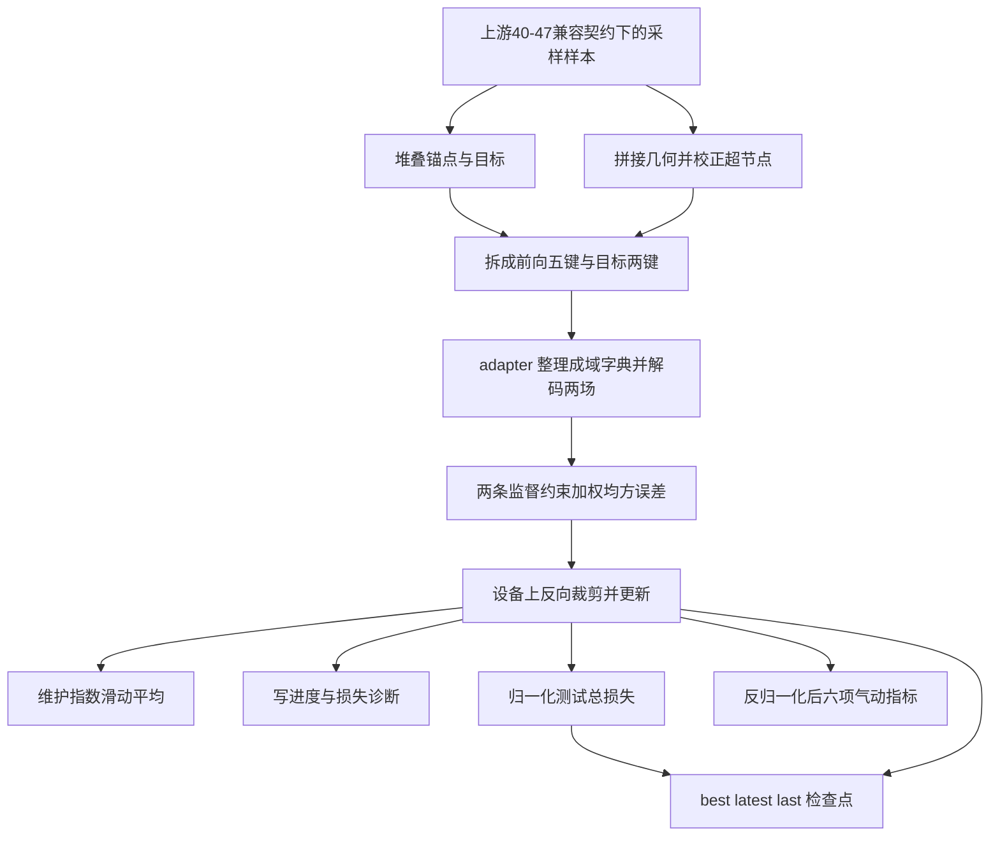

# 第 48–64 项：从已带目标的样本到检查点

编号以 [noether/docs/abupt_shapenet_训练流程功能列表.md](/Users/zonghui/work/new_code_project/noether/docs/abupt_shapenet_训练流程功能列表.md) 的 Excel 表为准。本次**实施 48–64**。第 **40–47** 项（归一化、采样、改回标准场名、复制监督目标）必须按下方兼容契约来设计，但**不由本切片实现**；本切片只消费合入后的字典与逆变换入口。

## 业务描述总结

- **做什么**
  - 给走外流训练的研究员：在已打开预处理库、已选定 AB-UPT 的同一条开车路上，把「已带监督目标的采样单样本」变成可前向、可算损失、可走几步更新、可在测试集上比、可留下检查点的训练闭环。
  - 做成后：覆盖为只开 `train` 且声明了训练轮数时，运行目录里有展开配置、日志、训练诊断，以及 `best` / `latest` / `last` 检查点；摘要能抄到分项损失和测试指标。默认案例仍只开前处理，不会误训。
- **怎么做**
  - 上游按兼容契约交出带两个 `*_target`（目标键）的采样样本；本切片不写归一化、采样或目标复制，只堆成一批，把五键给模型、两键给约束。
  - 模型前向只经外流 adapter，网络本体留在独立模型仓库。
  - 压力与速度各是一条监督约束，训练循环只汇总、反向、回调，不认场名。
  - 检查点只经已有运行写入方落入本次运行目录；训练张量仍不进运行目录。
  - 配置构建、代码快照仍保持命名占位；本切片只填「认设备」和「实例化可训对象」。



## 讨论

- **40–47 兼容契约（本切片只认、不实施）**
  - 另一 agent 负责第 40–47 项。本切片不得新增或改写归一化 apply/inverse、采样、改名、目标复制，也不得另起一套场名。
  - 合入后必须与已落地的读盘探测兼容：第 36–39 项仍交出磁盘七场加现场表面距离；40–47 是探测之后的准备，未打开时不得改探测字典，也不得让现有读盘用例失败。
  - 归一化必须可逆且与后处理共用同一套统计量：压力、速度、两域距离、两域坐标按现有随包统计量变换；表面距离复用体积距离的均值方差；法向不归一化。第 63 项只调用对方的逆变换入口，公式不在本切片。
  - 采样后单样本**没有批次维**。默认规模：几何 3586、超节点 512、两域锚点各 256。必须同时保留：几何三键、两域锚点坐标、标准压力/速度，以及第 47 项复制出的 `surface_pressure_target` / `volume_velocity_target`。第 47 项是复制不是改名，原键仍在，坐标与场同索引。
  - 物理特征（距离、法向）可以读、可以归一，但不进入前向五键。默认一批一个样本。
  - 准备步骤做成可注入钩子。对方未合入时，本切片用符合上述键名与形状的夹具，作业级不假装已接到真实 40–47。
  - 本切片收批、拆分、约束、adapter 一律按上述键名接线，避免对方合入后还要改二次。

- **第 27–35 项占位填多少**
  - 第 58–64 项必须有设备、模型、优化器、循环。本切片把「认设备」和「实例化 adapter / 约束 / 循环 / 回调」从占位改成真步骤。
  - 不搬 Hydra / Factory，不新造运行号，不写代码快照。第 27–32、35 项仍打尚未实现标记；超参由案例配置直接读入实例化，不另建 preset 系统。
  - 现有读盘探测用例断言九个占位名。本切片会改掉其中两个，必须同步改该用例，不得让旧断言挡住训练闭环。

- **adapter 不复制网络**
  - 独立参考在 `/Users/zonghui/work/new_code_project/AB-UPT/`。该包当前不是可安装模块，且一批多于一个样本会断言失败；解码键是扁平的 `surface_anchor_pressure` 等，不是训练契约里的 `surface_pressure` `(一批, 256, 1)` / `volume_velocity` `(一批, 256, 3)`。
  - 本仓 adapter 负责：扁平五键 ↔ 骨干输入，以及把骨干输出切成上述两场。骨干经全限定导入路径注入；测试用形状正确的替身。未配置真实骨干时，契约测试仍过，不强制本机导入独立包。
  - 禁止 `import noether`，禁止把 attention / block 抄进 `abilities/modeling`。

- **损失走约束，不焊进训练器**
  - 压力、速度各一条监督约束，权重 1.0，在归一化空间算均方误差。循环只执行约束集合、求和、反向。缺正权重目标或对应预测则失败，不静默跳过。
  - 不为加权均方误差再写一套 Trainer 子类。

- **不另开训练入口**
  - 仍是案例 → 开车 → 已有阶段盒子 → 原子能力。案例 `train.py` 继续只选标准装配。默认阶段名单仍只开前处理。
  - 只有打开 `train` 且配置了大于 0 的轮数时才跑循环；未声明轮数时保持现在的读盘探测，避免默认误训。

- **EMA 与检查点**
  - 每次参数更新后维护因子 0.9999 的滑动平均，可调用即可。官方脚本只训 2 轮、现有对照运行往往没有 EMA 文件；本切片不强制写出 EMA 检查点。
  - `best` 看测试集归一化总损失；周期写 `latest`；结束写 `last`。文件只经运行写入方进入本次运行目录的检查点子目录。不写训练 `.pt` 进运行目录。
  - 本切片不做分布式、不做十倍重复测试集、不做推理第 65 项及以后。

- **优化器**
  - 对照脚本是 Lion。当前核心包依赖清单没有 Lion。本切片用已有 Torch 的 AdamW，学习率 `5e-5`、权重衰减 `0.05`、梯度裁剪 `1.0`，把「优化器种类对齐 Lion」留在第 28 项占位，不新开依赖文件。

## 实施评审

### 功能点

**主功能 A：把已带目标键的采样样本收成一批，并拆开给模型和约束**

BDD：

- Given 上游已按兼容契约交出带两个目标键的采样样本
- When 按一批堆叠并拆分
- Then 模型侧只有五键，约束侧只有两个目标键；几何跨样本拼接后超节点下标已加上点偏移

子功能：

- A1：确认批次能消费已有 `*_target`；缺目标键则失败，本切片不补做复制
- A2：堆叠两域锚点坐标与两个目标（密场带批次维）
- A3：拼接几何点、生成 `geometry_batch_idx`、校正 `geometry_supernode_idx`
- A4：按清单拆分；缺键或多键发出警告，不把目标喂给模型

**主功能 B：经 adapter 完成一次命名前向**

BDD：

- Given 已拆好的前向五键
- When adapter 调用注入的骨干并整理输出
- Then 得到 `surface_pressure` 形状 `(一批, 256, 1)` 与 `volume_velocity` 形状 `(一批, 256, 3)`，训练阶段没有 query 键

子功能：

- B1：扁平五键整理为几何输入与两域锚点
- B2：把骨干输出切成上述两个标准场名（不复制网络源码）

**主功能 C：两条监督约束合成总损失**

BDD：

- Given 模型已给出两场预测，批次里有对应目标
- When 执行两条权重为 1.0 的监督均方误差并汇总
- Then 得到压力分项、速度分项和总损失；缺任一正权重目标或预测则失败

子功能：

- C1：表面压力均方误差
- C2：体积速度均方误差
- C3：分项求和为总损失，同时保留分项日志名

**主功能 D：在设备上走完可重复的短训练循环**

BDD：

- Given 已实例化的 adapter、约束、优化器，以及至少一批数据
- When 按配置轮数跑循环
- Then 参数被更新、损失有限、进度/损失/学习率可记；每次更新后可维护滑动平均

子功能：

- D1：认设备，批次上设备，可选混合精度下前向，反向、裁剪、优化器一步
- D2：推进轮次与更新计数，周期触发回调
- D3：更新后维护因子 0.9999 的滑动平均
- D4：默认诊断：进度、在线损失、学习率；环境相关项不强制全开

**主功能 E：测试集评估并留下检查点**

BDD：

- Given 短循环已能前向和算损失
- When 在测试批次上评估并在训练结束保存
- Then 写出归一化测试总损失、反归一化后压力/速度的均方误差、平均绝对误差、相对 L2，以及 `best` / `latest` / `last` 检查点

子功能：

- E1：测试集走同一前向与约束契约，记 `loss/test/total` 及两分项；该总损失选 `best`
- E2：调用上游逆变换后算六项气动指标；目标范数过小则跳过相对 L2 并警告
- E3：测试总损失变好时写 `best`，周期写 `latest`，结束写 `last`；只经运行写入方落盘

**辅助 F：案例声明与文档验收带齐**

- F1：案例配置补上前向/目标清单、场权重、轮数、滑动平均因子、设备；`train.py` 仍只选标准装配
- F2：同步入口说明、模块索引、相关产品说明与相关测试

### 接口

已带目标键的采样单样本到本切片，在 `applications/aero_cfd/train`（训练装配）：输入必须已满足 40–47 兼容契约（标准场 + 两个目标键，无批次维）。本切片只收批与拆分。对方未合入时用同形状夹具，不在内部重做第 40–47 项。

adapter 入口，在 `applications/aero_cfd/model`（模型装配）：吃前向五键，调用注入骨干，吐出两场标准预测。骨干缺席时契约测试用替身。

约束入口，在 `abilities/constraint`（约束）：吃批次、预测和上下文，吐出具名标量、当前权重。循环不认场名。

逆变换入口（对方交付），由气动指标回调调用：场名加归一化张量进去，物理尺度张量出来。本切片不实现变换公式。

检查点写入，在 `run/writer`（运行写入方）：权重与少量元数据写入本次运行目录的检查点子目录，不写训练张量。

### 架构改动

- 训练损失从「训练器内加权均方误差」改为两条监督约束加循环汇总：为以后加物理约束留同一插口。
- 模型前向从占位改为外流 adapter：扁平批次与独立骨干之间只留一层映射，网络不进本仓。
- 运行写入方增加检查点写出：保持「运行目录只有一个写入方」。
- 第 33–34 项从占位改为真实步骤：循环需要可训对象；仍不引入第二套开车或 Factory。
- 训练循环落在 `abilities/training` 的固定循环文件，只开放回调和约束，不开放整环替换。

### 文件改动

```text
packages/ai4e-core/
  abilities/data/batch.py                         新增（密场堆叠、稀疏几何拼接；不复制目标）
  abilities/constraint/result.py                  新增（约束结果）
  abilities/constraint/supervised.py              新增（监督均方误差）
  abilities/eval/metrics.py                       新增（均方误差、平均绝对误差、相对 L2）
  abilities/training/split.py                     新增（按清单拆前向与目标）
  abilities/training/loop.py                      新增（固定循环：前向、约束、更新、回调）
  abilities/training/callbacks/ema.py             新增（滑动平均）
  abilities/training/callbacks/diagnostics.py     新增（进度、在线损失、学习率）
  abilities/training/callbacks/offline_loss.py    新增（测试集归一化损失）
  abilities/training/callbacks/aero_metrics.py    新增（反归一化后六项指标）
  abilities/training/callbacks/checkpoint.py      新增（best/latest/last 决策）
  applications/aero_cfd/model/adapter.py          新增（扁平五键与两场输出）
  applications/aero_cfd/train/standard.py         修改（认设备、实例化、有轮数时跑循环）
  applications/aero_cfd/train/batch.py            新增（外流收批装配，只调公开能力）
  run/writer.py                                   修改（检查点写入）
packages/ai4e-recipes/aero_cfd/
  config.yaml                                     修改（训练清单、权重、轮数、设备）
  train.py                                        不改职责（仍只选标准装配）
AGENTS.md                                         修改（train 已到循环与检查点；27–32/35 仍占位）
.context/index.md                                 修改
.context/modules/ai4e-core.md                     修改
.context/modules/ai4e-recipes.md                  修改（若训练配置职责变化）
.context/mvp/abupt-mvp1.md                        修改
docs/PRD/ai4e-core/abilities/PRD.md               修改（约束、训练循环、指标）
docs/PRD/ai4e-core/applications/PRD.md            修改（train 从探测延伸到短循环）
docs/PRD/ai4e-core/run/PRD.md                     修改（检查点写出）
docs/PRD/ai4e-recipes/aero_cfd/PRD.md             修改（训练声明段）
tests/integration/test_train_loop.py              新增（48–64 相关叶子）
tests/integration/test_train_dataset_read.py      修改（第 33–34 项不再是占位）
```

### 实施步骤

1. 落地密场堆叠、稀疏几何拼接与拆分（夹具已带目标键）→ 五键/两键与超节点偏移正确；缺目标键失败
2. 落地监督约束与分项求和 → 缺键失败，权重 1.0 时总损失等于两分项之和
3. 落地外流 adapter（替身骨干）→ 输出两场标准名与形状
4. 落地认设备、一步更新、固定循环、滑动平均与默认诊断 → 一步后参数变化且损失有限
5. 落地测试损失、六项指标、写入方检查点 → `best` 随测试总损失更新，`last` 在结束出现
6. 标准装配串上有轮数才跑循环；案例配置补声明；同步入口、索引、产品说明
7. 跑通本切片相关用例，不跑全仓

### 测试用例

- A1：夹具已带两个目标键时可拆分；缺任一目标键失败且本切片不补键；`tests/integration/test_train_loop.py`（消费目标键）
- A2：一批两个样本时锚点与目标首维为 2；同一文件（密场堆叠）
- A3：第二件样本的超节点下标加上第一件几何点数；同一文件（稀疏几何）
- A4：五键进前向、两键进目标；多键只警告；同一文件（拆分）
- B1/B2：替身骨干收到几何与两域锚点，返回正确形状的两场；同一文件（adapter 契约）
- C1–C3：两场权重 1.0 时总损失为两均方误差之和；缺目标失败；同一文件（约束）
- D1：cpu 上一步后参数变化、总损失有限；同一文件（一步优化）
- D2/D4：轮数为 1 时诊断里有损失与学习率；同一文件（短循环诊断）
- D3：更新后滑动副本不等于实时参数（因子非 1）；同一文件（滑动平均）
- E1：测试总损失键为 `loss/test/total`；同一文件（离线损失）
- E2：注入逆变换后六项都出现；目标全零时相对 L2 可缺；同一文件（气动指标）
- E3：测试损失变好写出 `best`，结束有 `last` / `latest`，且在运行目录检查点子目录；同一文件（检查点）
- F：现有读盘探测仍能列出分片并读 test 第 0 个；占位减为七个；`tests/integration/test_train_dataset_read.py`（探测回归）

验收只跑：

```bash
uv run pytest tests/integration/test_train_loop.py tests/integration/test_train_dataset_read.py
```

真实骨干或本机 789 样本不作为本切片门禁。需要本机数据时继续用 `@pytest.mark.local_data`。

### 修改与验收（计划自检）

1. **上下游整条链**：上游 40–47 按兼容契约提供带目标键的采样样本与可逆变换；本切片收批、前向、约束、循环；运行写入方收检查点与摘要；失败时阶段带步骤名停止，不写半成品检查点冒充成功。40–47 未合入时，钩子与夹具保证 48–64 可测，作业级不假装已接到真实准备，也不改现有读盘探测。
2. **同一改动带齐**：入口说明、`.context`、abilities / applications / run / recipes 四份产品说明、相关测试。
3. **相关测试验收**：只跑上面两条命令中的两个文件。
