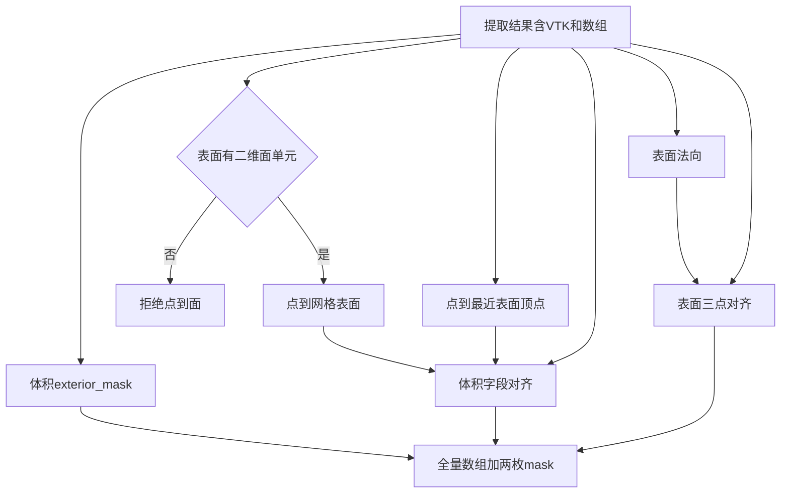

> 后续优化已替代本历史计划中的“存在面即放行”“按数量回贴法向”“pressure/velocity 必填”和“隐式全量几何”行为。现行语义见 abilities/applications PRD 与 recipe 的 aero_cfd PRD；当前实现采用全二维面门禁、原点身份回贴及显式 enabled 清单。

# 第 15–19 项：几何派生、域标记与点数校验

Experience 检索无相关命中（`receipt_d2aa9dd162b34243afe2bcc04e13722a`、`receipt_4e01986d5ade4522a934efe52c699a21`、`receipt_81c77d6dfb7e4f999ca4325b1dce9bf8`）。依据：Noether `get_sdf` / CAEML 预处理、AB-UPT 论文、本仓提取装配已交 `vtk`、点到顶点 / 点到面公开算法。

用户入口只转调官方脚本；第 15–19 项在 [`preprocessing.py`](noether/src/noether/data/datasets/cfd/shapenet_car/preprocessing.py)。本仓不得 `import noether`。

已拍板：体积点先全部保留，只标记重合点；不删点、不写 `.pt`。第 12–13 项对照、第 20–21 项落盘不在范围。装配留 VTK 已由提取计划落地，本切片只消费。点到点和点到面**并存**，字段名分开，互不顶替。

### 业务描述总结

- **做什么**
  - 给走外流预处理的研究员：在已抽出的表面/体积结果上，同时得到两套体积几何量——到最近表面顶点的非负距离和方向（对齐 AB-UPT / 功能表第 15 项），以及到网格表面的有符号距离、面上最近点和方向。
  - 点到面只在已确认「有拓扑、有表面」时才算；裸点云或无网格对象当场拒绝，不悄悄改成点到点。
  - 另得表面网格法向，并标出与表面坐标重合的体积点。
  - 表面位置/压力/法向对不齐，或体积位置/速度/两套几何量对不齐时当场拒绝。
  - 做成后仍是全量数组和 mask。第 15 项字段不叫成「真 SDF」；真 SDF 用另一组名字。
- **怎么做**
  - 点到点只吃坐标，不要求单元。
  - 点到面先校验表面对象是带二维面单元的网格，通过后才求距离。
  - 表面法向、重合点标记和点数对齐仍按原分工；新装配消费提取结果，失败由装配层感知。

### 讨论

- **第 15 项：sklearn 在算什么、判断用在哪**
  - `get_sdf` 对每个体积点，在全部表面顶点里找欧氏最近的一个，再算非负距离和方向 `(体积点 - 最近顶点) / (距离 + 1e-8)`。
  - [`NearestNeighbors`](https://sklearn.org/stable/modules/generated/sklearn.neighbors.NearestNeighbors.html) 是点云 1-NN，不看单元。[邻居算法说明](http://scikit-learn.org/stable/modules/neighbors)写明检索的是被索引的样本点。
  - 这个判断只用来生成将落盘的 `volume_sdf` / `volume_normals`。第 16 项表面法向、第 17 项坐标重合都不走它。当前训练默认不把这两场送进模型。
- **点到面：通行算法与本仓做法**
  - 最近点可落在面内、边或顶点；到最近顶点只会大于等于到表面的距离。
  - 通行做法：单元定位器找面上最近点，符号用角加权伪法向（[Bærentzen & Aanæs 2005](https://doi.org/10.1109/tvcg.2005.49)）。VTK [`vtkImplicitPolyDataDistance`](https://vtk.org/doc/nightly/html/classvtkImplicitPolyDataDistance.html) 即此：先三角化，再 cell locator，外侧为正、内侧为负。
  - 本仓用这条已有 VTK 能力，不加 trimesh / sklearn。交出有符号距离、面上最近点、指向该点的方向。不裁成非负，不顶替第 15 项。
- **点到面必须先确认有表面，不能拿点云来算**
  - 点到面用的是面上最近点，没有面单元就没有「表面」，只有散点。无网格对象、只有点没有单元、只有顶点/线、或只有体单元而没有三角/四边/多边形，都先拒绝，不进入定位器。
  - 校验在求距离之前做完；失败不返回半成品，也不退回点到点。点到点仍然只吃坐标，两套入口分开。
  - 调用方应传入表面网格（例如带 quad 的车身），不要把体积六面体或坐标数组冒充表面。
- **为什么 AB-UPT / ShapeNet-Car 没用点到面（不是因为点云复原不了表面）**
  - **不是复原问题。** 预处理手里就有带 quad 单元的表面网格，第 16 项还专门用网格算法向。真要算点到面，当时就有拓扑，不必先从点云复原表面。
  - **训练读盘只剩点，是先选了点到点的结果，不是原因。** SDF 在预处理算完再落盘。他们完全可以当时用网格算出真 SDF，训练仍然只读一个标量。
  - **主要是省事，并且只当可有可无的弱特征。** [AB-UPT 论文](https://arxiv.org/html/2502.09692v4)写明：各分支默认不需要附加输入，法向和 SDF 只是「可以加」。ShapeNet-Car 默认关掉物理特征。sklearn 几行就能出近似靠近程度；真 SDF 要三角化、定号、处理非封闭壳体。
  - **他们自己也不把这当几何真值。** 训练时表面 SDF 直接填全零，好和表面法向拼接；体积「法向」其实是指向最近顶点的方向，和表面网格法向是两套东西。
  - **同一仓库已经承认点到点是近似。** CAEML 预处理在有 STL 时走 `trimesh` 点到面，否则走 `cKDTree` 并打印 `Approximating surface distance via cKDTree`。ShapeNet-Car 只留了便宜的那条。
  - **车身表面未必封闭，符号本身就不稳。** 点到面的「内负外正」依赖可定向、尽量封闭的壳体。开曲面或法向不统一时，符号会飘。点到点没有符号问题，和「只当靠近程度」更合拍。
- **本仓怎么复刻点到点**
  - 判断位置与 Noether 相同：体积点 → 最近表面顶点。输入是未套 mask 的两组坐标。
  - 用 VTK 点定位器做 1-NN，距离和方向公式对齐，`1e-8` 不变。等距平局可能与 sklearn 选中不同顶点；合成用例锁公式，不要求逐点 bit-exact。
- **第 16–19 项**
  - 第 16 项：表面网格法向，深拷贝后算，含 NaN 失败。
  - 第 17 项：只出 `exterior_mask`（`True` = 不重合）。
  - 第 18–19 项：校验全量字段。点到点四字段仍对齐功能表；点到面各量也必须与体积点数等长。
- **装配**
  - 提取已交每域 `vtk`、`points`、具名 `fields`、`mask`。新函数消费这份结果：法向和点到面吃表面 `vtk`（点到面先做表面校验），点到点和重合标记吃两域 `points`。
  - 表面过不了校验时，点到面失败、装配失败；点到点不顶替。不改提取入口。点到面符号在非封闭车身上不做「必须全为正」的验收。



### 实施评审

#### 功能点

**主功能 A：由体积点得到到最近表面顶点的距离和方向**

BDD：

- Given 研究员已有体积点坐标和表面点坐标
- When 研究员按最近表面顶点计算距离和方向
- Then 得到与体积点数等长的非负距离，以及按同一公式得到的方向；距离为零时方向按公式退化，不抛错

子功能：

- A1：边界点为空或维度不是三维时拒绝

**主功能 B：由体积点得到到网格表面的有符号距离**

BDD：

- Given 研究员已有体积点坐标，以及带二维面单元的表面网格
- When 研究员先确认有表面拓扑，再计算点到表面的距离
- Then 得到与体积点数等长的有符号距离、面上最近点和方向；对着面心时，绝对值小于到四顶点的距离

子功能：

- B1：无网格对象、裸点云、只有顶点/线、或只有体单元时，在求距离之前拒绝
- B2：不改写输入网格

**主功能 C：由表面网格得到点法向**

BDD：

- Given 研究员已有带单元的表面网格对象
- When 研究员计算表面点法向
- Then 得到与点数对齐、已归一化的法向，且原网格未被改写

子功能：

- C1：法向含 NaN 时拒绝

**主功能 D：标出与表面重合的体积点**

BDD：

- Given 研究员已有体积坐标和表面坐标
- When 研究员标记域归属
- Then 得到与体积点数等长的布尔 mask：`True` 为不重合，`False` 为精确重合；体积数组长度不变

子功能：

- D1：用坐标精确相等判断，不按距离阈值合并

**主功能 E：校验表面三字段与体积各几何量点数对齐**

BDD：

- Given 研究员已有表面位置/压力/法向，以及体积位置/速度、点到点距离/方向、点到面距离/最近点/方向
- When 研究员做点数校验
- Then 各组首维相等才放行；对不齐则失败并报出各字段长度

子功能：

- E1：`exterior_mask` 长度必须等于体积点数

**辅助 F：外流预处理在提取结果上串两套几何、域标记和点数校验**

- F1：消费已有提取结果，同时交出点到点、点到面、表面法向和 `exterior_mask`
- F2：不删点、不落盘、不做压力对照；两套距离字段名分开

**辅助 G：同步治理资料**

- G1：同步 `AGENTS.md`、`.context`、abilities/applications PRD 与 README

#### 接口

点到最近顶点在 `abilities/geometry/nearest.py`（几何派生）：两组三维坐标进去，出来非负距离和方向。不接收网格。

点到网格表面在 `abilities/geometry/mesh_sdf.py`（几何派生）：查询坐标和表面 VTK 进去。先确认是带三角/四边/多边形的数据集，通过后才深拷贝、三角化并求有符号距离、面上最近点和方向；校验失败不计算、不降级。

表面点法向在 `abilities/geometry/surface_normals.py`（几何派生）：表面 VTK 进去，出来与点数对齐的法向；先深拷贝，含 NaN 则失败。

重合点标记在 `abilities/data/clean/coincident.py`（清洗）：体积坐标和表面坐标进去，出来 `exterior_mask`。

点数对齐在 `abilities/data/clean/aligned.py`（清洗）：带字段名的数组进去，首维不一致则失败。

几何装配在 `applications/aero_cfd/pre/derive_geometry.py`（串联）：吃提取已交的每域结果，补上两套几何、法向和 `exterior_mask`。点到点键名对齐功能表习惯；点到面用另一组键名。

#### 架构改动

- 首次落地 `abilities/geometry/`：点到点、点到面、表面法向三条原子能力并列；点到面入口先拦无表面的点云，字段语义不混用。
- `data/clean` 扩到体积重合点标记和多字段点数校验；仍不删点。
- 外流 pre 增加提取之后的几何装配，不改提取入口。
- 不加 scikit-learn / meshio / trimesh。

#### 文件改动

```text
packages/ai4e-core/
  abilities/geometry/__init__.py               新增（公开点到点、点到面、表面法向）
  abilities/geometry/nearest.py                新增（第15项：到最近顶点）
  abilities/geometry/mesh_sdf.py               新增（先校验表面拓扑，再算点到面距离）
  abilities/geometry/surface_normals.py        新增（第16项：表面法向）
  abilities/data/clean/coincident.py           新增（第17项：exterior_mask）
  abilities/data/clean/aligned.py              新增（第18–19项及点到面长度）
  abilities/data/clean/__init__.py             修改（导出新清洗入口）
  applications/aero_cfd/pre/derive_geometry.py 新增（消费 DomainResult，串两套几何与校验）
  applications/aero_cfd/pre/__init__.py        修改（导出新装配，不改提取入口）
  README.md                                    修改（本切片含两种距离）
AGENTS.md                                      修改（geometry 边界与验收入口）
.context/index.md                              修改（已交付几何与域标记）
.context/modules/ai4e-core.md                  修改（geometry 与 clean 目录含义）
.context/mvp/abupt-mvp1.md                     修改（第15–19项已交付；点到面为附加能力）
docs/PRD/ai4e-core/abilities/PRD.md            修改（几何章写清两种距离）
docs/PRD/ai4e-core/applications/PRD.md         修改（pre 在提取之后串两套几何）
docs/PRD/README.md                             修改（模块状态）
tests/integration/test_geometry_domain.py      新增（覆盖 A–E、F）
```

不改 [`extract_sample.py`](AI4E_Dojo/packages/ai4e-core/applications/aero_cfd/pre/extract_sample.py) 的交接形状。

#### 实施步骤

1. 点到最近表面顶点可用 → 合成点符合公式；对着面心时距离大于垂距
2. 点到网格表面：先拦住点云和无面单元 → 再在带面网格上对着面心得到等于垂距的绝对值；不改原网格
3. 表面法向可用 → 平面四边形沿法线，NaN 失败
4. `exterior_mask` 与首维对齐可用 → 重合点为 `False`，长度不符列出各字段
5. 新装配同时交出两套几何 → 提取键不变，新键齐套且不删点
6. 同步治理文档 → 写清两种距离的名字、语义和为何并存
7. 只跑相关测试 → `uv run pytest tests/integration/test_geometry_domain.py`

#### 测试用例

- A：一体积点正对一个表面顶点 → 欧氏距离与单位方向；`tests/integration/test_geometry_domain.py`（点到点）
- A：一体积点对着正方形面心 → 点到点距离等于到顶点、大于垂距
- A1：边界点为空 → 拒绝；同一文件
- B：同一面心查询 → 有符号距离的绝对值等于垂距，面上最近点在面心附近；同一文件（点到面）
- B1：无网格对象、只有坐标的点云、只有线、或只有六面体 → 均在求距离前拒绝，且不退回点到点；同一文件
- B2：计算后输入网格未被改写；同一文件
- C：平面 quad → 点法向沿 z 且输入网格未被改写；同一文件
- C1：退化网格出 NaN → 拒绝；同一文件
- D：体积含两个重合点 → 对应位置 `False`，长度不变；同一文件
- D1：邻近但不相同的点为 `True`；同一文件
- E：表面三字段或体积任一几何量长度不一致 → 失败并含各长度；同一文件
- E1：`exterior_mask` 长度不等于体积点数 → 失败；同一文件
- F1：对提取结果做几何装配 → 原键仍在，并有点到点、点到面、法向、`exterior_mask`；同一文件
- F2：真实 ShapeNet 样本（`@local_data`）→ 点到点非负、法向无 NaN、两枚 mask 与点数等长，体积点数未被裁掉；不要求点到面符号全为正
- G1：核对应索引与 PRD 已分开两种距离的名字和语义

#### 修改与验收

1. **上下游**：提取装配提供每域 VTK、坐标、具名字段和表面 mask。本切片交出点到点距离/方向、点到面距离/最近点/方向、表面法向、`exterior_mask`。消费方是后续落盘（第 15 项字段进原 filemap；点到面另键，本切片不写盘）。失败由原子能力抛错、装配层感知。
2. **同一改动带齐**：`AGENTS.md`、`.context`、两份模块 PRD、相关测试一并改。
3. **相关测试**：只跑 `tests/integration/test_geometry_domain.py`，不跑全仓冒充验收。
