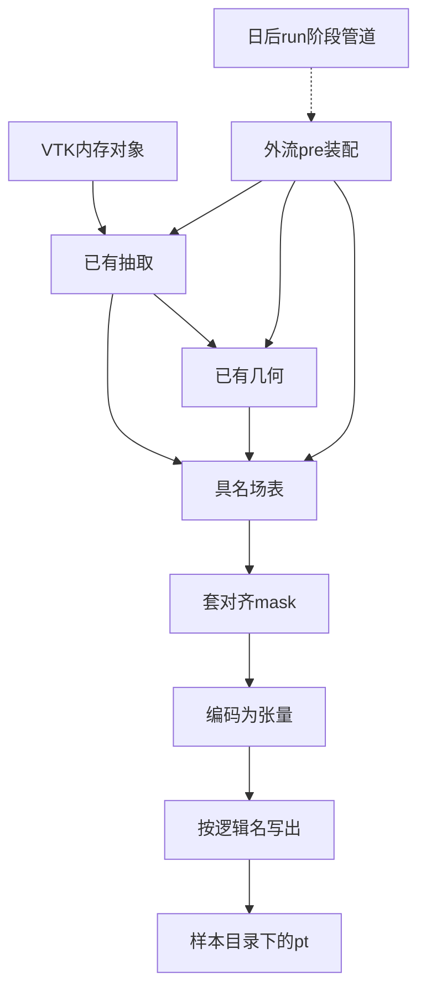

> 2026-09-07 实施修订：原计划的张量/统计和配置/Stage/Pipeline/run 入口已交付并保留。前处理 build=standard、pre 内批量循环、依赖名称后缀的分组、删除旧目录后提交以及扫描猜测统计目录的部分，已由本次“前处理架构与张量交付优化”替代。现行行为以 abilities/applications/run/recipe PRD 为准；recipe 展示可见业务步骤，run 执行样本循环，同组身份强制校验，写入支持备份恢复，统计仅消费本次结果。


# 第 20–25 项：张量落盘、编排与统计量

### 业务描述总结

- **做什么**
  - 给走 AB-UPT / ShapeNet-Car 的研究员：把已经抽出、清洗并补过几何的具名场，收成训练可读的磁盘张量；整库可只校验或全量写出；训练默认用随案例发布的统计量。
  - 做成后：一个样本目录里出现对照表声明的 `.pt`，同组点序对齐；有体网格且声明了单元场时另有 `cell.pt`。本切片**不**做训练期归一化，**不**把 VTK 或拓扑直接压成一张大张量。
- **怎么做**
  - 原子能力只处理「具名场记录」：数值、点/单元归属、标量/矢量、对齐组。清洗仍只出 mask；套 mask 和编码是落盘前的通用步。
  - 体积域预留单元组落盘位 `cell.pt`：只有输入了体网格才启用；表面域即使有四边形单元场也不写。当前 ShapeNet 体积网格没有单元场配置时，功能在、文件不出现。
  - 读哪几个场、叫什么文件名、写到哪、dry-run、首错是否继续，全部由外流 `pre` 装配决定。日后同一串步骤挂到 `run` 的阶段管道，不另写一套算法。
  - 案例只声明对照表、输出子目录和随包统计量。统计量能力只读文件或按数组流累计。

### 讨论

- **编排不进原子能力**
  - 你的判断对：第 22–24 项是作业怎么跑，不是数据怎么算。Noether 把它们和转张量写在同一个脚本里，本仓库要拆开。
  - 现在放在外流 `pre` 装配：单样本 = 读抽洗 → 几何 → 收成具名场 → 套 mask → 编码 → 写出；批量 = 枚举 + dry-run + 首错/继续。
  - 日后放进 `run` 的阶段管道：权威架构里 Stage 只做 `x = step(x)`，`data.offline.store` 是其中一步。本切片**不**新建 Stage / `run/writer`。预处理目录也不是一次实验的 run 产物，不走 run 唯一写入方。
  - 原子能力里不出现：样本枚举、889、排除名单、输出根目录策略、dry-run、继续开关。

- **网上怎么把网格收成训练张量**
  - 通行做法不是「一份 VTK → 一张大张量」。先抽成具名数值块，再用一份小契约说明每块是什么。
  - [PyTorch Geometric](https://github.com/pyg-team/pytorch_geometric/issues/1574) 把网格收成 `Data`：坐标、面、体单元各是一个具名张量；点场、单元场分开挂，不把整份网格压扁。[FAUST 数据集](https://pytorch-geometric.readthedocs.io/en/2.5.3/generated/torch_geometric.datasets.FAUST.html) 还把「落盘前变换」和「每次读取变换」分开，说明物化的是已经选好的具名块。
  - [NVIDIA PhysicsNeMo 的 Mesh](https://docs.nvidia.com/physicsnemo/latest/physicsnemo/api/mesh/core.html) 固定三层容器：顶点坐标、单元连接、以及顶点/单元/全局三本具名字典。单元场要进点模型时，另做「单元到点」的显式转换，不在读文件时偷偷平均。
  - [PhysicsNeMo Datapipes](https://docs.nvidia.com/physicsnemo/latest/physicsnemo/api/datapipes/physicsnemo.datapipes.html) 把读盘收成统一的张量字典；[CAE 数据管](https://docs.nvidia.com/physicsnemo/latest/physicsnemo/api/datapipes/physicsnemo.datapipes.cae.html) 再在字典上算 SDF、采样、归一化。读 VTK 的管子和「已经是 npy 再出字典」的管子是两条，互不假装同一种形态。
  - [Hugging Face Datasets 的 Features](https://huggingface.co/docs/datasets/v4.7.0/about_dataset_features) 用列名 + 数组类型描述数据：首维可以是变长点数，其余维（分量）固定。这就是「形态多变」时仍能通用的办法——变的是 N，不变的是每列的语义和尾维。
  - [VTKHDF](https://www.kitware.com/vtkhdf-file-format-2025-status-update/) 适合保住完整网格给可视和 HPC，不是训练随机读一个场的格式。本切片训练物化跟 Noether 一样走每场一个文件；VTK 原对象继续留在内存给几何，不在本切片另存一份网格。

- **落盘 `.pt` 规则（一份多物理量、多面体 VTK 怎么存）**
  - 不把整份 VTK 存成一个 `.pt`，也不把多面体连接、面、全局 FieldData 写成训练张量。多面体只影响「有效点 mask 认哪种单元」；认完之后，落盘看到的只是数值块。
  - 只写**已经抽出、并且出现在对照表里**的场。VTK 里多出来的温度、质量、活动标量，对照表没点名就不写、不猜测。
  - 点场仍是一场一个文件，文件里是**一块** `float32` 张量。体积域的单元场预留到同一个 `cell.pt`：按逻辑名收成映射，同单元序号对齐。逻辑名和磁盘文件名可以不同。
  - 形状：坐标 `(N, 3)`；点标量 `(N,)`；点矢量 `(N, 3)`；`cell.pt` 里每个单元场标量 `(M,)`、矢量 `(M, 3)`。点场的 `N` 是套 mask 后的点数；单元场的 `M` 是单元数。
  - 对齐组分开：所有点场（含坐标）共用点 mask、同一点序；`cell.pt` 内所有单元场共用单元数，**不套点 mask**。点和单元绝不写进同一个张量。
  - **`cell.pt` 只在有体网格输入时启用。** 判定是配置里存在体积域并且读入了体积网格，不靠猜表面是不是四边形。只有表面输入时，即使网格带单元场，也不写 `cell.pt`。有体网格但没声明任何单元场时，功能启用但不写空文件。
  - 先写到该样本临时目录，全部成功再改名为正式目录，避免缺文件的半成品。

  假设体积输入是 `body.vtk`：10000 个点、8000 个多面体、50 个点不在任何单元里；点场有压力、速度、温度；单元场有涡量。对照表点名坐标、压力、速度，并声明体积单元场：

  ```text
  抽出后（尚未套 mask）
    点组 N=10000: position, pressure, velocity, temperature
    单元组 M=8000: vorticity
    点 mask: 9950 个 True（参与多面体的顶点）

  套 mask 后写出（有体网格，启用 cell.pt）
    points.pt      (9950, 3)   点坐标
    pressure.pt    (9950,)     点标量
    velocity.pt    (9950, 3)   点矢量
    cell.pt        {vorticity: (8000, 3)}   单元组，未套点 mask
    不写 temperature.pt
    不写连接 / 原 VTK
  ```

  若同一份数据只作为表面输入：写出点场，**不出现** `cell.pt`。

  ShapeNet-Car：有体积六面体网格，因此 `cell.pt` 能力启用；当前抽取未声明单元场，正式样本不出现该文件。点到面多出来的场不在对照表里，同样不写。

- **对应关系就是同组内的序号，不是坐标去碰场**
  - 对。同一对齐组里，第 `i` 行就是同一个位置：`points[i]`、`pressure[i]`、`velocity[i]` 是同一个点。没有另存一份「点号 → 场」的索引表。套 mask 或外侧标记时，组内所有场必须用**同一份**下标，否则训练会把压力贴到别人的坐标上。
  - **Noether 就是这样做的。** 表面三个文件都写 `array[mask]`；体积四个文件都写 `array[exterior_indices]`。读回来后压力再 `unsqueeze(1)`，靠首维对齐，不靠单元连接。ShapeNet-Car 落盘的全是点场，没有 VOF，也没有单元场文件。DrivAerNet 预处理里若源数据是单元场，会先 `cell_data_to_point_data()` 再当点场用，说明他们也承认单元序号和点序号不是一回事。
  - **网上主流训练物化也是同组靠序号。** [PyG `Data`](https://github.com/pyg-team/pytorch_geometric/issues/1574) 的 `pos[i]` 对 `x[i]`。[PhysicsNeMo Mesh](https://docs.nvidia.com/physicsnemo/latest/physicsnemo/api/mesh/core.html) 把顶点字典和单元字典分成两本：`point_data[k][i]` 对 `points[i]`，`cell_data[k][j]` 对 `cells[j]`。需要单元场到点模型时，调用显式的单元到点平均，不把 `vof[j]` 当成 `points[j]`。

- **VOF 这类体心量：进体积域的 `cell.pt`，禁止和点坐标对序号**
  - VOF 是单元上的体积分数，第 `j` 个值属于第 `j` 个多面体，不是第 `j` 个顶点。[有限体积里单元心与节点心本就不是同一套自由度](https://ntrs.nasa.gov/api/citations/20110002899/downloads/20110002899.pdf)。点数和单元数通常也不相等，对上只是碰巧。
  - 本仓库把体积域单元场预留在 `cell.pt`（例如 `{"vof": (M,)}`），只和同文件里其他单元场对序号。表面域不启用。若以后要「这个 VOF 在哪」或「单元连了哪些点」，另开单元中心或连接，不塞进点场文件。
  - 单元场必须带 `cell` 归属；和点坐标首维不同则失败，不得按序号硬配。没有体网格输入时，这条路径关闭，不写 `cell.pt`。

- **原子能力切在哪**
  - 套对齐 mask：一组同组场 + 等长布尔 mask → 筛后的场。不认案例。
  - 编码：一场记录 → 张量。只检查归属、分量、dtype，不读 VTK。
  - 写出：目录 + 逻辑名到张量 → `.pt`。先写临时目录再改名。
  - 装配负责：从已有提取/几何结果收表、选对照表里有的场、把表面有效点 mask 和体积重合点 mask 套到对应点组、仅在有体网格时把单元场写入 `cell.pt`。
  - 几何切片已交付。表面组在落盘前套有效点 mask；体积点组套 `exterior_mask`（体积外侧标记）。`cell.pt` 不套点 mask。点到面多出来的场不在对照表里就不写。

- **统计量仍是全局归一化参数，不是预处理对错判据**
  - 默认用随案例发布的文件。数据或预处理规则变了，才按训练分片重算。真正套到字段上是训练后续项。



### 实施评审

#### 功能点

**主功能 A：把具名场收成训练可读张量**（功能表 20、21）

BDD：

- Given 一张具名场表，同组场首维对齐，并有对应 mask
- When 研究员编码并按对照表写出
- Then 得到 `float32` 的 `.pt`，同组点序一致；归属或长度不对则失败，不留下半成品目录

子功能：

- A1：按布尔 mask 筛选同一对齐组
- A2：按场记录编码为张量（标量一维，矢量带分量维）
- A3：按逻辑名写出；对照表没有的场不写、不造
- A4：点场一场一文件；体积域单元场预留到 `cell.pt`，不套点 mask，不写连接
- A5：单元心场（如 VOF）只进 `cell.pt`，不得与点坐标按序号硬配
- A6：没有体网格输入时不启用、不写 `cell.pt`

**主功能 B：外流预处理把单样本串到可落盘或只校验**（功能表 22、23 的单样本侧）

BDD：

- Given 案例配置和一个样本相对路径
- When 研究员对该样本做预处理
- Then 非 dry-run 时写出对照表中的场；dry-run 仍跑读抽洗和几何，但不写 `.pt`

子功能：

- B1：复用已有读抽洗和几何装配，把结果收成具名场表
- B2：表面点组套有效点 mask，体积点组套外侧标记后再编码
- B3：仅当存在体积网格输入且声明了单元场时写出 `cell.pt`

**主功能 C：整库批量处理与错误策略**（功能表 23、24）

BDD：

- Given 原始根目录和案例里的枚举/排除/期望总数
- When 研究员启动批量预处理
- Then 得到 `total/success/failed`；dry-run 不写任何 `.pt`；默认首错停止，打开继续开关后累计失败明细

子功能：

- C1：按案例配置枚举样本相对路径
- C2：输出目录已存在且未允许覆盖时拒绝（dry-run 除外）

**辅助 D：使用或重算训练集统计量**（功能表 25）

BDD：

- Given 随案例发布的统计量文件，或已写出的训练分片张量
- When 研究员选择使用已发布文件或重算
- Then 得到可供后续归一化读取的统计量路径；未指定重算时不遍历样本

子功能：

- D1：读入已发布统计量
- D2：按数组流累计均值、方差、最小、最大
- D3：可选扫描训练分片已写出的 `.pt` 重算（排除对照表中不存在的场）

#### 接口

具名场记录与编码，在 `abilities/data/offline/`（离线物化）：一场的名字、数组、点/单元、标量/矢量进去，张量出来。不读 VTK，不认案例文件名。

套对齐 mask，在 `abilities/data/clean/`（有效点筛选）：同组数组和等长 mask 进去，筛后数组出来。

按逻辑名写张量，在 `abilities/data/offline/`（离线物化）：目录和 `{逻辑名: 张量}` 进去，按对照表文件名写出 `.pt`。对照表本身由调用方传入。

单样本与批量预处理，在 `applications/aero_cfd/pre/`（业务装配）：配置和路径进去，写出目录或返回计数。只串联公开能力。日后同一函数可作为 Stage 的一步，本切片不建 Stage。

统计量读入与累计，在 `abilities/data/stats/`（全局统计量）：文件路径或数组流进去，统计量映射出来。

案例对照与发布统计量，在 [`packages/ai4e-recipes/aero_cfd/config.yaml`](packages/ai4e-recipes/aero_cfd/config.yaml) 与随包统计量文件：对照表预留 `cell` → `cell.pt`；当前体积域未声明单元场则不写出。

#### 架构改动

- 转张量的稳定入口是具名场表，不是 VTK。VTK 多样性停在抽取/几何；落盘只看见表。
- 物化写入放进 `data/offline/`，与 `run/writer` 分开。
- 编排只在 `applications/aero_cfd/pre/`；`run` 的阶段管道是后续挂载点，本切片不实现。
- 清洗继续只出 mask；套 mask 发生在编码前。体积域预留 `cell.pt`，仅体网格输入时启用。
- 统计量落在 `data/stats/`；随包数值放在 recipe。
- 本切片不落地完整 `ai4e-spec` 样本体系；场记录与日后字段说明对齐，避免以后再翻一次。

#### 文件改动

```text
packages/ai4e-core/abilities/data/clean/          修改（增加套对齐 mask）
packages/ai4e-core/abilities/data/offline/        新增（场记录、编码、按名写出）
packages/ai4e-core/abilities/data/stats/          新增（读入 yaml/json，累计矩）
packages/ai4e-core/applications/aero_cfd/pre/     修改（收表、单样本写出、批量）
packages/ai4e-recipes/aero_cfd/config.yaml        修改（对照表、输出子目录、枚举与统计量路径）
packages/ai4e-recipes/aero_cfd/stats/             新增（随案例发布的统计量）
tests/integration/test_pre_materialize.py         新增（覆盖 A–D 各叶）
docs/PRD/ai4e-core/abilities/PRD.md               修改（数据章补物化与统计量）
docs/PRD/ai4e-core/applications/PRD.md            修改（pre 章补落盘与批量）
AGENTS.md                                         修改（本切片边界与验收入口）
.context/index.md                                 修改（已交付范围）
.context/modules/ai4e-core.md                     修改（offline / stats / pre）
.context/modules/ai4e-recipes.md                  修改（对照表与统计量文件）
.context/mvp/abupt-mvp1.md                        修改（20–25 已交付边界）
packages/ai4e-core/README.md                      修改（包边界）
```

#### 实施步骤

1. 写下具名场记录、套 mask、编码 → A1、A2 用最小数组测通
2. 按逻辑名写出 `.pt`，临时目录改名 → A3，半成品目录不会留下
3. 外流 `pre` 从提取+几何收表并单样本写出；有体网格才启用 `cell.pt`；dry-run 跳过写出 → B、B1、B2、B3
4. 批量枚举、覆盖拒绝、首错/继续 → C、C1、C2
5. 统计量读入与累计；默认随包，可选重算 → D、D1、D2、D3
6. 同一改动带齐 `AGENTS.md`、`.context`、abilities/applications PRD 和相关测试
7. 只跑本切片相关用例：`uv run pytest tests/integration/test_pre_materialize.py`

#### 测试用例

- A1：五点场加一个无效点 mask → 四点且原数组未改；长度不一致则失败；`tests/integration/test_pre_materialize.py`（落盘与编排）
- A2：标量与矢量记录编码 → 标量一维、矢量带分量、`float32`；把单元场标成点场则失败；同一文件
- A5：单元 VOF 与点坐标首维不同 → 拒绝按点序号写出，只进体积域 `cell.pt`；同一文件
- A3：对照表含未提供的场 → 不写该文件、不造假数据；同一文件
- A4：体网格夹具含点场和单元涡量 → 点场套 mask 后点数一致，`cell.pt` 含涡量且长度为单元数，无连接文件；同一文件
- A6：只有表面网格、即使带单元场 → 不写 `cell.pt`；同一文件
- B：夹具走提取+几何后写出 → 表面已套有效点 mask，体积点场已套外侧标记；未声明单元场则无 `cell.pt`；同一文件
- B3：体积夹具声明单元场 → 出现 `cell.pt` 且不套点 mask；同一文件
- B dry-run：同一夹具 → 无 `.pt`，读抽洗和几何仍执行；同一文件
- C1：配置三个参数目录并排除一个 id → 枚举稳定且不含排除项；同一文件
- C2：输出目录已存在且未覆盖 → 非 dry-run 拒绝；同一文件
- C 首错：第二个样本损坏 → 默认停止且 failed=1；打开继续后跑完并给出明细；同一文件
- D1：读随包统计量 → 具备压力/速度/距离矩和坐标包围盒；同一文件
- D2：已知数组流累计 → 均值方差与手算一致；同一文件
- D3：两个假训练样本 `.pt` 重算 → 写出统计量且不读对照表外的场；同一文件
- 本地真实样本（无数据则 skip）：装配写出对照表中的表面/体积场；`@pytest.mark.local_data`

上下游：抽取和几何提供原点数数组与两份 mask；装配收成具名场表；offline 交接编码后的张量；`pre` 感知失败。日后 `run` 只复用这条装配，不改原子能力。失败时调用方看到场名、对齐组或样本相对路径。未做：完整字段契约包、Stage/`run/writer`、训练期归一化 apply/inverse、把 VTK 拓扑写成训练张量。
