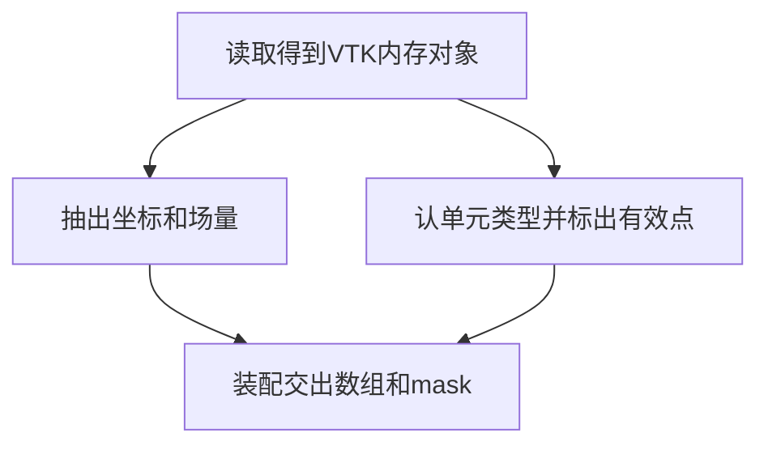

# 字段提取与有效点 mask

### 业务描述总结

- **做什么**
  - 给走 AB-UPT / ShapeNet-Car 的研究员：网格已经在 VTK 内存里之后，抽出表面压力/坐标、体积速度/坐标；按单元连通标出不参与表面的多余顶点（只出 mask，不删点）。
  - 做成后：单个样本得到可继续用的数组和 mask；单元类型与约定不符时失败。不落盘、不算法向/SDF，也不拿第二份压力文件对真伪。
- **怎么做**
  - 抽取只吃 VTK 内存对象。
  - 有效点 mask 从同一份 VTK 对象的单元类型和点号来，单独放清洗能力。
  - 外流 `pre` 按案例文件名把读、抽、洗串起来。

### 讨论

- **是不是 quad，meshio / VTK 能不能认单元类型**
  - 能。meshio 用字符串 `cell_block.type == "quad"`。VTK 内存对象同样能认：每个单元有类型号（四边形是 `VTK_QUAD`），也可以要求整份网格只有这一种单元。
  - 认类型和做 mask 是同一件事的两端：先确认单元是约定的那种，再收集这些单元用过的点号。
- **不用 meshio，VTK 对象够不够**
  - 够。VTK 校验得出来：单元类型、每个单元连了哪些点号、点表长度。本切片全部用 VTK 对象做，不增加 meshio。
- **VTK 压力对 press.npy 为什么不做**
  - Noether 第 12 项是因为这份官方数据同时给了 VTK 点标量和另存的 `press.npy`。对不上也判不出哪份是真的，一般数据集也不会给两份压力。本切片相信已读入的 VTK 场，**不做**第 12、13 项对照，不建独立对照能力。



### 实施评审

#### 功能点

**主功能 A：从 VTK 内存对象抽出点坐标和场量**（功能表 10、14）

BDD：

- Given 内存里已有表面或体积 VTK 对象
- When 研究员抽出点坐标和当前点场
- Then 得到与点数对齐的坐标数组和场量；缺坐标或缺对应点场时失败

子功能：

- A1：表面抽出压力标量与坐标
- A2：体积抽出速度矢量与坐标

**主功能 B：从 VTK 单元标出不参与表面的多余顶点**（功能表 11）

BDD：

- Given 同一份表面 VTK 内存对象，以及约定的单元类型
- When 研究员生成有效点 mask
- Then 得到与点数等长的布尔 mask；单元类型不对时失败。此时不删点、不落盘

**辅助 C：外流预处理按案例把读、抽、洗串起来**

#### 接口

字段提取，在 `abilities/data/extract/`（字段提取）：VTK 内存对象进去，点坐标和当前标量/矢量出来。

有效点 mask，在 `abilities/data/clean/`（表面多余顶点）：VTK 内存对象和期望单元类型进去，布尔 mask 出来。类型从 VTK 单元读取并核对。

预处理装配，在 `applications/aero_cfd/pre/`（调用能力）：案例指出文件名和期望单元类型；装配只串联读取、抽取和清洗。

#### 架构改动

- 抽取与 mask 都只认 VTK 内存对象。
- 不做 meshio，不加 meshio 依赖。功能表第 12、13 项不做，不建 `data/check`。
- 第 11 项不进 extract；认单元类型和出 mask 放在清洗。
- 空的外流 `pre` 第一次接入：读 → 抽 → 洗。仍不做样本发现、几何、落盘。

#### 文件改动

```text
packages/ai4e-core/abilities/data/extract/           新增（只从 VTK 对象抽场量）
packages/ai4e-core/abilities/data/clean/             新增（VTK 认单元类型并出 mask）
packages/ai4e-core/applications/aero_cfd/pre/        修改（按配置串联读抽洗）
packages/ai4e-core/README.md                         修改（本切片边界）
packages/ai4e-recipes/aero_cfd/config.yaml           修改（如需声明期望单元类型）
tests/integration/test_extract_clean.py              新增（覆盖 A、B 各叶与真实样本）
docs/PRD/ai4e-core/abilities/PRD.md                  修改（数据章补提取与清洗）
docs/PRD/ai4e-core/applications/PRD.md               新增（pre 装配章）
docs/PRD/README.md                                   修改（对照表）
AGENTS.md                                            修改（本切片相关验收入口）
.context/index.md                                    修改（本切片已交付）
.context/modules/ai4e-core.md                        修改（extract / clean / pre）
.context/mvp/abupt-mvp1.md                           修改（10、11、14 已交付；12、13 明确不做）
```

#### 实施步骤

1. 写下只吃 VTK 内存对象的场量提取 → A、A1、A2 可用最小夹具测通
2. 写下从 VTK 单元认类型并生成有效点 mask → B 只出 mask，类型不对则失败
3. 外流 `pre` 按配置串联读、抽、洗 → C 能交出数组和 mask
4. 同一改动带齐 `AGENTS.md`、`.context`、abilities/applications PRD 和相关测试
5. 只跑本切片相关用例验收，不以全仓代替

#### 测试用例

- A1：最小表面 VTK 对象 → 压力与坐标点数相同；`tests/integration/test_extract_clean.py`（字段提取与清洗）
- A2：最小体积 VTK 对象 → 速度与坐标首维相同；同一文件
- B：夹具含一个不参与指定单元的多余点 → mask 将其标为无效，且不删原数组；单元类型不对则失败；同一文件
- C：本地 ShapeNet 样本（无数据则 skip）→ 装配得到数组和 mask，表面单元为四边形；同一文件，`@pytest.mark.local_data`

上下游：读取提供 VTK 内存对象；extract / clean 交接数组与 mask；`pre` 消费配置并感知失败。本切片不写缓存、不写 run、不读 `press.npy` 做对照。未做：第 12、13 项对照，第 15 项起的几何、域分离、套 mask 落盘。
