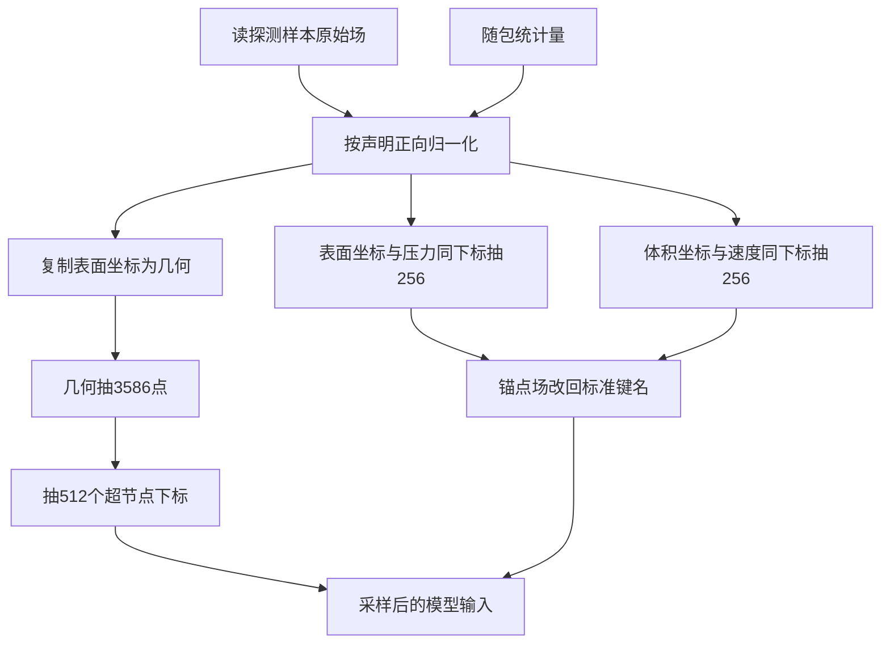

# 第 40–46 项：探测样本归一化与采样

## 业务描述总结

- **做什么**
  - 训练准备已经能打开官方分片并读出一份探测样本。本切片让这份样本继续走到「模型能认的输入」：物理场和坐标按随包统计量归一化，再按 AB-UPT 预算抽出几何点、超节点和两域锚点。
  - 做成后，只开 `train` 开车时：上下文里仍有刚读出的原始场；另有一份归一化后的全分辨率场；再有一份采样后的模型输入（几何约 3586 点、超节点 512、两域锚点各 256）。压力和速度的标准键名在采样后仍叫原名，但长度已是锚点数。运行目录不写训练张量。
  - 同一套变换能从归一化空间还原回物理量。本阶段开车不调用还原；日后评测和后处理用同一份规则，避免坐标或场对不上。

- **怎么做**
  - 原子层只做「给统计量和一张量 → 正向/反向」以及「多场共用同一组随机下标抽样」。不认案例场名，不认 ShapeNet。
  - 外流训练装配读案例声明：哪一场用均值方差、表面距离复用体积距离的统计量、两域坐标共用同一包围盒、采样人数。读盘步骤之后再套变换、再采样。
  - 案例配置写出上述声明，并继续指向已有随包统计量。第 27–35 项（完整训练配置拼装、设备、实例化）仍只占位。
  - 开车层只从上下文抄形状和键名进摘要，仍不认场语义、不写 `.pt`。

## 讨论

- **仍挂探测样本，不开训练循环**
  - 当前 `train` 阶段读 test 第 0 个，用来证明链路通。本切片在读盘之后加两步，不扫训练集、不组 batch、不算损失、不更新参数（那些是第 47 项起）。
  - 原子函数吃「一场字典」，日后按编号取任意样本时直接复用，本切片不另做 Dataset。

- **原始、归一化、采样三份分开放**
  - 读盘结果继续放在探测样本字典里，已有读盘验收不改形状。
  - 归一化后的全分辨率场、采样后的模型输入各占自己的上下文键。避免把 256 点压力覆盖回「刚读出的场」，也方便对照。

- **反变换本切片做成能力，开车不调用**
  - 功能表 40–46 只写正向。架构要求变换可逆；后处理必须用同一套规则还原压力/速度和坐标。
  - 因此原子层同时实现正向和反向，测试做往返对照。`train` 阶段只正向套用。

- **规则写在案例配置，不填第 30–31 项占位**
  - 第 30–31 项在功能表里是「拼完整训练配置」。本仓库对应步骤仍是占位。
  - 本切片把「用哪套统计、采多少点」写成案例 `train` 段声明，由装配步骤直接消费，与对照表、分片名单同一层。

- **与旧实现对齐的硬规则（不另开口径）**
  - 压力、速度、体积距离：减均值除标准差。表面距离不落盘、值为全零，但复用体积距离的均值方差，因此归一化后一般不是零。
  - 法向不进声明，保持原值。
  - 两域坐标共用 `raw_pos_min` / `raw_pos_max`，`scale=1000`，不居中，映射到约 `[0, 1000]`；越界失败。
  - 几何只从表面坐标复制，不含物理场。表面点数已是 3586 时几何抽样不打乱（与旧实现「人数已够则跳过」一致）。
  - 当前不把距离/法向采进锚点（与 `use_physics_features=False` 一致）。查询点数为 0。
  - 锚点场先写成临时锚点键，再改回 `surface_pressure` / `volume_velocity`，保证坐标与标签同下标。不生成 `*_target`（第 47 项）。



## 实施评审

### 功能点

**主功能 A：按声明对探测样本做正向场归一化**（压力、速度、两域距离进入同一统计量空间）

BDD：

- Given 探测样本已读出，且随包统计量与案例声明齐全
- When 训练准备对这份样本套用场归一化
- Then 压力、速度、体积距离按均值方差变换；表面距离复用体积距离的统计量；法向保持原值

子功能：

- A1：缺统计量或声明时拒绝
- A2：同一套规则可以把场变回物理量

**主功能 B：两域坐标按同一包围盒归一化**（训练与日后查询必须在同一坐标空间）

BDD：

- Given 表面与体积坐标已读出，统计量含全局包围盒
- When 训练准备对两域坐标套用位置变换
- Then 两域使用同一平移与缩放，结果落在约 `[0, 1000]`；越界失败

子功能：

- B1：同一套规则可以把坐标变回原始空间

**主功能 C：从归一化表面坐标构造几何并抽超节点**

BDD：

- Given 表面坐标已归一化
- When 训练准备构造几何并抽超节点
- Then 得到几何坐标（人数为声明值；已够则不打乱）以及 512 个落在几何点数内的超节点下标

**主功能 D：两域锚点联动抽样并恢复标准场名**

BDD：

- Given 归一化后的表面坐标/压力与体积坐标/速度
- When 训练准备按声明人数抽锚点并改名
- Then 表面锚点坐标与压力同下标、各 256 点；体积锚点坐标与速度同下标、各 256 点；标准键名仍是压力与速度

子功能：

- D1：只开 `train` 开车时摘要能抄出归一化与采样后的键名和形状，运行目录仍无 `.pt`

**辅助 E：案例写出归一化声明与采样人数**

### 接口

`abilities/transform`（变换）接收一张量和一组数，做均值方差或包围盒的正向/反向；越界或标准差非法则失败。不认场名。

`abilities/sampling`（采样）对若干张量共用一次随机下标：抽点、抽超节点下标、抽锚点并按对照改名。人数已够且不需要拆查询点时不打乱。

`applications/aero_cfd/train/normalize.py`（外流训练归一化装配）读案例声明和统计量文件，对一场字典逐场调用变换；表面距离指向体积距离的统计键。

`applications/aero_cfd/train/sample.py`（外流训练采样装配）按 AB-UPT 声明串：复制几何 → 抽几何点 → 抽超节点 → 两域联动锚点 → 改回标准场名。

`train` 阶段在读盘步骤之后增加两步，分别写入归一化字典和采样字典；`run/writer`（运行写入）只从报告抄形状。

### 架构改动

- 训练期变换从「未交付」落到 `abilities/transform`：正向与反向成对，供 train 正向、日后 post 反向，避免评测另写一套数。
- 采样落到 `abilities/sampling`：只表达「同下标抽样」，AB-UPT 的几何/锚点键名由训练装配拼，原子层不绑案例。
- `train` 阶段在读盘之后接归一化与采样；第 27–35 项占位不动；原始探测样本键保留，避免冲掉已有读盘验收。

### 文件改动

```text
packages/ai4e-core/abilities/transform/
  apply.py                 新增（均值方差与位置的正向/反向）
  __init__.py              新增（公开变换入口）
packages/ai4e-core/abilities/sampling/
  points.py                新增（多场共用下标抽点）
  supernodes.py            新增（从几何抽超节点下标）
  anchors.py               新增（联动抽锚点并改名）
  __init__.py              新增（公开采样入口）
packages/ai4e-core/applications/aero_cfd/train/
  normalize.py             新增（按案例声明套变换）
  sample.py                新增（按 AB-UPT 声明串采样）
  standard.py              修改（读盘后接归一化与采样两步）
packages/ai4e-recipes/aero_cfd/config.yaml
                           修改（写出 train.normalize 与 train.sample）
docs/PRD/ai4e-core/abilities/PRD.md
                           修改（补变换章、采样章）
docs/PRD/ai4e-core/applications/PRD.md
                           修改（train 阶段接到采样后的模型输入）
docs/PRD/ai4e-core/run/PRD.md
                           修改（摘要可抄归一化/采样形状）
docs/PRD/ai4e-recipes/aero_cfd/PRD.md
                           修改（案例声明统计量与采样人数）
AGENTS.md、.context/index.md、.context/modules/*.md、.context/mvp/abupt-mvp1.md
                           修改（边界从「读盘探测」扩到「归一化+采样」）
packages/ai4e-core/README.md、packages/ai4e-recipes/**/README.md、tests/README.md
                           修改（导航与验收入口）
tests/integration/test_train_normalize_sample.py
                           新增（覆盖 A–D、A1–A2、B1、D1）
tests/integration/test_train_dataset_read.py
                           修改（仅当全阶段摘要字段扩展时对齐；原始 sample 形状保持）
```

### 实施步骤

1. 原子变换可对单张量做均值方差与位置的正向/反向，缺数或越界能失败。
2. 原子采样可同下标抽点、抽超节点、抽锚点并改名；人数已够则不打乱。
3. 训练装配能按案例声明加载随包统计量并套整份场字典；表面距离复用体积距离统计量；法向不动。
4. 训练装配能按声明串完几何、超节点、两域锚点并恢复标准场名。
5. `train` 阶段在读盘后执行上述两步，报告带出键名与形状；开车摘要能抄到，运行目录无 `.pt`。
6. 案例配置写出声明；同步 `AGENTS.md`、`.context`、相关 PRD 与 README。
7. 补齐并跑通本切片相关用例（含既有读盘用例，确认原始探测样本形状未被覆盖）。

### 测试用例

- A：读出后套场归一化 → 压力/速度/体积距离符合均值方差；表面距离用体积距离统计量；法向不变；`tests/integration/test_train_normalize_sample.py`（场归一化）
- A1：缺统计键或声明 → 失败且指出缺什么；同一文件
- A2：正向后再反向 → 与原张量在容差内重合；同一文件
- B：两域坐标套位置变换 → 共用包围盒，落在约 `[0, 1000]`；越界失败；同一文件
- B1：坐标反向 → 回到原始空间；同一文件
- C：构造几何并抽超节点 → 几何人数符合声明（已够则与表面坐标点集相同），超节点 512 且下标合法；同一文件
- D：两域联动抽锚点并改名 → 压力/速度各 256 且与对应锚点坐标同下标，标准键名恢复；同一文件
- D1：只开 `train` 开车 → 摘要含归一化/采样形状，运行目录无 `.pt`；同一文件
- E：打开案例配置 → 能看到归一化声明与采样人数；核 `packages/ai4e-recipes/aero_cfd/config.yaml`（案例声明）
- 本机官方 test 第 0 个（有数据才跑）：采样后几何 3586、超节点 512、两域锚点 256；`test_train_normalize_sample.py` 的 `@pytest.mark.local_data`

相关验收：

```bash
uv run pytest tests/integration/test_train_dataset_read.py tests/integration/test_train_normalize_sample.py
```

### 修改与验收

1. **上下游整条链**：统计量由 pre 随包文件提供；读盘步骤提供原始场；本切片装配消费声明并交出归一化场与采样场；开车只抄报告；既有读盘测试继续看原始探测样本。失败时阶段停止，不写半成品张量。
2. **同一改动带齐**：`AGENTS.md`、`.context`、abilities/applications/run/aero_cfd 四份 PRD、README 与上述测试。
3. **只跑相关用例**：上面两条路径跑通才验收，不跑全仓冒充验收。

### Experience

已检索 `receipt_4df446751f19489a958b00c26122ab22`。命中 1 条 Ethos（回复条数），与本次功能规划无关，未采纳。
