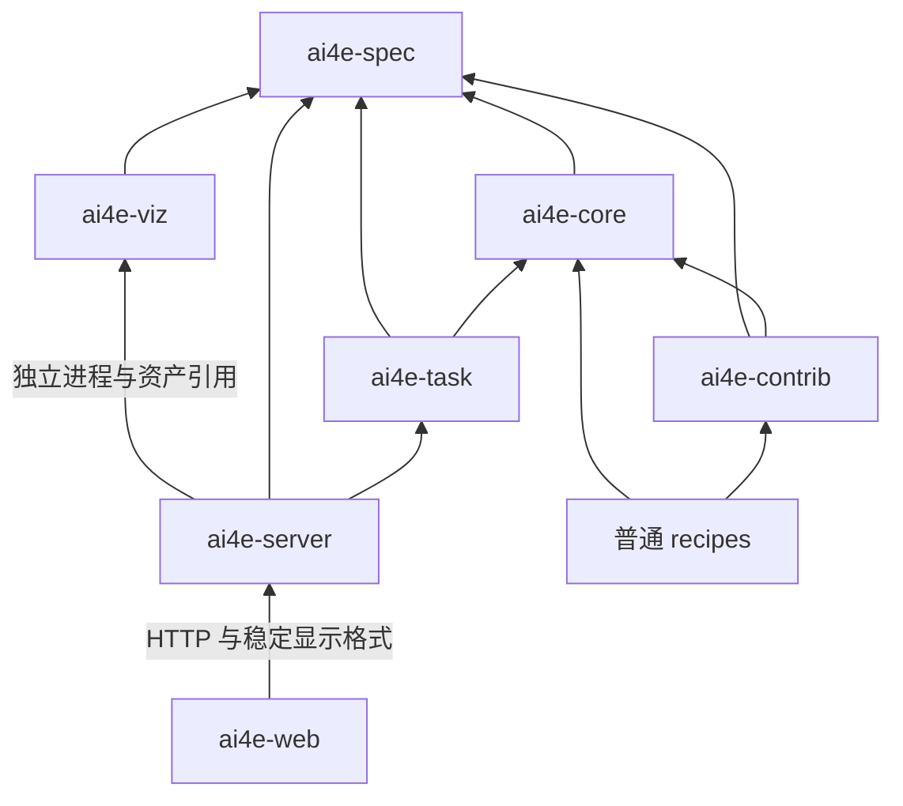

# AI4E_Dojo 架构设计文档

本文维护全局架构，现状按仓库源码核对（2026-09-18）。模块功能正文见 `docs/PRD/README.md`，文件与测试导航见 `.context/index.md`。Vis 内部架构以 `packages/ai4e-viz/docs/architecture/architecture.md` 为真源。历史实验记录只证明各自当时的范围；本轮执行结果见 `.context/mvp/architecture-alignment-acceptance.md`。

## 0. 定位与实现范围

Dojo 是供研究者组合数据处理、模型、训练、推理和结果分析的研究框架。当前有外流 CFD、参数化 PDE、耦合物理场、控制轨迹和时空预测五类应用。可安装模型包括 AB-UPT、Transolver-3、PI-BSNet、GenCP（CNO/SiT-FNO）、SafeDiffCon、WDNO（基础预测缩小预算）和 MeshGraphNet（CylinderFlow 工程接入，未完成论文复现）；Dojo Web 官方目录只开放前两个模型及 ShapeNet-Car/NASA CRM 五个案例。PDE、GenCP 与 MeshGraphNet 通过 Python/recipe 使用。

已有源码不等于生产精度或跨硬件等价。CAE 采样、平台批量研究任务和报告生成未开放；Vis 的部分几何交互、格式转换、自动化和 MCP 仅有限实现或预留。详见各模块 PRD，不在本轮补功能。

## 0.1 主线：Core、Task、Server、Web 的分层合作

Dojo 的主架构问题是“谁拥有哪类事实，谁在什么边界调用谁”，不是“某个模型能否逐级晋级到平台”。模型只是领域 application 提供的一类科学实现；不可中立化的结构、损失、采样、参数、输入输出和平台展示语义留在贡献侧，能够用中立输入输出表达、可由合成数据验证并可能跨模型复用的计算能力优先进入 `ai4e-core/abilities`。平台可以登记模型描述，但不把模型变成 Task 的分支。

| 层 | 拥有的事实与职责 | 明确不做 |
| --- | --- | --- |
| `ai4e-spec` | 共享名词和跨进程/持久化边界所需的最小记录：输入引用、运行来源、资产、指标、结果和可视化引用 | 不实现算法，不规定所有科学对象的统一格式 |
| `ai4e-core` | 原子能力、领域 application、顺序 Stage/Pipeline、训练/推理执行、writer 和稳定 `run` 门面 | 不管理项目任务生命周期，不维护 Web 页面，不登记具体官方模型目录 |
| `ai4e-contrib` | 不可中立化的模型本体和专属算法；数据集适配、模型配置与业务连接把具体科学语义装配成 application/provider | 不承载可中立化的通用能力，不把模型分支写进 Task，不接管通用运行记录 |
| `recipe` | 研究流程正文；Python 决定步骤和连接，YAML 提供参数与执行范围 | 不复制 Task 数据库，不把平台规则藏进训练循环 |
| `ai4e-task` | 项目、任务、版本、配置修订、运行收据、输入绑定、资产、检查点引用、失败和恢复事实 | 不识别 AB-UPT 等模型，不解释损失/采样/物理约束，不加载模型栈 |
| `ai4e-server` | 面向平台的业务用例、受控路径、能力描述、请求校验和 Task/Vis 适配；模型目录只属于平台 capability | 不实现数值算法，不读取模型内部状态来替代 application 描述 |
| `ai4e-web` | 按用户任务组织的界面和草稿状态；只消费稳定 Server API、传输类型和 Artifact schema | 不执行训练/推理，不直接导入 Python 包，不镜像后端内部目录 |
| `ai4e-viz` | 独立进程中的检查、预览、三维会话和导出；消费固定资产引用 | 不依赖 core/Trainer，不拥有 Task 或科学计算状态 |

调用方向固定为：

```text
Web → Server API → Task 公共门面
                         ↓
                 recipe / application provider
                         ↓
                    core + contrib
                         ↓
                run / Artifact / 固定结果
                         ↓
                 Task 收据 → Server → Web / Vis
```

Task 只传递“管理事实”和不透明引用；需要解释科学语义时，Task 通过任务声明的 operation/provider 启动独立进程，由领域 application 返回检查、评价或导出结果。Server 可以把 provider 返回的描述转换成页面能力，但不能把描述再实现成模型分支。这样不同领域都能用同一套管理语言（输入、版本、运行、资产、检查点、结果、指标、失败、恢复）进行记录和比较，同时保留各领域自己的科学对象和内部数据结构。

这条主线是架构正文的决策入口；产品开放范围、模型清单和单个案例的参数属于 PRD 与 application 文档，不反过来定义包之间的依赖。

## 1. 研究代码与框架的分界

组件负责计算，连接代码负责转换，领域应用负责业务装配，框架负责执行外围。普通组件可以接受数组、自定义对象或任意自身认可的参数，返回值原样交给下一个调用。组件无需继承、注册或提交全平台能力清单。

连接双方是否匹配由连接代码和实际调用决定。框架不保证任意组件自动匹配，不把每个中间结果转换为统一字典。只有实际跨进程、持久化、展示的边界需要可读写的格式。标准领域流程有局部约定，自由研究脚本可以不使用这些流程。

## 2. 分包与依赖方向



箭头表示依赖。spec 只用标准库；core 不反向导入 contrib、task、server、viz；task 管理进程不加载模型栈、不导入 recipes。Vis 不导入 core 或 Trainer。服务与可视化的进程交接不等于允许跨包导入内部实现。

算法包按科学能力组织；task 按功能组织；server 按真实业务生命周期采用轻量 DDD；Web 按用户任务划分微领域。迁入的 Vis backend 使用包内 DDD、frontend 使用 JSX 微领域，不套用 core 的算法目录规则。

## 3. 仓库目录

```text
packages/
  ai4e-spec/       components、data、artifacts
  ai4e-core/       base、abilities、applications、run、tools
  ai4e-contrib/    ability、application
  ai4e-task/       cli、projects、tasks、versions、templates、storage
  ai4e-server/     bootstrap、infrastructure、modules
  ai4e-web/        src、e2e、scripts
  ai4e-viz/        inspect、preview、pipeline、serialization、render、compose、runtime
                  backend、frontend、.context、docs、resources、fixtures
recipes/          aero_cfd、parametric_pde 普通运行目录
examples/         CFD 五例、PDE 五例、研究扩展与 Task 使用示例
tools/            科研参考对照、验收与维护工具
tests/            contract、integration、fixtures
docs/             本文、PRD、ADR、原型和专题资料
.context/         当前目录导航、模块索引、专项验收和历史证据
.cursor/rules/    按包和任务选择的工作规则
```

Python 包保持一层物理目录，由构建配置映射到下划线导入名。recipe 不安装为框架包，复制后仍是研究者维护的代码。空目录不代表已交付模块，完整目录清单由上下文索引维护。

## 4. spec 的局部契约

`components/model.py` 的 ModelFactory、ModelComponent、PreparedModelComponent 和 `components/dataset.py` 的 DatasetView 是特定消费者的类型说明。它们不是全仓准入协议，不对任意函数做 runtime Protocol 检查。构造、具名预测、物理样本准备等要求只在选用对应领域步骤时成立；可由薄适配对象实现。

`data/inspection.py` 描述文件字段目录。`artifacts/` 维护运行来源、物理清单、平台显示、推理选择和可视化交接。字段单位、位置、拓扑、身份和内容修订在消费者确实需要时明确，不推断未知量。不存在一个已覆盖所有领域的通用 `fields.py` 或自动语义匹配器。

公开记录可版本化，版本校验服务于真实持久化消费者。普通内存值不必包装为 Artifact；稳定记录也不承诺所有历史算法产物可直接续用。

## 5. core 的两条组织轴

`abilities/` 按 data、transform、geometry、sampling、modeling、constraint、training、inference、eval、postproc、report 组织计算。原子能力不认识具体案例。

### 5.1 能力归属判定：默认进入 core

能力归属按行为、输入输出和复用边界判断，不按源码来源判断。来自某个模型源码的函数或模块，仍然必须先审查是否可以成为中立的 core ability。默认进入 `ai4e-core/abilities`，只有确认存在不可中立化的模型、数据集或业务流程依赖时，才留在 `ai4e-contrib`。

判定时依次检查：是否可以用不包含具体模型名称的输入输出表达；是否依赖固定网络结构、结构版本或私有状态；是否依赖数据集字段名称、节点类别或文件布局；是否能用合成数据独立测试；是否可能被其他模型或领域流程复用；是否实际上只是某个步骤或业务流的参数交接。不确定时先设计中立 core 外壳，再由 contrib/application 绑定专属语义，不因为当前只有一个使用者就把能力判为专属。

`contrib/ability` 只保存无法中立化的模型本体和专属算法；可中立化的图构造、批处理、噪声、mask、rollout、评价和图算子应优先进入 core。`contrib/application` 负责数据集适配、模型配置、训练/推理连接、来源交接和领域业务流。不等待多个使用者出现才进入 core；归属不确定时，实际计算默认在 core 实现并独立测试，贡献侧只绑定具体组合与语义。后续复用用于改进边界，不是首次沉淀的前置条件。

`applications/base` 提供顺序 Stage/Pipeline 和不解释领域语义的迭代训练装配；领域 application 按 rawprep/trainprep/model/train/infer/post 组织可组合业务步骤。时空预测以物理轨迹、模型准备和固定结果区分交接，共用数组清单能力与迭代装配；WDNO 的小波、条件和数据语义留在 contrib。阶段参数和业务中间对象归领域所有，不是运行器的可变会话字典。

- data 按 source/extract/validate/filter/save/stats 组织；PT 与 Zarr 并列，VTKHDF 是规范网格资产。原始来源含网格或可重建 connectivity 时，平台数据必须同时交付逐场 PT、VTKHDF、实体身份及 manifest 网格引用；只有来源本身确实是无拓扑点云时才允许缺少 VTKHDF。模型图边、诱导子图、分区和 halo 由 trainprep 从只读平台数据派生，不写回共享数据集。
- transform 持有冻结变换和反变换；sampling 提供点集与几何选择；采样原语默认先按中立能力进入 core，只有依赖模型私有状态或业务流程的连接才留在模型贡献侧。
- modeling 提供构造、检查等机制；AB-UPT 结构版本为 3，训练检查点容器为 2，两者不可混写。
- constraint 含监督比较和物理残差原语，已被 PDE 训练使用；通用符号方程编译或任意几何 PINN 工作流未交付。
- training 提供更新循环、优化、调度、EMA、恢复与设备处理；各 recipe 的开放组合可更窄。
- inference 管理无梯度预测、随机状态保护、恢复、rollout 和分块原语；模型专属缓存留在 contrib。
- eval 基于固定预测/真值计算指标；postproc 负责回贴网格、物理空间与可视表达输入；report 提供表格导出，不等同平台报告产品。

## 6. 配置、连接与公开执行入口

稳定门面为 `ai4e_core.run.launch`、`stage`、`TrainingRun`、`execute_operation` 和 `managed_run`。旧已公开的运行导出继续保留。公开参数和异常语义改变属于接口变更，不能当内部重构处理。

`launch` 显式接收 `config_loader(path, overrides)`；不默认解释 CFD 配置、不删除或重命名模型参数。加载完成的配置作为运行输入快照，业务调用不得覆盖。`run_recipe` 支持程序调用；`stage(name, fn, *args, **kwargs)` 立即调用普通函数，原样返回结果，恢复阶段日志上下文，保留原异常类型与诊断信息。业务登记型函数仍按既有方式先登记、由执行器计算。

`TrainingRun` 提供 dry_run、run_dir、entrypoint、report、artifact、checkpoint 和 execute_samples；私有会话状态不属于组件 API。报告发布形成快照；writer 独占运行目录的配置、日志、摘要和检查点。数据输出走显式数据目录，不借 writer 冒领张量所有权。

官方共享配置转换在 contrib/application，复制 recipe 的 configuration 只连接加载器和本地扩展声明。模型专属布局、宽度、采样和样条参数由贡献侧适配解释，通用训练控制默认值由公开领域入口提供。旧外流加载适配显式注入，通用运行器本身不认识 workers 等业务键。

## 7. 执行所有权与失败

当前 Stage/Pipeline 是顺序调用，没有 DAG 调度器。run 承担通用样本循环、首错/继续、取消边界和汇总；应用决定发现哪些样本、绑定哪些字段、调用哪些计算。训练迭代由训练执行器负责。

一次失败不能汇总为完整成功。首错停止保留之前已提交结果；继续模式分别记录成功、失败和未执行；取消在约定边界响应。提交前预检与 dry-run 共用目标检查，dry-run 不产生正式数据。

独立固定结果评价由 execute_operation 创建运行并注入日志、取消、产物登记和发布接口。逐样本评价行追加到数据账本，最终生成完整快照；读取端忽略中断留下的不完整末行。Task 管理评价状态，不写 core 运行报告。进度发布不在业务层和会话层重复深拷贝同一账本。

平台配置编辑在 Server 阶段模块合成：原任务配置与页面明确编辑合并，删除和选项切换由平台处理，未编辑参数保持。Task 通过完整保存门面固定结果，不再次递归合并；运行继续捕获同一修订并由既有 recipe 加载。平台规则不进入算法 application、contrib 或通用 run，不增加研究脚本协议。完整保存和普通补丁保存分别提供，旧调用保持兼容。

## 8. 配置与产物的兼容范围

当前通过显式路径、清单、准备引用、内容摘要和检查点契约交接。内容摘要用于核验来源和比较条件，不是自动构建缓存。缺失比较条件必须判不可比，不能以空对象冒充相同。

用户配置、准备记录、检查点、历史实验分别决定兼容政策。模型结构、参数顺序、准备语义或数值行为改变可能使旧权重不能续训。旧源码摘要保留；不能更新历史证据来掩盖不相容。

四档执行 profile、自动依赖求解、内容寻址缓存调度、升级 doctor 和覆盖链自动报告仍是设计候选，未作为现行 API 实现。本轮不以这些机制约束研究组件。

## 9. recipe 与局部适配

Python 是步骤顺序唯一来源，YAML 提供参数和执行范围。 WDNO新版直接执行与Task托管共享pipeline.py和config.yaml；输入采用公共inputs阶段路径、数据目录由运行器分配，资产和有科学口径的指标通过writer公共索引交付。模型专属配置、分片绑定与历史配置显式转换留在贡献应用，不增加Task模型分支。模板不隐藏成整段 workflow，不以行数限制装配正文。新外流完整链为 rawprep → trainprep → train → infer → post；单阶段入口显式消费上游产物。推理必须选择样本，不能在后台默认跑完全部数据。

普通函数、自定义返回对象及连接函数示例见 `examples/recipe_extensions/free_wiring/`。字段转换和替换采样示例展示如何在连接处改变语义。与框架版本隔离的固定用户代码在测试夹具保存源码摘要；更新框架不能靠同步修改该夹具通过验收。

框架只保障未变公开接口，不保证导入私有实现、读取内部会话字典或依赖官方模板全文的用户代码跨版本成立。

## 10. Task

Task 使用 cli/projects/tasks/versions/templates/storage 六类功能。new/fork 创建正式版本，编辑和 run 不增加版本。版本来源快照、当前可编辑代码和每次运行捕获分开保存。

records 负责任务记录和运行收据投影；get_run 会核对进程收据并更新管理状态，不应称纯只读查询。query 负责日志、离线运行导入和阶段状态，并保留旧查询导出。storage 独占 SQLite 与文件提交机制。

Task 从固定 pipeline.py/config.yaml 发现普通研究入口，从 inputs.<stage>.<name> 捕获所选阶段的外部路径，并分配 run_root/data_root。不存在第二份逐案例 task-entry。可选 components.application 提供检查、评价、导出连接；缺操作只使该项不可用，Task 不猜测模型。Python 正文决定真实顺序，配置中的 stages 只选择范围。资产和具有科学口径的指标由 writer 写公共索引，管理层核验实际文件及依赖后查询、比较；发布者可声明仅使用目录内相对引用的自包含资产包，管理层整体复制并重定位管理引用，不改科学文件；未登记不等于运行失败，也不能推断研究成功。历史任务通过有原件备份、逐文件差异和回滚日志的迁移更新可编辑目录；已核验摘要的官方包装允许平台选择对应案例自动升级，自定义正文使用审阅后的离线候选。冻结版本与实验记录不改写。源码摘要用于来源与漂移核验，不能以模板全文不同拒绝自由连接。

Task 的模型无关边界是硬约束：Task 不按模型名、案例名、损失、采样方法、网络结构或物理领域分支执行；这些信息只作为任务配置中的不透明输入和运行产物引用保存。检查点能否恢复、多个权重能否放在同一批次、输入与权重是否科学兼容，必须由 application/provider 依据自己的 contract 判断，再把可执行或拒绝及原因交给 Task。Task 只负责记录请求、固定引用、启动隔离进程、维护状态、收据和恢复入口。

当前 `tasks/inference.py` 中对 checkpoint contract 的同批次一致性检查是这一边界的迁移接缝：它目前读取通用 contract 中的 `component/model` 字段来防止混批，尚未按 provider 返回的 opaque execution identity 完全下沉。后续改造应先补 provider contract 与跨领域测试，再移除 Task 对这些字段名称的了解；在此之前不得继续增加新的模型分支。

固定物理结果的既有检查适配保持自己的持久化格式，子进程接受明确提供者；它不是普通组件的通用数据协议。平台操作的 JSON 输入/输出只约束该操作。

## 11. Vis

Vis 与 core 解耦，通过固定资产和 spec 交接。根目录中的 inspect/preview/pipeline/serialization/render/compose/runtime 保留算法库与独立文件预览能力；迁入应用的 backend/frontend 保留 13 个模块的现有边界。

包内工作台的 controller 委托相机、对象、会话和导出控制，仍共享一个 Workbench/场景，不引入第二套状态或存储。表、所有权、存储键、公开路由和三维通信协议不因本轮拆分改变。不得删除运行数据库或上传资产。

## 12. 当前实际数据流

1. recipe 加载公开配置，解析相对路径和点号覆盖，run 冻结输入。
2. rawprep 按数据声明发现样本，执行 read/derive/select/save/stats；清单只登记本轮实际交付。Task 正式物理产物默认进入项目 shared，平台登记跨项目引用；运行记录仍在生成任务，准备副本和预测归任务数据目录。
3. trainprep 消费物理清单，冻结字段、变换、采样/拼批声明；可产生独立划分和归一化物化。PT 不必先转换成 Zarr，反之亦然。
4. model/train 使用贡献侧连接构造网络、绑定目标并执行训练。正式页面必须选准备记录，不“准备并训练”；直接研究脚本按其明确调用链工作。
5. infer 消费固定准备、完整检查点字节及显式样本，预测、反变换、评价和保存。失败/取消保留部分结果，不能标全批完成。
6. 新 post 消费固定预测/真值和清单，表格、曲线、重评价与导出都不重跑模型。历史 post 导入仅为兼容门面，计算实现归 infer。
7. Task 读取运行事实；Server 将受控引用交给 Web/Vis。预览、下载和加入三维时登记内容，文件树展开只列当前层，不全量哈希。

准备与物理来源可位于项目、任务或已登记数据根；未选择正式来源不会自动选最新。科学身份、实体 mask、单位和拓扑约束维持原语义。

## 13. 使用方式

研究者可以直接调用能力、复制 recipe、通过 Task 管理运行或从 Web 操作已开放案例。自由脚本只需自己保证连接函数输入输出；接入平台时为需要的操作提供适配，不必让所有组件都具备页面描述。

轮次和迭代入口复用 training/execution 的内部推进，保留各自的领域装配、评价/保存生命周期和恢复边界。实际更新事件与计数预算分离，优化器、EMA和调度器的科学顺序由局部适配明确调用；周期观察不重排算法。共享驱动不认识贡献模型。可选局部更新和构造函数在消费者边界适配，不成为全仓统一组件协议；原公开入口及默认合同保持兼容。

训练源代码快照和实际 wheel 安装路径必须分别核验。CPU 小模型用于工程交接；正式算法对照依赖锁定参考版本、相同数据、完整预算和硬件证据，不能由 import 或构建代替。

## 14. 扩展与版本隔离

固定导入位置和参数含义是承诺边界。先建立可运行用户代码基线，再移动内部实现；内部拆分用门面保留公开入口。类型注解说明实际消费者要求，不能扩大成全局准入规则。

模型只适配所需业务：独立训练不承担可视化说明，自由方程不承担模型构造协议。连接可由 recipe 或 contrib/application 持有；应用不感知 modeling/constraint 内部算法。对于公开接口确需变化的情况，列出旧入口、新入口、输入/输出、异常和迁移范围；不以“平台升级”要求全仓用户同步更新。

## 15. 验证与文档所有权

先圈定上下游影响，再执行所有新增/修改测试文件并集和必要回归。固定用户基线包含实际 wheel 安装，数值参考保留算术断言。Web 检查微领域边界、构建与相关浏览器流程；Vis 检查模块边界、场景和会话。缺环境、skip、未执行分别记录。

全仓功能核对涵盖源码、调用方、配置、产物、失败行为与测试；自动链接/目录检查不能替代功能核对。PRD 保存需求与现状差异，架构正文不复制第二套产品说明。`.context` 负责检索，AGENTS 负责稳定开发约束，历史验收保留原结果。

## 16. 当前限制

- 自由组件不会自动匹配；连接错误在实际调用或持久化消费者处暴露。
- 官方模型页面有明确目录范围，任意模型 Python 接入不等于自动得到全部 Web 配置能力。
- MPS 部分邻域计算回 CPU，随机/散射行为不保证跨设备逐值相同；模型算术未因本轮重构改变。
- Vis 多块计算、几何工具、报告产品以及转换格式的支持范围按包内 PRD 分项表达。
- 本地 Task 进程协调不等于分布式调度；代码快照也不等于自动可重建的完整外部环境。

## 17. 演进顺序

以真实模型、数据集和科研案例触发共享需求。优先稳定现有公开入口与局部连接，再按可验证收益优化内部热点。未实现的 profile、doctor、自动 DAG、通用表达式编译、远程后端不自动排为案例接入前置任务。

## 18. 包职责速查

spec 管交接格式；core 管原子计算、领域步骤与执行；contrib 管模型、数据和专属连接；recipe 管研究流程；task 管本地研究记录；server 管平台用例与受控访问；web 管交互；viz 管独立可视表达及其自身业务。

## 19. Web / Server 当前架构

平台功能正文见 [Web 产品文档](PRD/ai4e-web/src/PRD.md)。

React/TypeScript/Vite/Ant Design 与 FastAPI 已由 ADR 0004 确定。首页是项目管理，任务工作台采用稳定 slug 的九步入口；旧数字 6/7 仍映到 post/report。尚未开放的步骤明确显示状态，不以页面外壳冒充交付。

Server modules 按项目、任务、原始处理、阶段、推理、后处理、资产、比较、报告和可视化划分。它调用 task 和公开描述，不实现模型算法；报告文字 API 已存在，完整平台报告生成/导出产品尚未开放。声明操作替代模板代码一致性门禁，HTTP 不接受任意运行目标。`capabilities/model_cases.py` 中的模型/案例登记是平台起步目录和页面描述来源，不是 Task 的领域模型；登记变化只能影响 Server 的可选项和 application 的配置适配，不能改变 Task 的状态机与管理字段。

Web 微领域通过公开 index、API 与稳定传输类型连接。模型候选/选择请求和输入候选去重从 StageWorkbench 拆出；模型选择草稿、配置草稿、执行状态各有所有者。推理表格与图表使用独立草稿，取消不生效；Checkpoint 模式聚合所选权重全部分片，样本模式固定一个权重并保留分片。

推理管理固定权重完整字节；每个检查点×分片是一个子运行，同任务串行。完整批次状态决定步骤完成。只评价也保留轻量证据，字段分量评价保留完整向量；样本等权统计与历史全元素统计分开。

后处理结果文件/三维 Tab 消费固定来源；指标表与图表在推理页，后处理不再设指标页签。三维会话归任务，Tab 切换隐藏而不重建；离开回收，刷新后通过保存配置重开。相机、对象显隐和显示范围变化不重读模型或数据；数据归一化统计不等于色标范围。

## 20. 外流数据与模型边界

贡献数据集持有来源读取、名单与字段描述，贡献模型持有专属准备、布局、损失和预测转换。共享物理流程只消费局部约定，锚点与逐场路线允许差异；不能强行把 Transolver 缓存解码替换为独立块前向。

NASA 没有体场，单表面 AB-UPT 禁止跨域块；ShapeNet 允许联合域或单独表面/体场。模型结构版本、输入身份、查询顺序和冻结语义由原验证链保护。原始处理可多线程，但不改变算法和训练预算。

## 21. 参数化 PDE

PDE 生成、准备、模型、训练和预测使用独立 recipe。方程为普通 PyTorch 函数；样条导数和专属准备参数归贡献侧适配。通用运行器不解释方程、样条或物理约束配置。

Neumann、Advection、梯形采用各自当前明确迁移实现；其余差异与未验范围见专项记录。保留原参数导数与物理导数的区别、损失归约和更新粒度，不把部分源码对齐称全部论文复现。

## 脚本物理场分析

core 的 postproc/visualization 提供独立 PyVista 原子能力；eval 保持数值评价。领域 post 将固定数组、身份、单位及网格绑定到能力，recipe 决定步骤，run 负责样本执行和唯一运行记录。训练装配仅新增轮次观察适配；infer 的当前模型快照复用原预测与物理输出，并保护模式和随机流。新增数据在后处理数据目录提交。Web 的 VTK/Trame 会话后端保持独立，包间依赖无变化。

## 项目共享数据所有权

Task 的 projects 管理共享名称与绑定，storage 管理目录、生产占用和发布收据，tasks 通过入口声明分配共享及任务私有输出。物理数据以项目和名称识别当前内容，同名重做必须显式覆盖；不新增物理修订系统，也不回写原有任务。输入捕获固定本次内容摘要，历史运行不能因路径相同而冒认新产物。

Server 汇聚公开共享资源到平台目录，跨项目身份独立于显示名。共享发布无需 Server，原始处理仍由任务发起。通用 run 和数值能力不理解项目目录；writer 独占运行报告，Task 只写管理收据。

## 耦合物理场的局部交接

GenCP 接入维持 ability/application/recipe 三层：通用时空读取、概率路径、迭代训练与积分归 core abilities；网络、归一化、条件映射和参考 mask 归 contrib ability；coupled_physics application 绑定独立场准备、训练和固定权重组，recipe 显式连接场顺序。多个场可独立重训，更新次数不要求一致，准备/归一化身份一致才可组合。物理时间、生成时间和更新次数独立。固定异形场数组供 post 只读分析；局部对象不升级为全仓协议。writer 继续独占 run 记录，数据产物独立保存。此接入不改变平台包边界。

## 控制轨迹的局部交接

控制问题单独采用pde_control领域装配：动作、扩散预测、目标轨迹及真实响应有不同语义，不能塞入GenCP的耦合场固定维度。core负责物理/准备/检查点/固定结果交接和通用迭代；contrib负责SafeDiffCon网络、扩散、安全代价、原统计量、案例数据绑定和响应连接。recipe显示预训练、两轮后训练、显式适配、采样、求解、评价与保存；post只消费固定结果。

KSTAR通过数值NPZ/NPY和独立解释器隔离Python/NumPy/TensorFlow依赖，资源位置显式声明；该边界不把数据集真值变成生成控制的响应。预算监督属于验证工具层，不进入算法循环；已有run.writer继续独占日志与检查点。此接入不增加全仓组件协议，不开放Task/Web控制案例。
