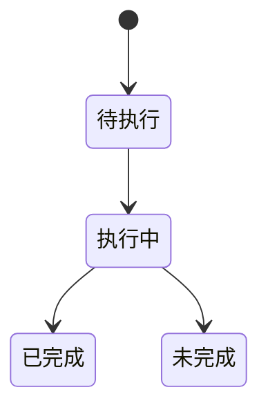

# 一、贡献模型

## 目录

- [四、WDNO 小波预测能力](#四WDNO 小波预测能力)

- [三、SafeDiffCon 扩散控制能力](#三safediffcon-扩散控制能力)

- [一、贡献模型](#一贡献模型)
  - [1.1 背景与定位](#11-背景与定位)
  - [1.2 核心业务操作流程图](#12-核心业务操作流程图)
  - [1.3 业务状态机](#13-业务状态机)
  - [1.4 状态值说明](#14-状态值说明)
  - [1.5 功能点清单](#15-功能点清单)
  - [1.6 功能点详解](#16-功能点详解)

- [二、GenCP 场生成与条件能力](#二gencp-场生成与条件能力)
  - [2.1 背景与定位](#21-背景与定位)
  - [2.2 核心业务操作流程图](#22-核心业务操作流程图)
  - [2.3 业务状态机](#23-业务状态机)
  - [2.4 状态值说明](#24-状态值说明)
  - [2.5 功能点清单](#25-功能点清单)
  - [2.6 功能点详解](#26-功能点详解)

## 一、贡献模型

### 1.1 背景与定位

完整第三方网络的变化与通用算子不同，将其保留在贡献包中可明确来源、许可和模型自身的输入要求。当前交付正式 AB-UPT，recipe 直接引用，core 不反向依赖贡献包。

### 1.2 核心业务操作流程图

### 1.3 业务状态机

本章无独立持久业务状态；调用失败向现有运行会话传播。

### 1.4 状态值说明

本章无业务状态值。数据空间与已提交产物在对应功能中明确记录。

### 1.5 功能点清单

1. 完整网络托管
2. 组件与布局
3. 推理缓存与分块查询
4. 参数化样条模型
5. 直接调用物理方程

### 1.6 功能点详解

#### 1. 完整网络托管

新 recipe 显式加载数据与模型组件；模型公开准备、构造、目标与预测接口保留当前语义，旧工作流加载仅作兼容。真实扩展使用普通函数和可重建来源声明；五例允许数据读取与模型完整预测的局部差异。

AB-UPT与Transolver公开推理查询块支持。Transolver先按照原分块及原顺序完成物理状态缓存，再以推理选择的查询块大小解码；参数只影响缓存后的查询，不替换为各块独立全模型预测。网络结构、训练损失、优化器及训练采样语义不随页面修改。

新增 Transolver-3 原始分块网络及全表面缓存、解码网络；保持参数注册次序和算法运算，正式运行不导入参考项目。来源摘要独立保存；原检出未发现许可文件，不能宣称已明确再分发许可。

当前无条件 AB-UPT 使用 RMSNorm、绝对位置几何消息、联合 Q/K/V 投影与同形跨域注意力收批，构造顺序和局部初始化对齐官方。无条件域块经模块入口调用多域路径，数值与直接 `forward_domains` 相同，结构跟踪才能收成模块盒。多域输入接口保持；默认案例保留声明的特征投影结构但不提供物理特征。旧结构权重不能直接续训，避免数学语义变化被静默接受。条件输入和缓存能力保留，其官方数值等价性须独立验收。

完整 AB-UPT 及必要模块从锁定版本引入，可安装导入路径替代外部本机路径。模型可选依赖固定兼容的图计算后端版本；编译扩展必须使用本环境的 Torch，不能借用其他项目环境。超节点半径/近邻检索依赖的图扩展只支持 CPU 与 CUDA；MPS 上先在 CPU 检索再把边索引搬回，其余计算仍在原设备。旋转频率与复数旋转在 MPS 原设备执行；已在 PyTorch 2.14.0 验证前向和反向，旧版不支持的内核会明确报错，不再强制把旋转搬回 CPU。MPS 的 scatter_reduce 池化没有确定性实现，不能承诺相同种子训练逐位复现。来源许可为 ENPL，保留许可证与集中分发声明。

#### 2. 组件与布局

Transolver 输入输出宽度按声明验证：NASA 为 12→4，汽车表面为 6→1，汽车体积为 3→3。各域独立训练，不改注意力和缓存算子。AB-UPT 条件可直接绑定物理样本字段；NASA 单表面配置使用已有自注意力块替代仅用于多域的跨域块，汽车联合模型保留原块组成。

模型通过构造、结构描述及具名预测交付能力。AB-UPT 自行解释布局和结构版本，Transolver 按参数声明接收具名特征并返回对应宽度的场；公共训练代码不检查模型专属属性。平台检查读取模型的损失与采样能力声明：AB-UPT 提供可配置点、锚点与查询采样；Transolver-3 提供切片数量、抽稀步长、查询分块和固定等权 MSE，参考抽稀步长只读。

输入契约错误分别说明非张量、形状、精度、设备或非有限值。错误包含输入名称与实际/期望约束，设备包含 type/index；沿用 ValueError，避免破坏调用方异常处理。模型不自动搬迁或转换输入以掩盖不合法数据。采样元信息附带实际分片下标，供批次诊断使用。

模型使用有序命名域与预测字段决定输出头；ShapeNet 仅压力一维、速度三维，不再建立固定四/七通道头后切片。局部特征按域投影，全局条件对归一化输入和读出进行零初始化缩放/平移；几何条件默认继承，显式空声明表示关闭，单独声明时必须提供相应输入。查询不进入任何 anchor 的键值集合。单域禁止跨域交互块。

数据准备显式绑定磁盘字段和模型字段；特征、条件必须声明变换或恒等方法。无放回采样按域和操作独立，anchor/query 可相交。固定布局批次允许几何点数不同，但超节点数、域内点数与通道一致，不自动填充。完整前向必须包含所有域的 anchors。域与字段顺序冻结到新检查点；模型结构现行为 version=3，检查点容器仍为 version=2；数值不相容的旧结构权重不能直接续训。

#### 3. 推理缓存与分块查询

独立推理将查询预算通过 infer 参数交给模型组件，历史 post 参数仍由旧入口解释。AB-UPT 返回已经反变换的物理场；Transolver 的全域汇总与解码保持原行为，业务层不替换为普通独立分块前向。

Transolver 逐层汇总整个表面的所有块后解码，缓存限制在单个样本内并在结束或异常时释放。正式网络、完整数据两轮及恢复、全部测试输出已通过限定环境下的严格数值对标；不推广为其他硬件上的等价保证。

缓存包含几何编码与位置频率、物理块与每域解码层的 anchor K/V，属于单个模型推理上下文。预填充只执行 anchors；查询调用只传 query 坐标和特征。支持仅几何缓存以及完整缓存，部分层缺失失败。上下文绑定准备记录、模型实例、权重版本、设备、精度和布局。进入训练、启用梯度、加载/更新权重或设备精度变化后拒绝复用。缓存不可序列化，退出上下文释放持有张量；分块按原查询顺序拼接。默认块长 1024，不承诺固定加速倍数。
#### 4. 参数化样条模型

PI-BSNet 从实例参数预测控制系数，提供场重建和物理坐标导数。模型不管理数据生成、优化器或训练循环。
Neumann与Advection采用经用户选定的原参数样条、原导数递推与端点；Neumann保持原网络初始化消耗，Advection恢复原首行标签插值覆盖及融合均方损失，不再使用解析lifting。参数导数与物理导数在输出名称上明确区分。对流扩散及Burgers的进一步原代码迁移待范围确认。梯形唯一案例改为用户选定的十实例实验：保留原参数空间递推、端点数值行为和近似方程，导数明确标为参数导数，不称为完整物理导数。没有原版/修正版切换开关。
硬边界只支持明确的常数定值条件；不连续初边界采用边界优先，初值提供软条件能力和监测；参考配置不增加原目标未使用的罚项。Advection 支持解析初值 lifting。
梯形使用完整控制系数输出头，先固定初始内部零再覆盖四边一；控制系数布局与场轴分别明确。正式网格为100×20×20、隐藏64。硬约束违约仅监测，不重复计入软损失。只支持网格点子集和完整网格查询，离网采样及不支持的条件明确拒绝。
模型拓扑、数值行为与原脚本不同的部分必须在比较中披露。旧梯形、Neumann及Advection准备与检查点不能直接续训；原独立权重只可用于有记录的数值验算，不能伪作新训练。

#### 5. 直接调用物理方程

用户可直接以 PyTorch 张量调用 Burgers、对流、扩散、对流扩散和二维不可压缩 NS 方程。
标量方程返回逐点残差，NS 返回连续性与两个动量分项。函数不求导、不归约、不改变设备或计算空间。
场和导数要求形状、精度和设备一致；物理系数仅允许标量或匹配的逐点张量，避免误广播。
NS 采用常密度、常运动黏度、物理压力及无体积力假设，压力基准由完整问题定义。
用户自定义方程仍是普通函数，无须继承框架类。提供 NS 函数不等于交付完整 NS 训练案例。

## 二、GenCP 场生成与条件能力

### 2.1 背景与定位

保留发布 CNO 与 SiT-FNO 的初始化和张量算术；模型内部模块暂不提炼成全仓通用层。当前缩小实验接入不代表论文精度。

### 2.2 核心业务操作流程图

### 2.3 业务状态机

本章无业务状态；普通能力由调用方组合，失败以异常交接。

### 2.4 状态值说明

本章无业务状态，不建立共享全局生命周期。

### 2.5 功能点清单

1. 网络与流匹配目标。
2. 场间条件与边界。
3. 归一化与参考分析。

### 2.6 功能点详解

#### 1. 网络与流匹配目标

两骨干按各场输入输出和物理时间布局构建。原噪声、路径噪声消耗、sigma 与通道目标独立；核热网络时间乘一千不改变积分时间。

#### 2. 场间条件与边界

FSI 联合状态拆分合并；核热中子、固体、流体使用不同网格条件映射。固体最右两列归一化温度作为流体条件，未改写成热通量。外部真值边界显式输入，完整真值仅供评价。

#### 3. 归一化与参考分析

保留 FSI 输入/输出各自范围和算术顺序；核热中子对数及固定物理界限。FSI 只平滑 SDF，真值 mask 阈值单独声明，物理分量分别评价。

## 三、SafeDiffCon 扩散控制能力

### 3.1 背景与定位

提供Burgers二维时空网络和Tokamak一维多通道网络及其原扩散算术。当前官方案例是用户批准的三小时缩小变体；安装和数值迁移通过不等于论文精度复现。

### 3.2 核心业务操作流程图

### 3.3 业务状态机

### 3.4 状态值说明

待执行表示仅有参数；执行中表示计算尚未交付；已完成要求对应步骤产物完整；预算耗尽、异常和数据不符均为未完成，不能据此宣称论文达标。

### 3.5 功能点清单

1. 原网络与安全控制

2. 物理响应与评价

3. 来源与变体边界

### 3.6 功能点详解

#### 1. 原网络与安全控制

模型宽度和采样步数显式可配；噪声损失、原加权次序统计量、重加权及输入梯度分别提供。EMA保留原预热与间隔。普通采样不更新权重，推理适配显式产生新权重。

#### 2. 物理响应与评价

Burgers使用原数值求解器；KSTAR在隔离Python3.9环境读取指定资源，每样本按原程序重置。输出必须有限，失败不得发布成功指标。Burgers终态MSE和三类违规率、Tokamak两种目标MSE和两类违规率分别评价。

#### 3. 来源与变体边界

原数值定义保留授权和逐文件摘要；原仓库只用于验证，不是安装包运行依赖。dim64/4000更新/DDIM50为当前缩小配置，完整论文宽度与预算不在本次验收范围。

## 四、WDNO 小波预测能力

### 4.1 背景与定位

WDNO 在小波系数空间预测 Burgers 状态轨迹。本期支持作者基础预测数值定义；递归超分、控制和 Smoke 尚未形成受支持的研究闭环，不因抽取代码中存在相关分支而标为可用。

### 4.2 核心业务操作流程图

### 4.3 业务状态机

### 4.4 状态值说明

已完成只表示所选步骤已交付完整产物；预算中断、参数冲突、数据变化和异常均为未完成。模型精度与论文复现结论独立说明。

### 4.5 功能点清单

1. 网络与目标

2. 小波准备与采样

3. 评价与平均权重

### 4.6 功能点详解

#### 1. 网络与目标

保留作者二维 U-Net 的参数注册、条件扩散的掩码、噪声日程、通道损失权重和归约。网络、损失与采样分别可通过普通函数组合。默认配置为源码 groups=1 的缩小预算基础预测，不能称为论文 groups=8 的完整设置。

#### 2. 小波准备与采样

使用 bior2.4/periodization 的一层变换；训练条件取自反变换后状态，推理条件取自原始轨迹，两条路径保留原算术。逐通道缩放保持作者定义。恢复物理场时不把预测初始帧强制改成真值。

#### 3. 评价与平均权重

默认评价普通模型权重。MSE 排除初始帧，先以 float32 求每样本平均，再按样本等权汇总。EMA 使用作者依赖并保留计数器与预热；共享适配仍兼容 SafeDiffCon 旧导入。论文表中 0.00014 只作为目标展示，本地切片的分片与评价数据不同。
