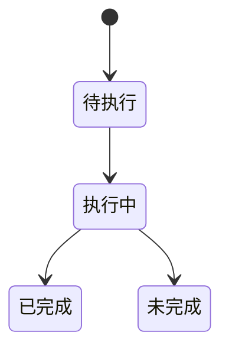
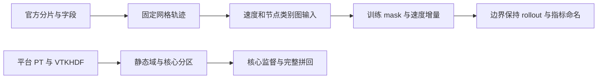
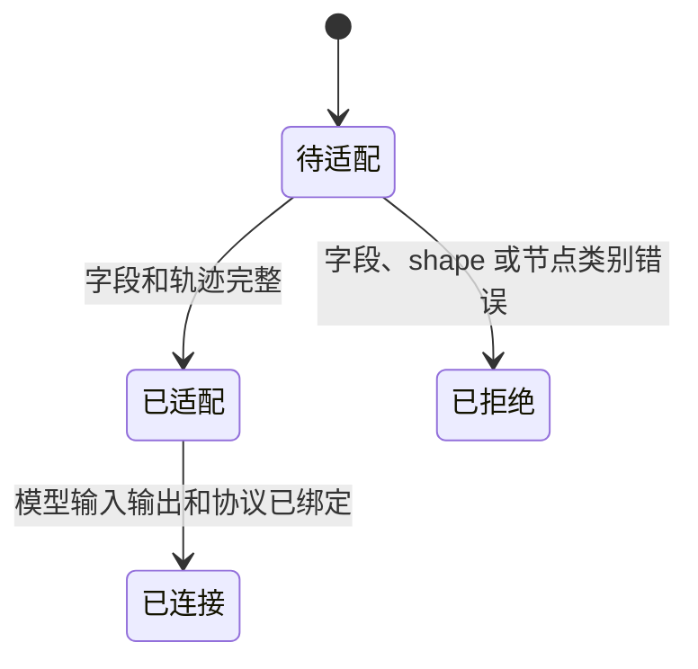

# 共享数据集适配

## 目录

- [七、PCNO 发布数据与研究连接](#七PCNO 发布数据与研究连接)

- [六、GeoTransolver 数据与实验绑定](#六geotransolver-数据与实验绑定)
  - [6.1 背景与定位](#61-背景与定位)
  - [6.2 核心业务操作流程图](#62-核心业务操作流程图)
  - [6.3 业务状态机](#63-业务状态机)
  - [6.4 状态值说明](#64-状态值说明)
  - [6.5 功能点清单](#65-功能点清单)
  - [6.6 功能点详解](#66-功能点详解)

- [五、CylinderFlow 数据与 MeshGraphNet 连接](#五cylinderflow-数据与-meshgraphnet-连接)
  - [5.1 背景与定位](#51-背景与定位)
  - [5.2 核心业务操作流程图](#52-核心业务操作流程图)
  - [5.3 业务状态机](#53-业务状态机)
  - [5.4 状态值说明](#54-状态值说明)
  - [5.5 功能点清单](#55-功能点清单)
  - [5.6 功能点详解](#56-功能点详解)

- [四、WDNO 数据与案例连接](#四WDNO 数据与案例连接)

- [三、SafeDiffCon 数据与案例连接](#三safediffcon-数据与案例连接)

- [一、共享数据集适配](#一共享数据集适配)
  - [1.1 背景与定位](#11-背景与定位)
  - [1.2 核心业务操作流程图](#12-核心业务操作流程图)
  - [1.3 业务状态机](#13-业务状态机)
  - [1.4 状态值说明](#14-状态值说明)
  - [1.5 功能点清单](#15-功能点清单)
  - [1.6 功能点详解](#16-功能点详解)

- [二、GenCP 数据与案例连接](#二gencp-数据与案例连接)
  - [2.1 背景与定位](#21-背景与定位)
  - [2.2 核心业务操作流程图](#22-核心业务操作流程图)
  - [2.3 业务状态机](#23-业务状态机)
  - [2.4 状态值说明](#24-状态值说明)
  - [2.5 功能点清单](#25-功能点清单)
  - [2.6 功能点详解](#26-功能点详解)

## 一、共享数据集适配

### 1.1 背景与定位

共享数据集实现可安装、可引用、可复制修改。这里解释特有布局、字段语义和模型/步骤连接；不复制 core 数值算法，不承担平台上传。能力归属默认进入 core，contrib application 只绑定不能中立化的数据、模型参数和业务流程。

### 1.2 核心业务操作流程图

### 1.3 业务状态机

读取适配器无业务状态。独立生成依次进入 generating，再进入 complete 或 failed；失败不发布完整数据清单。

### 1.4 状态值说明

generating 表示逐样本产生与保存；complete 表示全部数据和清单已发布；failed 表示生成中断，保留已提交记录但不可冒充完整数据集。

### 1.5 功能点清单

1. 数据结构描述
2. 数据集选择与复用
3. 独立生成参数化物理数据

4. 数据集原始处理声明

### 1.6 功能点详解

#### 1. 数据结构描述

官方旧配置加载适配在托管请求内单独校验并行线程和多格式参数，避免将旧加载器不能识别的键写回冻结脚本；多格式恢复到本次公开配置，并行参数只交给样本循环。共享名称由用户明确提供，不从模型或任务名称推断。

新 recipe 显式加载数据与模型组件；模型公开准备、构造、目标与预测接口保留当前语义，旧工作流加载仅作兼容。真实扩展使用普通函数和可重建来源声明；五例允许数据读取与模型完整预测的局部差异。

数据集为推理输出提供真实物理量名称、分量及单位描述：ShapeNet-Car压力和速度的未知单位保持未知；NASA的Cp/Cf为无量纲。物理描述不增加模型未输出的热或结构能力，域和实体归属由实际数据契约确定。

NASA 数据适配提供直接 HDF5 到物理 PT 的字段映射；汽车通过逻辑布局打开原 PT，不改写旧数值。拓扑来源由数据组件解释，模型选择不影响数据身份；NASA 没有体场，不生成体积案例。

NASA CRM 适配解释 HDF5 点字段、六维工况、全局参考系数和邻接表，交付兼容原有 NPY 分块的数据视图。不同源文件可以重复 Sample 编号，身份以来源和分片区分；同一训练来源的训练与验证不得重叠。

源 manifest 描述版本、文件布局、字段归属与分量、未知单位和官方分片。处理描述把各域来源文件名写入 `source_files` 并补到对应输出，页面编辑提取时回填默认 VTK。ShapeNet 官方 train/test 名单与参考统计独立随包发布，默认不会把参考统计当作本次拟合。

#### 2. 数据集选择与复用

WDNO 原版来源审计和缩小训练记录独立保留；当前可安装数据适配、模型连接与可复制研究入口见第四章。基础预测迁移按用户明确授权的缩小范围验收，论文复现与其他任务仍单独限定。

新模型的数据准入与正式适配分开。SafeDiffCon 当前已提供仓库辅助工具核验 Burgers/HDF5 和
Tokamak/Arrow（含压缩分片），记录全部样本的有限性、官方划分、来源摘要及目标语义差异；
本包已新增 SafeDiffCon 数据适配和限时训练连接，见第三章。数据通过不等于原版论文复现通过，
也不会自动注册模型、发布平台数据或改变现有准备记录；原版完整复现后才进入正式迁移。

共享配置转换和模型专属参数解释放在贡献侧连接。复制研究脚本可保留本地扩展参数声明，不需要每次平台内部调整都复制新的转换实现。PDE 模型只提供本流程实际需要的准备参数，不承担外流模型或页面描述约定。外流 `operations.inspect` 对现行公共输入做绑定后检查，并把检查期间的临时数据目录分配到独立检查区，避免案例相对输出落入复制 recipe；任务配置仍含已迁移旧键时改走原检查门面，不在检查时改写 YAML。

共享组件加载器解析数据、模型及业务装配的全限定路径。NASA 采用独立测试来源和固定种子划分，未声明组件的汽车配置自动选择原组件，公开旧键迁移另行处理。数据读取不要求使用者解析具体清单文件映射。

用户选择全部或显式样本列表，选择官方、`unsplit` 或自定义分片。`unsplit` 仍核验官方名单人数，但把全部样本收成单一训练宇宙，供平台原始处理不按 train/test 落盘。重复、跨分片重复、越界和不存在的样本拒绝。打开时只访问元数据与路径，不读网格。用户可在任意目录复制 manifest/adapter，通过普通 import 使用；相对资源按 manifest 位置解析。

平台检查入口 `inspect_dataset(config)` 提供来源、稳定样本身份、分片、完整依赖和真实字段目录。带 `sample_scope` 时输入宇宙是数据集官方或自身分片，不吃任务里的子集声明，并回传 `sample_universe`。汽车按样本目录校验选定域文件并读取真实 VTK 点/单元数组；NASA 将 HDF5 文件与文件内样本分开，校验连接关系依赖，允许显式读取原始数值点字段。未知单位保持空值，不能将同名数组视为相同物理量。

#### 3. 独立生成参数化物理数据

对流扩散、Neumann 扩散、Advection、Burgers 和梯形域扩散各有独立生成入口。用户先产生新数据集，再执行准备和训练；生成过程不依赖模型。
数据保存实例参数、物理/参考轴、参考场、映射与身份。Neumann/Advection保留原连续MT19937训练后测试抽样，轴、标签及参数保存为原FP32精度；Neumann在FP32坐标上计算解析标签，Advection保留显式取模后转FP32。其他未迁移生成器仍使用分离随机流；梯形保留原连续随机流，训练后消耗一个原演示实例，再产生十个测试参数，记录明确名单。
已有非空输出目录拒绝写入；逐样本原子提交，全部成功后才发布完整清单。部分失败保留已生成记录，不冒充可训练的完整数据集。
对流扩散采用与积分等价的闭式概率，Burgers使用不重复端点的周期FFT网格。梯形使用用户选定的源码近似差分及Euler：默认十个训练实例、21×21空间点、1001时间片，逐步保存单精度场；中间计算保留原标量精度。稳定条件不满足则失败，不自动加子步。此标签是近似数值参考，不是完整坐标变换的解析真值。
数据变更产生新版本并记录数值协议。旧完整映射梯形数据及旧随机流/精度的Neumann、Advection数据不可作为选定实验的输入；不覆盖历史数据，失败不发布完整清单。

#### 4. 数据集原始处理声明

- ShapeNet-Car 与 NASA 的默认处理参数及可选输出随数据集声明提供，未绑定来源也可展示。两份清单默认写出 `formats: [pt]`，不再用旧单键 `format`；与平台选项合并时以页面值为准，不报冲突。两类来源只要提供真实网格或 connectivity，均声明 VTKHDF 能力并默认打开；NASA 使用官方 connectivity 和每个样本坐标交付表面网格。绑定后读取各分片代表样本的真实字段，执行前覆盖选定样本检查。完整范围来自数据集声明名单，不递归处理名单外目录；缺失不自动补齐。NASA 的共享文件与文件内样本独立。ShapeNet 最近顶点距离与体积法向是两项独立几何能力；`volume_normals` 不再挂在 `nearest_vertex` 下。历史任务若已保存体积法向且启用了最近顶点，解析时提升为独立能力。

## 二、GenCP 数据与案例连接

### 2.1 背景与定位

将发布数据原生数组接入耦合领域，数据无需转换为 VTK。保留官方分片，重叠窗口按需读取。

### 2.2 核心业务操作流程图

### 2.3 业务状态机

本章无业务状态；普通能力由调用方组合，失败以异常交接。

### 2.4 状态值说明

本章无业务状态，不建立共享全局生命周期。

### 2.5 功能点清单

1. 三套数据来源。
2. 案例配置和模型连接。
3. 单场验证与物理恢复。

### 2.6 功能点详解

#### 1. 三套数据来源

两个 FSI 分支分别验证九个训练和一个验证文件，原裁剪、历史与预测窗口固定；HDF5 中的实际网格与物理时间可从冻结来源读取，结果保存坐标与时间值，未声明的单位不猜测。核热以发布 NPY 行配对三个异形网格，训练与耦合分片独立。

#### 2. 案例配置和模型连接

模型参数、目标、归一化和原始字段解释归贡献连接；核心领域不认识具体网络。完整导入路径可换用户条件和构造器，路径按配置文件解析。

#### 3. 单场验证与物理恢复

连接原单场生成能力、验证样本及物理指标。FSI 流体按 u、结构按 SDF 选优；核热流体各分量相对误差平均。耦合最终结果另行评价。

## 三、SafeDiffCon 数据与案例连接

### 3.1 背景与定位

绑定原始两个数据集、原生通道和领域步骤，扩展研究无需改平台或框架注册表。

### 3.2 核心业务操作流程图

### 3.3 业务状态机

### 3.4 状态值说明

待执行表示仅有参数；执行中表示计算尚未交付；已完成要求对应步骤产物完整；预算耗尽、异常和数据不符均为未完成，不能据此宣称论文达标。

### 3.5 功能点清单

1. 官方样本与常数缩放

2. 预训练与两轮后训练

3. 显式适配与严格配置

### 3.6 功能点详解

#### 1. 官方样本与常数缩放

Burgers固定39000/1000/50；Tokamak固定48950/1000/50。Arrow可从现有ZIP流读取；不重划测试集。Burgers补齐到16并除10，Tokamak补齐到128并按12通道常数缩放。原outputs目标与数据targets独立保留。

#### 2. 预训练与两轮后训练

原Adam预训练参数、余弦调度和EMA保持；批次流可恢复并保留尾批。两轮开始校准、明确交接后训练权重，属于已披露的原脚本顺序修正；不通过继续错误长训练获取新基线。

预训练更新数表示含恢复历史的总目标，默认4000，当前短实验允许1至20000的整数；这只是规模检查，不代表这些步数必然能在三小时内完成。继续训练须使用相容的准备、模型、学习率、批量与随机种子，保留原调度位置，不把目标步数当作额外增加量。实际执行仍由原累计账本监督，预留最终响应评价时间后冻结步数。历史4000步配置及准备记录继续有效，不更改冻结摘要。

#### 3. 显式适配与严格配置

适配次数表示实际参数更新次数；读取明确准备和检查点。配置、覆盖和程序入口检查相同参数，未知键拒绝，相对路径按配置文件展开。安全引导、目标、模型、变换和派生量可通过普通函数路径替换。

公共用户输入按阶段分组，领域内部参数只在实际调用前绑定，不回写用户配置。求解器资源作为推理输入捕获，解释器位置保留虚拟环境身份；不追随解释器符号链接到缺依赖的基础环境。旧配置显式转换生成新副本、路径以旧目录为基准，新旧键混用拒绝；已有数组与完整训练状态按原科学合同继续消费。固定结果按完整自包含目录登记，后处理只消费已保存数组。预训练、后训练和适配权重补充阶段身份；指标包含固定真值、样本与统计定义，不能因缺语义冒充可比较结果。

## 四、WDNO 数据与案例连接

### 4.1 背景与定位

Burgers 基础预测连接原始 Torch 字典、代表轨迹划分、模型准备、训练和独立评价。只提供 Python 代码能力，用户明确批准三小时内的缩小范围迁移；其他系统和平台不自动进入范围。

### 4.2 核心业务操作流程图

### 4.3 业务状态机

### 4.4 状态值说明

已完成只表示所选步骤已交付完整产物；预算中断、参数冲突、数据变化和异常均为未完成。模型精度与论文复现结论独立说明。

### 4.5 功能点清单

1. 原始来源与切片

2. 模型连接与可恢复训练

3. 普通函数与配置

### 4.6 功能点详解

#### 1. 原始来源与切片

原文件只读并核验完整摘要。训练与验证从前 20000 条独立代表轨迹选择，测试从前 4000 条选择；重复、跨训练验证重叠、空分片和越界拒绝。保存原索引及来源信息，验证和测试子集在训练前确定。原版工具历史数组不自动冒领为 Dojo 准备。

#### 2. 模型连接与可恢复训练

贡献侧装配小波条件、网络、Adam、余弦调度和 EMA；核心迭代能力执行更新。Dojo 检查点包含优化器、调度、完整 EMA、批次排列与游标、随机状态和损失历史。总更新目标可增加；数据、网络、目标、学习率、批量、随机种子、Torch 版本或数值代码身份变化拒绝续训。原 Trainer 权重可以明确导入预测，但缺少完整原随机/调度状态，不能冒称精确续训。

#### 3. 普通函数与配置

训练连接可选择本地优化器构造、调度器构造和单次更新函数；省略时仍是原装配。参数来自当前训练配置，实际选择的函数来源参与完整恢复身份。策略变化后不能沿用不相容的训练状态；固定预测和后处理不需要导入训练策略。

配置文件、点号覆盖和程序入口共用校验，相对路径以 YAML 位置解析。网络、损失、变换、预测和评价可用全限定函数或直接调用连接。变体记录实际组件所在文件摘要，并由运行writer保存本次研究目录直接Python文件的原文与摘要；独立train和整条pipeline均记录。 外部输入按公共阶段分组，每项只接受路径或空值；公共加载负责相对路径，WDNO连接负责分片完整性、冲突和科学参数。旧用户配置只能显式转换，准备与检查点格式不因配置重排失效。采样步数独立于训练恢复身份。固定结果包含权重摘要、真实采样函数和派生输出单位/轴说明。

WDNO固定结果的资产和指标登记共用数组依赖解析，拒绝越界或缺失来源。指标除清单外绑定全部实际数组，任务比较核验其内容身份；依赖完整性和科学可比口径分别判断，预测变化不影响同真值实验的可比身份。该交接不改变原评价算术，不升级历史指标索引；旧报告保留原保护范围，需要增强保护时重新执行固定结果评价。

## 五、CylinderFlow 与静态外流 MeshGraphNet 连接

### 5.1 背景与定位

本章解释官方 CylinderFlow 轨迹字段、九类节点、训练/推理布局和论文评价名称，并把
这些语义连接到中立 core 能力；同时提供 ShapeNet-Car 与 NASA CRM 的静态外流字段、
工况、监督和分区拼回连接。它不实现通用 TFRecord、图算法、训练循环或 Task 管理，
也不把 PhysicsNeMo 作为运行依赖。

### 5.2 核心业务操作流程图

### 5.3 业务状态机

### 5.4 状态值说明

| 中文含义 | 标识 | 业务说明 |
| --- | --- | --- |
| 待适配 | `pending` | 已找到原始记录，尚未形成规范轨迹 |
| 已适配 | `adapted` | 坐标、拓扑、节点类别和速度时间轴完整 |
| 已连接 | `bound` | 训练、恢复和 rollout 可以消费 |
| 已拒绝 | `rejected` | 数据不满足固定二维 CylinderFlow 协议 |

### 5.5 功能点清单

1. 官方数据字段和分片适配
2. 训练帧与节点语义
3. 模型归一化、目标和恢复连接
4. rollout 与论文指标连接
5. 静态外流字段与分区连接

### 5.6 功能点详解

#### 1. 官方数据字段和分片适配

读取 train、valid、test 分片，以 meta.json 解码 cells、mesh_pos、node_type、velocity
和可选 pressure。首期只消费二维速度；静态字段保持一份，不人为复制到每个时间步。
固定网格轨迹至少有三个帧，拓扑和节点身份在整条轨迹内保持不变。

#### 2. 训练帧与节点语义

训练从完整轨迹的中间帧取当前速度和后一帧目标。九类节点以 one-hot 加到速度后；
只有 NORMAL 节点加噪，NORMAL 和 OUTFLOW 节点进入损失。其他类别作为边界，在 rollout
中保持初始速度。类别越界或局部索引越界时拒绝。

#### 3. 模型归一化、目标和恢复连接

完整十一维节点特征、三维边特征和二维速度增量分别在线累计统计。噪声加入输入后从
速度增量目标扣除；损失在两个速度分量上求和，再对选中节点平均。检查点身份包含网络
结构、batch、噪声、预热和学习率协议，缺失或不一致时不能继续训练。

#### 4. rollout 与论文指标连接

模型输出经反归一化后作为速度增量积分。固定结果按样本保存不同节点数的轨迹，并报告
1、10、20、50、100、200 步可用 horizon 的累计 MSE；初始帧排除，轨迹之间等权。
这些名称对齐评价程序，但只有同数据、同预算的实跑才能形成论文复现结论。

#### 5. 静态外流字段与分区连接

ShapeNet-Car 把位置、法向和距离绑定到表面/体积两个独立网络，分别预测压力和三分量
速度；NASA CRM 把六维工况广播到表面节点并预测 Cp 与三分量 Cf。训练只在核心节点
计算监督，halo 只提供 Processor 消息上下文；推理要求核心块互斥且覆盖完整原点身份。
两例沿用外流物理指标，仅证明工程连接，不形成 MeshGraphNets 论文复现结论。

## 六、GeoTransolver 数据与实验绑定

### 6.1 背景与定位

贡献连接只声明来源、字段、工况、科学目标和模型配置；不实现训练/预测循环或统计、绘图。首期Python和Task，不登记Web案例。

### 6.2 核心业务操作流程图

### 6.3 业务状态机

本章无业务状态；持久结果只有完整交付后才可消费，失败由执行会话记录。

### 6.4 状态值说明

本章无业务状态，不增加全仓协议或平台状态。

### 6.5 功能点清单

1. Darcy实验身份
2. 保险杠实验身份
3. 优化与配置
4. 外流点场绑定

### 6.6 功能点详解

#### 1. Darcy实验身份

smooth1前1000训练、smooth2前200评价。原421网格保留，模型以相同索引取85网格。采用参考float32全局标量归一化、物理空间逐样本相对L2；原MAT浮点精度不修改。

#### 2. 保险杠实验身份

公开124训练/7验证；共同11帧，预测后续10帧全部节点。工况依次为速度x、厚度比例、刚性墙原点y。目标依次为三维位置、有效塑性应变、von Mises应力；前三通道回加初态。保留位置统计及动态场原尺度，原额外帧不删除。

#### 3. 优化与配置

二维参数选Muon，其余选AdamW。Darcy逐更新预热/余弦，保险杠完整轮次末余弦；短训不压缩原日程。公共阶段输入路径、程序入口和覆盖采用同一校验。缩小训练不构成文献复现。

#### 4. 外流点场绑定

ShapeNet-Car 将表面坐标和法向绑定为六维输入，输出压力；体积坐标、距离和方向为七维输入，输出三分量速度。两域共享几何条件和计算块，各自计算切片，不增加跨域注意力。距离与方向保持现有数据适配器含义。

NASA CRM 节点输入坐标和法向，输出 Cp、Cfx、Cfy、Cfz；Mach、AlphaMean、aileronInboard、aileronOutboard、htp、elevator 按固定次序进入全局条件，不重复广播到节点。字段顺序冲突和目标泄漏失败。

基础实验选用四层、128 隐藏维、四头、64 切片的普通 GALE，无局部编码；二维参数选 Muon，其余选 AdamW，完整百轮后学习率乘 0.5。网络、采样和监督参数可在公开案例中修改，但形成新的实验身份。CPU 工程短训证据不表示 SHIFT-Wing 或其他论文成绩。

## 七、PCNO 发布数据与研究连接

### 7.1 背景与定位

绑定CMG发布张量、原统计量与双分支研究流程；管理层保持模型无关。

### 7.2 核心业务操作流程图

### 7.3 业务状态机

本章无业务状态，函数调用成功返回结果，失败抛出明确异常。

### 7.4 状态值说明

仅完整交付表示所选步骤完成；异常与中断保留已有记录，不声明完整成功。科学精度另行评价。

### 7.5 功能点清单

1. 发布数据身份

2. 训练与恢复

3. 联合预测与经济连接
4. 圆柱来源、配对训练和准入边界

### 7.6 功能点详解

#### 1. 发布数据身份

24例训练集按8块发布，每轮21训练、3轮换验证。18例演示场与作者预存预测相同，不登记为独立真值。缺字段、错维、非有限值和井标签错配明确失败。

#### 2. 训练与恢复

两个分支独立固定种子，保留250轮学习率与损失阶段日程，以总更新次数决定快速验证范围；训练物理项保留伴随场真实标签。完整检查点保存模型、优化器、调度、随机流、排列与游标，科学配置变化拒绝恢复。

#### 3. 联合预测与经济连接

提供24例回算、18例新预测与作者18例回放。双分支检查点与结果清单均可独立搬运和读回。经济评价只消费固定结果，作者回放与自训结果分开，24例误差不称为独立测试精度。

#### 4. 圆柱来源、配对训练和准入边界

双圆柱按现有五条训练和一条验证轨迹核验来源，保留未人工清零的交错速度。训练统计只来自训练轨迹，准备仅保存索引；窗口按需读取，原始数据为外部只读依赖。训练先共用数据预热，再分叉监督与连续性组，共用相同目标的结构分支；完整恢复核对准备、科学参数和组件身份。

独立推理只输入历史场，输出固定物理场。误差在共同真实几何有效域上比较，同时单列预测几何下的散度及覆盖数。官方CylinderFlow可按完整记录取得原始子集；当前P1散度超过预设门槛，训练路线处于未准入，不修改标签或放宽阈值。
