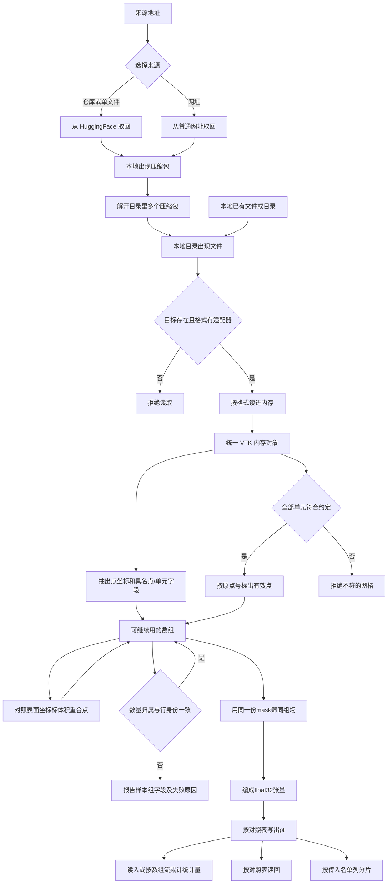
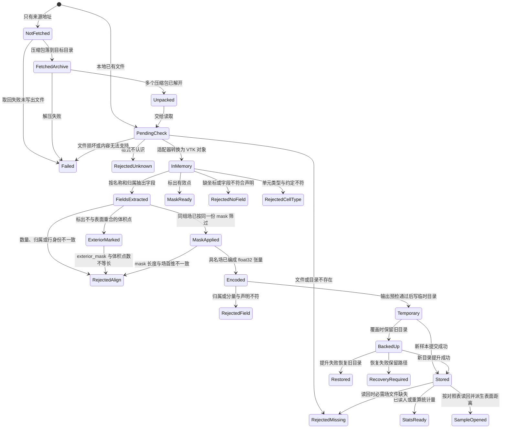
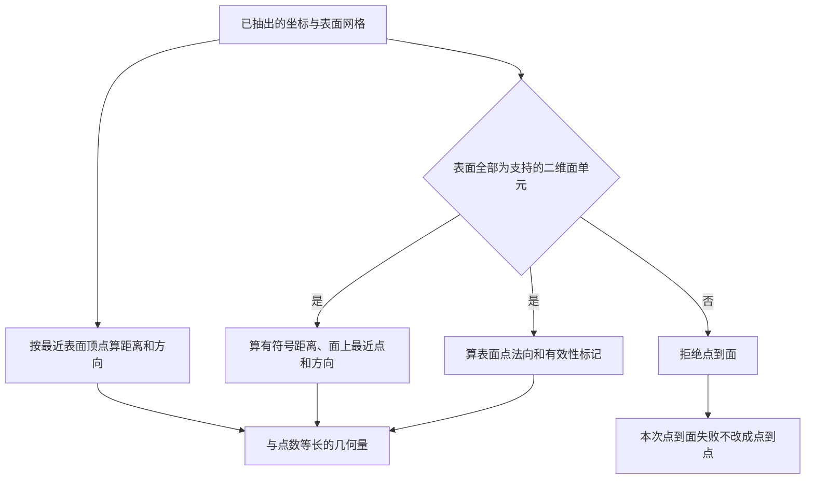
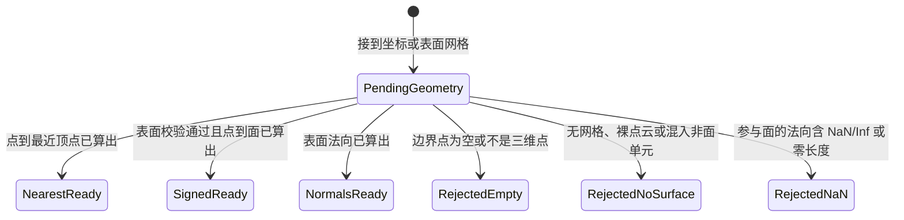
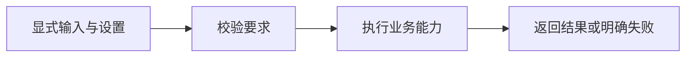
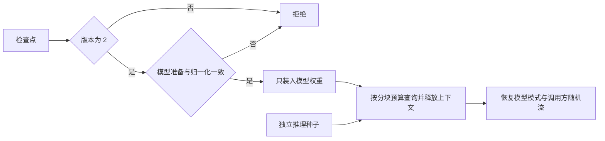
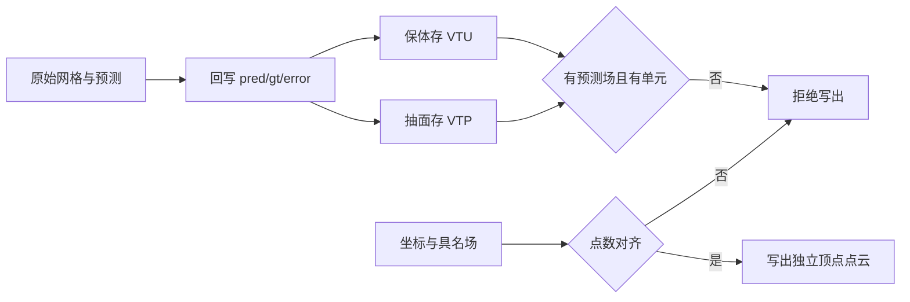

# 原子能力

本文是 `ai4e-core` 的 `abilities` 模块产品说明。原子能力跨阶段复用，不认识具体案例。当前交付**数据**章（原始数据源访问、字段提取、有效点 mask、重合点标记、点数对齐、套对齐 mask、具名场编码写出与统计量）和**几何**章（点到最近表面顶点、点到网格表面、表面法向）。变换、采样、建模、监督比较方法、训练和锚点评估见第三章；推理重建、锚点点云与完整网格回贴见第四、五章。物理约束与报告为后续范围。

---

## 目录

- [一、数据](#一数据)
  - [1.1 背景与定位](#11-背景与定位)
  - [1.2 核心业务操作流程图](#12-核心业务操作流程图)
  - [1.3 业务状态机](#13-业务状态机)
  - [1.4 状态值说明](#14-状态值说明)
  - [1.5 功能点清单](#15-功能点清单)
  - [1.6 功能点详解](#16-功能点详解)
- [二、几何](#二几何)
  - [2.1 背景与定位](#21-背景与定位)
  - [2.2 核心业务操作流程图](#22-核心业务操作流程图)
  - [2.3 业务状态机](#23-业务状态机)
  - [2.4 状态值说明](#24-状态值说明)
  - [2.5 功能点清单](#25-功能点清单)
  - [2.6 功能点详解](#26-功能点详解)
- [三、数据准备与训练能力实施](#三数据准备与训练能力实施)
  - [3.1 背景与定位](#31-背景与定位)
  - [3.2 核心业务操作流程图](#32-核心业务操作流程图)
  - [3.3 业务状态机](#33-业务状态机)
  - [3.4 状态值说明](#34-状态值说明)
  - [3.5 功能点清单](#35-功能点清单)
  - [3.6 功能点详解](#36-功能点详解)
- [四、推理重建](#四推理重建)
  - [4.1 背景与定位](#41-背景与定位)
  - [4.2 核心业务操作流程图](#42-核心业务操作流程图)
  - [4.3 业务状态机](#43-业务状态机)
  - [4.4 状态值说明](#44-状态值说明)
  - [4.5 功能点清单](#45-功能点清单)
  - [4.6 功能点详解](#46-功能点详解)
- [五、后处理导出](#五后处理导出)
  - [5.1 背景与定位](#51-背景与定位)
  - [5.2 核心业务操作流程图](#52-核心业务操作流程图)
  - [5.3 业务状态机](#53-业务状态机)
  - [5.4 状态值说明](#54-状态值说明)
  - [5.5 功能点清单](#55-功能点清单)
  - [5.6 功能点详解](#56-功能点详解)

## 一、数据

### 1.1 背景与定位

走 AB-UPT / ShapeNet-Car 的研究员把官方包取回并解开，再按文件路径把 VTK 家族文件或 NPY 读成统一 VTK 内存对象，随后从 VTK 对象抽出点坐标与具名点/单元字段，按单元连通标出不参与网格的多余顶点，并可用坐标精确相等标出与表面重合的体积点、校验多字段首维对齐。落盘前用同一份 mask 筛同组数组，再把具名场编成训练可读的 `float32` 张量按对照表写出。统计量默认读随案例发布的文件，必要时按已写出的训练分片重算。下载只负责取回和解开多个压缩包。读取先确认文件存在且格式有适配器。抽取和清洗只吃 VTK 内存对象或坐标数组；编码和写出只吃具名场记录，不认数据集名字。本切片支持 `.vtk`、`.vtp`、`.vtu`、标准 `.vtkhdf`、兼容扩展名 `.vtkh5` 与 `.npy`。

**为什么这样划分**

- 不同来源先转换为统一 VTK 内存对象，后续提取与清洗复用同一套能力，避免按文件格式重复实现操作。统一对象不代表所有数据都是网格，也不代表已经支持所有外部格式。
- 网格保留具体类型、拓扑和字段，避免为统一形式而展开结构网格或合并区域；无需先写 VTKHDF 或 PT 再读取。
- 提取明确指定字段名称和归属，防止文件中的活动字段切换后，把温度误读为压力。
- 清洗先给出原点序 mask（有效点、重合点），不提前删点，使后续几何处理仍能访问完整拓扑；套 mask 发生在编码之前，原数组保持不变。首维检查保持独立；落盘前还必须检查同组来源、归属和行身份。
- 不把第二份压力数组或第二个读取库作为通用真值来源。对照能发现差异但不能独立判断谁正确；当前不实施该数据集特有的对照步骤。

**边界**

- 不单独做两份压力或两套读法的对照；存在性与格式检查发生在打开适配器之前。
- 不解释解开后的目录是不是 ShapeNet，也不自动删除缺 VTK 的样本目录。
- 清洗仍可只出 mask 或校验结果，不删原数组；套 mask、编码和写出是独立能力。几何派生见第二章。
- 不把整份 VTK 或单元连接压成一张训练张量。对照表没有点名的场不写、不造。
- 通用编码和写入不认识 `cell.pt`。点场、单元场以及打包文件由业务层显式选择，禁止按名称后缀猜归属。
- 已交付字段名称、归属和分量检查，以及具名场落盘与统计量读入/累计；完整 FieldSpec、样本体系与跨运行内容缓存仍为后续；阶段与运行能力见对应模块。
- 官方包地址与「可用本仓下载或继续手搓」写在案例说明里，本章不单独做查阅能力。
- 分片名单按传入列表校验人数，不扫盘。规范化预处理根与打开样本属于外流 trainprep 装配。样本发现属于 application；批量执行、dry-run 意图和首错策略属于 run；输出预检与覆盖恢复是本章可复用能力。对照表即字段白名单；完整 FieldSpec 仍未交付。

### 1.2 核心业务操作流程图

### 1.3 业务状态机

本地已有文件时从待校验进入；只有来源地址时从下载进入。两条入口都落在本章，不拆成两个功能域。

### 1.4 状态值说明

| 中文含义 | 标识 | 业务说明 |
| --- | --- | --- |
| 未取回 | `NotFetched` | 只有来源与目标目录，本地还没有包 |
| 已取回压缩包 | `FetchedArchive` | 目标目录出现下载下来的压缩包 |
| 已解开 | `Unpacked` | 目录里多个压缩包已解开，出现可读文件 |
| 失败 | `Failed` | 取回、解压或读取转换失败 |
| 待校验 | `PendingCheck` | 已接到路径，尚未确认存在性和格式 |
| 拒绝：目标不存在 | `RejectedMissing` | 不是已有文件，或目录读取、预处理根、分片名单、读回必需 `.pt` 时路径不存在；读回错误含完整样本路径 |
| 拒绝：格式不认识 | `RejectedUnknown` | 扩展名或显式格式没有适配器 |
| 已读入内存 | `InMemory` | VTK 保留原始拓扑与全部字段，NPY 通过无网格 VTK 对象保留受支持数值及原始 dtype、shape 信息 |
| 已抽出场量 | `FieldsExtracted` | 从 VTK 对象得到原点序坐标及按点数或单元数分别对齐的具名字段 |
| 已标有效点 | `MaskReady` | 得到与点数等长的布尔 mask，未删点 |
| 拒绝：缺字段 | `RejectedNoField` | 没有点坐标，或没有指定名称和归属的标量/矢量，或分量数与数量不符 |
| 拒绝：单元类型不符 | `RejectedCellType` | 网格单元不是约定类型 |
| 已标重合点 | `ExteriorMarked` | 得到与体积点数等长的布尔 mask，未删点；True 表示不与表面坐标精确重合 |
| 拒绝：点数不对齐 | `RejectedAlign` | 表面三字段或体积各几何量首维不一致，或 mask 与场首维不等长 |
| 已套 mask | `MaskApplied` | 同组场按同一份布尔 mask 筛过，原数组未改 |
| 已编码 | `Encoded` | 具名场成为 float32 张量，标量一维、矢量带分量维 |
| 拒绝：场记录不符 | `RejectedField` | 单元场被标成点组，或形状与标量/矢量声明不符 |
| 临时写入 | `Temporary` | 同级临时目录正在写入 |
| 旧目录已备份 | `BackedUp` | 提升失败可恢复旧目录 |
| 已恢复 | `Restored` | 新目录提交失败，原结果恢复 |
| 待人工恢复 | `RecoveryRequired` | 备份和临时路径保留并明确报告 |
| 已写出 | `Stored` | 对照表中已提供的逻辑名写成 `.pt`；提交完成；恢复失败时保留临时和备份供人工处理 |
| 统计量就绪 | `StatsReady` | 已读入发布文件，或按训练分片对照表点场重算 |
| 已打开样本 | `SampleOpened` | 对照表磁盘场已读回，并现场生成表面距离全零场 |

### 1.5 功能点清单

1. 原始文件读取与格式适配

    1.1 按格式把一个文件读进内存

    1.2 保留无网格数组及恢复信息

    1.3 迁移统一返回类型与扩展新格式

    1.4 内容不支持或转换失败时明确拒绝

    1.5 文件不存在时拒绝读取

    1.6 格式不认识时拒绝读取

    1.7 按目录做多文件或递归读取

2. 数据源下载与解压

    2.1 下载并解开多个压缩包

    2.2 从 HuggingFace 拉整库或单文件

    2.3 从普通网址下载

    2.4 解开目录里多个压缩包

3. 从 VTK 内存对象抽出点坐标和场量

    3.1 按名称和点/单元归属选择数值字段

    3.2 校验字段分量和数量

    3.3 保留原点序坐标与共享数组

    3.4 迁移显式字段选择

4. 从 VTK 单元标出不参与表面的多余顶点

    4.1 按约定单元类型生成有效点 mask

    4.2 从同一份网格判断有效点

    4.3 明确一致性检查的证明范围

5. 标出与表面重合的体积点

    5.1 用坐标精确相等判断，不按距离阈值合并

6. 校验同组字段数量与行身份

    6.1 exterior_mask 长度必须等于体积点数

7. 用同一份 mask 筛选同组场

    7.1 长度不一致时拒绝按序号硬配

8. 把具名场编成训练张量并按对照表写出

    8.1 按场记录编码为 float32 张量

    8.2 按逻辑名写出，先写临时目录再改名

    8.3 按业务声明打包点场或单元场

9. 使用或重算训练集统计量

    9.1 读入已发布的统计量文件

    9.2 按数组流累计均值、方差、最小和最大

    9.3 对具名数组流分别累计

10. 按对照表读回一个样本目录

    10.1 可选逻辑名缺文件时跳过

11. 按传入名单列分片

    11.1 只校验人数，不扫盘冒充官方顺序

### 1.6 功能点详解

本章前处理链上的读取、提取、校验、筛选、编码、提交与统计能力统一发出真实执行事件：开始、结束、耗时和小型输入输出事实；由运行写入方记录，不在能力中创建日志文件，不输出数组。

#### 1. 原始文件读取与格式适配

- 磁盘上已有受支持的 VTK 家族文件或 NPY 时，读进内存并得到统一 VTK 对象。
- 文件不在或格式不认识时，在打开适配器之前失败，避免半成品。

##### 1.1 按格式把一个文件读进内存

- 读取知道格式后，得到保留受支持结构和数值的 VTK 内存对象，供后续数据接入与预处理使用。

- 使用者可以直接提供文件路径，并在需要时指定格式；未指定时按扩展名选择。这里不要求案例配置，也不要求先建立数据集对象，让临时检查单个工程文件和完整案例流程都能复用同一能力。
- `.vtk` 读取旧版 VTK 数据，`.vtp` 读取表面多边形数据，`.vtu` 读取非结构网格，`.vtkhdf/.vtkh5` 读取标准 VTKHDF 内容；读取采用对应格式的官方读取能力，避免自行解释网格结构带来的差异。
- 读取阶段保留数据供后续选择，不提前裁成某个模型的训练张量。这样更换训练目标或进行几何计算时，仍能取得原字段和拓扑，而不是重新下载或重新读取被丢弃的信息。
- 数据读取与提取本身不调用 Torch。框架仍保留训练所需的 Torch 依赖，因此这不意味着安装整个框架无需训练依赖。

##### 1.2 保留无网格数组及恢复信息

- NPY 可能只是工况向量或未绑定的场值，没有坐标与拓扑；不凭文件名、形状或长度推断它属于哪张网格，也不创建虚假网格。
- 无网格 NPY 使用 VTK FieldData 承载。`values` 保存按 C 顺序展平的单分量数值；`__ai4e_npy_metadata` 是单条 JSON 字符串，包含 `schema_version: 1`、原始 `shape`、原始 `dtype`（NumPy dtype.str）和 `order: C`。
- 这些信息用于恢复原始数组：数值按记录的 dtype 恢复，并按原 shape 和 C 顺序组织。标量 shape 为 `[]`，空数组保留全部维度；不保存原 strides 或 Fortran 连续布局，保留的是数值与逻辑索引关系。
- 支持 bool、8/16/32/64 位有符号和无符号整数、float32/64。bool 用 uint8 承载，非本机字节序转成本机字节序；原始 dtype 保留在元数据中，不静默降低数值精度。
- NPY 到 VTK 的转换由 VTK 持有数值副本，避免临时 NumPy 数组释放后失效。这与后续从 VTK 提取共享视图是两个不同阶段。
- NPY 已能读取成统一对象，但当前网格字段提取要求带网格的数据集，不能直接把这个无网格容器当 PointData/CellData 使用；建立其网格关系仍需后续能力。

##### 1.3 迁移统一返回类型与扩展新格式

- 已支持 `.vtk/.vtu/.vtp/.vtkhdf/.vtkh5/.npy`。`.vtkh5` 是标准 VTKHDF 内容的兼容扩展名，不代表任意 HDF5 文件都可读取。
- 单文件、多文件和目录读取中的每个数据对象均为 `vtkDataObject` 或其子类。旧 NPY ndarray 返回行为已移除，不提供切回开关；`NativeData` 仅作为 VTK 对象类型别名保留。
- VTK 网格保留原具体类型、点/单元顺序、字段归属及活动属性；Legacy 文件读取全部同类数组，不能只保留首个标量或矢量。
- 新格式应在入口完成结构映射，后续操作按统一对象能力处理。无法保留的必要信息必须报告，不能把“返回了 VTK 对象”当作完整转换的证明。
- CGNS、多块及时间序列等扩展需分别实现并验证；当前不宣称已完成这些新格式的接入。

- 早期方案让各格式返回自己的内存对象，其中 NPY 返回 NumPy 数组；现已统一为 VTK 对象，以减少后续提取与清洗面对多种返回类型的分支。保留原始数据关系的目标没有改变，改变的是入口交出的表示。
- 保留网格对象并不把它视为训练结果：读取成功只表示数据进入支持范围内的内存表示，不能等同于完成字段校验、几何派生或训练资产生成。

##### 1.4 内容不支持或转换失败时明确拒绝

- NPY 支持布尔、8/16/32/64 位有符号和无符号整数、float32/64；保留原始维度，不猜测字段归属。
- 复数、字符串、对象、结构化类型、日期时间及其他未支持 NPY 类型明确失败，不静默丢弃信息；NPY 读取禁用 pickle。
- 统一返回 VTK 对象不代表所有数据都有网格，也不代表未来所有格式已经支持。

- VTK 文件损坏、内容与所选格式不匹配、读取过程报错或未产生输出时，明确停止并指出文件，避免把读取失败形成的空结果交给后续计算。
- 文件后缀仅用于选择读取方式，不作为内容正确的证明；例如把旧版 VTK 文件改成表面文件后缀，不能因此视为合法表面数据。
- 读取成功不保证所有后续操作都可用。没有坐标、缺少指定字段、没有单元等问题，分别由需要这些数据的提取或清洗能力报告。

##### 1.5 文件不存在时拒绝读取

- 目标不是已有文件时直接拒绝，不进入适配。

##### 1.6 格式不认识时拒绝读取

- 扩展名或显式格式没有适配器时直接拒绝，不打开未知格式。

##### 1.7 按目录做多文件或递归读取

- 给定目录时，按已登记格式收集文件并逐个走单文件读取。
- 可以选择是否进入子目录，也可以只读一种指定格式。多文件保持输入顺序，目录结果按完整路径排序，并保留路径与对象的对应关系。

- 目录读取只收集已登记扩展名的文件，其他文件不作为失败项；显式读取一个未知格式的文件则会失败。这一区分使资料目录中的说明文件不会打断网格读取。
- 多文件与目录读取都复用单文件规则；任一已选中文件读取失败时，本次调用失败，不返回“看似完整”的部分结果。
- 目录遍历只发现文件，不判断哪些文件属于同一个仿真样本、不自动配对表面与体积，也不校验样本总数。暂不增加独立定位机制，避免在真实案例配对规则未明确时把猜测固化到通用读取中。

#### 2. 数据源下载与解压

- 给定来源和本地目标目录后，目标目录出现解开后的文件，供读取使用。
- 下载层不解释这是什么数据集，避免把数据集语义绑在取回动作上。

##### 2.1 下载并解开多个压缩包

- 选择下载并解压后，目标目录出现解开后的文件，而不是停在压缩包上。

##### 2.2 从 HuggingFace 拉整库或单文件

- 按仓库标识取回整库或其中一个文件，落到指定本地目录。

##### 2.3 从普通网址下载

- 没有仓库标识时，按普通网址把文件取回本地。

##### 2.4 解开目录里多个压缩包

- 目标目录里若有多个压缩包，一次解开，避免研究员逐个手搓。

#### 3. 从 VTK 内存对象抽出点坐标和场量

- 输入已经是 VTK 内存对象，不再读取原文件，不按来源扩展名重新实现提取；同一能力服务于表面压力、体积速度等不同业务。

##### 3.1 按名称和点/单元归属选择数值字段

- 指定 VTK 原始数组的精确名称，以及 point 或 cell 归属；二者共同确定字段，即使 PointData 与 CellData 内有同名数组也不会混用。
- 不使用 active scalar/vector，不回退到首个数组；改变活动字段不能改变具名提取结果。物理量名称与原始数组名称的映射由业务装配配置负责。
- 不自动把单元场转换为点场，不推断单位或建立物理语义；数组不存在、类型非数值或输入不是网格数据集时拒绝提取。

##### 3.2 校验字段分量和数量

- scalar 要求 1 个分量，输出 `(N,)`；vector 要求 3 个分量，输出 `(N, 3)`。张量及其他分量规则本阶段未支持。
- point 字段的 N 必须等于点数，cell 字段的 N 必须等于单元数；不能用坐标数组长度检查单元字段。
- 校验针对结构一致性，不证明物理量或单位本身正确，也不执行归一化或插值。

##### 3.3 保留原点序坐标与共享数组

- 坐标输出所有原始点，形状为 `(N_points, 3)`；不生成单元中心，也不套用有效点 mask。
- 字段和坐标优先共享 VTK 底层存储，不主动复制、不强制连续化或转 dtype；不保证所有 VTK 后端都能零复制。这样在当前提取、清洗及后续几何处理阶段避免额外完整副本。
- 提取和当前清洗本身不修改输入。调用方修改共享数组可能同步改变原 VTK；通过 NumPy 修改后若继续使用依赖 VTK 修改时间的管线，还应通知相应数组或对象 `Modified()`。
- 替换字段数组、改变拓扑或点序后，旧视图不会自动更新，必须重新提取并生成 mask。需要独立副本的后续业务应在自己的边界明确安排。

##### 3.4 迁移显式字段选择

- 原来只指定标量/矢量或依赖活动字段的调用，需要增加精确名称和归属；缺少必填参数不再沿用旧隐式行为。
- 通用具名提取和标量/矢量便捷入口使用相同的选择与校验规则，不形成多套处理机制。

- 早期切片只提取“当前活动标量/矢量”，用于打通单个案例；现在已改成具名选择，并支持点字段和单元字段。这样即使文件中存在多个物理量，业务选择也不会随着活动场设置改变。
- 表面压力与体积速度是这一能力的使用案例，不是提取能力内置的两个固定物理量；其他符合当前分量与归属约定的数值字段也使用同一规则。

#### 4. 从 VTK 单元标出不参与表面的多余顶点

- 按单元连通标出哪些点真正参与约定类型的单元，只出 mask，不删点、不落盘。
- 单元类型与约定不符时失败，避免把错误拓扑当成有效表面。

##### 4.1 按约定单元类型生成有效点 mask

- 研究员给出期望单元类型后，得到与点数等长的布尔 mask；未出现在任何单元中的点为无效。

- mask 与原点序一一对应，True 表示点至少参与一个单元。所有单元必须符合配置的期望类型；空点表或无单元的数据集拒绝生成 mask。
- 当前支持类型名 triangle、quad、tetra、hexahedron/hex，也可提供 VTK 单元类型号；未知名称失败。
- mask 是点选择标记，不能直接套用到 CellData。返回 mask 不等于已经完成删点或拓扑重建，所有原始数组仍保持原长度。

- 例如五个点中只有前四个组成一个四边形，结果为前四个有效、第五个无效；压力和坐标仍保持五个值，不在此处删除第五个点。
- 判断依据是“该点是否被单元引用”，不是坐标是否重复、字段数值是否异常或点是否在外部区域，因此这一步不能替代去重、异常值处理。与表面坐标重合的体积点由功能 5 单独标记。
- 当前要求整份输入网格的所有单元都符合期望类型；出现三角形与四边形混合时，不是只挑出四边形继续处理，而是拒绝结果，防止案例拓扑假设被悄悄改变。

##### 4.2 从同一份网格判断有效点

- 提取坐标、读取场量和判断有效点都使用已读入的同一份 VTK 网格；其中已有单元类型和单元引用的点号，足以确定哪些点参与网格。
- 不为此再次使用 meshio 读取原文件，避免多读一次、增加依赖，以及把两份读取结果的点序重新对齐。同一份网格中的点号就是 mask 与坐标、点字段的对应依据。
- 单元类型检查和有效点标记放在清洗能力中，提取能力只负责取出字段；需要完整场量但不需要筛点的业务可以独立使用提取。

##### 4.3 明确一致性检查的证明范围

- 当前检查能发现字段缺失、字段分量或数量不符，以及单元类型与声明不符；它证明数据符合本阶段的结构要求，不证明压力、速度的物理真值正确。
- 不执行表面压力与另存 press.npy 的对照，也不执行 VTK 与另一读取库的坐标对照。这两项是早期参考流程中的特定检查，不是已经实现的通用验真能力。
- 两份结果不一致可以提示问题，但不能单靠比较确定哪份正确。未来若有可信参考和明确验收规则，可单独增加数据集验收；当前不能把没有做对照表述成“原场已验证为真”。

#### 5. 标出与表面重合的体积点

- 研究员给出体积坐标和表面坐标后，得到与体积点数等长的布尔 mask：True 表示不与任一表面点坐标精确重合（后续可保留），False 表示精确重合。体积数组长度不变，不删点。
- 这是域标记，不是有效点 mask：有效点看单元引用，重合点只看坐标是否相同。两者极性都是 True 表示可保留。
- 输入只要两组三维坐标，不要求单元，也不看距离或法向。

##### 5.1 用坐标精确相等判断，不按距离阈值合并

- 邻近但不相同的点仍为 True。不按距离阈值合并，避免把接近车身的流体点悄悄当成表面点。
- 坐标不是三维点时拒绝。空体积得到空 mask；空表面则全部体积点视为不重合。

#### 6. 校验同组字段数量与行身份

内容摘要能力对实际张量、文件与源码生成只读指纹，保留形状、类型和序列顺序，不把存放路径当作数据内容身份，不改变随机流。业务决定需对照哪些字段；摘要本身不证明模型精度或不同算法等价。

- 对齐组声明来源、point/cell 归属、实体数和原始实体 ID 序列；每场声明同一来源与自身行身份。允许共享只读身份数组，不复制每场的 ID。
- 即使没有 mask，也检查同组首维、归属、来源和 ID 顺序；等长错序、重复逻辑名、非法分量或非有限数值均失败。仅长度一致不证明身份一致。
- 报告包含 valid、sample、checked、issues；失败项含组、字段、预期/实际数量和原因。调用方声明身份仍是信任边界，校验不能从数值反推被隐瞒的重排。
- 第 20、21 项交付的是训练张量：各文件第 i 行必须对应同一实体。落盘成功和统计量正常都不能替代这一检查。

##### 6.1 exterior_mask 长度必须等于体积点数

- 独立首维能力仍供几何使用；几何不检查压力或速度。完整字段记录校验供落盘流程使用，不向轻量 spec 引入 VTK 或 NumPy。

#### 7. 用同一份 mask 筛选同组场

- 筛选同时更新同组所有字段和 ID 序列，保留原数组；筛选前后均校验组契约。未选择标记时原样透传。

##### 7.1 长度不一致时拒绝按序号硬配

- mask 必须是一维等长布尔数组，点 mask 不适用于单元组。不得因组名含 point/cell 而推断归属。

#### 8. 把具名场编成训练张量并按对照表写出

物理点场可保存为 NPY 跨步分块。数组和 JSON 使用临时文件原子提升，工况保持样本级，不当作点字段重复存储。分块恢复检查点数、类型及有限性。

- 编码为独立 float32 张量；标量 `(N,)`、矢量 `(N,3)`，不写 VTK 和单元连接。布尔标记选择落盘时同样编码为 float32。
- 输出预检拒绝重复目标文件、非法路径、缺少必需字段和空输出；可选项须显式声明，不能静默忽略必需项。

##### 8.1 按场记录编码为 float32 张量

- 编码仅检查单场形状，不认识案例；同组身份由独立校验完成。业务装配在编码前强制校验。

##### 8.2 按逻辑名写出，先写临时目录再改名

- dry-run 与真实写入共用输出规划，覆盖检查针对实际样本目录，已有父目录不构成冲突。
- 单样本先写同级临时目录并关闭文件；允许覆盖时将旧目录改名为备份，再提升临时目录。提升失败恢复旧目录，恢复失败保留新旧目录并报告完整路径。
- 提交成功后清理备份，清理失败作为已提交后的警告。遗留备份/临时目录必须显式恢复或清理，不自动猜测删除。
- 此流程不是多次改名组成的完整原子事务，也不提供整库回滚、锁或多写入者协调。

##### 8.3 按业务声明打包点场或单元场

- 写入器接受张量或具名张量映射，不认识 cell 逻辑名。业务层决定打包哪些场；单元场仍使用自己的实体组，不能套点 mask。
- 旧编码器对组名后缀和体网格开关的解释已移除，调用方改为显式组契约与业务路由。

#### 9. 使用或重算训练集统计量

样本工况与点标签分别累计总体矩；点场统计保留 float64 累加顺序，变换以 float32 执行。只使用本次完整训练分片，零标准差拒绝准备。

- 本层提供文件读取和具名数组流累计，训练样本、统计字段、缺失策略和兼容键由 application 决定。统计量不证明训练行对齐正确。

##### 9.1 读入已发布的统计量文件

- 支持 YAML/JSON；训练期 apply/inverse 由变换能力提供。

##### 9.2 按数组流累计均值、方差、最小和最大

- 仅沿第零维累计总体矩（标准差除以 N），保留尾维形状。尾维不一致、非有限值或没有非空数组时失败。
- 逐批消费数组流，不收集整个数据集，不拼接坐标数组。

##### 9.3 对具名数组流分别累计

- 不解释 param 编号、字段名称后缀或 cell 文件。输入是名字到数组流，输出各场的矩与实体数。
- 原来扫描训练目录的职责迁到 application；位置总体极值由业务层根据显式位置字段的累计极值合成。

#### 10. 按对照表读回一个样本目录

公共物理视图复用现有文件映射，读取时检查点字段数量、有限值和唯一身份。点字段与样本工况分别表达，域缺字段明确定位到分片、样本和字段；不要求为另一个模型重打包物理 PT。

- 样本目录和对照表进去，只读已声明的逻辑名。对照表外的不读、不造。
- 缺必需文件或加载失败时，错误带完整文件路径。这是写出的逆操作，仍不认案例文件名。

##### 10.1 可选逻辑名缺文件时跳过

- 业务层传入允许缺失的逻辑名（训练读盘时为 `cell`）。这些项没有文件时跳过，不失败。其余对照表项缺失则拒绝。

#### 11. 按传入名单列分片

- 名单由案例提供。能力保持原顺序返回相对路径，不自己扫盘冒充官方顺序。规范化预处理根和打开样本见外流 train 装配。

##### 11.1 只校验人数，不扫盘冒充官方顺序

- 官方 ShapeNet-Car 期望 train 789、test 100。人数不对则失败，不改名单。

---

## 二、几何

### 2.1 背景与定位

研究员可独立调用原子能力，或通过装配选择所需几何量；两套体积几何量分别为：到最近表面顶点的非负距离和方向，以及到网格表面的有符号距离、面上最近点和方向；另得表面网格点法向。点到面只在已确认「有拓扑、有表面」时才算；裸点云或无网格对象当场拒绝，不悄悄改成点到点。第 15 项字段不叫成「真 SDF」；真 SDF 用另一组名字。

**为什么并存两套距离**

- 点到点复刻 AB-UPT / 功能表第 15 项：每个体积点在全部表面顶点里找欧氏最近的一个，得到非负距离和由该顶点指向查询点的方向。等距最近点沿用官方近邻实现及锁定版本，以避免距离相同但方向不同。它是点云 1-NN，不看单元，距离只会大于等于到表面的垂距。训练读盘只剩点，是先选了点到点的结果，不是因为预处理没有表面网格。
- 点到面用面上最近点：最近点可落在面内、边或顶点。符号遵循输入表面定向，朝外闭合表面才可解释为外正内负。开放或反向定向表面不保证物理内外，因此不把「必须全为正」当作验收。
- 字段名必须分开，互不顶替。点到点失败或点到面失败各自报告，后者不降级成前者。
- 表面预处理手里就有带面单元的网格，不必先从点云复原表面。点到面仍使用 VTK；最近顶点使用锁定的 scikit-learn 近邻实现，使等距顶点选择与参考处理一致，不新增 meshio/trimesh。

**边界**

- 点到点只吃两组三维坐标，不接收网格。
- 点到面与法向共用严格表面门禁：全部单元必须为支持的二维面，混入线或体也拒绝。
- 不改写输入网格，不删点，不落盘。
- 参与面的法向含 NaN/Inf 或零长度 时拒绝。开曲面的点到面符号不做强制。
- 套 mask 写出训练资产见数据章功能 7、8。归一化 apply/inverse 已交付；完整 FieldSpec 不在本期范围。
- 几何本身仍不删点、不落盘。

### 2.2 核心业务操作流程图

### 2.3 业务状态机

几何量在一次调用内算完即交出，不落盘、不跨样本缓存。

### 2.4 状态值说明

| 中文含义 | 标识 | 业务说明 |
| --- | --- | --- |
| 待计算 | `PendingGeometry` | 已接到查询坐标或声称代表表面的网格 |
| 点到点已就绪 | `NearestReady` | 得到与查询点数等长的非负距离和方向 |
| 点到面已就绪 | `SignedReady` | 得到与查询点数等长的有符号距离、面上最近点和方向 |
| 法向已就绪 | `NormalsReady` | 得到原点序法向与 normals_valid_mask，孤立点为零且无效 |
| 拒绝：输入不成立 | `RejectedEmpty` | 边界点为空，或坐标不是三维点 |
| 拒绝：没有表面 | `RejectedNoSurface` | 对象不满足全二维面门禁，尚未进入几何计算 |
| 拒绝：法向无效 | `RejectedNaN` | 计算得到的参与面的法向含 NaN/Inf 或零长度 |

### 2.5 功能点清单

1. 由体积点得到到最近表面顶点的距离和方向

    1.1 边界点为空或维度不是三维时拒绝

2. 由体积点得到到网格表面的有符号距离

    2.1 无网格、裸点云、混入顶点、线或体单元时，在计算之前拒绝

    2.2 不改写输入网格

3. 由表面网格得到点法向

    3.1 参与面的法向无效时拒绝

### 2.6 功能点详解

#### 1. 由体积点得到到最近表面顶点的距离和方向

- 研究员已有体积点坐标和表面点坐标时，得到与体积点数等长的非负距离，以及按同一公式得到的方向。距离为零时方向按公式退化，不抛错。
- 这是点云最近邻，不看单元。字段语义是「到最近表面顶点」，不是有符号点到面距离，也不应叫成真 SDF。
- 输入是未套 mask 的全部表面坐标，这样后续仍能对照被标记的重合点。

##### 1.1 边界点为空或维度不是三维时拒绝

- 表面顶点为空，或任一组坐标不是三维点时当场拒绝，避免空定位器给出无意义结果。
- 查询点为空时交出空距离和空方向，不视为失败。

#### 2. 由体积点得到到网格表面的有符号距离

- 研究员已有体积点坐标，以及带二维面单元的表面网格时，先确认有表面拓扑，再得到与体积点数等长的有符号距离、面上最近点和方向。
- 对着面心时，距离绝对值应小于到四个顶点的距离，并等于查询点到面上最近点的欧氏距离。法向朝外的封闭壳体上，外侧为正、内侧为负；开曲面符号可能飘，不要求车身样本符号全为正。绝对值不大于到参与面单元的表面顶点的距离。
- 失败不返回半成品，也不退回点到点。调用方应传入表面网格，不要把体积六面体或坐标数组冒充表面。

##### 2.1 无网格、裸点云、混入顶点、线或体单元时，在计算之前拒绝

- 输入须为完整 VTK 数据集，兼容 PolyData 与 UnstructuredGrid。所有单元须为 triangle、quad、polygon、pixel 或 triangle strip，允许混合面类型。空表面、点云或混入顶点、线、体单元均拒绝，报告首个违规编号和类型，不提取体外壳。二维是单元维度，不要求整个表面共面。
- 校验必须在求距离之前做完。点到点入口仍然只吃坐标，两套入口分开。

##### 2.2 不改写输入网格

- 计算在深拷贝上进行。调用方手里的表面对象点序、单元和字段保持原样。

#### 3. 由表面网格得到点法向

- 研究员给出通过表面门禁的完整 VTK 对象后，得到原点序法向及 normals_valid_mask。孤立点法向为零、标记为 False；参与面且法向有效的点为 True。
- 转换后按原点身份对齐，而非按数量推测顺序；不继承旧法向，也不改写输入点序、拓扑与属性。旧接口仍返回法向数组，新入口同时返回有效性标记。
- 法向来自网格单元，不是点到点那条「从最近顶点指向查询点的方向」。两套方向不得混用。

##### 3.1 参与面的法向无效时拒绝

- 退化面或参与面的点产生 NaN、Inf 或零长度法向时立即失败；孤立点的零值是显式无效占位，不冒充单位法向。
- 不是数据集、没有点或没有单元时，在计算前拒绝。

## 三、数据准备与训练能力实施

### 3.1 背景与定位

准备、训练与独立评估需要复用相同的变换、采样和数值计算，避免两条业务链出现统计口径差异。通用能力按功能组织，模型布局和业务选择由调用方提供。监督项可选用均方误差、平均绝对误差、Huber 或相对 L2；物理约束未交付。

### 3.2 核心业务操作流程图

### 3.3 业务状态机

本章无独立持久业务状态；调用失败向现有运行会话传播。

### 3.4 状态值说明

本章无业务状态值。数据空间与已提交产物在对应功能中明确记录。

### 3.5 功能点清单

1. 冻结变换与采样
2. 训练与评估机制
3. 归一化资产与网格提交
4. 监督比较方法

### 3.6 功能点详解

#### 1. 冻结变换与采样

跨模型准备仅使用训练分片，工况按样本累计，点场按实际点累计。变换记录和物理数据身份独立，切换模型使相应准备失效，物理数据仍可复用。

冻结记录的组合、重建、摘要、恒等变换、正反变换，以及标量通道整理和显式零场派生，均由跨领域原子能力提供；场名与来源绑定由调用方确定。场量使用均值标准差，坐标使用共享正跨度边界。参数非有限或维度错误拒绝；正反变换共享参数。坐标正变换可用同一套平移缩放关掉范围门禁，数值不变，用于原始网格中未参与训练的顶点。随机种子按样本、操作和轮次独立，验证固定。新增字段必须选择显式变换或恒等变换；样本条件记录 scope=condition，单独归一化。

#### 2. 训练与评估机制

训练期评价可以显式关闭；此时不消费验证或测试批次，也不生成最佳权重，最后轮次权重仍正常提交。跨运行物理指标累计分量与向量模长的绝对误差、平方误差及真值平方和，总体按实际元素加权；真值范数为零时相对误差不可定义。

调度单位可为更新或轮次，权重衰减可覆盖所有参数或排除偏置和归一化；默认汽车策略保持不变。逐点监督按真实元素累计误差，验证间隔和相等时选优可声明，恢复保留已完成历史。启用选优保存的流程在新运行中保留此前最佳模型；缺少选择证据时拒绝以最新权重替代，相等误差按明确策略选优。

设备只是执行参数。通用输入搬运保持字典、列表、元组结构以及浮点、整数、布尔类型，不隐式转换精度。共享评估可注入批次上下文以定位实际样本，默认调用行为不变；上下文覆盖该批次的前向及指标计算，异常仍恢复模型模式和随机状态。

偏置与一维参数默认不作权重衰减。可用普通回调按有效更新或完整轮次的正整数周期触发；稳定性诊断记录解除缩放后、裁剪前的梯度范数及参数范数。默认不扫描额外参数。官方全局流模式下评估分别遍历损失和物理指标，保留随机状态推进；独立评估仍可选择保护随机状态。

循环独占反向和优化器更新：清梯度、反向、混合精度先解除缩放再裁剪、累积满才 step，合成一次更新原子；每轮不完整尾组只消耗数据，不做前向或反向，总更新步按每轮完整组数计算。不把单条 PyTorch 语句拆成独立能力。周期回调使用普通 callable；`PeriodicCallback(callback, unit="update" 或 "epoch", every=N)` 只在对应有效更新/完整轮次触发，回调异常进入同一恢复收尾，不要求继承框架基类。设备名 `auto` 按 CUDA、MPS、CPU 选择；找不到加速器时警告并回退 CPU，训练继续。点名 CUDA/MPS/`gpu` 不可用则拒绝，不静默换设备。混合精度仍只允许 CUDA。MSE 使用标准损失内核；Lion 使用批量张量更新与动量运算，避免等价公式的舍入误差被 sign 更新累积放大。可按名构造 Adam、AdamW、Lion，参数可改；非法种类失败。学习率调度是公开能力：按名构造预热余弦或恒定策略，必须绑定总有效更新步；更新原子只在有效更新时推进调度。跳步不推进有效计数、调度和 EMA。EMA 内存随有效更新推进，满十轮独立发布周期权重；普通 latest/last 均保留恢复所需 EMA 内部状态，不额外发布 EMA last。SIGTERM 必听，SIGINT 默认可保存，发生终止信号、训练或回调异常时尝试保存当前轮次起始状态，恢复时完整重放该轮；保存失败保留原始错误。诊断写出数据规模、参数量、进度、损失、学习率、耗时和设备峰值内存；预计剩余时间仅在交互终端附加。每批把总损失和分项记入在线窗口（含累积未满）；配置了更新间隔则在有效更新后冲刷窗口平均并写进度，一轮结束再冲刷剩余。窗口非有限则失败。未配置更新间隔时只按轮次间隔出进度，不加密日志。评估与检查点仍在轮次末。分流缺键或多键发警告，正权重空目标仍由监督失败。日志按配置的轮次间隔报告且保留最终轮次。评估同时给出归一化总分和按权重计入的分项，与物理 MSE/MAE/相对 L2 分开；分项之和等于总分。目标范数不大于 1e-8 时跳过相对误差并累计有效数和跳过数。损失、分项与指标逐样本平均，模式和随机流在成功及异常时都恢复。嵌套输入递归搬运设备，目标始终与模型输入分离。评估按显式预测/目标/反变换绑定累计，忽略未声明的无真值查询。检查点 version=2 深复制载荷，含调度状态和可用 MPS 随机状态；旧检查点缺少 MPS 随机状态时不能据此承诺 MPS 恢复复现。best 仅在测试总损失严格改善时更新，不看分项或 test_repeat。

#### 3. 归一化资产与网格提交

单文件张量包使用同级临时文件提交，失败不替换已有文件，默认拒绝覆盖。归一化记录返回独立副本，保存版本、实际参数、字段绑定、来源与训练样本范围；反变换只读取冻结参数。完整物化后发布独立清单；失败不发布完整新清单。VTKHDF 保留实体身份，具名筛选字段按原身份回贴。

#### 4. 监督比较方法

监督只比较预测场与真值场。比较方法独立于监督项：均方误差、平均绝对误差、Huber、相对 L2。未声明时用均方误差，现有均方误差入口仍按均方误差计算。外流案例通过学习目标读取按场比较方法。Huber 宽度默认 1.0，允许单项覆盖。预测与真值必须同形且非空，禁止广播。相对 L2 在目标范数不大于 1e-8 时失败，避免训练项变成空值；评估指标仍可跳过相对误差，口径不同。未知方法、非有限或非正 Huber 宽度、非有限或负权重、全零权重均拒绝。缺字段按现有方式失败，不补默认真值。物理约束（残差对零、边界条件、PDE）未交付，不在本能力中占位。

## 四、推理重建

### 4.1 背景与定位

后处理和独立评估只需要已经训好的网络，不能把优化器和随机流一并恢复，否则会改写训练进度。本能力只核对接得上的版本与语义，再装入模型权重。

**边界**

- 不恢复优化器、调度、EMA、缩放器或随机流。
- 不解释运行目录或案例路径；检查点由调用方给出。
- 本能力接收任意查询坐标并通过注入的模型上下文分块推理；原始网格路径和回贴属于调用方与导出能力。

### 4.2 核心业务操作流程图

### 4.3 业务状态机

本章无独立持久业务状态；失败向现有运行会话传播。

### 4.4 状态值说明

本章无业务状态值。

### 4.5 功能点清单

1. 只恢复模型权重
    1.1 版本或语义冲突时拒绝
2. 分块查询与随机状态隔离

### 4.6 功能点详解

#### 1. 只恢复模型权重

- 给定检查点和当前契约后，模型权重与训练结束时一致，训练进度保持不动。
- 契约至少核对此刻的模型声明、项目准备和冻结归一化，以及结构版本。

##### 1.1 版本或语义冲突时拒绝

- 旧版本或对不上的模型、准备、归一化直接失败，避免用错权重做推理。

#### 2. 分块查询与随机状态隔离

支持注入可重复遍历的流式推理组件。框架保持模型模式和异常传播，模型组件负责全表面状态与解码；单块独立预测不视为全表面预测。

- 查询预算、模型上下文和准备身份由调用方传入；仅在评估及无梯度条件使用缓存，成功或异常均释放上下文并恢复模式。
- 独立推理可设置起始种子；退出或异常时恢复 Python、NumPy 和 Torch CPU/CUDA/MPS 随机状态，不读取训练检查点内的随机状态。

## 五、后处理导出

### 5.1 背景与定位

锚点预测需要落到数据目录，并可选写成点云供外部查看。完整网格后处理要把预测画回原始表面和体积网格，字段名与拓扑与模版一致。这是结果转换，不是看图；可视化包仍未交付，本能力只用已有 VTK 写 PolyData 与 UnstructuredGrid。

**边界**

- 锚点点云没有原始单元，不等于完整网格回贴。
- 完整网格预测场应是物理量；真值形状匹配时才写误差。
- 表面先抽成面网格再存 VTP，体积保留体单元存 VTU。
- 云图和报告不在本章。

### 5.2 核心业务操作流程图

### 5.3 业务状态机

本章无独立持久业务状态；提交失败保留临时路径由调用方处理。

### 5.4 状态值说明

本章无业务状态值。

### 5.5 功能点清单

1. 写出锚点点云
    1.1 场点数对不上时拒绝
2. 写出完整网格
    2.1 缺预测场或没有单元则失败

### 5.6 功能点详解

#### 1. 写出锚点点云

- 坐标必须是非空三维点；标量压成一维，矢量保留分量。
- 成品每个点包含一个独立顶点单元，没有面或体连接；保持坐标和场的输入数值类型，与参考点云消费者兼容。

##### 1.1 场点数对不上时拒绝

- 任一场的首维与点数不一致则不写文件，避免错位预览。

#### 2. 写出完整网格

跨模型比较先按唯一点身份对齐，确认物理坐标与真值一致，再在同一网格上切割和插值全部场。历史 PT 通过保存精度下的精确坐标匹配恢复原点，歧义必须提供映射，不猜测。仅保留所有顶点均有效的单元，筛除区域不填零。

支持具名表面场的 HDF5 数值结果和混合三角形、四边形 VTP。点序、法向、工况和向量模长随结果保存；几何朝向和面积比用于阻止错误拓扑交付。

- 预测场必写：表面 `pred_pressure`，体积 `pred_velocity`。
- 真值点数或形状匹配时另写 `gt_*` 与 `error_*`；压力误差取绝对值，速度误差取逐点欧氏长度。
- 表面按提取后的点数验收，不把未被单元引用的原始顶点计入交付点数；保留原始点/单元 ID。体积保留原始点数和单元连接，仍拒绝缺失预测或无面/体单元的结果。

##### 2.1 缺预测场或没有单元则失败

- 表面没有面单元或缺少 `pred_pressure`，体积没有体单元或缺少 `pred_velocity`，均拒绝验收。

平台交接扩展：`data/save/zarr.py` 与既有 PT 共用样本目录事务；具名输出成员保留独立形状与 dtype，ManifestIndex 使用 `输出/成员` 读取并将 Zarr 全部成员计入内容摘要。`transform/minmax.py` 提供通用冻结 Min-Max，常量分量可逆，旧坐标入口复用同一算术并保留原门禁；新 Min-Max 只从训练分片拟合，拒绝手填边界。`modeling/inspection.py` 执行真实 TorchVista 前向，失败不发布 HTML。`postproc/difference.py` 在单位、归属、实体集合、ID、坐标及拓扑全部一致后做差，不自动插值。相关测试为 `test_algorithm_platform_contract.py`。

坐标空间声明由 `postproc/coordinate_space.py` 校验，独立于物理场单位。严格差值在既有坐标/身份/拓扑/场单位校验之外，拒绝一侧缺失或不一致的 `coordinate_space`；一致声明继承到 difference.json。双方都未知的历史差值保持可读，sidecar 为 null，不提供跨来源相机联动证明。
