# 原子能力

经典网络的计算块、网络阶段和完整模型已完成已有小数据短训及安装流程，范围受专项证据限定。本批新增算子及普通状态代理已形成实现和组件检查；对应真实统一训练、安装和完整研究流程仍待专项验收。研究者的可调用行为、替换位置和兼容边界见第十一章；组合尺度遵循[唯一架构第5.2节](../../../AI4E_Dojo_ARCHITECTURE%20%281%29.md#52-建模能力的组合尺度block网络阶段与完整架构)。

本文是 `ai4e-core` 的 `abilities` 模块产品说明。原子能力跨阶段复用，不认识具体案例。能力归属默认按中立输入输出和潜在复用进入 core；来自单个模型源码的图构造、变长收批、mask、rollout 和轨迹评价也必须先经过中立化审查。只有固定模型结构、私有状态或无法中立表达的业务语义才由 contrib 持有。当前交付**数据**章、**几何**章以及 MeshGraphNet 所需的中立图、变长批处理、mask、噪声、rollout 和轨迹评价能力。

---

## 目录

- [十一、可组合建模能力](#十一可组合建模能力)
  - [11.1 背景与定位](#111-背景与定位)
  - [11.2 核心业务操作流程图](#112-核心业务操作流程图)
  - [11.3 业务状态机](#113-业务状态机)
  - [11.4 状态值说明](#114-状态值说明)
  - [11.5 功能点清单](#115-功能点清单)
  - [11.6 功能点详解](#116-功能点详解)

- [十、具名网格轨迹与几何注意力](#十具名网格轨迹与几何注意力)
  - [10.1 背景与定位](#101-背景与定位)
  - [10.2 核心业务操作流程图](#102-核心业务操作流程图)
  - [10.3 业务状态机](#103-业务状态机)
  - [10.4 状态值说明](#104-状态值说明)
  - [10.5 功能点清单](#105-功能点清单)
  - [10.6 功能点详解](#106-功能点详解)

- [九、中立图与轨迹计算](#九中立图与轨迹计算)
  - [9.1 背景与定位](#91-背景与定位)
  - [9.2 核心业务操作流程图](#92-核心业务操作流程图)
  - [9.3 业务状态机](#93-业务状态机)
  - [9.4 状态值说明](#94-状态值说明)
  - [9.5 功能点清单](#95-功能点清单)
  - [9.6 功能点详解](#96-功能点详解)

- [八、脚本物理场分析与输出](#八脚本物理场分析与输出)
  - [8.1 背景与定位](#81-背景与定位)
  - [8.2 核心业务操作流程图](#82-核心业务操作流程图)
  - [8.3 业务状态机](#83-业务状态机)
  - [8.4 状态值说明](#84-状态值说明)
  - [8.5 功能点清单](#85-功能点清单)
  - [8.6 功能点详解](#86-功能点详解)

- [一、数据](#一数据)
  - [1.1 背景与定位](#11-背景与定位)
  - [1.2 核心业务操作流程图](#12-核心业务操作流程图)
  - [1.3 业务状态机](#13-业务状态机)
  - [1.4 状态值说明](#14-状态值说明)
  - [1.5 功能点清单](#15-功能点清单)
  - [1.6 功能点详解](#16-功能点详解)
- [二、几何](#二几何)
  - [2.1 背景与定位](#21-背景与定位)
  - [2.2 核心业务操作流程图](#22-核心业务操作流程图)
  - [2.3 业务状态机](#23-业务状态机)
  - [2.4 状态值说明](#24-状态值说明)
  - [2.5 功能点清单](#25-功能点清单)
  - [2.6 功能点详解](#26-功能点详解)
- [三、数据准备与训练能力实施](#三数据准备与训练能力实施)
  - [3.1 背景与定位](#31-背景与定位)
  - [3.2 核心业务操作流程图](#32-核心业务操作流程图)
  - [3.3 业务状态机](#33-业务状态机)
  - [3.4 状态值说明](#34-状态值说明)
  - [3.5 功能点清单](#35-功能点清单)
  - [3.6 功能点详解](#36-功能点详解)
- [四、推理重建](#四推理重建)
  - [4.1 背景与定位](#41-背景与定位)
  - [4.2 核心业务操作流程图](#42-核心业务操作流程图)
  - [4.3 业务状态机](#43-业务状态机)
  - [4.4 状态值说明](#44-状态值说明)
  - [4.5 功能点清单](#45-功能点清单)
  - [4.6 功能点详解](#46-功能点详解)
- [五、后处理导出](#五后处理导出)
  - [5.1 背景与定位](#51-背景与定位)
  - [5.2 核心业务操作流程图](#52-核心业务操作流程图)
  - [5.3 业务状态机](#53-业务状态机)
  - [5.4 状态值说明](#54-状态值说明)
  - [5.5 功能点清单](#55-功能点清单)
  - [5.6 功能点详解](#56-功能点详解)
- [六、物理采样与条件](#六物理采样与条件)
  - [6.1 背景与定位](#61-背景与定位)
  - [6.2 核心业务操作流程图](#62-核心业务操作流程图)
  - [6.3 业务状态机](#63-业务状态机)
  - [6.4 状态值说明](#64-状态值说明)
  - [6.5 功能点清单](#65-功能点清单)
  - [6.6 功能点详解](#66-功能点详解)
- [七、固定结果评价](#七固定结果评价)
  - [7.1 背景与定位](#71-背景与定位)
  - [7.2 核心业务操作流程图](#72-核心业务操作流程图)
  - [7.3 业务状态机](#73-业务状态机)
  - [7.4 状态值说明](#74-状态值说明)
  - [7.5 功能点清单](#75-功能点清单)
  - [7.6 功能点详解](#76-功能点详解)

## 一、数据

### 1.1 背景与定位

走 AB-UPT / ShapeNet-Car 的研究员把官方包取回并解开，再按文件路径把 VTK 家族文件或 NPY 读成统一 VTK 内存对象，随后从 VTK 对象抽出点坐标与具名点/单元字段，按单元连通标出不参与网格的多余顶点，并可用坐标精确相等标出与表面重合的体积点、校验多字段首维对齐。落盘前用同一份 mask 筛同组数组，再把具名场编成训练可读的 `float32` 张量按对照表写出。统计量默认读随案例发布的文件，必要时按已写出的训练分片重算。下载只负责取回和解开多个压缩包。读取先确认文件存在且格式有适配器。抽取和清洗只吃 VTK 内存对象或坐标数组；编码和写出只吃具名场记录，不认数据集名字。本切片支持 `.vtk`、`.vtp`、`.vtu`、标准 `.vtkhdf`、兼容扩展名 `.vtkh5` 与 `.npy`。

**为什么这样划分**

- 不同来源先转换为统一 VTK 内存对象，后续提取与清洗复用同一套能力，避免按文件格式重复实现操作。统一对象不代表所有数据都是网格，也不代表已经支持所有外部格式。
- 网格保留具体类型、拓扑和字段，避免为统一形式而展开结构网格或合并区域；无需先写 VTKHDF 或 PT 再读取。
- 提取明确指定字段名称和归属，防止文件中的活动字段切换后，把温度误读为压力。
- 清洗先给出原点序 mask（有效点、重合点），不提前删点，使后续几何处理仍能访问完整拓扑；套 mask 发生在编码之前，原数组保持不变。首维检查保持独立；落盘前还必须检查同组来源、归属和行身份。
- 不把第二份压力数组或第二个读取库作为通用真值来源。对照能发现差异但不能独立判断谁正确；当前不实施该数据集特有的对照步骤。

**边界**

- 不单独做两份压力或两套读法的对照；存在性与格式检查发生在打开适配器之前。
- 不解释解开后的目录是不是 ShapeNet，也不自动删除缺 VTK 的样本目录。
- 清洗仍可只出 mask 或校验结果，不删原数组；套 mask、编码和写出是独立能力。几何派生见第二章。
- 不把整份 VTK 或单元连接压成一张训练张量。对照表没有点名的场不写、不造。
- 原始来源含网格或可重建 connectivity 时，平台样本除独立物理 PT 外必须保存
  VTKHDF、原实体身份和 manifest 网格引用；无拓扑点云才允许缺少网格资产。
- 混合 VTK 单元的真实边、诱导子图、稳定核心分区和指定跳数 halo 是准备期缓存，
  不作为平台物理字段写回共享数据；同一次分区只构造一份邻接表，分区预算变化时按
  当前配置重建，缓存可由 PT、VTKHDF 和 manifest 重建。
- 通用编码和写入不认识 `cell.pt`。点场、单元场以及打包文件由业务层显式选择，禁止按名称后缀猜归属。
- 已交付字段名称、归属和分量检查，以及具名场落盘与统计量读入/累计；完整 FieldSpec、样本体系与跨运行内容缓存仍为后续；阶段与运行能力见对应模块。
- 官方包地址与「可用本仓下载或继续手搓」写在案例说明里，本章不单独做查阅能力。
- 分片名单按传入列表校验人数，不扫盘。规范化预处理根与打开样本属于外流 trainprep 装配。样本发现属于 application；批量执行、dry-run 意图和首错策略属于 run；输出预检与覆盖恢复是本章可复用能力。对照表即字段白名单；完整 FieldSpec 仍未交付。

### 1.2 核心业务操作流程图

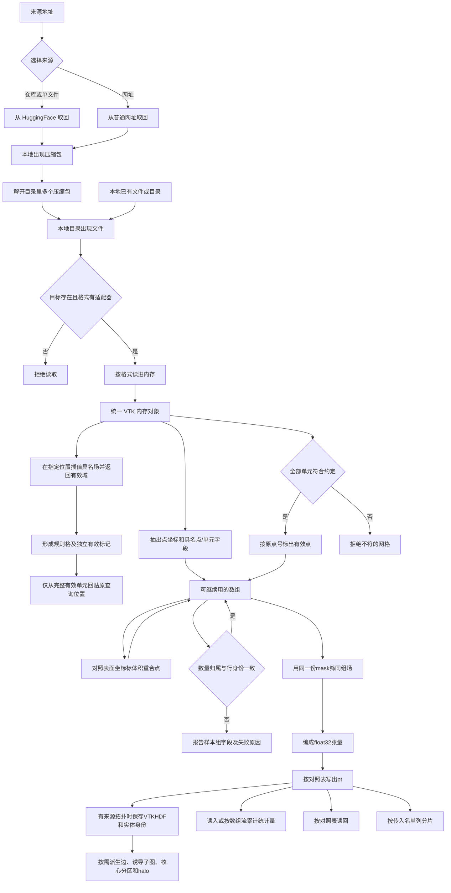

### 1.3 业务状态机

本地已有文件时从待校验进入；只有来源地址时从下载进入。两条入口都落在本章，不拆成两个功能域。

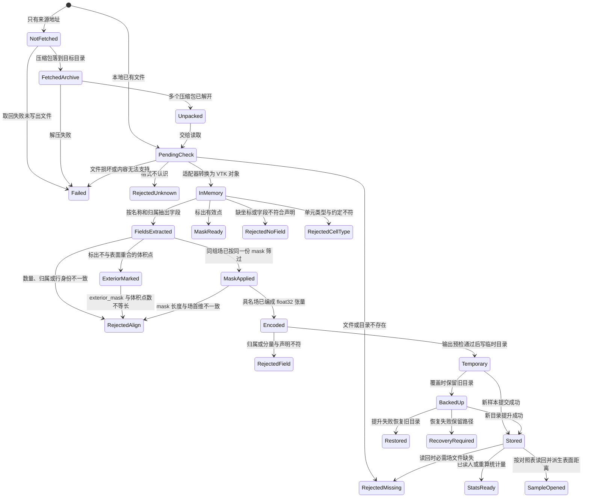

### 1.4 状态值说明

| 中文含义 | 标识 | 业务说明 |
| --- | --- | --- |
| 未取回 | `NotFetched` | 只有来源与目标目录，本地还没有包 |
| 已取回压缩包 | `FetchedArchive` | 目标目录出现下载下来的压缩包 |
| 已解开 | `Unpacked` | 目录里多个压缩包已解开，出现可读文件 |
| 失败 | `Failed` | 取回、解压或读取转换失败 |
| 待校验 | `PendingCheck` | 已接到路径，尚未确认存在性和格式 |
| 拒绝：目标不存在 | `RejectedMissing` | 不是已有文件，或目录读取、预处理根、分片名单、读回必需 `.pt` 时路径不存在；读回错误含完整样本路径 |
| 拒绝：格式不认识 | `RejectedUnknown` | 扩展名或显式格式没有适配器 |
| 已读入内存 | `InMemory` | VTK 保留原始拓扑与全部字段，NPY 通过无网格 VTK 对象保留受支持数值及原始 dtype、shape 信息 |
| 已抽出场量 | `FieldsExtracted` | 从 VTK 对象得到原点序坐标及按点数或单元数分别对齐的具名字段 |
| 已标有效点 | `MaskReady` | 得到与点数等长的布尔 mask，未删点 |
| 拒绝：缺字段 | `RejectedNoField` | 没有点坐标，或没有指定名称和归属的标量/矢量，或分量数与数量不符 |
| 拒绝：单元类型不符 | `RejectedCellType` | 网格单元不是约定类型 |
| 已标重合点 | `ExteriorMarked` | 得到与体积点数等长的布尔 mask，未删点；True 表示不与表面坐标精确重合 |
| 拒绝：点数不对齐 | `RejectedAlign` | 表面三字段或体积各几何量首维不一致，或 mask 与场首维不等长 |
| 已套 mask | `MaskApplied` | 同组场按同一份布尔 mask 筛过，原数组未改 |
| 已编码 | `Encoded` | 具名场成为 float32 张量，标量一维、矢量带分量维 |
| 拒绝：场记录不符 | `RejectedField` | 单元场被标成点组，或形状与标量/矢量声明不符 |
| 临时写入 | `Temporary` | 同级临时目录正在写入 |
| 旧目录已备份 | `BackedUp` | 提升失败可恢复旧目录 |
| 已恢复 | `Restored` | 新目录提交失败，原结果恢复 |
| 待人工恢复 | `RecoveryRequired` | 备份和临时路径保留并明确报告 |
| 已写出 | `Stored` | 对照表中已提供的逻辑名写成 `.pt`；提交完成；恢复失败时保留临时和备份供人工处理 |
| 统计量就绪 | `StatsReady` | 已读入发布文件，或按训练分片对照表点场重算 |
| 已打开样本 | `SampleOpened` | 对照表磁盘场已读回，并现场生成表面距离全零场 |

### 1.5 功能点清单

1. 原始文件读取与格式适配

    1.1 按格式把一个文件读进内存

    1.2 保留无网格数组及恢复信息

    1.3 迁移统一返回类型与扩展新格式

    1.4 内容不支持或转换失败时明确拒绝

    1.5 文件不存在时拒绝读取

    1.6 格式不认识时拒绝读取

    1.7 按目录做多文件或递归读取

    1.8 解析 manifest 声明的样本网格资产并覆盖完整内容摘要

2. 数据源下载与解压

    2.1 下载并解开多个压缩包

    2.2 从 HuggingFace 拉整库或单文件

    2.3 从普通网址下载

    2.4 解开目录里多个压缩包

3. 从 VTK 内存对象抽出点坐标和场量

    3.1 按名称和点/单元归属选择数值字段

    3.2 校验字段分量和数量

    3.3 保留原点序坐标与共享数组

    3.4 迁移显式字段选择

4. 从 VTK 单元标出不参与表面的多余顶点

    4.1 按约定单元类型生成有效点 mask

    4.2 从同一份网格判断有效点

    4.3 明确一致性检查的证明范围

5. 标出与表面重合的体积点

    5.1 用坐标精确相等判断，不按距离阈值合并

6. 校验同组字段数量与行身份

    6.1 exterior_mask 长度必须等于体积点数

7. 用同一份 mask 筛选同组场

    7.1 长度不一致时拒绝按序号硬配

8. 把具名场编成训练张量并按对照表写出

    8.1 按场记录编码为 float32 张量

    8.2 按逻辑名写出，先写临时目录再改名

    8.3 按业务声明打包点场或单元场

9. 使用或重算训练集统计量

    9.1 读入已发布的统计量文件

    9.2 按数组流累计均值、方差、最小和最大

    9.3 对具名数组流分别累计

10. 按对照表读回一个样本目录

    10.1 可选逻辑名缺文件时跳过

11. 按传入名单列分片

    11.1 只校验人数，不扫盘冒充官方顺序

    11.2 准备阶段重划 train/test/eval

12. 逐场张量与物理清单读取

13. 原生数组与物理时间窗口。

14. 有拓扑场插值与规则格回贴。
15. 普通拟合状态的完整保存与读回。

### 1.6 功能点详解

#### 1. 原始文件读取与格式适配

冻结变换支持 custom 方法的 target/parameters 工厂，重建 apply/inverse 并检查来源。采样、目标、指标、预测的算法继续由能力提供，recipe 通过各自领域步骤注入，能力不读取 recipe 私有上下文。


本章前处理链上的读取、提取、校验、筛选、编码、提交与统计能力统一发出真实执行事件：开始、结束、耗时和小型输入输出事实，默认 debug，供排查；常规阶段摘要由 application 输出。由运行写入方记录，不在能力中创建日志文件，不输出数组。失败仍为错误。

- 磁盘上已有受支持的 VTK 家族文件或 NPY 时，读进内存并得到统一 VTK 对象。
- 文件不在或格式不认识时，在打开适配器之前失败，避免半成品。

##### 1.1 按格式把一个文件读进内存

- 读取知道格式后，得到保留受支持结构和数值的 VTK 内存对象，供后续数据接入与预处理使用。

- 使用者可以直接提供文件路径，并在需要时指定格式；未指定时按扩展名选择。这里不要求案例配置，也不要求先建立数据集对象，让临时检查单个工程文件和完整案例流程都能复用同一能力。
- `.vtk` 读取旧版 VTK 数据，`.vtp` 读取表面多边形数据，`.vtu` 读取非结构网格，`.vtkhdf/.vtkh5` 读取标准 VTKHDF 内容；读取采用对应格式的官方读取能力，避免自行解释网格结构带来的差异。
- 读取阶段保留数据供后续选择，不提前裁成某个模型的训练张量。这样更换训练目标或进行几何计算时，仍能取得原字段和拓扑，而不是重新下载或重新读取被丢弃的信息。
- 数据读取与提取本身不调用 Torch。框架仍保留训练所需的 Torch 依赖，因此这不意味着安装整个框架无需训练依赖。

##### 1.2 保留无网格数组及恢复信息

- NPY 可能只是工况向量或未绑定的场值，没有坐标与拓扑；不凭文件名、形状或长度推断它属于哪张网格，也不创建虚假网格。
- 无网格 NPY 使用 VTK FieldData 承载。`values` 保存按 C 顺序展平的单分量数值；`__ai4e_npy_metadata` 是单条 JSON 字符串，包含 `schema_version: 1`、原始 `shape`、原始 `dtype`（NumPy dtype.str）和 `order: C`。
- 这些信息用于恢复原始数组：数值按记录的 dtype 恢复，并按原 shape 和 C 顺序组织。标量 shape 为 `[]`，空数组保留全部维度；不保存原 strides 或 Fortran 连续布局，保留的是数值与逻辑索引关系。
- 支持 bool、8/16/32/64 位有符号和无符号整数、float32/64。bool 用 uint8 承载，非本机字节序转成本机字节序；原始 dtype 保留在元数据中，不静默降低数值精度。
- NPY 到 VTK 的转换由 VTK 持有数值副本，避免临时 NumPy 数组释放后失效。这与后续从 VTK 提取共享视图是两个不同阶段。
- NPY 已能读取成统一对象，但当前网格字段提取要求带网格的数据集，不能直接把这个无网格容器当 PointData/CellData 使用；建立其网格关系仍需后续能力。

##### 1.3 迁移统一返回类型与扩展新格式

- 已支持 `.vtk/.vtu/.vtp/.vtkhdf/.vtkh5/.npy`。`.vtkh5` 是标准 VTKHDF 内容的兼容扩展名，不代表任意 HDF5 文件都可读取。
- 单文件、多文件和目录读取中的每个数据对象均为 `vtkDataObject` 或其子类。旧 NPY ndarray 返回行为已移除，不提供切回开关；`NativeData` 仅作为 VTK 对象类型别名保留。
- VTK 网格保留原具体类型、点/单元顺序、字段归属及活动属性；Legacy 文件读取全部同类数组，不能只保留首个标量或矢量。
- 新格式应在入口完成结构映射，后续操作按统一对象能力处理。无法保留的必要信息必须报告，不能把“返回了 VTK 对象”当作完整转换的证明。
- CGNS、多块及时间序列等扩展需分别实现并验证；当前不宣称已完成这些新格式的接入。

- 早期方案让各格式返回自己的内存对象，其中 NPY 返回 NumPy 数组；现已统一为 VTK 对象，以减少后续提取与清洗面对多种返回类型的分支。保留原始数据关系的目标没有改变，改变的是入口交出的表示。
- 保留网格对象并不把它视为训练结果：读取成功只表示数据进入支持范围内的内存表示，不能等同于完成字段校验、几何派生或训练资产生成。

##### 1.4 内容不支持或转换失败时明确拒绝

- NPY 支持布尔、8/16/32/64 位有符号和无符号整数、float32/64；保留原始维度，不猜测字段归属。
- 复数、字符串、对象、结构化类型、日期时间及其他未支持 NPY 类型明确失败，不静默丢弃信息；NPY 读取禁用 pickle。
- 统一返回 VTK 对象不代表所有数据都有网格，也不代表未来所有格式已经支持。

- VTK 文件损坏、内容与所选格式不匹配、读取过程报错或未产生输出时，明确停止并指出文件，避免把读取失败形成的空结果交给后续计算。
- 文件后缀仅用于选择读取方式，不作为内容正确的证明；例如把旧版 VTK 文件改成表面文件后缀，不能因此视为合法表面数据。
- 读取成功不保证所有后续操作都可用。没有坐标、缺少指定字段、没有单元等问题，分别由需要这些数据的提取或清洗能力报告。

##### 1.5 文件不存在时拒绝读取

- 目标不是已有文件时直接拒绝，不进入适配。

##### 1.6 格式不认识时拒绝读取

- 扩展名或显式格式没有适配器时直接拒绝，不打开未知格式。

##### 1.7 按目录做多文件或递归读取

- 给定目录时，按已登记格式收集文件并逐个走单文件读取。
- 可以选择是否进入子目录，也可以只读一种指定格式。多文件保持输入顺序，目录结果按完整路径排序，并保留路径与对象的对应关系。

- 目录读取只收集已登记扩展名的文件，其他文件不作为失败项；显式读取一个未知格式的文件则会失败。这一区分使资料目录中的说明文件不会打断网格读取。
- 多文件与目录读取都复用单文件规则；任一已选中文件读取失败时，本次调用失败，不返回“看似完整”的部分结果。
- 目录遍历只发现文件，不判断哪些文件属于同一个仿真样本、不自动配对表面与体积，也不校验样本总数。暂不增加独立定位机制，避免在真实案例配对规则未明确时把猜测固化到通用读取中。

#### 2. 数据源下载与解压

- 给定来源和本地目标目录后，目标目录出现解开后的文件，供读取使用。
- 下载层不解释这是什么数据集，避免把数据集语义绑在取回动作上。

##### 2.1 下载并解开多个压缩包

- 选择下载并解压后，目标目录出现解开后的文件，而不是停在压缩包上。

##### 2.2 从 HuggingFace 拉整库或单文件

- 按仓库标识取回整库或其中一个文件，落到指定本地目录。

##### 2.3 从普通网址下载

- 没有仓库标识时，按普通网址把文件取回本地。

##### 2.4 解开目录里多个压缩包

- 目标目录里若有多个压缩包，一次解开，避免研究员逐个手搓。

#### 3. 从 VTK 内存对象抽出点坐标和场量

- 输入已经是 VTK 内存对象，不再读取原文件，不按来源扩展名重新实现提取；同一能力服务于表面压力、体积速度等不同业务。

##### 3.1 按名称和点/单元归属选择数值字段

- 指定 VTK 原始数组的精确名称，以及 point 或 cell 归属；二者共同确定字段，即使 PointData 与 CellData 内有同名数组也不会混用。
- 不使用 active scalar/vector，不回退到首个数组；改变活动字段不能改变具名提取结果。物理量名称与原始数组名称的映射由业务装配配置负责。
- 不自动把单元场转换为点场，不推断单位或建立物理语义；数组不存在、类型非数值或输入不是网格数据集时拒绝提取。

##### 3.2 校验字段分量和数量

- scalar 要求 1 个分量，输出 `(N,)`；vector 要求 3 个分量，输出 `(N, 3)`。张量及其他分量规则本阶段未支持。
- point 字段的 N 必须等于点数，cell 字段的 N 必须等于单元数；不能用坐标数组长度检查单元字段。
- 校验针对结构一致性，不证明物理量或单位本身正确，也不执行归一化或插值。

##### 3.3 保留原点序坐标与共享数组

- 坐标输出所有原始点，形状为 `(N_points, 3)`；不生成单元中心，也不套用有效点 mask。
- 字段和坐标优先共享 VTK 底层存储，不主动复制、不强制连续化或转 dtype；不保证所有 VTK 后端都能零复制。这样在当前提取、清洗及后续几何处理阶段避免额外完整副本。
- 提取和当前清洗本身不修改输入。调用方修改共享数组可能同步改变原 VTK；通过 NumPy 修改后若继续使用依赖 VTK 修改时间的管线，还应通知相应数组或对象 `Modified()`。
- 替换字段数组、改变拓扑或点序后，旧视图不会自动更新，必须重新提取并生成 mask。需要独立副本的后续业务应在自己的边界明确安排。

##### 3.4 迁移显式字段选择

- 原来只指定标量/矢量或依赖活动字段的调用，需要增加精确名称和归属；缺少必填参数不再沿用旧隐式行为。
- 通用具名提取和标量/矢量便捷入口使用相同的选择与校验规则，不形成多套处理机制。

- 早期切片只提取“当前活动标量/矢量”，用于打通单个案例；现在已改成具名选择，并支持点字段和单元字段。这样即使文件中存在多个物理量，业务选择也不会随着活动场设置改变。
- 表面压力与体积速度是这一能力的使用案例，不是提取能力内置的两个固定物理量；其他符合当前分量与归属约定的数值字段也使用同一规则。

#### 4. 从 VTK 单元标出不参与表面的多余顶点

- 按单元连通标出哪些点真正参与约定类型的单元，只出 mask，不删点、不落盘。
- 单元类型与约定不符时失败，避免把错误拓扑当成有效表面。

##### 4.1 按约定单元类型生成有效点 mask

- 研究员给出期望单元类型后，得到与点数等长的布尔 mask；未出现在任何单元中的点为无效。

- mask 与原点序一一对应，True 表示点至少参与一个单元。所有单元必须符合配置的期望类型；空点表或无单元的数据集拒绝生成 mask。
- 当前支持类型名 triangle、quad、tetra、hexahedron/hex，也可提供 VTK 单元类型号；未知名称失败。
- mask 是点选择标记，不能直接套用到 CellData。返回 mask 不等于已经完成删点或拓扑重建，所有原始数组仍保持原长度。

- 例如五个点中只有前四个组成一个四边形，结果为前四个有效、第五个无效；压力和坐标仍保持五个值，不在此处删除第五个点。
- 判断依据是“该点是否被单元引用”，不是坐标是否重复、字段数值是否异常或点是否在外部区域，因此这一步不能替代去重、异常值处理。与表面坐标重合的体积点由功能 5 单独标记。
- 当前要求整份输入网格的所有单元都符合期望类型；出现三角形与四边形混合时，不是只挑出四边形继续处理，而是拒绝结果，防止案例拓扑假设被悄悄改变。

##### 4.2 从同一份网格判断有效点

- 提取坐标、读取场量和判断有效点都使用已读入的同一份 VTK 网格；其中已有单元类型和单元引用的点号，足以确定哪些点参与网格。
- 不为此再次使用 meshio 读取原文件，避免多读一次、增加依赖，以及把两份读取结果的点序重新对齐。同一份网格中的点号就是 mask 与坐标、点字段的对应依据。
- 单元类型检查和有效点标记放在清洗能力中，提取能力只负责取出字段；需要完整场量但不需要筛点的业务可以独立使用提取。

##### 4.3 明确一致性检查的证明范围

- 当前检查能发现字段缺失、字段分量或数量不符，以及单元类型与声明不符；它证明数据符合本阶段的结构要求，不证明压力、速度的物理真值正确。
- 不执行表面压力与另存 press.npy 的对照，也不执行 VTK 与另一读取库的坐标对照。这两项是早期参考流程中的特定检查，不是已经实现的通用验真能力。
- 两份结果不一致可以提示问题，但不能单靠比较确定哪份正确。未来若有可信参考和明确验收规则，可单独增加数据集验收；当前不能把没有做对照表述成“原场已验证为真”。

#### 5. 标出与表面重合的体积点

- 研究员给出体积坐标和表面坐标后，得到与体积点数等长的布尔 mask：True 表示不与任一表面点坐标精确重合（后续可保留），False 表示精确重合。体积数组长度不变，不删点。
- 这是域标记，不是有效点 mask：有效点看单元引用，重合点只看坐标是否相同。两者极性都是 True 表示可保留。
- 输入只要两组三维坐标，不要求单元，也不看距离或法向。

##### 5.1 用坐标精确相等判断，不按距离阈值合并

- 邻近但不相同的点仍为 True。不按距离阈值合并，避免把接近车身的流体点悄悄当成表面点。
- 坐标不是三维点时拒绝。空体积得到空 mask；空表面则全部体积点视为不重合。

#### 6. 校验同组字段数量与行身份

内容摘要能力对实际张量、文件与源码生成只读指纹，保留形状、类型和序列顺序，不把存放路径当作数据内容身份，不改变随机流。业务决定需对照哪些字段；摘要本身不证明模型精度或不同算法等价。

- 对齐组声明来源、point/cell 归属、实体数和原始实体 ID 序列；每场声明同一来源与自身行身份。允许共享只读身份数组，不复制每场的 ID。
- 即使没有 mask，也检查同组首维、归属、来源和 ID 顺序；等长错序、重复逻辑名、非法分量或非有限数值均失败。仅长度一致不证明身份一致。
- 报告包含 valid、sample、checked、issues；失败项含组、字段、预期/实际数量和原因。调用方声明身份仍是信任边界，校验不能从数值反推被隐瞒的重排。
- 第 20、21 项交付的是训练张量：各文件第 i 行必须对应同一实体。落盘成功和统计量正常都不能替代这一检查。

##### 6.1 exterior_mask 长度必须等于体积点数

- 独立首维能力仍供几何使用；几何不检查压力或速度。完整字段记录校验供落盘流程使用，不向轻量 spec 引入 VTK 或 NumPy。

#### 7. 用同一份 mask 筛选同组场

- 筛选同时更新同组所有字段和 ID 序列，保留原数组；筛选前后均校验组契约。未选择标记时原样透传。

##### 7.1 长度不一致时拒绝按序号硬配

- mask 必须是一维等长布尔数组，点 mask 不适用于单元组。不得因组名含 point/cell 而推断归属。

#### 8. 把具名场编成训练张量并按对照表写出

具名时空数组可独立保存并通过清单校验路径、形状与完整内容摘要，支持控制与基础预测共用。已有目录拒绝覆盖，失败不发布完整清单；该能力不解释控制目标或小波布局，旧控制导入保留。

物理点场可保存为 NPY 跨步分块。数组和 JSON 使用临时文件原子提升，工况保持样本级，不当作点字段重复存储。分块恢复检查点数、类型及有限性。

- 编码为独立 float32 张量；标量 `(N,)`、矢量 `(N,3)`，不写 VTK 和单元连接。布尔标记选择落盘时同样编码为 float32。
- 输出预检拒绝重复目标文件、非法路径、缺少必需字段和空输出；可选项须显式声明，不能静默忽略必需项。

##### 8.1 按场记录编码为 float32 张量

- 编码仅检查单场形状，不认识案例；同组身份由独立校验完成。业务装配在编码前强制校验。

##### 8.2 按逻辑名写出，先写临时目录再改名

- dry-run 与真实写入共用输出规划，覆盖检查针对实际样本目录，已有父目录不构成冲突。
- 单样本先写同级临时目录并关闭文件；允许覆盖时将旧目录改名为备份，再提升临时目录。提升失败恢复旧目录，恢复失败保留新旧目录并报告完整路径。
- 提交成功后清理备份，清理失败作为已提交后的警告。遗留备份/临时目录必须显式恢复或清理，不自动猜测删除。
- 此流程不是多次改名组成的完整原子事务，也不提供整库回滚、锁或多写入者协调。

##### 8.3 按业务声明打包点场或单元场

- 写入器接受张量或具名张量映射，不认识 cell 逻辑名。业务层决定打包哪些场；单元场仍使用自己的实体组，不能套点 mask。
- 旧编码器对组名后缀和体网格开关的解释已移除，调用方改为显式组契约与业务路由。

#### 9. 使用或重算训练集统计量

样本工况与点标签分别累计总体矩；点场统计保留 float64 累加顺序，变换以 float32 执行。只使用本次完整训练分片，零标准差拒绝准备。

- 本层提供文件读取和具名数组流累计，训练样本、统计字段、缺失策略和兼容键由 application 决定。统计量不证明训练行对齐正确。

##### 9.1 读入已发布的统计量文件

- 支持 YAML/JSON；训练期 apply/inverse 由变换能力提供。

##### 9.2 按数组流累计均值、方差、最小和最大

- 仅沿第零维累计总体矩（标准差除以 N），保留尾维形状。尾维不一致、非有限值或没有非空数组时失败。
- 逐批消费数组流，不收集整个数据集，不拼接坐标数组。

##### 9.3 对具名数组流分别累计

- 不解释 param 编号、字段名称后缀或 cell 文件。输入是名字到数组流，输出各场的矩与实体数。
- 原来扫描训练目录的职责迁到 application；位置总体极值由业务层根据显式位置字段的累计极值合成。

#### 10. 按对照表读回一个样本目录

公共物理视图复用现有文件映射，读取时检查点字段数量、有限值和唯一身份。点字段与样本工况分别表达，域缺字段明确定位到分片、样本和字段；不要求为另一个模型重打包物理 PT。

- 样本目录和对照表进去，只读已声明的逻辑名。对照表外的不读、不造。
- 缺必需文件或加载失败时，错误带完整文件路径。这是写出的逆操作，仍不认案例文件名。

##### 10.1 可选逻辑名缺文件时跳过

- 业务层传入允许缺失的逻辑名（训练读盘时为 `cell`）。这些项没有文件时跳过，不失败。其余对照表项缺失则拒绝。

#### 11. 按传入名单列分片

- 名单由案例提供。能力保持原顺序返回相对路径，不自己扫盘冒充官方顺序。规范化预处理根和打开样本见外流 train 装配。

##### 11.1 只校验人数，不扫盘冒充官方顺序

- 官方 ShapeNet-Car 期望 train 789、test 100。人数不对则失败，不改名单。

##### 11.2 准备阶段重划 train/test/eval

- 样本池默认是当前物理清单已经处理出来的全部样本，不论原身份是 train 还是 test；`samples` 可先限定执行范围。
- 默认数量用原分片人数，缺的桶显示 0；随机抽取时三者之和必须等于执行范围内的样本，训练至少 1 个，test/eval 可为 0。
- `method: original` 保持原成员；`method: random` 按种子打乱后切分。官方 `partition.yaml` 不改写，张量不重算。
- 清单索引按样本名重挂分片后才能读取新身份：先匹配目标分片，`eval` 与旧 `validation` 互为别名；没有匹配时只有唯一来源候选可以跨分片移动。找不到样本或同名多来源无法确定时明确失败，不按清单顺序猜测。
- 重挂只更新本次内存索引，保留记录中的原分片、路径、资产和张量字节；空分片不进入索引。新划分写入准备记录，训练读这次记录。阅读准备时固定给出 train/test/eval 三个切片，缺的人数为 0，旧 `validation` 并进评价切片；不改历史文件字节。

---


#### 12. 逐场张量与物理清单读取

- 逐场输出直接读回张量，向量维度保留，不包装为单成员容器。点字段和单元字段分别保持原实体身份；重命名保留语义别名，不能重复或与真实字段冲突。新物理清单的实际布局优先，历史没有布局的清单继续使用数据组件提供的布局。

#### 13. 原生数组与物理时间窗口

HDF5 切片及 NPY 内存映射保留原数组；窗口明确历史、预测、间隔和末端边界。安全解压核对路径与 CRC，准备不复制全部重叠窗口。布局转换、可逆对数和仿射变换不猜测单位。


#### 14. 有拓扑场插值与规则格回贴

- 给定真实来源单元、具名点场和有限查询坐标，在有单元支撑的位置返回插值值及独立有效标记；来源缺拓扑、点场缺失或有效结果非有限时明确失败，不用最近点补洞。三维规则格由有限非退化包围盒及显式轴长生成，坐标和展平顺序保持一致。
- 将规则格结果回贴指定查询位置时，只从所有顶点都有效的单元取值。不存在完整有效单元时，全部查询点标为无支撑；保留原查询行序，不借接近有效的阈值把孔洞补回。
- 无支撑位置的零值只是存放占位，必须连同有效标记消费；它不是零速度、固体内外判断或有效真值。有效域覆盖、插值误差与模型预测误差分别报告，不承诺全点回贴。来源几何和数组不因重采样改写，单位、样本分片、训练统计与监督目标仍由调用方显式决定。

#### 15. 普通拟合状态的完整保存与读回

代数、统计或树模型可保存由字典、序列、有限标量及数值数组组成的显式状态，并附调用方给出的准备、字段、单位和统计约定。发布采用独立临时目录再整体提交，目标存在时拒绝覆盖；读取校验结构内容摘要与数组摘要，保留精度。完整目录搬移后可独立读回，不依赖原始数据。

状态不保存任意可执行对象、闭包或模型实例，不在读取时动态导入类。调用方负责选用明确重建函数并比较语义；保存成功不表示模型已经完成精度验证。该能力与既有神经网络检查点并存，不迁写历史记录，也不要求所有计算中间值资产化。

## 二、几何

### 2.1 背景与定位

研究员可独立调用原子能力，或通过装配选择所需几何量；两套体积几何量分别为：到最近表面顶点的非负距离和方向，以及到网格表面的有符号距离、面上最近点和方向；另得表面网格点法向。点到面只在已确认「有拓扑、有表面」时才算；裸点云或无网格对象当场拒绝，不悄悄改成点到点。第 15 项字段不叫成「真 SDF」；真 SDF 用另一组名字。

**为什么并存两套距离**

- 点到点复刻 AB-UPT / 功能表第 15 项：每个体积点在全部表面顶点里找欧氏最近的一个，得到非负距离和由该顶点指向查询点的方向。等距最近点沿用官方近邻实现及锁定版本，以避免距离相同但方向不同。它是点云 1-NN，不看单元，距离只会大于等于到表面的垂距。训练读盘只剩点，是先选了点到点的结果，不是因为预处理没有表面网格。
- 点到面用面上最近点：最近点可落在面内、边或顶点。符号遵循输入表面定向，朝外闭合表面才可解释为外正内负。开放或反向定向表面不保证物理内外，因此不把「必须全为正」当作验收。
- 字段名必须分开，互不顶替。点到点失败或点到面失败各自报告，后者不降级成前者。
- 表面预处理手里就有带面单元的网格，不必先从点云复原表面。点到面仍使用 VTK；最近顶点使用锁定的 scikit-learn 近邻实现，使等距顶点选择与参考处理一致，不新增 meshio/trimesh。

**边界**

- 点到点只吃两组三维坐标，不接收网格。
- 点到面与法向共用严格表面门禁：全部单元必须为支持的二维面，混入线或体也拒绝。
- 不改写输入网格，不删点，不落盘。
- 参与面的法向含 NaN/Inf 或零长度 时拒绝。开曲面的点到面符号不做强制。
- 套 mask 写出训练资产见数据章功能 7、8。归一化 apply/inverse 已交付；完整 FieldSpec 不在本期范围。
- 几何本身仍不删点、不落盘。

### 2.2 核心业务操作流程图

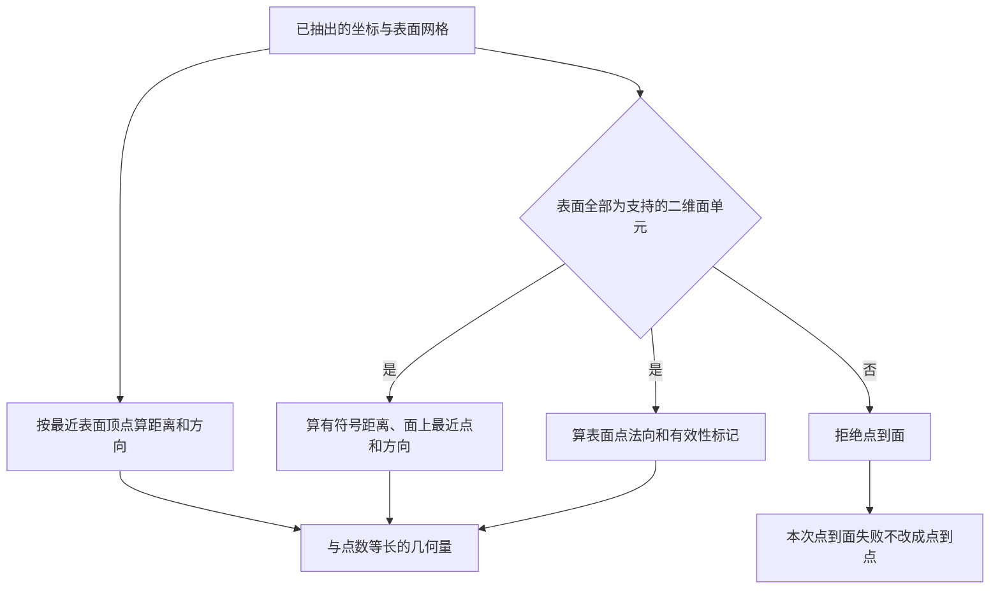

### 2.3 业务状态机

几何量在一次调用内算完即交出，不落盘、不跨样本缓存。

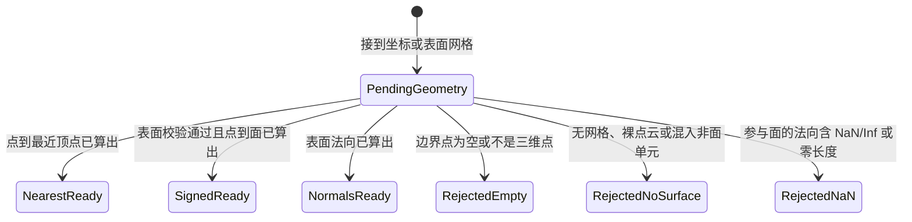

### 2.4 状态值说明

| 中文含义 | 标识 | 业务说明 |
| --- | --- | --- |
| 待计算 | `PendingGeometry` | 已接到查询坐标或声称代表表面的网格 |
| 点到点已就绪 | `NearestReady` | 得到与查询点数等长的非负距离和方向 |
| 点到面已就绪 | `SignedReady` | 得到与查询点数等长的有符号距离、面上最近点和方向 |
| 法向已就绪 | `NormalsReady` | 得到原点序法向与 normals_valid_mask，孤立点为零且无效 |
| 拒绝：输入不成立 | `RejectedEmpty` | 边界点为空，或坐标不是三维点 |
| 拒绝：没有表面 | `RejectedNoSurface` | 对象不满足全二维面门禁，尚未进入几何计算 |
| 拒绝：法向无效 | `RejectedNaN` | 计算得到的参与面的法向含 NaN/Inf 或零长度 |

### 2.5 功能点清单

1. 由体积点得到到最近表面顶点的距离和方向

    1.1 边界点为空或维度不是三维时拒绝

2. 由体积点得到到网格表面的有符号距离

    2.1 无网格、裸点云、混入顶点、线或体单元时，在计算之前拒绝

    2.2 不改写输入网格

3. 由表面网格得到点法向

    3.1 参与面的法向无效时拒绝

### 2.6 功能点详解

#### 1. 由体积点得到到最近表面顶点的距离和方向

- 研究员已有体积点坐标和表面点坐标时，得到与体积点数等长的非负距离，以及按同一公式得到的方向。距离为零时方向按公式退化，不抛错。
- 这是点云最近邻，不看单元。字段语义是「到最近表面顶点」，不是有符号点到面距离，也不应叫成真 SDF。
- 输入是未套 mask 的全部表面坐标，这样后续仍能对照被标记的重合点。

##### 1.1 边界点为空或维度不是三维时拒绝

- 表面顶点为空，或任一组坐标不是三维点时当场拒绝，避免空定位器给出无意义结果。
- 查询点为空时交出空距离和空方向，不视为失败。

#### 2. 由体积点得到到网格表面的有符号距离

- 研究员已有体积点坐标，以及带二维面单元的表面网格时，先确认有表面拓扑，再得到与体积点数等长的有符号距离、面上最近点和方向。
- 对着面心时，距离绝对值应小于到四个顶点的距离，并等于查询点到面上最近点的欧氏距离。法向朝外的封闭壳体上，外侧为正、内侧为负；开曲面符号可能飘，不要求车身样本符号全为正。绝对值不大于到参与面单元的表面顶点的距离。
- 失败不返回半成品，也不退回点到点。调用方应传入表面网格，不要把体积六面体或坐标数组冒充表面。

##### 2.1 无网格、裸点云、混入顶点、线或体单元时，在计算之前拒绝

- 输入须为完整 VTK 数据集，兼容 PolyData 与 UnstructuredGrid。所有单元须为 triangle、quad、polygon、pixel 或 triangle strip，允许混合面类型。空表面、点云或混入顶点、线、体单元均拒绝，报告首个违规编号和类型，不提取体外壳。二维是单元维度，不要求整个表面共面。
- 校验必须在求距离之前做完。点到点入口仍然只吃坐标，两套入口分开。

##### 2.2 不改写输入网格

- 计算在深拷贝上进行。调用方手里的表面对象点序、单元和字段保持原样。

#### 3. 由表面网格得到点法向

- 研究员给出通过表面门禁的完整 VTK 对象后，得到原点序法向及 normals_valid_mask。孤立点法向为零、标记为 False；参与面且法向有效的点为 True。
- 转换后按原点身份对齐，而非按数量推测顺序；不继承旧法向，也不改写输入点序、拓扑与属性。旧接口仍返回法向数组，新入口同时返回有效性标记。
- 法向来自网格单元，不是点到点那条「从最近顶点指向查询点的方向」。两套方向不得混用。

##### 3.1 参与面的法向无效时拒绝

- 退化面或参与面的点产生 NaN、Inf 或零长度法向时立即失败；孤立点的零值是显式无效占位，不冒充单位法向。
- 不是数据集、没有点或没有单元时，在计算前拒绝。


## 三、数据准备与训练能力实施

### 3.1 背景与定位

准备、训练与独立评估需要复用相同的变换、采样和数值计算，避免两条业务链出现统计口径差异。通用能力按功能组织，模型布局和业务选择由调用方提供。监督项可选用均方误差、平均绝对误差、Huber 或相对 L2；标准物理条件见第六章。

### 3.2 核心业务操作流程图


### 3.3 业务状态机

本章无独立持久业务状态；调用失败向现有运行会话传播。

### 3.4 状态值说明

本章无业务状态值。数据空间与已提交产物在对应功能中明确记录。

### 3.5 功能点清单

1. 冻结变换与采样
2. 训练与评估机制
3. 归一化资产与网格提交
4. 监督比较方法

5. 生成式更新与精确迭代恢复。
6. 有序轮次记录、尾批与精确恢复。
7. 独立验证选优与权重来源配对。
8. 非梯度拟合与统计模型估计。

### 3.6 功能点详解

#### 1. 冻结变换与采样

具名坐标字段可声明共享组，从训练分片联合边界形成同一变换，确保表面、体积和几何中相同位置映射一致。组内必须采用坐标方法和相同尺度；未声明组的旧案例保持原行为。点特征按显式字段顺序拼接，校验维数、有限值、实体数量和唯一身份；字段绑定和物理含义由调用方提供。

跨模型准备仅使用训练分片，工况按样本累计，点场按实际点累计。变换记录和物理数据身份独立，切换模型使相应准备失效，物理数据仍可复用。

冻结记录的组合、重建、摘要、恒等变换、正反变换，以及标量通道整理和显式零场派生，均由跨领域原子能力提供；场名与来源绑定由调用方确定。场量使用均值标准差，坐标使用共享正跨度边界映射到 `[0, 1]`。场上 `scale` 在方法之后乘正系数，缺省为 1，反变换先除系数；非正或非有限拒绝。参数非有限或维度错误拒绝；正反变换共享参数。坐标正变换可用同一套平移缩放关掉范围门禁，数值不变，用于原始网格中未参与训练的顶点。随机种子按样本、操作和轮次独立，验证固定。新增字段必须选择显式变换或恒等变换；样本条件记录 scope=condition，单独归一化。旧记录不再把坐标方法内部 `scale=1000` 当作附加放大。

#### 2. 训练与评估机制

轮换分块训练流每轮重排上一轮顺序，留出末块验证，保存排列、轮次与样本游标；随机状态由完整检查点统一恢复。恢复拒绝来源与游标不相容。

逐样本场评价可选择 MSE、MAE、相对 L2；未声明保留原三项，空列表不计算附加指标。只计算声明的误差项，仍保留归一化评估总损失与加权分项用于选优。非法或重复名称在前向前拒绝；物理指标仍先反归一化，再逐样本平均，并保留有效和不可定义样本数量。

梯度裁剪允许显式关闭；关闭时仍检查非有限梯度，但不对梯度做裁剪乘法。梯度累积可选择求和或平均，原默认平均行为保持。
参数化 PDE 的整轮求和训练逐实例反向、累积完成后更新一次，避免把全部实例计算图保留在内存。

训练期评价可以显式关闭；此时不消费验证或测试批次，也不生成最佳权重，最后轮次权重仍正常提交。跨运行物理指标累计分量与向量模长的绝对误差、平方误差及真值平方和，总体按实际元素加权；真值范数为零时相对误差不可定义。

调度单位可为更新或轮次，权重衰减可覆盖所有参数或排除偏置和归一化；默认汽车策略保持不变。逐点监督按真实元素累计误差，验证间隔和相等时选优可声明，恢复保留已完成历史。启用选优保存的流程在新运行中保留此前最佳模型；缺少选择证据时拒绝以最新权重替代，相等误差按明确策略选优。

设备只是执行参数。通用输入搬运保持字典、列表、元组结构以及浮点、整数、布尔类型，不隐式转换精度。共享评估可注入批次上下文以定位实际样本，默认调用行为不变；上下文覆盖该批次的前向及指标计算，异常仍恢复模型模式和随机状态。

偏置与一维参数默认不作权重衰减。可用普通回调按有效更新或完整轮次的正整数周期触发；稳定性诊断记录解除缩放后、裁剪前的梯度范数及参数范数。默认不扫描额外参数。官方全局流模式下评估分别遍历损失和物理指标，保留随机状态推进；独立评估仍可选择保护随机状态。

循环独占反向和优化器更新：清梯度、反向、混合精度先解除缩放再裁剪、累积满才 step，合成一次更新原子；每轮不完整尾组只消耗数据，不做前向或反向，总更新步按每轮完整组数计算。不把单条 PyTorch 语句拆成独立能力。周期回调使用普通 callable；`PeriodicCallback(callback, unit="update" 或 "epoch", every=N)` 只在对应有效更新/完整轮次触发，回调异常进入同一恢复收尾，不要求继承框架基类。设备名 `auto` 按 CUDA、MPS、CPU 选择；找不到加速器时警告并回退 CPU，训练继续。点名 CUDA/MPS/`gpu` 不可用则拒绝，不静默换设备。混合精度仍只允许 CUDA。MSE 使用标准损失内核；Lion 使用批量张量更新与动量运算，避免等价公式的舍入误差被 sign 更新累积放大。可按名构造 Adam、AdamW、Lion，参数可改；非法种类失败。学习率调度是公开能力：按名构造预热余弦或恒定策略，必须绑定总有效更新步；更新原子只在有效更新时推进调度。跳步不推进有效计数、调度和 EMA。EMA 内存随有效更新推进，满十轮独立发布周期权重；普通 latest/last 均保留恢复所需 EMA 内部状态，不额外发布 EMA last。SIGTERM 必听，SIGINT 默认可保存，发生终止信号、训练或回调异常时尝试保存当前轮次起始状态，恢复时完整重放该轮；保存失败保留原始错误。诊断写出数据规模、参数量、进度、损失、学习率、耗时和设备峰值内存；预计剩余时间仅在交互终端附加。每批把总损失和分项记入在线窗口（含累积未满）；配置了更新间隔则在有效更新后冲刷窗口平均并写进度，一轮结束再冲刷剩余。轮次报告独立累计整轮在线分项，不受更新日志冲刷频率影响；既不能丢失恰好冲刷完的分项，也不能只报告尾窗口。窗口非有限则失败。未配置更新间隔时只按轮次间隔出进度，不加密日志。评估与检查点仍在轮次末。分流缺键或多键发警告，正权重空目标仍由监督失败。日志按配置的轮次间隔报告且保留最终轮次。评估同时给出归一化总分和按权重计入的分项，与物理 MSE/MAE/相对 L2 分开；分项之和等于总分。目标范数不大于 1e-8 时跳过相对误差并累计有效数和跳过数。损失、分项与指标逐样本平均，模式和随机流在成功及异常时都恢复。嵌套输入递归搬运设备，目标始终与模型输入分离。评估按显式预测/目标/反变换绑定累计，忽略未声明的无真值查询。检查点 version=2 深复制载荷，含调度状态和可用 MPS 随机状态；旧检查点缺少 MPS 随机状态时不能据此承诺 MPS 恢复复现。best 仅在测试总损失严格改善时更新，不看分项或 test_repeat。

#### 3. 归一化资产与网格提交

单文件张量包使用同级临时文件提交，失败不替换已有文件，默认拒绝覆盖。归一化记录返回独立副本，保存版本、实际参数、字段绑定、来源与训练样本范围；反变换只读取冻结参数。完整物化后发布独立清单；失败不发布完整新清单。VTKHDF 保留实体身份，具名筛选字段按原身份回贴。

#### 4. 监督比较方法

提供四维谱卷积、三维U-Net和全局特征融合，以及时空梯度与加权监督损失；能力先服务当前地热模型并保留清晰输入输出，后续逐步泛化。压力与温度物理约束、物性及井筒计算接收显式物理参数，不读取PCNO文件布局；保留来源科学算术及GPL许可。

监督只比较预测场与真值场。比较方法独立于监督项：均方误差、平均绝对误差、Huber、相对 L2。未声明时用均方误差，现有均方误差入口仍按均方误差计算。外流案例通过学习目标读取按场比较方法。Huber 宽度默认 1.0，允许单项覆盖。预测与真值必须同形且非空，禁止广播。相对 L2 在目标范数不大于 1e-8 时失败，避免训练项变成空值；评估指标仍可跳过相对误差，口径不同。未知方法、非有限或非正 Huber 宽度、非有限或负权重、全零权重均拒绝。缺字段按现有方式失败，不补默认真值。物理残差与初边界条件独立于监督比较；方程数值函数由 contrib 提供，不在监督能力中解释 PDE。

#### 5. 生成式更新与精确迭代恢复

轮次与更新次数入口共用内部执行推进，预算按实际成功更新计算；梯度累积未满和混合精度溢出跳步不增加有效更新数。旧轮次评价相位、丢弃尾组、轮首重放，以及各路线的调度和滑动平均顺序保持不变。迭代训练可显式选择默认累积与精度能力，数据流的真实轮次边界由局部连接报告，不跨边界拼接不足一组的批次。

局部更新函数只负责一次参数更新并返回损失与成功标记；第一版限单优化器、完整精度、无额外持久状态，不与默认累积/混合精度叠加。停止预算完成后不额外取数，有限流耗尽不得发布完成；恢复前先检查合同与游标副本，不相容时不改变实时模型或输入游标。

更新循环支持由调用方注入取消标记，在完整更新边界保存并中断。可选临时信号上下文退出后恢复调用者处理器；非主线程不接管进程信号。WDNO 与控制共享领域无关装配，数据流和目标仍由各领域提供。

流时间、初始噪声和路径噪声可显式传入；路径状态、速度目标、损失通道独立。迭代流保存排列、游标和随机状态；EMA 可选参数平均与缓冲复制，默认旧行为不变。旧 epoch 检查点不作为精确 iteration 状态。

**迭代更新的可选扩展**

迭代能力允许显式关闭或设置梯度裁剪，并在优化器、既有EMA和调度器完成后调用普通回调。SafeDiffCon用该回调保留原scheduler→EMA顺序；未选择扩展时GenCP既有顺序不变。取消与截止在下一次更新前检查，保存中断状态且不发布完整成功；完整进程限时由外部预算监督器处理，包含采样和求解器子进程。

#### 6. 有序轮次记录、尾批与精确恢复

研究者提供每轮有限的索引或数值记录序列，收批工具保留顺序，不自行重排或改变窗口分布。默认保留不足一批的尾项，显式丢尾时不把它们补入下一轮；空轮和丢尾后零批报错。记录使用普通值结构，不能含文件句柄、函数或自定义可执行对象。

随机源独立于模型随机源。构造和恢复不提前生成记录，每轮首批才调用用户抽样函数；保存当前记录、轮次、游标及随机状态。恢复预检来源声明、批量和丢尾政策，拒绝时不改变当前流；声明中应包含数据身份和抽样规则版本。用户函数的外部副作用、未交给流的随机源及并行预取不在恢复保证内。公开轮末事实便于既有累积训练不跨轮拼批。

新能力为显式选择，不修改原固定整批流的整除约定和随机顺序，不自动迁移历史检查点。

#### 7. 独立验证选优与权重来源配对

对同一口径的有限标量按最小或最大选择；相等时显式保留先到或后到候选。判断不更新状态，调用者先冻结真正受评的权重，经运行记录接口保存成功后再提交指标、更新位置和权重来源。写入失败不提交选择，非有限指标不能作为普通落选静默丢弃。

选择器不运行模型、不管理文件、不解释科学字段。保存恢复时，最佳权重独立快照与选择状态一并交付，调用者核对位置和来源；最佳来自此前 EMA 时不得以最新普通权重替代。状态读取预检版本、选择政策与元信息，失败不改变已有选择。当前使用现有检查点显式装配，自动用户状态连接与完整扩展示例另行交付。旧轮次训练的按损失选优行为保持原样。

#### 8. 非梯度拟合与统计模型估计

研究者可在训练数据上显式拟合降维表示、响应面、径向基插值、克里金或提升树，获得可重建状态和实际诊断。它们不要求神经网络基类，不把一次矩阵求解包装成优化器轮次，也不为数据语义新增全仓估计器协议。

- POD 使用训练快照拟合带均值与可选正权的低秩表示，保存基、权重及奇异值；秩必须可识别，验证数据不能参与拟合。后续编码解码只消费冻结表示，不自动重拟合。
- 响应面提供常数、一次和二次多项式特征及最小二乘；秩亏默认拒绝。显式正则化同时作用于全部系数，包括截距，不隐式改变用户选择。
- 径向基插值当前使用三次核与多项式尾项。重复中心、尾项不满秩或无法可靠求解时明确失败；平滑量由调用方选择，不自动增加扰动来掩盖奇异性。
- 克里金支持固定协方差条件求解和显式有界参数估计，趋势、过程方差、观测噪声与数值扰动分开记录。退化趋势或非正定系统拒绝，不静默换为伪逆；优化迭代达到限额的报告不能当作最优收敛证据。
- 提升树通过可选依赖调用官方 LightGBM 训练引擎，默认采用确定性 CPU 回归配置；按目标分别拟合并保存原生模型文本、特征顺序和参数。仅该能力要求安装对应后端，普通数组与其他代理不因缺后端失效。追加提升轮次必须使用兼容状态和原数据身份，含义不同于神经优化器的精确断点恢复。
- 拟合可检查截止时间与取消；一次不可中断矩阵求解的硬时限由外层进程承担。失败或取消不发布“全部目标拟合完成”的状态，组合累计训练预算由研究调用方统一管理。

## 四、推理重建

### 4.1 背景与定位

后处理和独立评估只需要已经训好的网络，不能把优化器和随机流一并恢复，否则会改写训练进度。本能力只核对接得上的版本与语义，再装入模型权重。

**边界**

- 不恢复优化器、调度、EMA、缩放器或随机流。
- 不解释运行目录或案例路径；检查点由调用方给出。
- 本能力接收任意查询坐标并通过注入的模型上下文分块推理；原始网格路径和回贴属于调用方与导出能力。

### 4.2 核心业务操作流程图

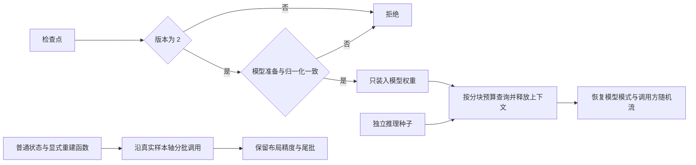

### 4.3 业务状态机

本章无独立持久业务状态；失败向现有运行会话传播。

### 4.4 状态值说明

本章无业务状态值。

### 4.5 功能点清单

1. 只恢复模型权重
    1.1 版本或语义冲突时拒绝
2. 分块查询与随机状态隔离
3. 注入单次预测与运行模式保护

4. 多场同步与顺序积分。
5. 普通预测函数的分批执行。

### 4.6 功能点详解

#### 1. 只恢复模型权重

- 给定检查点和当前契约后，模型权重与训练结束时一致，训练进度保持不动。
- 契约至少核对此刻的模型结构参数、数据规格、项目准备和冻结归一化，以及结构版本。模型页采样点数不参与恢复契约。

##### 1.1 版本或语义冲突时拒绝

- 旧版本或对不上的权重结构、数据规格、准备、归一化直接失败，避免用错权重做推理。仅采样点数不同不能拒绝恢复。

#### 2. 分块查询与随机状态隔离

索引预测接受完整行排列、正整数块大小与普通预测函数，按块计算并恢复原行序的 CPU 数组。重复、遗漏、越界及非有限输出失败，末块不丢弃。全部点被预测不代表与全场一次前向等价；块大小和排列种子属于实验身份。

支持注入可重复遍历的流式推理组件。框架保持模型模式和异常传播，模型组件负责全表面状态与解码；单块独立预测不视为全表面预测。

- 查询预算、模型上下文和准备身份由调用方传入；仅在评估及无梯度条件使用缓存，成功或异常均释放上下文并恢复模式。
- 独立推理可设置起始种子；退出或异常时恢复 Python、NumPy 和 Torch CPU/CUDA/MPS 随机状态，不读取训练检查点内的随机状态。

#### 3. 注入单次预测与运行模式保护

模型与预测函数由调用方提供；能力不解释任务、数据集和文件目录。预测在无梯度状态执行，成功和异常均恢复各子模块原有训练/评价模式，不覆盖已有梯度。默认恢复 Python、NumPy 和全部可用设备的随机流；批量业务可明确在外层保护随机状态后共享同一流，保持样本顺序及历史数值行为。权重恢复不读取优化器或训练随机状态。

#### 4. 多场同步与顺序积分

给定流时间网格和普通速度函数，同步步骤读取同一旧状态，顺序步骤消费已更新场。边界回填、逐步观察、取消与非有限值检查明确；多模型组保护全部模式与随机流。

#### 5. 普通预测函数的分批执行

普通预测入口沿真实样本轴调用研究者提供的函数，接受数组或数组元组输出，保留精度、行顺序、尾批及独立输出快照。空输入、非有限输出、丢失样本轴或批间输出布局变化明确失败；预测器复用内部工作缓冲时，已完成批次也不会被后续调用覆盖。

该入口不假定神经网络、不隐式切换训练模式或关闭梯度；设备和执行上下文由实际预测器负责。全局谱算子的空间网格不是样本轴，不能切成小块后声称等价全域预测。普通拟合状态使用自己的明确版本和重建入口，不套用本章神经权重的版本限制。

## 五、后处理导出

### 5.1 背景与定位

锚点预测需要落到数据目录，并可选写成点云供外部查看。完整网格后处理要把预测画回原始表面和体积网格，字段名与拓扑与模版一致。这是结果转换，不是看图；可视化包仍未交付，本能力只用已有 VTK 写 PolyData 与 UnstructuredGrid。

**边界**

- 锚点点云没有原始单元，不等于完整网格回贴。
- 完整网格预测场应是物理量；真值形状匹配时才写误差。默认导出含真值场，不写空拓扑。
- `mesh_topology_kind` 只按 VTK 对象判断结构化、非结构、表面或点云，不猜文件名。
- 表面先抽成面网格再存 VTP，体积保留体单元存 VTU。
- 云图和报告不在本章。

### 5.2 核心业务操作流程图

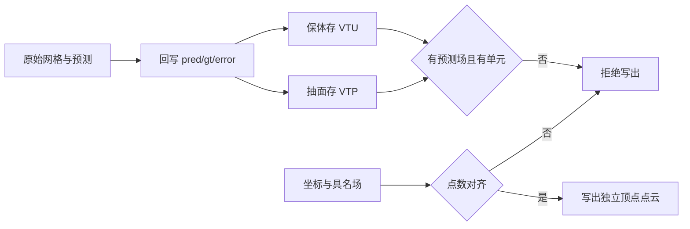

### 5.3 业务状态机

本章无独立持久业务状态；提交失败保留临时路径由调用方处理。

### 5.4 状态值说明

本章无业务状态值。

### 5.5 功能点清单

1. 写出锚点点云
    1.1 场点数对不上时拒绝
2. 写出完整网格
    2.1 缺预测场或没有单元则失败

3. 时空数组参考处理。

### 5.6 功能点详解

#### 1. 写出锚点点云

- 坐标必须是非空三维点；标量压成一维，矢量保留分量。
- 成品每个点包含一个独立顶点单元，没有面或体连接；保持坐标和场的输入数值类型，与参考点云消费者兼容。

##### 1.1 场点数对不上时拒绝

- 任一场的首维与点数不一致则不写文件，避免错位预览。

#### 2. 写出完整网格

跨模型比较先按唯一点身份对齐，确认物理坐标与真值一致，再在同一网格上切割和插值全部场。历史 PT 通过保存精度下的精确坐标匹配恢复原点，歧义必须提供映射，不猜测。仅保留所有顶点均有效的单元，筛除区域不填零。

支持具名表面场的 HDF5 数值结果和混合三角形、四边形 VTP。点序、法向、工况和向量模长随结果保存；几何朝向和面积比用于阻止错误拓扑交付。

- 预测场必写：表面 `pred_pressure`，体积 `pred_velocity`。
- 真值点数或形状匹配时另写 `gt_*` 与 `error_*`；压力误差取绝对值，速度误差取逐点欧氏长度。
- 表面按提取后的点数验收，不把未被单元引用的原始顶点计入交付点数；保留原始点/单元 ID。体积保留原始点数和单元连接，仍拒绝缺失预测或无面/体单元的结果。

##### 2.1 缺预测场或没有单元则失败

- 表面没有面单元或缺少 `pred_pressure`，体积没有体单元或缺少 `pred_velocity`，均拒绝验收。


平台交接扩展：`data/save/zarr.py` 与既有 PT 共用样本目录事务；具名输出成员保留独立形状与 dtype，ManifestIndex 使用 `输出/成员` 读取并将 Zarr 全部成员计入内容摘要。`transform/minmax.py` 提供通用冻结 Min-Max，常量分量可逆，旧坐标入口复用同一算术并保留原门禁，方法目标区间为 `[0, 1]`；`transform/scale.py` 在方法之后做可见附加放大。新 Min-Max 只从训练分片拟合，拒绝手填边界。通用结构跟踪接收网络、真实输入、可选预测函数和显式显示参数，写出固定 HTML 与来源记录。每次跟踪保护参数、缓冲区、逐模块模式及 Python、NumPy、Torch 随机状态；多档任一失败回退旧完整结果并清理临时文件。能力不读案例配置、不猜模型属性、不导入 Vis。`postproc/difference.py` 在单位、归属、实体集合、ID、坐标及拓扑全部一致后做差，不自动插值。相关测试为 `test_algorithm_platform_contract.py`。

坐标空间声明由 `postproc/coordinate_space.py` 校验，独立于物理场单位。严格差值在既有坐标/身份/拓扑/场单位校验之外，拒绝一侧缺失或不一致的 `coordinate_space`；一致声明继承到 difference.json。双方都未知的历史差值保持可读，sidecar 为 null，不提供跨来源相机联动证明。

#### 3. 时空数组参考处理

地热井筒、供热发电与技术经济计算保留来源公式；水蒸汽物性是可选依赖。参数改变会重新评价固定预测，不加载网络。原评分在常量指标上可能未定义，不以静默填值改变科学算法。

Gaussian 平滑只处理指定空间轴和字段，原始数组不被覆盖。可输出各分量固定物理帧的预测、真值、误差图及逐物理帧误差曲线。

## 六、物理采样与条件

### 6.1 背景与定位

物理训练需要可复用的域、点集、坐标变换和标准条件。几何描述域与物理法向，采样生成点集，变换处理坐标，条件比较预测和目标；不包装 PyTorch 原子运算，不替模型求导，也不负责训练循环。

### 6.2 核心业务操作流程图

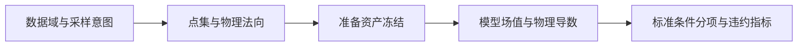

### 6.3 业务状态机

本章无独立持久业务状态；准备资产发布由调用方负责。

### 6.4 状态值说明

本章无业务状态值。无效域、点数、目标或不支持的硬约束显式失败。

### 6.5 功能点清单

1. 物理点集与初边界条件

### 6.6 功能点详解

#### 1. 物理点集与初边界条件

监督点从已有标签选择，域内点可按规则网格或连续物理域均匀生成；用户采样函数返回张量，框架检查数量和域内性。
初始面、命名边界和周期点对保存独立身份。梯形物理均匀采样考虑面积雅可比，法向使用物理坐标。
准备阶段冻结点集，训练不重新采样；数据、域或采样变化后重新准备，不能静默消费旧点集。
给定值比较场值，给定梯度/零梯度比较物理外法向导数；零梯度不普遍等同于零通量。标准条件不管理模型或优化器。
损失保留原始分项、明确归约和权重；非平方范数可直接用于 Burgers。硬条件由模型执行，仍独立评价违约程度。

完整网格 PDE 配点可显式包含初始面与空间边界；严格域内采样则排除这些点。该选择属于冻结采样语义，改变后必须重新准备。周期边界按配对身份计算条件，不靠相邻存储位置推断配对。

## 七、固定结果评价

### 7.1 背景与定位

研究者对已保存物理场重新选择评价指标，不重新执行模型。

### 7.2 核心业务操作流程图

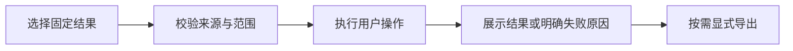

### 7.3 业务状态机

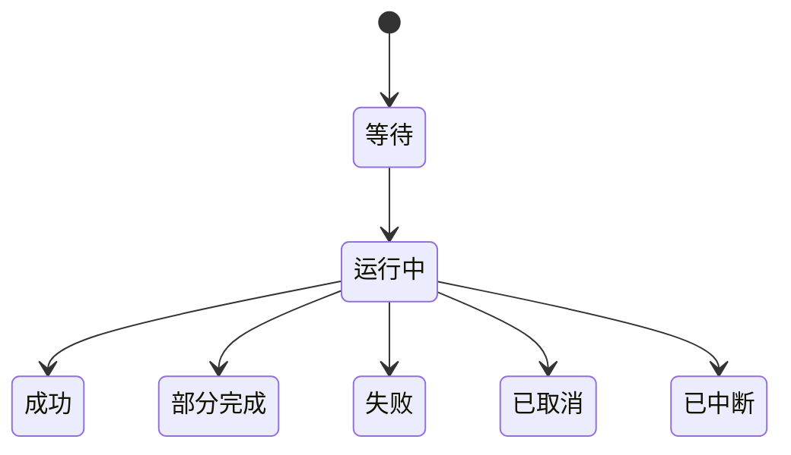

### 7.4 状态值说明

等待表示固定请求已提交；运行中只采用实际完成数量；成功要求全部交付；部分完成保留成功项并披露失败项；取消不发布完整成功；中断不自动重新执行。

### 7.5 功能点清单

1. 物理空间评价。
2. 实体与有效性检查。
3. 逐样本交付与显式导出。

4. 轨迹分量评价。

### 7.6 功能点详解

#### 1. 物理空间评价

地热场误差先反归一化，第1—20年计算MAE、RMSE及abs(reference)+1e-8分母的平均绝对相对误差；先按例计算，再按例等权汇总，井级量说明井数与例内归约。没有独立真值的发布预测不生成精度。

从固定预测值与真值计算相对L2、RMSE、MSE、MAE、R²。每个域、物理量和分量分别评价；向量模长先分别求模再计算误差，不混合不同单位。原训练、推理的指标算术保持原样。

新增最大绝对误差、相对MAE、平均逐点相对误差与MAPE；全部基于物理空间有效实体以float64计算。逐点相对误差排除绝对真值不大于最大绝对真值的10⁻¹²倍的实体，同时记录阈值和排除数量。相对误差零分母、恒定真值R²分别保留不可定义原因。

#### 2. 实体与有效性检查

形状、实体数量、ID及明确有效性声明必须一致。未声明的非有限值、缺少真值、无有效实体分别报错。零真值范数的相对误差、恒定真值的R²显示不可定义，不填零。

#### 3. 逐样本交付与显式导出

逐样本释放数组并保留成功行；取消和部分失败不冒充完整成功。CSV/JSON只在用户导出时生成，包含完整数值、来源、字段、单位、状态和原因。

推理统计按样本等权计算Mean、Median、P90、Max，P90使用线性插值；有效、不可定义、失败和期望数量分别记录。历史全元素累计算法继续保留原名称和算术。CSV和真实Excel支持统计、明细、单位、算法和来源；数值保持数值。预测计时在CPU/CUDA/MPS必要同步后记录，不把异步提交时间当完成时间；恢复、评价、保存分别计时，吞吐量按实际成功数量除以预测时间计算。

#### 4. 轨迹分量评价

以明确的样本、物理时间、二维空间和分量轴计算整段、逐帧、逐分量相对 L2；GenCP 轨迹指标保留输入精度以匹配 FP32 参考，外流固定评价的 float64 策略独立。样本等权后分别报告。零范数不能填零或当成通过，不把不同单位的场拼成一个误差。

## 八、脚本物理场分析与输出

### 8.1 背景与定位

为研究者提供无需启动网页的物理场计算、图片与文件输出。PyVista 仅在使用三维能力时加载；普通数组指标独立执行。计算能力不认识样本、模型和训练轮次。

### 8.2 核心业务操作流程图

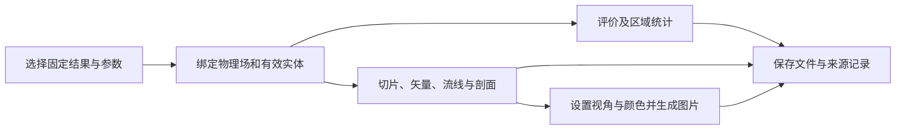

### 8.3 业务状态机

单次计算没有持久业务状态；文件提交有进行中、成功和失败结果，整份样本成功后才发布清单。

### 8.4 状态值说明

| 中文含义 | 标识 | 业务说明 |
| --- | --- | --- |
| 完成交付 | succeeded | 选择的全部文件已提交 |
| 部分完成 | partial | 已提交样本可读，批次尚未完整成功 |
| 不可评价 | unavailable | 缺少真值，仍可执行场统计与绘图 |

### 8.5 功能点清单

1. 物理场选择与分析
2. 视角、颜色与图片
3. 误差与区域统计
4. 文件输出

### 8.6 功能点详解

#### 1. 物理场选择与分析

显式 point/cell、字段、分量或模长。支持切片、剖切、等值面、等高线、矢量箭头、体流线、显式表面流线及点线采样。单元场转换到点场须显式启用。缺拓扑、空交集及非法参数拒绝；插值点不保留虚假的原始身份。

#### 2. 视角、颜色与图片

支持标准与自定义相机、投影、缩放、透明度、色带、色条、离散颜色及尺寸。默认白底 1600×1000，预测和真值共色标，相同视角使用相同参数。图像生成返回像素，文件保存是独立调用；调用者可提供绘图对象扩展。

#### 3. 误差与区域统计

九项物理空间误差复用已有公式，恒定真值的 R² 保持不可定义。区域统计包含有效及排除数量、最值、均值、总体标准差、中位数和 P90，均为有效实体等权；不冒充面积或体积积分。向量差模长与模长之差分别命名。

#### 4. 文件输出

PNG 保留图片；VTP/VTU 保留完整数组及真实拓扑；剖面 CSV 保留位置、距离、有效性和分量，域外值留空。全场与区域统计同时写 JSON 和 CSV 长表，含字段、分量、单位、有效/排除数量及不可定义原因；无真值仍可交付预测统计。保存使用临时文件原子提升。原始输入只读；不保存网页会话或模型对象。

## 九、中立图与轨迹计算

### 9.1 背景与定位

图模型和时空模型需要可复用的记录读取、拓扑、收批、归一化、监督和 rollout
能力。这些能力只认识普通张量、坐标、边和状态，不解释模型名称、节点类别或数据集
字段；固定网络结构和业务 mask 由贡献侧连接。

### 9.2 核心业务操作流程图

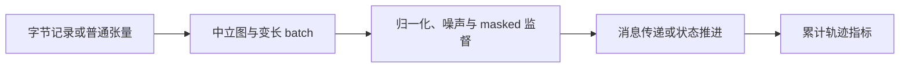

### 9.3 业务状态机

本章无业务状态；流式归一化统计作为模型状态随检查点保存，其他函数按调用返回结果。

### 9.4 状态值说明

| 中文含义 | 标识 | 业务说明 |
| --- | --- | --- |
| 未累计 | `empty` | 归一化器还没有观测值 |
| 累计中 | `accumulating` | 新 batch 更新计数、和及平方和 |
| 已冻结使用 | `restored` | 从检查点读回统计并用于正反变换 |

### 9.5 功能点清单

1. TFRecord 与 bytes feature 基础读取
2. 三角形图和边特征
3. 变长图收批与消息传递
4. 在线归一化、噪声和 masked 监督
5. 多步状态推进与累计时间步指标
6. 二维时空谱与局部空间融合
7. 连续性残差与窗口误差

### 9.6 功能点详解

#### 1. TFRecord 与 bytes feature 基础读取

逐记录校验长度和内容 CRC，并从 `tf.train.Example` 提取具名 bytes feature。能力不
解释 dtype、shape 或静态字段；截断、CRC 错误、非法 protobuf 和非 bytes feature
明确失败。数据集适配器负责把字节变成业务数组。

支持有对象版本约束的范围下载，按完整记录校验和提交；中断从已提交边界继续。整包响应、对象变化和本地内容篡改均失败，不把部分内容发布为完整来源。

#### 2. 三角形图和边特征

三角形拓扑去除重复无向边后展开成双向边。每条有向边使用 sender 到 receiver 的
相对坐标和距离；索引越界、非三角形或非整数拓扑拒绝。能力不推断边界或节点类别。

#### 3. 变长图收批与消息传递

收批按图偏移局部边索引并返回节点、边所属 batch，不填充节点。消息传递先以源节点、
目标节点和旧边更新边，再把新边聚合到目标节点并更新节点；sum/mean 由调用方选择，
节点和边均保留残差。

#### 4. 在线归一化、噪声和 masked 监督

归一化器按最后一维累计有限值，保存计数、和、平方和及累计次数，支持反变换和恢复。
高斯噪声不改变输入，mask 由调用方明确提供。masked 平方误差可以先按特征求均值或
求和，再对选中实体等权平均；空 mask 和 shape 不一致失败。

#### 5. 多步状态推进与累计时间步指标

rollout 返回包含初始状态的序列，并可在每一步保留调用方指定实体。状态 shape 或有限性
变化时失败。`mse_H_steps` 排除可选初始帧，对前 H 个预测帧累计求均方误差；时间不足
时不生成该名称，避免把第 H 帧误差冒充累计口径。


#### 6. 二维时空谱与局部空间融合

历史场与显式相对坐标进入三维时空谱计算，逐时间片二维U-Net补充局部空间特征，可选全局参数必须显式给定。输入只含已知历史，返回未来窗口，不接收未来标签。该变体与既有地热四维权重分别构造，不隐式迁移权重。

#### 7. 连续性残差与窗口误差

提供交错面速度前向散度、三角形分片线性梯度、有效域腐蚀和加权误差。调用者负责提供相同场景的速度尺度、位置和边界语义；空有效域、非法权重、非有限值和退化网格明确失败。计算能力可用不表示任意数据源已通过物理准入。固定窗口评价保留时间及分量维度，零参考范数不伪造相对误差。

## 十、具名网格轨迹与几何注意力

### 10.1 背景与定位

为普通研究脚本提供具名字段、几何上下文、监督训练与固定结果能力。实际计算独立于贡献模型；本章不代表论文精度已复现。

### 10.2 核心业务操作流程图


### 10.3 业务状态机

本章无业务状态；持久结果只有完整交付后才可消费，失败由执行会话记录。

### 10.4 状态值说明

本章无业务状态，不增加全仓协议或平台状态。

### 10.5 功能点清单

1. 数据身份与轨迹变换
2. 几何查询与注意力
3. 训练和恢复
4. 固定结果评价与报告
5. 可选动态路由注意力

### 10.6 功能点详解

#### 1. 数据身份与轨迹变换

MAT保留原dtype和轴；数值时间排序、实体对齐、窗口选择缺帧明确失败。二维网格采样同时交付原索引。单元场转点保留原单元场；逐场PT与VTKHDF并存，清单映射不含点/斜线的网格键到原字段名。

#### 2. 几何查询与注意力

半径查询保留邻居排序与参考零填充，MPS显式在CPU查询。缓存绑定坐标身份、半径和邻居数，不缓存学习特征。`install_prepared_queries` 的 `cache_spec` 显式接收准备时的半径与邻居数，与本次模型参数对照后再注入；坐标身份、形状或索引范围不符均拒绝。投影、物理切片、几何交叉注意力、上下文和多尺度局部编码可用普通张量独立调用。首期限制为普通PyTorch与二维结构路径。

#### 3. 训练和恢复

逐样本相对范数先各自求比值再归约，零真值拒绝。参数分组拒绝遗漏和重叠；组合优化器保存全部子状态。迭代执行的验证与保存周期独立配置；未显式传入保存周期时保持原默认。检查点可附加具名用户状态，保存为独立副本，恢复先做版本、名称和用户只读校验；失败回滚限于所声明的内存状态。轮次调度适配保存更新游标。严格映射权重同时核对参数及buffer，冲突在加载前拒绝。

#### 4. 固定结果评价与报告

具名批量预测包含末批。CPU float64逐样本、时间和物理场评价；零范数指标为空而非伪零。报告包含数值表、误差曲线和场图，支持派生数组单独保存与下游消费。


#### 5. 可选动态路由注意力

FLARE++ 是根据当前输入合成路由的独立注意力层，供研究者选择性组合进自己的网络。它接收并返回同形的「批次、点或 token、特征」浮点张量，支持反向传播、普通参数保存与恢复。内部头数乘每头宽度不必等于输入宽度；路由数量为正，跨调用可改变点数。

该能力不要求几何输入，不包含完整模型、残差、归一化、MLP 或训练循环，也不作为 Transformer 之前的必经预处理。现有模型和默认 GALE 保持原行为；选择新结构后由用户显式组合，不能仅因形状相同就复用原模型的完整恢复状态。与来源相同布局的独立 FLARE++ 注意力权重可严格读取，不承诺其他完整模型权重可直接互换。

当前接受普通稠密浮点张量和非空 token 轴，输出 dropout 只在训练模式生效。非法尺寸、路由数量、缩放或概率明确拒绝；不支持 Transformer Engine、token 分片、padding mask 或因果掩码。变长样本需分别调用或由用户提供明确的局部连接，不能把补零当作屏蔽。此交付只证明组件数值与工程使用，不承诺模型精度或性能提升。


## 十一、可组合建模能力

### 11.1 背景与定位

研究者可以直接取用前馈、卷积、残差、注意力、图交互和循环计算块，也可以独立调用网络阶段或使用完整基础模型。完整模型实际复用公共计算，并在有意义的位置允许替换；研究者不必复制整个模型才能组合空间编码、注意力瓶颈或循环预测。计算模块不解释数据集、物理字段、训练预算或运行会话，网络阶段也不是业务执行阶段。建模同时包含固定状态驱动的代数与统计模型；具有独立输入输出且可复用时才形成计算块或网络阶段，不为所有模型强补相同层级。

当前具备多层感知机、二维/三维普通卷积与残差场网络、二维/三维跳连网络、规则场标准注意力、消息传递图网络和显式状态循环网络的源码能力。经典网络的独立前后向、组件重组、保存读回、小数据训练及安装后流程已有对应证据；新增算子和代理的真实矩阵与安装仍需单独确认，不从旧网络结果推断。结构默认值用于明确本次基础版本，不表示覆盖每个网络家族的全部变体。

### 11.2 核心业务操作流程图

```mermaid
flowchart TD
  input[研究者明确输入表示与目标] --> choose{选择计算能力}
  choose --> dense[末轴前馈或显式时间循环]
  choose --> spatial[卷积与残差提取空间特征]
  spatial --> scales[多尺度编码与跳连解码]
  choose --> attention[分块并执行标准注意力]
  choose --> graph[编码节点与边并传播消息]
  choose --> operators[分支主干读出或完整空间谱运算]
  choose --> fitted[冻结降维与代数统计状态预测]
  operators --> compose
  fitted --> compose
  dense --> compose[独立调用或组成完整网络]
  scales --> compose
  attention --> compose
  graph --> compose
  compose --> replace[按局部张量约定替换实际部分]
  replace --> check{尺寸状态与身份对应}
  check -->|否| reject[拒绝不相容交接]
  check -->|是| output[返回预测及所选中间特征或状态]
  output --> record[由调用方保存结构参数与必要状态]
  record --> consume[恢复同结构或独立消费固定结果]
```

### 11.3 业务状态机

本章无业务状态。网络模块具有参数、归一化缓冲及训练/评价模式，循环调用另显式交付隐藏状态；这些计算状态不表示任务已准备、已训练或已验收，业务生命周期由调用方管理。

### 11.4 状态值说明

本章无业务状态值。训练/评价模式控制归一化或随机失活的计算行为；循环末状态只用于明确的同序列续接，不能当作跨样本共享状态。未传循环状态表示本次从初始状态开始。

### 11.5 功能点清单

1. 末轴前馈与显式循环预测
2. 卷积与残差场预测
3. 多尺度特征与跳连替换
4. 规则场分块与标准注意力
5. 节点边交互与图预测
6. 结构保存、重组与旧模型兼容
7. 分支主干算子与规则场谱算子
8. 冻结降维与代数统计预测

### 11.6 功能点详解

#### 1. 末轴前馈与显式循环预测

- 前馈能力保持所有前导维度，仅转换末轴特征；隐藏宽度、激活及随机失活显式配置，默认线性输出，没有隐式归一化或残差。完整多层感知机默认三个64宽隐藏层，可以替换整体前馈映射，但替换结果仍须保留前导轴和声明输出宽度。
- 循环阶段消费“批次、时间、特征”序列，默认两层、隐藏宽度32的双曲正切循环；返回完整序列特征及“层、批次、隐藏宽度”末状态。完整模型的输入映射、循环阶段和输出映射可分别替换，默认不截取最后时刻，不把空间点轴猜成时间。
- 隐藏状态由调用方持有；只有同一序列续段才回传，独立样本省略状态。时间为空、映射破坏批次/时间轴、状态形状或设备/精度不符时拒绝，模型不在内部跨调用保存或悄悄分离状态。

#### 2. 卷积与残差场预测

- 二维与三维网络消费通道在前的规则场。卷积块组合卷积、显式归一化和激活；普通卷积场模型默认四个16宽隐藏层、GELU和线性输出，保持原空间尺寸，编码器与输出头可以独立注入。
- 残差提供基本块与扩张四倍的瓶颈块，主支和捷径的归一化、激活及相加顺序属于公开计算语义。通道或分辨率改变时显式投影捷径；瓶颈采用中间空间卷积承担步长的版本，不混称原论文另一种步长位置。
- 完整残差模型使用18层基本块的四阶段组合，层数为2/2/2/2、基础宽度16；小输入入口不用原分类网络的大卷积和池化，读出是线性场头并显式插值回原尺寸。因此它是二维/三维场预测变体，不是原图像分类模型，也不表示瓶颈五十层模型已经真实训练。
- 非法通道、空间维度或过小降采样尺寸明确失败。默认模型保尺寸不代表任何自定义输出头都自动兼容；注入部分须遵守实际消费者的通道与布局要求。

#### 3. 多尺度特征与跳连替换

- 多尺度编码器返回底部输入、浅到深的有序跳连特征以及对应空间尺寸。解码器反向逐层消费这些显式交接；长度不符、尺寸声明错误或浅深顺序不符时拒绝，不用裁切或截短列表隐藏错误。
- 默认二维/三维跳连网络采用基础宽度8、三级双卷积、三次降采样，解码插值到对应跳连尺寸后融合，因此支持奇数和非方形输入；三维版本沿三个空间轴处理。它是场预测配置，不以原分割论文设置或旧地热各向异性网络名义交付。
- 编码、瓶颈、解码和输出头都可注入普通网络对象；顺序阶段和多尺度子模块正常注册，参数、设备与模式可以跟随整网。中间特征直接返回且保留梯度，研究者可独立分析或另行保存，不强制每层生成运行资产。

#### 4. 规则场分块与标准注意力

- 分块编码接收末轴通道的二维/三维场及可选有效域，只在高索引侧补齐；输出有序特征序列、键忽略标记及原尺寸、补齐尺寸和分块尺寸。完全没有有效格点的样本拒绝，缺失区域不当作有效输入。
- 标准注意力编码阶段保留后规范化残差顺序；注意力、前馈或完整编码阶段可替换。键掩码的真值表示忽略，不能与物理有效标记直接互换。分块重建按同一空间信息恢复并裁去补齐区域，是可训练读出而非投影的数学逆运算。
- 规则场完整模型开放分块、编码、位置及重建的实际注入位置；位置使用归一化块中心的索引坐标，不宣称物理坐标。原连续正弦位置计算仍采用单精度；整体转双精度时只处理运算兼容，不重新定义旧单精度频率或静默改变原位置语义。
- 标准注意力与已有几何/物理注意力分别承担各自语义，不默认互换，不把形状相同当作参考模型等价。

#### 5. 节点边交互与图预测

- 图输入明确节点特征、边特征及源到目标的有向索引，输出保持节点行身份；编码器、消息处理阶段与读出可分别替换。图构造、抽样、坐标单位及物理监督由调用方提供。
- 当前基础消息传递变体先对边做残差更新，再把更新后的完整边状态按目标节点求和或求均值，最后残差更新节点。这里聚合包含原边状态，不等于只聚合新增边增量的另一种算法；来源对照必须采用同一约定。
- 处理阶段按显式次序传递节点和边状态，不重新排序实体；索引类型、数量或范围不相容时拒绝。该能力不代表特定数据集的网格图、分区或全点预测已自动准备完成。

#### 6. 结构保存、重组与旧模型兼容

- 同一批公共组件可组装残差编码与跳连解码、跳连网络与注意力瓶颈、空间编码与循环阶段等局部组合。跨网格、特征序列和图的转换须明确空间轴、时间轴、mask与实体身份；不以元素数相同的换形代替语义交接。
- 参数及缓冲通过网络正常状态机制保存；构造参数、注入组件身份和有序拓扑由调用方另存并按同结构重建。权重字典本身不会保存任意用户代码或全部结构信息；替换组件后不承诺旧权重仍兼容，不以静默部分加载掩盖错误。
- 现有前馈、图、几何注意力和地热谱/跳连实现的公开导入、来源许可及旧权重保留；新增基础模型不会默认替换已有业务模型。位置计算兼容修复不扩为精度重定义，网络阶段不改变运行器或平台模型选择。
- 组件数值一致、结构可重组、真实学习效果和安装后完整流程是分别需要证据的结论。当前经典网络已通过小数据短训、三个公开组件重组及独立安装流程；这些证据不将独立参考零差值提升为论文复现或生产精度。


#### 7. 分支主干算子与规则场谱算子

DeepONet 以固定传感器特征和查询坐标为两个明确输入。分支、主干和内积读出可分别替换，实际使用公共前馈能力；查询布局显式区分共享查询与逐样本查询，多输出必须声明分组方式。调用方负责传感器含义与顺序；改变查询集合无需重建传感器，改变传感器语义则需重新准备并记录构造约定。输入或输出布局不符时拒绝隐式广播。

FNO 提供二维、三维完整规则场能力，由升维、谱块序列和读出组成，开放真实替换位置。谱块组合低频谱映射与逐点支路；模态数、FFT 归一化、右侧补齐和最后一块激活均显式声明。输入保持通道在前，坐标由调用方决定是否作为通道加入；补零只属于数值布局，不代表物理边界条件。完整模型不能沿空间切块后冒充原全局算子，非法模态及布局明确拒绝。

新增完整算子不覆盖既有地热、时空谱或生成式网络，也不自动切换任何案例后端。当前实现与圈定组件证据已形成，真实数据统一矩阵、安装后完整流程和论文级精度分别等待专项证据。

#### 8. 冻结降维与代数统计预测

多项式、径向基与协方差是可独立调用的计算块；POD、响应面、RBF 插值器、Kriging 和 LightGBM 预测器消费明确状态并返回普通数组。完整模型真实组合对应共享计算，不以门面反向调用贡献层算法。它们无需人为增加一个没有复用意义的网络阶段。

POD 提供编码、解码和重建，冻结的可微解码器可以连接已有前馈网络，使系数预测的梯度穿过固定基而不训练该基。响应面和 RBF 按拟合时的特征顺序、核及尾项状态预测，读取状态不自动求解。Kriging 返回均值并可选择潜在过程边际方差；方差保留趋势估计的影响，观测噪声与数值扰动不冒充预测方差。多目标独立连接不能声称联合输出协方差。

LightGBM 保存官方引擎的原生文本和目标列身份，并以该引擎恢复预测；这是可选后端能力，不是重新实现树学习器，也不需要将整个第三方工程收入框架。所有普通状态的保存与重建应同时保留字段与准备约定；维度相同不表示物理语义兼容。
