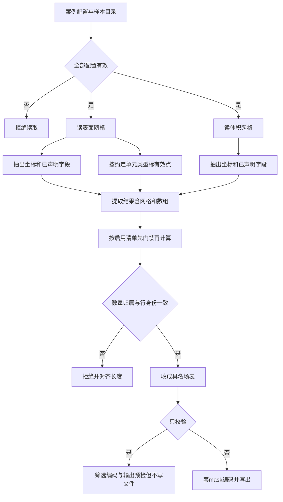
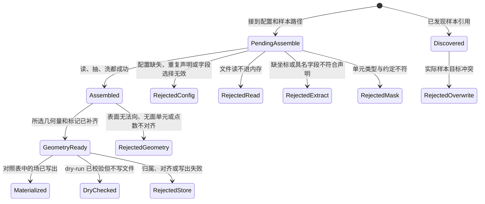
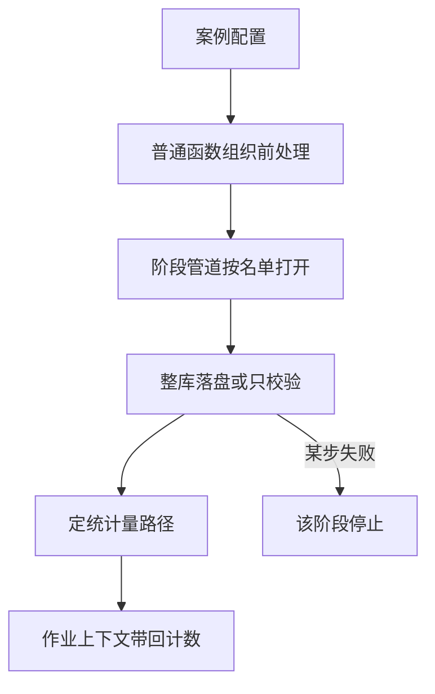
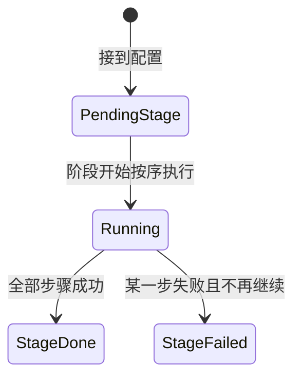
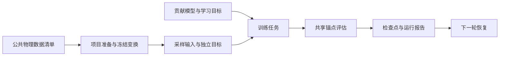
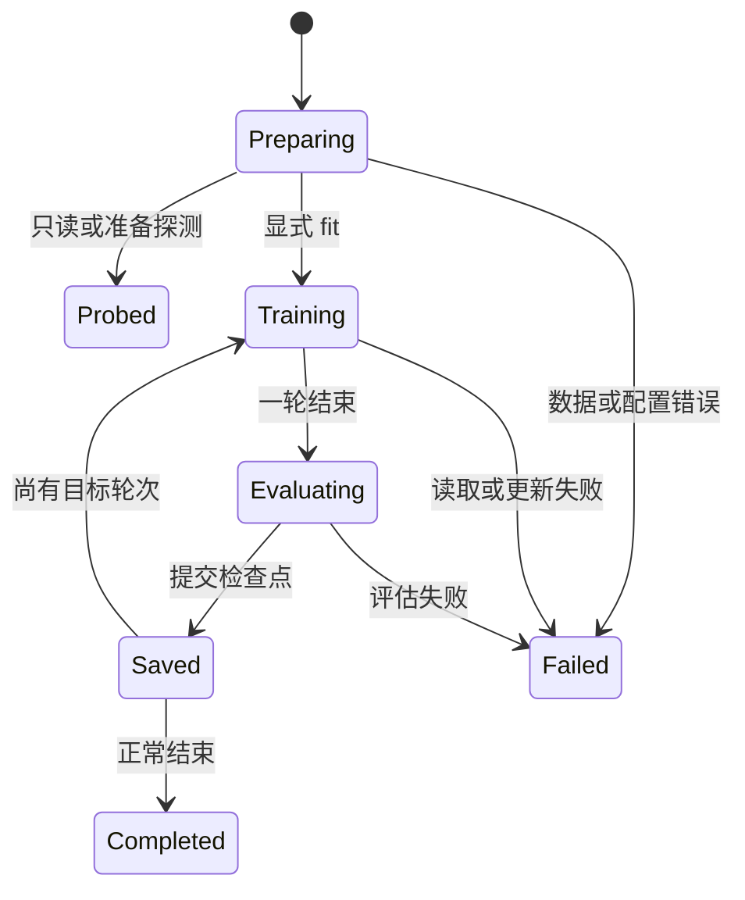

# 业务装配

本文是 `ai4e-core` 的 `applications` 模块产品说明。业务装配只协调公开能力，不实现原子算法。当前交付外流预处理装配中的读、抽、洗串联，在提取结果上串几何、表面法向、域标记与点数校验，按对照表落盘与整库批量编排，最小阶段盒子与外流 `rawprep` 标准装配，以及外流 `train` 选定 AB-UPT、打开分片并读盘探测。项目准备、正式模型和训练评估见第三章；后处理已交付锚点评估保存、可选点云与完整网格回贴。查询坐标、特征和锚点按同一模型设备交接，支持显式 MPS；具体数值复现边界见能力与案例验收。云图、报告与内容寻址缓存仍为规划。

---

## 目录

- [一、外流预处理装配](#一外流预处理装配)
  - [1.1 背景与定位](#11-背景与定位)
  - [1.2 核心业务操作流程图](#12-核心业务操作流程图)
  - [1.3 业务状态机](#13-业务状态机)
  - [1.4 状态值说明](#14-状态值说明)
  - [1.5 功能点清单](#15-功能点清单)
  - [1.6 功能点详解](#16-功能点详解)
- [二、阶段盒子与标准装配](#二阶段盒子与标准装配)
  - [2.1 背景与定位](#21-背景与定位)
  - [2.2 核心业务操作流程图](#22-核心业务操作流程图)
  - [2.3 业务状态机](#23-业务状态机)
  - [2.4 状态值说明](#24-状态值说明)
  - [2.5 功能点清单](#25-功能点清单)
  - [2.6 功能点详解](#26-功能点详解)
- [三、项目准备、模型设置与训练](#三项目准备模型设置与训练)
  - [3.1 背景与定位](#31-背景与定位)
  - [3.2 核心业务操作流程图](#32-核心业务操作流程图)
  - [3.3 业务状态机](#33-业务状态机)
  - [3.4 状态值说明](#34-状态值说明)
  - [3.5 功能点清单](#35-功能点清单)
  - [3.6 功能点详解](#36-功能点详解)

## 一、外流预处理装配

### 1.1 背景与定位

原始数据处理业务改名为 rawprep，公共函数及产物行为保持不变；旧 pre 应用路径移除，调用方应迁移。案例脚本与阶段名是 rawprep；装配内部配置键 `pre` 不变。

现行入口使用 Dataset 按需装配：登记读取、字段、几何、选择、校验、过滤与编码，运行器逐样本执行保存。数据集发现和官方布局由 contrib adapter 提供。原有单样本函数保留供独立调用与回归。

走 AB-UPT / ShapeNet-Car 的研究员给出案例配置和一个样本目录后，装配按文件名读入表面与体积网格，抽出坐标和具名点/单元字段，并在表面按约定单元类型标出有效点。随后可把这份提取结果交给几何装配，按启用清单得到所选几何量和体积重合点标记。再把具名场收成对照表声明的训练张量；整库可只校验或全量写出。失败时在装配层感知。

**设计原因与取舍**

- 物理量名称与原始数组名称分开：不同数据集可以用不同名字保存压力，业务仍以 pressure 消费结果；不用改写原字段，也不依赖活动场。
- 先检查全部配置再读取，避免处理到第二个域才发现配置不完整；同源复用限制在一个样本调用内，不引入跨样本缓存。
- 原网格和数组同时交接：几何装配直接取得每域 VTK 与坐标，避免为了找回网格关系而重新读取或由点云重建网格。
- 当前阶段不归一化、不实际删点，使用共享数组视图减少复制。原 VTK 对象和数组存在共享关系，调用方必须理解其可变性。
- 提取入口的交接形状保持不变；几何是另一次装配，消费已有结果，不回头改读取或提取。

**边界**

- 几何装配本身仍不删点、不落盘；写出由落盘装配负责。
- rawprep 封装独立业务步骤；contrib adapter 负责样本发现，recipe 声明步骤顺序；run 执行样本循环和首错/继续策略。rawprep 不导入 run。
- 最小阶段盒子见第二章。预处理目录不是一次实验的 run 产物，训练张量不写进运行目录。
- 不做压力对照。点场和单元场由输出配置选择；`cell.pt` 仅为 ShapeNet 的默认业务打包约定。
- 点到面过不了表面校验时，装配失败，不把点到点结果顶替成真 SDF。
- 不实现读取、抽取、清洗、编码或几何算法，只串联已有能力。

### 1.2 核心业务操作流程图



### 1.3 业务状态机



### 1.4 状态值说明

| 中文含义 | 标识 | 业务说明 |
| --- | --- | --- |
| 待装配 | `PendingAssemble` | 已接到案例配置和样本相对路径 |
| 已装配 | `Assembled` | 每域交出原网格、具名数组和字段描述；配置单元类型时另有点 mask |
| 拒绝：配置不全 | `RejectedConfig` | 配置缺失、来源重名、旧字段配置或无效字段声明 |
| 拒绝：读失败 | `RejectedRead` | 指定文件不存在或无法读成 VTK 对象 |
| 拒绝：抽失败 | `RejectedExtract` | VTK 对象没有坐标或具名字段不符合声明 |
| 拒绝：mask 失败 | `RejectedMask` | 表面单元不是约定类型 |
| 几何已就绪 | `GeometryReady` | 原域及提取键仍在，并补上已选能力的输出 |
| 拒绝：几何失败 | `RejectedGeometry` | 能力名、所需域、表面单元或输出冲突不合法，或计算结果无效 |
| 已落盘 | `Materialized` | 样本目录出现对照表声明的 `.pt`，同组点序对齐 |
| 只校验 | `DryChecked` | 读抽洗和几何已跑，未写 `.pt` |
| 拒绝：写出失败 | `RejectedStore` | 场归属/长度不符，或写出中途失败；恢复失败保留可恢复目录及完整路径 |
| 已发现样本 | `Discovered` | 只交出样本引用，执行与汇总由 run 完成 |
| 拒绝：目录已存在 | `RejectedOverwrite` | 实际样本目录已存在且未允许覆盖，dry-run 同样检查 |

### 1.5 功能点清单

1. 外流预处理按案例把读、抽、洗串起来

    1.1 读取前检查全部配置

    1.2 按配置读取并复用样本来源

    1.3 按物理量名称配置多个字段

    1.4 交接原网格、数组和字段描述

    1.5 按约定单元类型交出点 mask

    1.6 迁移旧配置并定位失败

    1.7 从原始读取演进到案例装配

2. 外流预处理按需派生几何与域标记

    2.1 只消费 VTK，按启用能力交接派生量

    2.2 不删点、不落盘；两套距离字段名分开

    2.3 选择能力与迁移旧调用

3. 外流预处理把单样本串到可落盘或只校验

    3.1 显式选择原始字段或几何输出

    3.2 校验组契约后按配置筛选

    3.3 按配置打包单元场

4. 发现样本并规划实际目标

    4.1 按案例配置枚举样本相对路径

    4.2 预检实际样本目录与重复目标

5. 选择使用已发布统计量或按训练分片重算

### 1.6 功能点详解

现行交付约定：产物 manifest 记录实际样本路径、字段形状和 physical 状态；训练分片统计成功后才发布完整清单，部分失败不发布。训练读盘新增按清单校验形状/类型/状态的入口，旧物理张量读盘仍保留。归一化仅登记字段方法、参数及统计引用，执行请求明确拒绝。

#### 1. 外流预处理按案例把读、抽、洗串起来

- fields 必须显式声明；允许 fields: {} 表示只提取坐标和拓扑，支持无标签输入。遗漏 fields 仍报错。

- 研究员给出案例配置和样本目录后，得到 surface、volume 两个域的原网格、具名数组、字段描述和可选点 mask。
- 装配只协调公开读取、提取和清洗能力；任一环节失败则本次调用失败，不返回半成品结果。

##### 1.1 读取前检查全部配置

- dataset.root 指定数据根目录，source.files 声明来源名称、文件名及可选格式；pre 中 surface 和 volume 均需声明。
- 两个域全部配置验证通过后才开始读取，包括来源引用、非空字段集合、数组名称、归属和类别。source.files 名称重复时拒绝，不允许后声明项覆盖前项。
- 配置结构或字段选择无效时明确失败。这一阶段验证声明，不承诺文件内容有效；缺文件、坏数据仍在读取或提取阶段报告。

##### 1.2 按配置读取并复用样本来源

- 单样本目录由数据根目录与传入的样本相对目录确定；没有样本相对目录时直接使用数据根目录。整库枚举见功能 4。
- 两个域引用同一 source 名称时，单样本调用内只读取一次，并共享同一个 VTK 对象；不同 source 名称不因指向相同路径而自动合并。
- 未被域引用的来源不会读取。案例中保留 press.npy 声明，也不表示装配已经读取它或执行两份压力的对照。

- 配置描述属于案例装配层；通用读取只接收文件路径和可选格式，不理解案例名称，也不自行加载 YAML。这样换一个案例的目录或物理量，不必改动通用读取能力。
- 单样本入口仍是「给定哪个样本就处理哪个」；缺失文件按读取错误报告。批量发现、排除名单和期望总数由功能 4 使用 `pre.discover`。

##### 1.3 按物理量名称配置多个字段

- 每域 fields 以业务物理量名称为键。每项必须声明 array（原始数组精确名称）、association（point/cell）、kind（scalar/vector）。一个域允许声明多个物理量。
- scalar 要求 1 个分量，vector 要求 3 个分量；点字段对齐点数，单元字段对齐单元数。类别、名称、归属缺一不可，不进行单位推断、活动字段回退或点/单元转换。
- 真实 ShapeNet-Car 表面数组名为 point_scalars，体积数组名为 point_vectors；业务分别映射为 pressure、velocity。以下是对应的配置约定：

```yaml
pre:
  surface:
    source: surface_pressure
    cell_type: quad
    fields:
      pressure:
        array: point_scalars
        association: point
        kind: scalar
  volume:
    source: volume_velocity
    fields:
      velocity:
        array: point_vectors
        association: point
        kind: vector
```

- pressure 是下游使用的物理量名称，point_scalars 是文件中原字段名称；原 VTK 字段不会因此被改名。同名原数组可分别按 point 和 cell 声明为两个物理量。

##### 1.4 交接原网格、数组和字段描述

- 每域结果的 vtk 保存原对象引用；points 保存所有原点序坐标；fields 以物理量名保存数组；field_specs 保存各物理量的 array、association、kind；mask 仅在配置单元类型时存在。
- 数组优先共享原 VTK 存储，不主动复制或改 dtype，不保证所有后端都零复制。返回的 VTK 不是原始数据的冻结快照，调用方修改共享数组可能改变它。
- 后续几何与拓扑能力直接取得每域 vtk。替换数组或改变拓扑、点序后必须重新提取视图并生成 mask，旧结果不会自动跟随更新。
- 这份轻量结果描述不等同于完整 FieldSpec、跨阶段 Artifact 或可回贴身份体系；尚未增加完整单位、时间和来源追踪契约。
- 几何装配已能在内存中补齐派生量。套 mask 后的 `.pt` 写出见功能 3；VTKHDF/PT 实体映射和训练期归一化已交付；完整字段契约仍为后续。不能把提取交接结果本身当成已落盘资产。

##### 1.5 按约定单元类型交出点 mask

- 任一域配置 cell_type 时，生成与该域原点数等长的 mask；未配置时不生成。当前示例仅表面配置 quad，体积未配置。
- mask 表示点是否参与单元，不表示字段已经过滤；对单元字段不能直接应用点 mask。保持原网格和数组完整，供后续几何处理使用。
- 单元类型不符或没有点/单元时失败，不静默生成可用结果。

##### 1.6 迁移旧配置并定位失败

- 旧的 field: scalars/vectors 已移除，遇到时明确提示迁移到 fields，并补齐 array、association、kind；不同时支持两套字段语义。
- 旧结果中的 scalars/vectors 顶层字段改由 fields 中的物理量名称读取，原网格通过 vtk 访问；调用方还可从 field_specs 判断点/单元归属。
- 读取、坐标、字段或 mask 失败时，错误包含域、物理量和来源路径，并保留原始异常原因；配置错误指向相应配置项。
##### 1.7 从原始读取演进到案例装配

- 早期阶段曾撤回仅为读文件而建立的配置式入口，让通用读取先保持路径输入，避免把案例规则提前写进基础能力；配置草案与通用配置加载能力仍保留。
- 随着提取与有效点标记具备可复用能力，现已在外流预处理中接回案例配置，负责串联“读取、具名提取、按需生成 mask”。这与早期撤回并不矛盾：恢复的是完整案例步骤的装配，而不是让底层读取承担案例业务。
- 提取与几何的交付结果仍是内存中的网格、数组和标记。套 mask 后的文件输出由功能 3、4 完成；模型相关归一化由 trainprep 执行。

#### 2. 外流预处理按需派生几何与域标记

- 研究员可以直接调用单个原子能力，也可以通过标准装配执行所选能力；未选择的能力不执行、不检查其专属输入、不生成对应字段。
- 所选能力的输入门禁与输出冲突检查在算法开始前完成。失败不返回半成品，不降级替代，不修改输入。

##### 2.1 只消费 VTK，按启用能力交接派生量

- 域的最低输入只有 vtk；坐标与拓扑以该对象为准，不依赖 pressure、velocity 或其他物理场。已有 points、fields、field_specs、mask 及额外域保持引用和原内容；调用方改变点序或拓扑后仍须重新提取，不得沿用旧视图。
- 表面法向只需要 surface；最近顶点、点到面和重合标记需要 surface 与 volume。查询侧体网格只提供坐标，不受表面门禁限制。
- 最近顶点输出 nearest_distance / nearest_direction；点到面输出 signed_distance / closest_on_surface / surface_direction，方向均由最近位置指向查询点。
- 表面法向输出 normals 与 normals_valid_mask。未参与面的孤立点为零且有效性为 False；它不同于已有 mask，不替换已有标记。
- exterior_mask 的 True 仅表示与表面坐标不精确重合，不表示空间上位于物体外部。
- 装配只校验本次生成的几何量长度。已声明物理场在提取时按 point/cell 和分量校验，几何层不重复检查。

##### 2.2 不删点、不落盘；两套距离字段名分开

- 全量点数与拓扑保持不变，不自动应用任何 mask。两套距离独立命名，互不覆盖。
- 点到面及法向要求全部单元为支持的二维面，允许弯曲和开放表面；混入线或体单元时拒绝，不自动取体外壳。
- 距离符号遵循输入定向，开放表面或反向绕序不保证物理内外。本装配不落盘，也不做压力副本对照。写出由功能 3 负责。

##### 2.3 选择能力与迁移旧调用

- pre.geometry.enabled 是能力名称列表，可选 nearest_vertex、mesh_signed_distance、surface_normals、exterior_mask。缺省或空列表表示关闭全部几何；空列表只透传输入。
- ShapeNet 案例显式启用四项。Python 标准装配调用必须显式传 enabled；从配置调用时先读取启用列表再传入，不再隐式计算全部。
- 未知名、重复名、非法配置容器及已有同名派生字段均报错。直接调用原子函数的方式不变；旧数组法向入口仍返回数组，带有效性标记的入口供新装配使用。

#### 3. 外流预处理把单样本串到可落盘或只校验

- 读取、提取、派生、选择、校验、筛选、编码、提交分别作为独立步骤公开。Python 可直接调用；recipe 展示顺序与参数，不调用隐藏整库逻辑的单一入口。
- 输出结果只含实际路径、文件映射、可用字段、校验报告、筛后数量、跳过项和提交警告，不把 VTK/数组带进作业汇总。

##### 3.1 显式选择原始字段或几何输出

- 输出配置中 fields 按逻辑名声明 domain/field；`fields.pressure` 表示具名物理场，`points` 表示坐标，其余为已生成的几何键。filemap 与 fields/bundles 必须一一对应。
- 可选项在 optional 中显式声明。必需输出尚未生成时失败，不自动启用能力，不以空产物冒充成功。
- 点到面距离、最近面点、方向和法向有效性标记均可选择。ShapeNet 的 volume_sdf 保持最近顶点距离语义。

##### 3.2 校验组契约后按配置筛选

- 组按来源域和 point/cell 归属声明原 ID，数量来自完整 VTK。读取和几何接口承诺原身份；外部重排数组必须同步其字段记录中的身份序列。
- 无 mask 时也强制校验来源、归属、数量和顺序，失败报告含样本/组/字段及原因。
- filters 以域名映射标记列表；多标记取交集。未声明的已有 mask 不自动使用；标记不存在或形状无效则报错。筛选同步字段与身份，筛后再次校验。
- ShapeNet 显式选择表面有效点标记和体积精确不重合标记。exterior_mask 不代表空间内外。

##### 3.3 按配置打包单元场

- bundles 声明域和 association，将该域已声明的同归属字段打包；可同时支持表面或体积单元场。
- ShapeNet 将体积单元场打包成可选 cell 输出；没有声明单元场时跳过，不写空文件。

#### 4. 发现样本并规划实际目标

- 本步骤只交出稳定样本引用，支持显式 samples、glob 或参数目录枚举。空选择、重复目标和逃离数据根的相对路径报错。
- 批量执行与错误策略已迁到 run，旧的 pre 整库入口移除。

##### 4.1 按案例配置枚举样本相对路径

- 参数目录是业务可选枚举方式。ShapeNet 保留 9 个参数目录、4 个排除 id 和期望 889；其他布局可用 samples/glob，无需改原子能力。

##### 4.2 预检实际样本目录与重复目标

- 实际目标为 output.dir/root_subdir/样本相对路径。已有父目录不拒绝；同一批次解析到重复目标时在读取前拒绝。
- dry-run 与提交共用映射和覆盖预检；真正写入时再检查目标状态。目录备份恢复委托原子写入能力。

#### 5. 选择使用已发布统计量或按训练分片重算

- 新入口默认拟合本次完整训练分片；reference 显式引用 adapter 发布的统计参数。旧 resolve_statistics 的 shipped 参数仅保留兼容。统计读取本次成功提交的实际路径，不扫描旧目录推断成功。
- train_samples 显式选择优先，否则可用 train_params；均未声明时选择本次样本。空列表不回退默认编号。fields 为必需的非空列表，position_fields 显式声明坐标字段；打包成员用“输出名/成员名”选择。
- missing 默认 error：训练样本失败或字段缺失则拒绝发布；设为 skip 时记录排除项，没有可累计数据仍失败。
- dry-run 只校验统计选择与计划，不读取旧张量、不写统计量；真实重算逐字段、逐样本消费数组流，保留尾维。
- 输出保留具名矩及 ShapeNet 兼容键，metadata 记录训练样本、字段、筛选策略、排除项和有效计数。默认写到实际预处理根的 statistics.yaml，可显式指定 output；覆盖已有统计文件须允许 overwrite。

---

## 二、阶段盒子与标准装配

### 2.1 背景与定位

研究员或案例入口需要把「整库落盘再定统计量」装进一条可被管道选中的业务阶段，而不是在开车层重写步骤顺序。现行 recipe 提供 rawprep(cfg) 普通函数，由 pipeline 按配置调用；Stage 只作为内部顺序执行机制。

**设计原因与取舍**

- 阶段只回答这一段业务按什么顺序调用已有封装。谁按下运行、日志目录和配置覆盖属于 run，不进阶段盒子。
- Stage 保留独立调用能力；新入口由普通函数组织作业，run 将 Dataset 顺序步骤按样本交给内部 Stage，并只累计轻量结果。
- 允许不同业务装配之间存在少量顺序代码，避免一条带很多分支的通用工厂。

**边界**

- 不下载、不解包、不删原始样本目录。
- 不实现读抽洗、几何或编码算法。
- 不做内容寻址缓存、四档 profile、model/post。外流 train 见第三章。
- 训练张量仍写到数据目录的预处理子目录，不写进运行目录。

### 2.2 核心业务操作流程图



### 2.3 业务状态机



### 2.4 状态值说明

| 中文含义 | 标识 | 业务说明 |
| --- | --- | --- |
| 待执行 | `PendingStage` | 已装配阶段盒子，尚未调用 |
| 执行中 | `Running` | 正在按顺序 `ctx = step(ctx)` |
| 阶段完成 | `StageDone` | 物化计数和统计量路径已进入上下文 |
| 阶段失败 | `StageFailed` | 失败步骤名可被开车层记入摘要 |

### 2.5 功能点清单

1. 阶段盒子按顺序执行内部步骤
    1.1 一步失败则该阶段停止
2. recipe 声明可见的 pre 阶段
    2.1 阶段管道只打开配置声明的阶段

### 2.6 功能点详解

#### 1. 阶段盒子按顺序执行内部步骤

- 名字和可调用步骤列表进去，执行时只做一件事：把上下文交给下一步。
- 步骤不必继承框架基类。上下文可以是作业或单样本映射，不要求继承基类。

##### 1.1 一步失败则该阶段停止

- 第二步抛错时不调用后续步骤。失败带阶段名和步骤名，供运行摘要使用。

#### 2. recipe 声明可见的 pre 阶段

- recipe 显式打开 Dataset、登记读取到编码的业务步骤、触发执行和统计。循环封装在 run，用户不写 build 或 Stage。
- 新入口从 paths.datasets 读取各分片的完整路径；支持变量插值和独立目录。统计保存在训练分片内，产物 manifest 是训练读盘入口；旧 pre.output.dir 与 preprocessed 拼接仅作为底层兼容，不再出现在模板。

##### 2.1 阶段管道只打开配置声明的阶段

- `pipeline.stages` 列出本次打开的阶段名。未列出的阶段不构造、不执行。默认案例声明 rawprep、trainprep、train、post；可显式选择已有输入支持的阶段，独立训练消费已经交付的准备引用。

---

## 三、项目准备、模型设置与训练

### 3.1 背景与定位

原始数据资产可供多个项目复用，而模型需要的归一化、采样和学习目标会随实验改变。应用以 rawprep、trainprep、model、train、post 聚合相邻业务：避免把业务拆成大量原子能力转调文件，也避免把模型配置混入原始数据处理。旧只读入口继续可用，但不再产生训练占位标记。

### 3.2 核心业务操作流程图



### 3.3 业务状态机



### 3.4 状态值说明

Preparing 校验清单和空间状态；Probed 只返回探测结果；Training 组织有效更新；Evaluating 使用固定采样；Saved 表示检查点成功提交；Completed 写出 last；Failed 交由现有会话报告，不能发布完整成功结果。以上描述执行阶段，不新增通用持久状态系统。

### 3.5 功能点清单

1. 项目数据准备
2. 模型与学习目标设置
3. 训练任务与恢复
4. 独立评估、锚点保存与完整网格回贴
5. 公共网格资产关联

### 3.6 功能点详解

#### 1. 项目数据准备

逐点监督装配通过数据组件的公开读取与描述消费分块，冻结数据摘要、字段、变换、模型及采样声明；数据改变时拒绝旧准备。训练以样本为计算单位，验证遍历全部块，分别记录样本数与元素数。

准备分为打开数据、物理规则、冻结归一化、配置采样、配置拼批和全分片校验。持久化交付记录清单及实际文件内容摘要、冻结变换、输入声明与组件路径；训练消费前校验，不重读原统计文件，也不把检查时的采样冻结为所有轮次的数据。

trainprep 解析一次清单，逐样本读盘，统一标量通道，按 `trainprep.physical_rules.zero_fields` 在物理空间显式派生零距离。probe 保持只读，prepare 同时返回物理、归一化和采样视图。坐标共用边界，压力、速度、距离采用冻结统计，法向保持。几何来源显式绑定，超节点引用几何点；命名域 anchor/query 分别联动坐标、特征及目标；标准场独立复制为监督目标。支持独立可复现随机流；官方案例选用全局随机流，保留官方采样顺序与推进方式。

默认只保存版本化方法记录，显式物化才保存全分辨率归一化张量与独立清单。新归一化记录版本 2 固定官方 shift/scale 运算顺序及同系数反变换；旧记录版本 1 继续使用原有除法语义。归一化输入复用冻结记录；方法和参数冲突失败，反变换不依赖原统计文件。原始清单不被覆盖，新版本失败保留旧版本。

#### 2. 模型与学习目标设置

model 接收 recipe 注入的贡献构造器。`model.data_specs` 有序声明域、预测字段、特征和条件；输出为具名 anchor/query 场，不再固定五键和四/七通道头。默认单样本，固定布局允许多样本；不填充变长域点。初始权重和冻结仍属于模型设置。学习目标仅由 `model.supervision` 显式绑定预测、目标、反变换字段、权重及比较方法；默认两条 anchor 均方误差，权重各一。query 监督必须显式绑定真值，禁止广播和自动使用目标作为特征。旧配置不兼容。


#### 3. 训练任务与恢复

外流共享入口可选择锚点监督或逐点监督装配。后者使用独立训练数据生成器、标准化均方误差、逐轮余弦及验证选优，参数更新仍由公共训练循环执行。恢复重新构建独立生成器，与参考恢复规则保持一致；不承诺恢复轨迹等于不中断轨迹。

train 默认两轮、批次一、零读取子进程，使用自动选择设备、Lion、5% 预热余弦到 `1e-6`、裁剪和 EMA。优化器与调度可换、参数可改。启动前展开模型/优化/采样/检查点默认值并联合校验，缺项不启动。设备默认 `auto` 按 CUDA/MPS/CPU 选择，点名设备不可用失败；AB-UPT 的实际支持以设备验收为准。评估登记官方 test，另有 test_repeat：一百条各十次、独立采样，长度为 1000；两者都带归一化分项，best 仍只看测试总分。自定义步骤替换前向与损失计算，循环仍独占更新。公开装配 `configure_evaluation(job, step=..., callbacks=...)` 注入步骤与周期回调，recipe 可以逐项调整，训练循环不进入 recipe。检查点保存模型、优化器、调度、随机状态、已启用缩放器和兼容契约；普通 latest/best/last 都包含恢复所需 EMA 状态，每十轮额外发布 ema_latest 权重。恒定调度允许更改目标轮数；预热余弦恢复必须保持计划总轮数，设备和日志频率可改；更新间隔默认为空，不按更新打进度。新检查点 version=2 同时冻结域/字段顺序、特征、条件和准备绑定。旧版本及模型、数据、采样、变换等语义冲突拒绝。报告和检查点通过现有会话公开桥接提交，不创建新运行目录。

#### 4. 独立评估、锚点保存与完整网格回贴

逐点表面场支持全测试推理，默认随机一个样本导出，可指定或选择全部。预测复用必须核验权重、冻结准备及完整块摘要。预测、评估、数值结果和网格独立登记，失败保留已提交文件，整体不得冒充成功。

后处理保留既有成功输出字段，并分别报告 evaluation、predictions、mesh 的执行状态、完成样本数、已提交路径及错误身份。状态为 pending/running/succeeded/failed/skipped：关闭的分支为 skipped；首错之后未执行的分支保持 pending；任一要求的交付失败，整体保持 failed。每个样本完成后才增加计数；样本中途失败时保留已经成功提交的目录、张量或网格路径，不扫描旧文件推测本次交付。具名张量与同目录点云为一个原子目录提交；兼容张量、兼容点云和完整网格分别记录。

查询入口按模型实际设备交接锚点、坐标与可选特征，保持精度门禁。沿用同进程执行和既有随机顺序，不新增设备专用流程。独立补跑只打开失败分支，显式指向已有检查点；不重训、不自动覆盖、不跳过已有目标。

业务装配消费独立参数副本，不再向运行器写回整份内部配置。准备引用、实际数据和恢复检查点通过既有交付记录，用户配置保持启动时的结构与内容。旧外流路径解析保留兼容入口，不识别案例五段分组；新案例自行组织参数。

训练自动发布 training-protocol.json，后处理自动发布 comparison-protocol.json：记录实际数据内容摘要、分片、归一化、结构、初始化、采样、精度、设备、源码与入口。后处理记录实际几何、锚点及查询内容摘要；已失败运行保留已消费输入的记录。旧检查点无初始化证据时保留未知，不从路径或种子补造。外部全局条件与几何条件文件按内容取摘要，同路径替换也会改变数据身份。比较判定由验收工具执行，application 不依赖参考框架。

post 对显式加载的模型装配共享评估能力，训练周期直接使用同一原子实现。每次前向同时计算归一化总分、按权重计入的分项和反归一化六项物理指标，逐样本平均；分项与物理指标分开。零范数相对 L2 跳过并记录数量。结束或失败都恢复模型模式及随机流。仅声明监督项对应的预测、真值与反变换进入评估，未标注 query 不计算误差；anchor/query 指标分开命名。指标代表声明点集，不自动代表完整网格误差。

未写检查点路径时使用本次运行目录的 `last`；也可写 `best` / `latest` 或显式路径。只恢复模型权重，优化器与训练进度保持不动。模型、准备或归一化与检查点不一致则拒绝。测试分片复用训练的读盘和冻结变换。独立后处理从配置种子开始重建模型并沿全局流采样，锚点与网格分支隔离随机状态，结束恢复调用方状态；仍可显式选择旧的按样本独立流。打开保存时每个测试样本写入物理压力、物理速度和两域归一化锚点坐标；打开点云时另写两个带独立顶点单元的 `.vtp` 点云。预测还按测试顺序交付兼容的逐样本张量包和点云路径，编号由流程生成，不要求用户预填。检查模式只核对接得上，不写预测、点云或网格。

打开查询后按测试下标定位设计号和原始网格，默认只处理第 0 辆，下标越界或缺少原始文件拒绝。几何和锚点与训练评估准备一致，全部原始顶点当分块查询坐标；坐标变换数值不变，越界只放宽范围门禁。查询预测覆盖所有原始顶点；表面提取移除未被面单元引用的顶点，交付按提取后的点数校验，并保留原始点与单元身份。成品写到数据目录 `predictions/mesh_vtk/`，文件名为 `sample_XXXX_surface.vtp` 与 `sample_XXXX_volume.vtu`，字段名与模版一致。已写出的样本保留，部分失败不得报成完整成功。不读锚点查询张量。仅 eval/no_grad 使用缓存，退出或失败即释放。评估、保存、点云和查询按配置开关并存，至少打开一路。recipe 只注入组件，运行报告仍由唯一 writer 提交。锁定 ShapeNet-Car 配置的 CPU 数值对照与扩展配置的功能验收分别记录，不外推到任意硬件或模型配置。

#### 5. 公共网格资产关联

rawprep 显式启用 VTKHDF 时，原拓扑、点/单元身份与具名场和 PT 一起提交。筛选结果通过实体映射关联，未选实体回贴为 NaN；失败不发布完整新资产。默认 PT 训练链无需启用此功能。
