# 业务装配

本文是 `ai4e-core` 的 `applications` 模块产品说明。业务装配只协调公开能力，不实现原子算法。领域 application 负责步骤和交接，模型或数据集专属连接留在 contrib/application；可中立化的图轨迹、固定结果和迭代装配复用 core。当前交付外流预处理装配、标准阶段盒子、训练和固定结果后处理，并扩展时空轨迹的 rawprep/trainprep/train/infer/post 通用交接。具体 MeshGraphNet 网络、CylinderFlow 字段和论文协议仍由贡献侧绑定。

---

## 目录

- [十一、地热研究装配](#十一地热研究装配)

- [十、具名网格场与轨迹装配](#十具名网格场与轨迹装配)
  - [10.1 背景与定位](#101-背景与定位)
  - [10.2 核心业务操作流程图](#102-核心业务操作流程图)
  - [10.3 业务状态机](#103-业务状态机)
  - [10.4 状态值说明](#104-状态值说明)
  - [10.5 功能点清单](#105-功能点清单)
  - [10.6 功能点详解](#106-功能点详解)

- [九、时空场预测研究装配](#九时空场预测研究装配)

- [八、控制轨迹研究装配](#八控制轨迹研究装配)

- [一、外流预处理装配](#一外流预处理装配)
  - [1.1 背景与定位](#11-背景与定位)
  - [1.2 核心业务操作流程图](#12-核心业务操作流程图)
  - [1.3 业务状态机](#13-业务状态机)
  - [1.4 状态值说明](#14-状态值说明)
  - [1.5 功能点清单](#15-功能点清单)
  - [1.6 功能点详解](#16-功能点详解)
- [二、阶段盒子与标准装配](#二阶段盒子与标准装配)
  - [2.1 背景与定位](#21-背景与定位)
  - [2.2 核心业务操作流程图](#22-核心业务操作流程图)
  - [2.3 业务状态机](#23-业务状态机)
  - [2.4 状态值说明](#24-状态值说明)
  - [2.5 功能点清单](#25-功能点清单)
  - [2.6 功能点详解](#26-功能点详解)
- [三、项目准备、模型设置与训练](#三项目准备模型设置与训练)
  - [3.1 背景与定位](#31-背景与定位)
  - [3.2 核心业务操作流程图](#32-核心业务操作流程图)
  - [3.3 业务状态机](#33-业务状态机)
  - [3.4 状态值说明](#34-状态值说明)
  - [3.5 功能点清单](#35-功能点清单)
  - [3.6 功能点详解](#36-功能点详解)
- [四、参数化 PDE 工作流](#四参数化-pde-工作流)
  - [4.1 背景与定位](#41-背景与定位)
  - [4.2 核心业务操作流程图](#42-核心业务操作流程图)
  - [4.3 业务状态机](#43-业务状态机)
  - [4.4 状态值说明](#44-状态值说明)
  - [4.5 功能点清单](#45-功能点清单)
  - [4.6 功能点详解](#46-功能点详解)
- [五、独立外流推理与结果消费](#五独立外流推理与结果消费)
  - [5.1 背景与定位](#51-背景与定位)
  - [5.2 核心业务操作流程图](#52-核心业务操作流程图)
  - [5.3 业务状态机](#53-业务状态机)
  - [5.4 状态值说明](#54-状态值说明)
  - [5.5 功能点清单](#55-功能点清单)
  - [5.6 功能点详解](#56-功能点详解)
- [六、固定推理结果后处理](#六固定推理结果后处理)
  - [6.1 背景与定位](#61-背景与定位)
  - [6.2 核心业务操作流程图](#62-核心业务操作流程图)
  - [6.3 业务状态机](#63-业务状态机)
  - [6.4 状态值说明](#64-状态值说明)
  - [6.5 功能点清单](#65-功能点清单)
  - [6.6 功能点详解](#66-功能点详解)

- [七、耦合物理场研究装配](#七耦合物理场研究装配)
  - [7.1 背景与定位](#71-背景与定位)
  - [7.2 核心业务操作流程图](#72-核心业务操作流程图)
  - [7.3 业务状态机](#73-业务状态机)
  - [7.4 状态值说明](#74-状态值说明)
  - [7.5 功能点清单](#75-功能点清单)
  - [7.6 功能点详解](#76-功能点详解)


## 一、外流预处理装配

### 1.1 背景与定位

原始数据处理业务改名为 rawprep，公共函数及产物行为保持不变；旧 pre 应用路径移除，调用方应迁移。案例脚本与阶段名是 rawprep；装配内部配置键 `pre` 不变。

现行入口使用 Dataset 按需装配：登记读取、字段、几何、选择、校验、过滤与编码，运行器逐样本执行保存。数据集发现和官方布局由 contrib adapter 提供。原有单样本函数保留供独立调用与回归。

走 AB-UPT / ShapeNet-Car 的研究员给出案例配置和一个样本目录后，装配按文件名读入表面与体积网格，抽出坐标和具名点/单元字段，并在表面按约定单元类型标出有效点。随后可把这份提取结果交给几何装配，按启用清单得到所选几何量和体积重合点标记。再把具名场收成对照表声明的训练张量；整库可只校验或全量写出。失败时在装配层感知。

**设计原因与取舍**

- 物理量名称与原始数组名称分开：不同数据集可以用不同名字保存压力，业务仍以 pressure 消费结果；不用改写原字段，也不依赖活动场。
- 先检查全部配置再读取，避免处理到第二个域才发现配置不完整；同源复用限制在一个样本调用内，不引入跨样本缓存。
- 原网格和数组同时交接：几何装配直接取得每域 VTK 与坐标，避免为了找回网格关系而重新读取或由点云重建网格。
- 当前阶段不归一化、不实际删点，使用共享数组视图减少复制。原 VTK 对象和数组存在共享关系，调用方必须理解其可变性。
- 提取入口的交接形状保持不变；几何是另一次装配，消费已有结果，不回头改读取或提取。

**边界**

- 几何装配本身仍不删点、不落盘；写出由落盘装配负责。
- rawprep 封装独立业务步骤；contrib adapter 负责样本发现，recipe 声明步骤顺序；run 执行样本循环和首错/继续策略。rawprep 不导入 run。原始处理按全部或指定样本执行，不在此步选择 train/test 分片；平台提交非 NASA 案例时覆盖为 `unsplit`，产物不按官方切分落盘。划分由 trainprep.split 完成。`rawprep.workers` 控制并行样本线程数，缺省 1，范围 1–64；旧任务脚本未声明该键时由运行入口透传，不要求改写冻结案例加载器。
- 最小阶段盒子见第二章。预处理目录不是一次实验的 run 产物，训练张量不写进运行目录。
- 不做压力对照。点场和单元场由输出配置选择；`cell.pt` 仅为 ShapeNet 的默认业务打包约定。
- 点到面过不了表面校验时，装配失败，不把点到点结果顶替成真 SDF。
- 不实现读取、抽取、清洗、编码或几何算法，只串联已有能力。

### 1.2 核心业务操作流程图

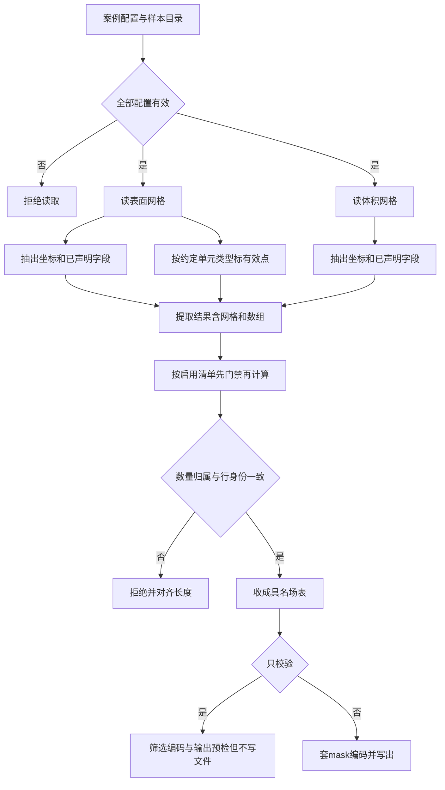

### 1.3 业务状态机

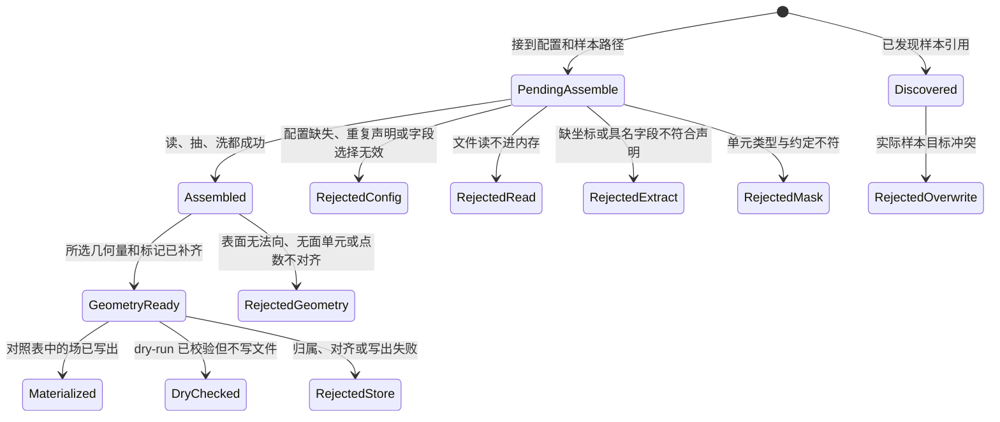

### 1.4 状态值说明

| 中文含义 | 标识 | 业务说明 |
| --- | --- | --- |
| 待装配 | `PendingAssemble` | 已接到案例配置和样本相对路径 |
| 已装配 | `Assembled` | 每域交出原网格、具名数组和字段描述；配置单元类型时另有点 mask |
| 拒绝：配置不全 | `RejectedConfig` | 配置缺失、来源重名、旧字段配置或无效字段声明 |
| 拒绝：读失败 | `RejectedRead` | 指定文件不存在或无法读成 VTK 对象 |
| 拒绝：抽失败 | `RejectedExtract` | VTK 对象没有坐标或具名字段不符合声明 |
| 拒绝：mask 失败 | `RejectedMask` | 表面单元不是约定类型 |
| 几何已就绪 | `GeometryReady` | 原域及提取键仍在，并补上已选能力的输出 |
| 拒绝：几何失败 | `RejectedGeometry` | 能力名、所需域、表面单元或输出冲突不合法，或计算结果无效 |
| 已落盘 | `Materialized` | 样本目录出现对照表声明的 `.pt`，同组点序对齐 |
| 只校验 | `DryChecked` | 读抽洗和几何已跑，未写 `.pt` |
| 拒绝：写出失败 | `RejectedStore` | 场归属/长度不符，或写出中途失败；恢复失败保留可恢复目录及完整路径 |
| 已发现样本 | `Discovered` | 只交出样本引用，执行与汇总由 run 完成 |
| 拒绝：目录已存在 | `RejectedOverwrite` | 实际样本目录已存在且未允许覆盖，dry-run 同样检查 |

### 1.5 功能点清单

1. 外流预处理按案例把读、抽、洗串起来

    1.1 读取前检查全部配置

    1.2 按配置读取并复用样本来源

    1.3 按物理量名称配置多个字段

    1.4 交接原网格、数组和字段描述

    1.5 按约定单元类型交出点 mask

    1.6 迁移旧配置并定位失败

    1.7 从原始读取演进到案例装配

2. 外流预处理按需派生几何与域标记

    2.1 只消费 VTK，按启用能力交接派生量

    2.2 不删点、不落盘；两套距离字段名分开

    2.3 选择能力与迁移旧调用

3. 外流预处理把单样本串到可落盘或只校验

    3.1 显式选择原始字段或几何输出

    3.2 校验组契约后按配置筛选

    3.3 按配置打包单元场

4. 发现样本并规划实际目标

    4.1 按案例配置枚举样本相对路径

    4.2 预检实际样本目录与重复目标

5. 选择使用已发布统计量或按训练分片重算

6. 声明驱动的原始处理

### 1.6 功能点详解

#### 1. 外流预处理按案例把读、抽、洗串起来

现行交付约定：产物 manifest 记录实际样本路径、字段形状和 physical 状态；训练分片统计成功后才发布完整清单，部分失败不发布。训练读盘新增按清单校验形状/类型/状态的入口，旧物理张量读盘仍保留。归一化仅登记字段方法、参数及统计引用，执行请求明确拒绝。

- fields 必须显式声明；允许 fields: {} 表示只提取坐标和拓扑，支持无标签输入。遗漏 fields 仍报错。

- 研究员给出案例配置和样本目录后，得到 surface、volume 两个域的原网格、具名数组、字段描述和可选点 mask。
- 装配只协调公开读取、提取和清洗能力；任一环节失败则本次调用失败，不返回半成品结果。

##### 1.1 读取前检查全部配置

- dataset.root 指定数据根目录，source.files 声明来源名称、文件名及可选格式；pre 中 surface 和 volume 均需声明。
- 两个域全部配置验证通过后才开始读取，包括来源引用、非空字段集合、数组名称、归属和类别。source.files 名称重复时拒绝，不允许后声明项覆盖前项。
- 配置结构或字段选择无效时明确失败。这一阶段验证声明，不承诺文件内容有效；缺文件、坏数据仍在读取或提取阶段报告。

##### 1.2 按配置读取并复用样本来源

- 单样本目录由数据根目录与传入的样本相对目录确定；没有样本相对目录时直接使用数据根目录。整库枚举见功能 4。
- 两个域引用同一 source 名称时，单样本调用内只读取一次，并共享同一个 VTK 对象；不同 source 名称不因指向相同路径而自动合并。
- 未被域引用的来源不会读取。案例中保留 press.npy 声明，也不表示装配已经读取它或执行两份压力的对照。

- 配置描述属于案例装配层；通用读取只接收文件路径和可选格式，不理解案例名称，也不自行加载 YAML。这样换一个案例的目录或物理量，不必改动通用读取能力。
- 单样本入口仍是「给定哪个样本就处理哪个」；缺失文件按读取错误报告。批量发现、排除名单和期望总数由功能 4 使用 `pre.discover`。

##### 1.3 按物理量名称配置多个字段

- 每域 fields 以业务物理量名称为键。每项必须声明 array（原始数组精确名称）、association（point/cell）、kind（scalar/vector）。一个域允许声明多个物理量。
- scalar 要求 1 个分量，vector 要求 3 个分量；点字段对齐点数，单元字段对齐单元数。类别、名称、归属缺一不可，不进行单位推断、活动字段回退或点/单元转换。
- 真实 ShapeNet-Car 表面数组名为 point_scalars，体积数组名为 point_vectors；业务分别映射为 pressure、velocity。以下是对应的配置约定：

```yaml
pre:
  surface:
    source: surface_pressure
    cell_type: quad
    fields:
      pressure:
        array: point_scalars
        association: point
        kind: scalar
  volume:
    source: volume_velocity
    fields:
      velocity:
        array: point_vectors
        association: point
        kind: vector
```

- pressure 是下游使用的物理量名称，point_scalars 是文件中原字段名称；原 VTK 字段不会因此被改名。同名原数组可分别按 point 和 cell 声明为两个物理量。

##### 1.4 交接原网格、数组和字段描述

- 每域结果的 vtk 保存原对象引用；points 保存所有原点序坐标；fields 以物理量名保存数组；field_specs 保存各物理量的 array、association、kind；mask 仅在配置单元类型时存在。
- 数组优先共享原 VTK 存储，不主动复制或改 dtype，不保证所有后端都零复制。返回的 VTK 不是原始数据的冻结快照，调用方修改共享数组可能改变它。
- 后续几何与拓扑能力直接取得每域 vtk。替换数组或改变拓扑、点序后必须重新提取视图并生成 mask，旧结果不会自动跟随更新。
- 这份轻量结果描述不等同于完整 FieldSpec、跨阶段 Artifact 或可回贴身份体系；尚未增加完整单位、时间和来源追踪契约。
- 几何装配已能在内存中补齐派生量。套 mask 后的 `.pt` 写出见功能 3；VTKHDF/PT 实体映射和训练期归一化已交付；完整字段契约仍为后续。不能把提取交接结果本身当成已落盘资产。

##### 1.5 按约定单元类型交出点 mask

- 任一域配置 cell_type 时，生成与该域原点数等长的 mask；未配置时不生成。当前示例仅表面配置 quad，体积未配置。
- mask 表示点是否参与单元，不表示字段已经过滤；对单元字段不能直接应用点 mask。保持原网格和数组完整，供后续几何处理使用。
- 单元类型不符或没有点/单元时失败，不静默生成可用结果。

##### 1.6 迁移旧配置并定位失败

- 旧的 field: scalars/vectors 已移除，遇到时明确提示迁移到 fields，并补齐 array、association、kind；不同时支持两套字段语义。
- 旧结果中的 scalars/vectors 顶层字段改由 fields 中的物理量名称读取，原网格通过 vtk 访问；调用方还可从 field_specs 判断点/单元归属。
- 读取、坐标、字段或 mask 失败时，错误包含域、物理量和来源路径，并保留原始异常原因；配置错误指向相应配置项。
##### 1.7 从原始读取演进到案例装配

- 早期阶段曾撤回仅为读文件而建立的配置式入口，让通用读取先保持路径输入，避免把案例规则提前写进基础能力；配置草案与通用配置加载能力仍保留。
- 随着提取与有效点标记具备可复用能力，现已在外流预处理中接回案例配置，负责串联“读取、具名提取、按需生成 mask”。这与早期撤回并不矛盾：恢复的是完整案例步骤的装配，而不是让底层读取承担案例业务。
- 提取与几何的交付结果仍是内存中的网格、数组和标记。套 mask 后的文件输出由功能 3、4 完成；模型相关归一化由 trainprep 执行。

#### 2. 外流预处理按需派生几何与域标记

- 研究员可以直接调用单个原子能力，也可以通过标准装配执行所选能力；未选择的能力不执行、不检查其专属输入、不生成对应字段。
- 所选能力的输入门禁与输出冲突检查在算法开始前完成。失败不返回半成品，不降级替代，不修改输入。

##### 2.1 只消费 VTK，按启用能力交接派生量

- 域的最低输入只有 vtk；坐标与拓扑以该对象为准，不依赖 pressure、velocity 或其他物理场。已有 points、fields、field_specs、mask 及额外域保持引用和原内容；调用方改变点序或拓扑后仍须重新提取，不得沿用旧视图。
- 表面法向只需要 surface；最近顶点、点到面和重合标记需要 surface 与 volume。查询侧体网格只提供坐标，不受表面门禁限制。
- 最近顶点输出 nearest_distance / nearest_direction；点到面输出 signed_distance / closest_on_surface / surface_direction，方向均由最近位置指向查询点。
- 表面法向输出 normals 与 normals_valid_mask。未参与面的孤立点为零且有效性为 False；它不同于已有 mask，不替换已有标记。
- exterior_mask 的 True 仅表示与表面坐标不精确重合，不表示空间上位于物体外部。
- 装配只校验本次生成的几何量长度。已声明物理场在提取时按 point/cell 和分量校验，几何层不重复检查。

##### 2.2 不删点、不落盘；两套距离字段名分开

- 全量点数与拓扑保持不变，不自动应用任何 mask。两套距离独立命名，互不覆盖。
- 点到面及法向要求全部单元为支持的二维面，允许弯曲和开放表面；混入线或体单元时拒绝，不自动取体外壳。
- 距离符号遵循输入定向，开放表面或反向绕序不保证物理内外。本装配不落盘，也不做压力副本对照。写出由功能 3 负责。

##### 2.3 选择能力与迁移旧调用

- pre.geometry.enabled 是能力名称列表，可选 nearest_vertex、volume_normals、mesh_signed_distance、surface_normals、exterior_mask。缺省或空列表表示关闭全部几何；空列表只透传输入。
- nearest_vertex 只写最近顶点距离；volume_normals 独立写体积法向。任一项启用都计算一次最近顶点，只保存对应键；两项同时开则一次计算写两个键。二者都与 mesh_signed_distance 互斥，彼此不互斥。
- ShapeNet 案例默认启用最近顶点距离、体积法向、表面法向与重合标记。Python 标准装配调用必须显式传 enabled；从配置调用时先读取启用列表再传入，不再隐式计算全部。
- 未知名、重复名、非法配置容器及已有同名派生字段均报错。直接调用原子函数的方式不变；旧数组法向入口仍返回数组，带有效性标记的入口供新装配使用。

#### 3. 外流预处理把单样本串到可落盘或只校验

- 读取、提取、派生、选择、校验、筛选、编码、提交分别作为独立步骤公开。Python 可直接调用；recipe 展示顺序与参数，不调用隐藏整库逻辑的单一入口。
- 输出结果只含实际路径、文件映射、可用字段、校验报告、筛后数量、跳过项和提交警告，不把 VTK/数组带进作业汇总。逐样本筛选/提交只记 debug；阶段、批量、统计进度与失败保持常规日志。

##### 3.1 显式选择原始字段或几何输出

- 输出配置中 fields 按逻辑名声明 domain/field；`fields.pressure` 表示具名物理场，`points` 表示坐标，其余为已生成的几何键。filemap 与 fields/bundles 必须一一对应。
- 可选项在 optional 中显式声明。必需输出尚未生成时失败，不自动启用能力，不以空产物冒充成功。
- 点到面距离、最近面点、方向和法向有效性标记均可选择。ShapeNet 的 volume_sdf 保持最近顶点距离语义。

##### 3.2 校验组契约后按配置筛选

- 组按来源域和 point/cell 归属声明原 ID，数量来自完整 VTK。读取和几何接口承诺原身份；外部重排数组必须同步其字段记录中的身份序列。
- 无 mask 时也强制校验来源、归属、数量和顺序，失败报告含样本/组/字段及原因。
- filters 以域名映射标记列表；多标记取交集。未声明的已有 mask 不自动使用；标记不存在或形状无效则报错。筛选同步字段与身份，筛后再次校验。
- ShapeNet 显式选择表面有效点标记和体积精确不重合标记。exterior_mask 不代表空间内外。

##### 3.3 按配置打包单元场

- bundles 声明域和 association，将该域已声明的同归属字段打包；可同时支持表面或体积单元场。
- ShapeNet 将体积单元场打包成可选 cell 输出；没有声明单元场时跳过，不写空文件。

#### 4. 发现样本并规划实际目标

- 本步骤只交出稳定样本引用，支持显式 samples、glob 或参数目录枚举。空选择、重复目标和逃离数据根的相对路径报错。
- 批量执行与错误策略已迁到 run，旧的 pre 整库入口移除。

##### 4.1 按案例配置枚举样本相对路径

- 参数目录是业务可选枚举方式。ShapeNet 保留 9 个参数目录、4 个排除 id 和期望 889；其他布局可用 samples/glob，无需改原子能力。

##### 4.2 预检实际样本目录与重复目标

- 实际目标为 output.dir/root_subdir/样本相对路径。已有父目录不拒绝；同一批次解析到重复目标时在读取前拒绝。
- dry-run 与提交共用映射和覆盖预检；真正写入时再检查目标状态。目录备份恢复委托原子写入能力。

#### 5. 选择使用已发布统计量或按训练分片重算

采用参考统计时，在物理清单发布前将统计文件冻结到物理输出目录，保证共享数据脱离原安装位置仍能使用。统计数值保持不变，检查不复制或发布。

- 新入口默认拟合本次完整训练分片；reference 显式引用 adapter 发布的统计参数。旧 resolve_statistics 的 shipped 参数仅保留兼容。统计读取本次成功提交的实际路径，不扫描旧目录推断成功。
- train_samples 显式选择优先，否则可用 train_params；均未声明时选择本次样本。空列表不回退默认编号。fields 为必需的非空列表，position_fields 显式声明坐标字段；打包成员用“输出名/成员名”选择。
- missing 默认 error：训练样本失败或字段缺失则拒绝发布；设为 skip 时记录排除项，没有可累计数据仍失败。
- dry-run 只校验统计选择与计划，不读取旧张量、不写统计量；真实重算逐字段、逐样本消费数组流，保留尾维。
- 输出保留具名矩及 ShapeNet 兼容键，metadata 记录训练样本、字段、筛选策略、排除项和有效计数。默认写到实际预处理根的 statistics.yaml，可显式指定 output；覆盖已有统计文件须允许 overwrite。

---


#### 6. 声明驱动的原始处理

- 默认参数、案例覆盖和当前任务修改按顺序生效，显式空列表和空映射不恢复默认。原始处理描述只回配置里已保存的 `dataset.processed_name`，不用数据集标识填空名称。流程仍按来源读取、字段提取、几何、选择、校验、清洗、编码、执行与发布表达；NASA 使用自身物理字段步骤。标准与自定义输出支持一个逻辑场一个张量，旧多成员容器保持原义。取消字段后仅声明实际保存布局，数据准备按真实字段检查缺项。
- `rawprep.formats` 列出要写出的容器，PT 与 Zarr 可同时声明，至少一种；清单记录实际后缀，读盘优先 PT。旧顶层 `rawprep.format` 视为只选这一种。平台已提供的格式选项覆盖清单默认和旧单键；生成配置两键并存时只保留平台列表，不向用户报冲突。空列表或非法格式仍拒绝。VTKHDF 仍是额外网格附件，未接入的数据集不能打开；已接入数据集的官方案例默认打开，已保存关闭保持原值。

## 二、阶段盒子与标准装配

### 2.1 背景与定位

研究员或案例入口需要把「整库落盘再定统计量」装进一条可被管道选中的业务阶段，而不是在开车层重写步骤顺序。现行 recipe 提供 rawprep(cfg) 普通函数，由 pipeline 按配置调用；Stage 只作为内部顺序执行机制。

**设计原因与取舍**

- 阶段只回答这一段业务按什么顺序调用已有封装。谁按下运行、日志目录和配置覆盖属于 run，不进阶段盒子。
- Stage 保留独立调用能力；新入口由普通函数组织作业，run 将 Dataset 顺序步骤按样本交给内部 Stage，并只累计轻量结果。
- 允许不同业务装配之间存在少量顺序代码，避免一条带很多分支的通用工厂。

**边界**

- 不下载、不解包、不删原始样本目录。
- 不实现读抽洗、几何或编码算法。
- 不做内容寻址缓存、四档 profile、model/post。外流 train 见第三章。
- 训练张量仍写到数据目录的预处理子目录，不写进运行目录。

### 2.2 核心业务操作流程图

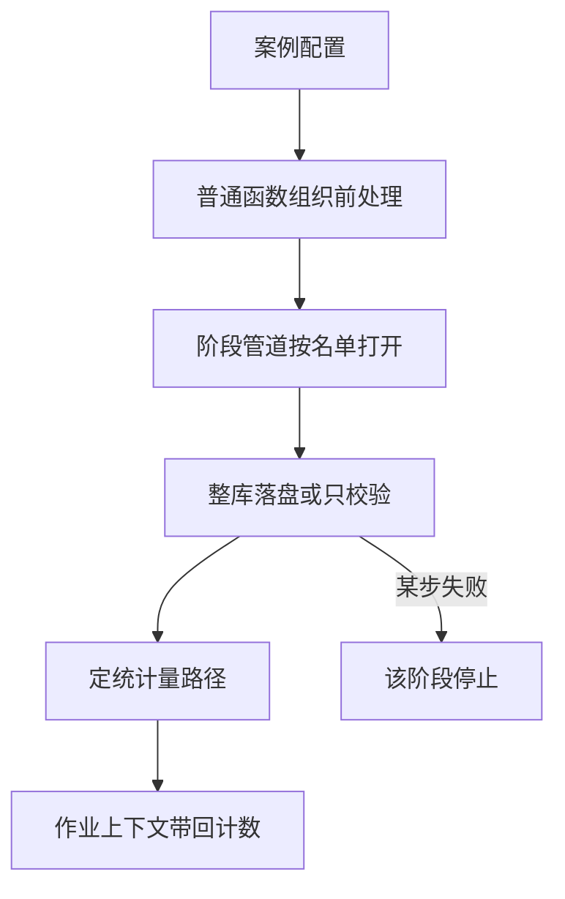

### 2.3 业务状态机

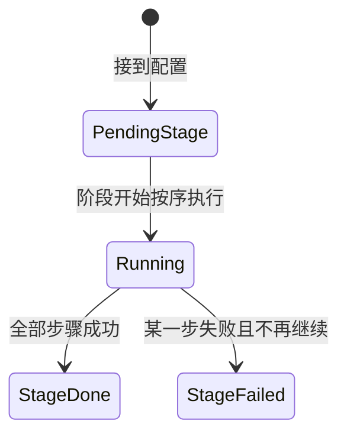

### 2.4 状态值说明

| 中文含义 | 标识 | 业务说明 |
| --- | --- | --- |
| 待执行 | `PendingStage` | 已装配阶段盒子，尚未调用 |
| 执行中 | `Running` | 正在按顺序 `ctx = step(ctx)` |
| 阶段完成 | `StageDone` | 物化计数和统计量路径已进入上下文 |
| 阶段失败 | `StageFailed` | 失败步骤名可被开车层记入摘要 |

### 2.5 功能点清单

1. 阶段盒子按顺序执行内部步骤
    1.1 一步失败则该阶段停止
2. recipe 声明可见的 pre 阶段
    2.1 阶段管道只打开配置声明的阶段

### 2.6 功能点详解

#### 1. 阶段盒子按顺序执行内部步骤

- 名字和可调用步骤列表进去，执行时只做一件事：把上下文交给下一步。
- 步骤不必继承框架基类。上下文可以是作业或单样本映射，不要求继承基类。

##### 1.1 一步失败则该阶段停止

- 第二步抛错时不调用后续步骤。失败带阶段名和步骤名，供运行摘要使用。

#### 2. recipe 声明可见的 pre 阶段

物理训练恢复同时重建独立 DataLoader 的索引随机流：历史检查点无独立生成器状态时，按原种子和已完成轮次重放同一 DataLoader 的索引消耗，不读样本、不更新模型。修复 NASA Transolver 恢复后第二轮洗牌重置；正常连续训练保持原算术和顺序。


现行阶段名 rawprep。公开步骤提供业务数据句柄和返回值，recipe 负责显式顺序与参数选择。原始处理分开统计和清单发布；部分失败只保留已提交结果。map_fields 接受具名只读数组，声明输出逻辑名、entity_like、分量、单位和物理状态；跨来源实体不能隐式对齐，筛选同时更新组内字段及身份。

准备状态依次绑定字段、冻结变换、登记在线采样/拼批、验证并发布；训练状态依次装配模型、目标、优化、评价和恢复后执行。后处理按登记步骤交接，物理路线逐样本运行，保留模型完整预测策略和部分交付。检查模式不构造成功产物。兼容 workflow 共用这些步骤，新模板不调用整段包装。


- recipe 显式打开 Dataset、登记读取到编码的业务步骤、触发执行和统计。循环封装在 run，用户不写 build 或 Stage。
- 新入口从 paths.datasets 读取各分片的完整路径；支持变量插值和独立目录。统计保存在训练分片内，产物 manifest 是训练读盘入口；旧 pre.output.dir 与 preprocessed 拼接仅作为底层兼容，不再出现在模板。

##### 2.1 阶段管道只打开配置声明的阶段

- `pipeline.stages` 列出本次打开的阶段名。未列出的阶段不构造、不执行。默认案例声明 rawprep、trainprep、train、post；可显式选择已有输入支持的阶段，独立训练消费已经交付的准备引用。

---

## 三、项目准备、模型设置与训练

### 3.1 背景与定位

原始数据资产可供多个项目复用，而模型需要的归一化、采样和学习目标会随实验改变。应用以 rawprep、trainprep、model、train、post 聚合相邻业务：避免把业务拆成大量原子能力转调文件，也避免把模型配置混入原始数据处理。旧只读入口继续可用，但不再产生训练占位标记。

### 3.2 核心业务操作流程图

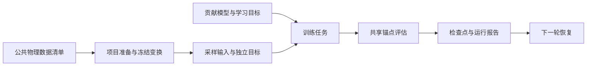

### 3.3 业务状态机

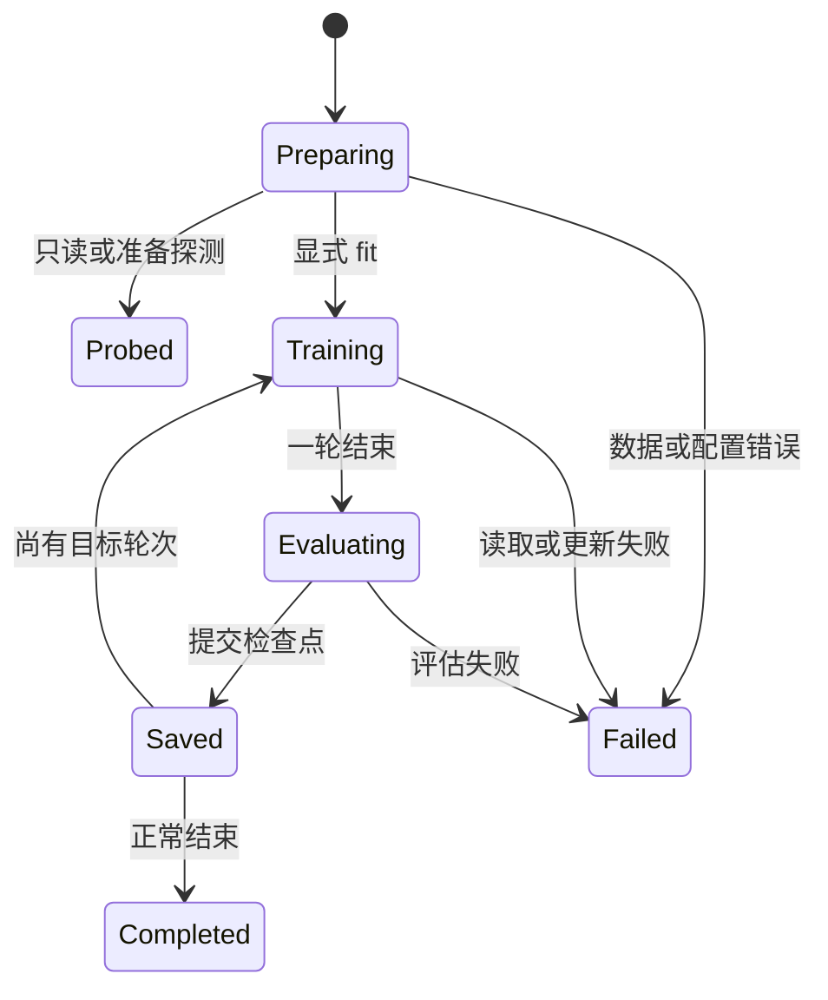

### 3.4 状态值说明

Preparing 校验清单和空间状态；Probed 只返回探测结果；Training 组织有效更新；Evaluating 使用固定采样；Saved 表示检查点成功提交；Completed 写出 last；Failed 交由现有会话报告，不能发布完整成功结果。以上描述执行阶段，不新增通用持久状态系统。

### 3.5 功能点清单

1. 项目数据准备
2. 模型与学习目标设置
3. 训练任务与恢复
4. 独立评估、锚点保存与完整网格回贴
5. 公共网格资产关联

### 3.6 功能点详解

#### 1. 项目数据准备

外流点场准备按具名域组织位置、特征、目标、表面几何和可选样本工况；同一索引同时选择特征、真值和实体身份。几何按样本固定，训练查询按轮次选择，评价保留全部点。真值不进入模型输入，工况使用独立全局入口。准备版本二引用既有物理清单，不改写源数据，也不要求声明图拓扑。

物理清单可以来自项目共享数据。清单内统计的相对路径按清单位置解析；独立准备不重新读取原始网格。归一化物化与本次分片只写本任务准备输出，不改变共享物理内容；历史准备只判断现行记录能否导入，计算按当前平台配置进行。

来源具有网格或可重建 connectivity 时，平台物理清单同时索引逐场 PT、VTKHDF、实体
身份及域到网格的映射。trainprep 可选拓扑绑定按 PT 原点 ID 对齐 VTKHDF 坐标，从真实
单元派生边，并保存可删除重建的摘要缓存；筛选后的诱导子图、核心分区和 halo 都属于
本次准备，不写回共享数据。核心分区按训练和推理角色缓存，缓存键包含当前核心块与
halo 预算；预算不写入准备冻结声明，改变后从平台资产重建。缺网格、身份重复/越界或
坐标不一致时在准备阶段拒绝。

公共物理路径统一打开数据、冻结变换和调用模型输入准备。原始来源只决定物理数据的解释；采样、输入拼接及专用缓存由模型组件承担。NASA 可直接从 HDF5 生成完整物理 PT，原 NPY 参考入口保留。

逐点监督装配通过数据组件的公开读取与描述消费分块，交付数据摘要、字段、变换、模型及采样声明；已导入的现行准备按当前平台参数计算，不因这些声明不同拒绝。训练以样本为计算单位，验证遍历全部块，分别记录样本数与元素数。

准备分为打开数据、物理规则、冻结归一化、配置采样、配置拼批和全分片校验。可选 `trainprep.split` 在打开清单后先按执行范围收窄样本，再重划 train/test/eval，不改物理清单文件；无该键时保持原划分，只要求训练分片非空，评估分片可空。新发布的准备记录固定写出 train/test/eval 三个切片的名单、人数和方法/种子，空切片人数为 0；旧记录不改字节，阅读时按已有 `partitions`/`split` 补齐缺的切片。训练按 `train.training_split` 取其中一个切片开训，默认训练集；评估和写出仍用该准备里的 test/eval。推理样本目录读准备记录里的切片，不回退到源清单的官方分片。持久化交付记录清单及实际文件内容摘要、冻结变换、准备真正消费的输入声明、组件路径以及这次生效的分片名单。新准备记录的 `declarations` 只写字段角色、归一化相关声明、数据规格和几何/域采样方法，不得写入模型页采样预算（几何 `max_points`、超节点、域锚点点数）或训练批次。训练消费只检查记录可读且为现行 `version=2`、摘要完整，然后套用记录里的清单、统计和物化场，按当前平台与 core 参数组计算；不重读原统计文件，也不把检查时的采样冻结为所有轮次的数据。字段角色、数据规格、采样方法或模型声明不同不能拒绝 consume、模型检查、开训、推理预检和结构跟踪。缺键、条件文件路径改写和额外 `split` 不单独报冲突。评估分片为空不把缺 test 当成准备失败；训练时关闭评估可继续，显式启用而所选分片为空则在更新前拒绝。每一步只校验自己的输入：准备验绑定清单能否做准备，模型验当前参数能否组模型并读一份数据做前向，开训验所选准备能否导入。

物理清单没有独立统计文件时，Z-score 可从训练分片按实际字段累计总体均值和标准差，条件字段按样本累计；有明确统计来源时仍严格消费其键，缺键不会回退。冻结记录保留训练身份，推理不重算统计。


trainprep 解析一次清单，逐样本读盘，统一标量通道，按 `trainprep.physical_rules.zero_fields` 在物理空间显式派生零距离。probe 保持只读，prepare 同时返回物理、归一化和采样视图。坐标共用边界，压力、速度、距离采用冻结统计，法向保持。几何来源显式绑定，超节点引用几何点；命名域 anchor/query 分别联动坐标、特征及目标；标准场独立复制为监督目标。支持独立可复现随机流；官方案例选用全局随机流，保留官方采样顺序与推进方式。

默认新任务打开显式物化，保存全分辨率归一化张量与独立清单；关闭后只保留版本化方法记录。新归一化记录版本 2 固定官方 shift/scale 运算顺序及同系数反变换。平台检查与结构跟踪要求 version=2；普通 Python 研究入口仍可按原科学合同消费旧 version=1 准备并恢复旧检查点。新逐样本物理流程使用带 `physical_fields` 身份的 version=2，额外冻结归一化摘要、准备函数来源、外部输入及分片，不改变采样和训练算术。原生锚点与逐样本物理准备按记录身份选择各自消费链，不能只改版本数字绕过校验。页面把统一空间勾选写成既有 `method: coordinate`，方法只映射到 `[0, 1]`；场上 `scale` 是归一化之后的附加放大，缺省 1，AB-UPT 官方案例坐标预填 1000。归一化输入复用已导入记录的统计与物化场，反变换不依赖原统计文件。原始清单不被覆盖，新版本失败保留旧版本。`version=1` 旧准备须按现行数据准备重新生成；现行 `version=2` 含 `physical_fields` 可导入。

#### 2. 模型与学习目标设置

model 接收 recipe 注入的贡献构造器。`model.data_specs` 有序声明域、预测字段、特征和条件；输出为具名 anchor/query 场，不再固定五键和四/七通道头。默认单样本，固定布局允许多样本；不填充变长域点。初始权重和冻结仍属于模型设置。学习目标仅由 `model.supervision` 显式绑定预测、目标、反变换字段、权重及比较方法；默认两条 anchor 均方误差，权重各一。query 监督必须显式绑定真值，禁止广播和自动使用目标作为特征。旧配置不兼容。


#### 3. 训练任务与恢复

物理训练可显式注入优化器与调度器构造函数；两者必须同时提供，调度构造接收每轮实际更新数。未注入沿用原行为。构造来源进入恢复身份，组合优化状态与轮次调度一起保存，不因短训压缩日程。

现行外流训练将所选 MSE、MAE、相对 L2 交给评价执行，普通与重复评价使用同一选择；每轮报告只包含实际计算项。未配置保持原三项，清空仅保留评估 Loss。关闭评估不消费评估分片；显式启用而该分片为空时在更新前拒绝。指标选择属于观察参数，不改变学习目标或检查点选优依据，修改选择不阻挡恢复；原训练与历史报告不回写。

五组交叉实验共用物理数据工作流，一个 example 对应一个模型实例。该路径目前使用批次一、零读取子进程、fp32，并要求关闭训练期评价，训练后独立评价完整点场。训练循环无数据集或模型名称分支，优化与调度来自各模型配置；不提供多实例执行管理。

外流共享入口可选择锚点监督或逐点监督装配。后者使用独立训练数据生成器、标准化均方误差、逐轮余弦及验证选优，参数更新仍由公共训练循环执行。恢复重新构建独立生成器，与参考恢复规则保持一致；不承诺恢复轨迹等于不中断轨迹。

train 默认两轮、批次一、零读取子进程，使用自动选择设备、Lion、5% 预热余弦到 `1e-6`、裁剪和 EMA。开训切片默认 `train`，须是准备记录里有样本的 train/test/eval 之一。优化器与调度可换、参数可改。启动前展开模型/优化/采样/检查点默认值并联合校验，缺项不启动。设备默认 `auto` 按 CUDA/MPS/CPU 选择，点名设备不可用失败；AB-UPT 的实际支持以设备验收为准。评估登记官方 test，另有 test_repeat：一百条各十次、独立采样，长度为 1000；两者都带归一化分项，best 仍只看测试总分。自定义步骤替换前向与损失计算，循环仍独占更新。公开装配 `configure_evaluation(job, step=..., callbacks=...)` 注入步骤与周期回调，recipe 可以逐项调整，训练循环不进入 recipe。检查点保存模型、优化器、调度、随机状态、已启用缩放器和兼容契约；普通 latest/best/last 都包含恢复所需 EMA 状态，每十轮额外发布 ema_latest 权重。恒定调度允许更改目标轮数；预热余弦恢复必须保持计划总轮数，设备和日志频率可改；更新间隔默认为空，不按更新打进度。每个轮次结束覆盖写入训练报告，检查模式不写；未开评估时最优值写成空，避免指标读取失败。整次结束再写入检查点路径。新检查点 version=2 同时冻结域/字段顺序、特征、条件和准备绑定。旧版本及模型、数据、采样、变换等语义冲突拒绝。报告和检查点通过现有会话公开桥接提交，不创建新运行目录。训练结束写出预测和网格默认关闭，与训练期评价分开；打开后在成功结束时按所选分片调用与独立推理相同的锚点保存正文，写入本次运行数据目录，不创建推理批次，也不打开已锁定的训练期评价。只开网格、不开预测时拒绝。写出只消费现行 version=2 准备（含 `physical_fields`），不得再走 `version=1` 旧物理接口；缺版本或旧记录拒绝并要求按现行数据准备重新生成。

#### 4. 独立评估、锚点保存与完整网格回贴

公共物理后处理消费检查点及其冻结准备，在显式样本名单上交付具名物理预测、真值、点身份和来源协议。各模型独立运行结果可按域比较，报告按实际点数累计。预测或比较失败保留已提交样本并标记失败，不能发布完整成功。

逐点表面场支持全测试推理，默认随机一个样本导出，可指定或选择全部。预测复用必须核验权重、冻结准备及完整块摘要。预测、评估、数值结果和网格独立登记，失败保留已提交文件，整体不得冒充成功。

后处理保留既有成功输出字段，并分别报告 evaluation、predictions、mesh 的执行状态、完成样本数、已提交路径及错误身份。状态为 pending/running/succeeded/failed/skipped：关闭的分支为 skipped；首错之后未执行的分支保持 pending；任一要求的交付失败，整体保持 failed。每个样本完成后才增加计数；样本中途失败时保留已经成功提交的目录、张量或网格路径，不扫描旧文件推测本次交付。具名张量与同目录点云为一个原子目录提交；兼容张量、兼容点云和完整网格分别记录。

查询入口按模型实际设备交接锚点、坐标与可选特征，保持精度门禁。沿用同进程执行和既有随机顺序，不新增设备专用流程。独立补跑只打开失败分支，显式指向已有检查点；不重训、不自动覆盖、不跳过已有目标。

业务装配消费独立参数副本，不再向运行器写回整份内部配置。准备引用、实际数据和恢复检查点通过既有交付记录，用户配置保持启动时的结构与内容。旧外流路径解析保留兼容入口，不识别案例五段分组；新案例自行组织参数。

训练自动发布 training-protocol.json，后处理自动发布 comparison-protocol.json：记录实际数据内容摘要、分片、归一化、结构、初始化、采样、精度、设备、源码与入口。后处理记录实际几何、锚点及查询内容摘要；已失败运行保留已消费输入的记录。旧检查点无初始化证据时保留未知，不从路径或种子补造。外部全局条件与几何条件文件按内容取摘要，同路径替换也会改变数据身份。比较判定由验收工具执行，application 不依赖参考框架。

post 对显式加载的模型装配共享评估能力，训练周期直接使用同一原子实现。每次前向同时计算归一化总分、按权重计入的分项和反归一化六项物理指标，逐样本平均；分项与物理指标分开。零范数相对 L2 跳过并记录数量。结束或失败都恢复模型模式及随机流。仅声明监督项对应的预测、真值与反变换进入评估，未标注 query 不计算误差；anchor/query 指标分开命名。指标代表声明点集，不自动代表完整网格误差。

未写检查点路径时使用本次运行目录的 `last`；也可写 `best` / `latest` 或显式路径。只恢复模型权重，优化器与训练进度保持不动。模型、准备或归一化与检查点不一致则拒绝。测试分片复用训练的读盘和冻结变换。独立后处理从配置种子开始重建模型并沿全局流采样，锚点与网格分支隔离随机状态，结束恢复调用方状态；仍可显式选择旧的按样本独立流。打开保存时每个测试样本写入物理压力、物理速度和两域归一化锚点坐标；打开点云时另写两个带独立顶点单元的 `.vtp` 点云。预测还按测试顺序交付兼容的逐样本张量包和点云路径，编号由流程生成，不要求用户预填。检查模式只核对接得上，不写预测、点云或网格。

打开查询后按测试下标定位设计号和原始网格，默认只处理第 0 辆，下标越界或缺少原始文件拒绝。几何和锚点与训练评估准备一致，全部原始顶点当分块查询坐标；坐标变换数值不变，越界只放宽范围门禁。查询预测覆盖所有原始顶点；表面提取移除未被面单元引用的顶点，交付按提取后的点数校验，并保留原始点与单元身份。成品写到数据目录 `predictions/mesh_vtk/`，文件名为 `sample_XXXX_surface.vtp` 与 `sample_XXXX_volume.vtu`，字段名与模版一致。已写出的样本保留，部分失败不得报成完整成功。不读锚点查询张量。仅 eval/no_grad 使用缓存，退出或失败即释放。评估、保存、点云和查询按配置开关并存，至少打开一路。recipe 显式登记组件与交付步骤，运行报告仍由唯一 writer 提交。锁定 ShapeNet-Car 配置的 CPU 数值对照与扩展配置的功能验收分别记录，不外推到任意硬件或模型配置。

#### 5. 公共网格资产关联

rawprep 显式启用 VTKHDF 时，原拓扑、点/单元身份与具名场和 PT 一起提交。筛选结果通过实体映射关联，未选实体回贴为 NaN；失败不发布完整新资产。默认 PT 训练链无需启用此功能。


平台公开检查由 `aero_cfd/inspection.py:execute` 提供，task 传入捕获配置、固定输入与输出目录，门面不读取服务数据库或导入 recipe。支持案例能力、数据集检查、准备兼容校验、真实模型跟踪及严格差值。模型跟踪只负责现行准备取样和组网，把网络与输入交给检查进程；可视化模块按平台两档官方参数出图，检查门面不写 HTML、不设 TorchVista 参数。五段配置仅在边界转为既有业务参数。原始提取容器编译到既有单样本字段路由，不拼接不同实体归属；配置格式在阶段级选择 PT/Zarr。平台公开交接是 `inputs.trainprep.dataset`、`inputs.train.preparation`、`inputs.infer.checkpoint` 与 `inputs.post.results`。检查门面仍消费 `bind_inputs` 注入的内部旧键 `train.manifest` / `train.preparation` / `post.checkpoint`，缺清单时错误仍可能写 `train.manifest`。训练设置预检不要求准备记录；正式开训仍要已有准备。模型跟踪缺少清单和准备记录时先读公共 `inputs.*`，再回退内部旧键，不抛出无位置的键错误。现行准备记录为 version=2，原生锚点与带 `physical_fields` 身份的逐样本物理记录分别沿训练本身的消费链检查和跟踪。平台遇到旧 version=1 记录提示重新准备；Python 原研究入口可继续按原合同使用。物理接口拒绝没有对应身份的原生锚点准备，避免混淆两种模型输入约定。

平台配置能力由检查门面返回 `training_constraints`、`parameter_descriptors`、`losses` 和 `sampling`：共享物理工作流固定单样本、零读取子进程、fp32 与独立后处理评价；Transolver 保持逐轮余弦、AdamW 和固定等权 MSE，采样能力带出其抽稀步长只读约束，无 supervision 时按准备域目标补固定损失行供页面展示，不写回用户配置。前端只消费这些声明，不重新推断算法支持范围。旧默认案例可以由 task 明确指定可信 `component_provider` 使用既有案例默认加载器，避免历史缺省配置不能打开。

平台独立推理默认同时打开点云与 VTK 网格化导出，二者都写入预测与真值。`export_pointcloud` 调用 ability 写出锚点点云；`export_mesh`（旧键 `export_vtk` 只表示网格化）按数据集适配：有原始 VTK/VTKHDF 来源文件时查询回贴，已绑定连接关系路径时走 `comparison_mesh`。网格化是否可用只认清单来源文件名或配置里已经绑定的连接关系路径；NASA 只有槽位、没有路径则不可用。原始处理 `vtkhdf` 是额外写出，不单独让网格化可勾。页面置灰和装配跳过共用这一判断。旧配置只给 `export_vtk` 时，该键仍同时开关两种导出，别名由契约包解释。缺原始数据根、源网格或点数对不上时该样本失败，清单 `vtk` 分点云与网格化记录原因，跳过网格化不得把已写出的点云标成未导出，也不得把整批标成功。训练结束写出网格仍默认关闭，不因推理默认改写。

共享物理工作流的 `post.export_vtk` 是旧后处理键，不是推理页拆开后的点云/网格化。它现在控制实际网格导出：关闭时仅交付既有预测张量与清单；打开时通过数据集公开 `comparison_mesh` 取得真实来源拓扑，以原点身份回贴预测及真值，逐域写入样本目录 `surface.vtp` / `volume.vtu`。体单元保持原类型，表面保留面单元；不补造顶点单元。缺少有效拓扑时网格阶段失败，已提交预测仍保留且总后处理不冒充完整成功。样本清单 `meshes` 记录相对路径、数量、字段及单位，场名为 `<domain>.<field>.prediction/truth`，并保存 `original_point_id` 和 `original_cell_id`。只保留顶点都有真实预测的单元，缺失区域不补零。

`dataset.coordinate_space: {id, unit}` 可显式声明坐标空间与坐标单位，二者均须为非空字符串，不猜测默认值、不转换坐标。post 在域清单和网格清单保存 `coordinate_space`，网格 VTK FieldData 写单值字符串 `coordinate_space_id`、`coordinate_space_unit`；无声明时清单为 null、VTK 不写这些字段。该声明属于来源意图，不是归一化统计。历史产物不回写。

## 四、参数化 PDE 工作流

### 4.1 背景与定位

面向参数化 PDE 的模型研究，装配独立生成的物理数据、模型准备、原生 PyTorch 训练计算和完整预测。不解释具体方程或模型内部算法，不承担数据生成及 Web 界面。

### 4.2 核心业务操作流程图


### 4.3 业务状态机

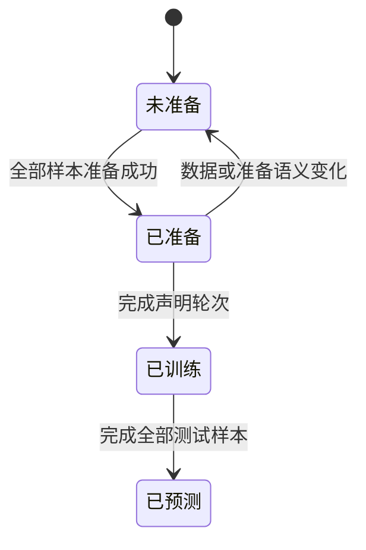

### 4.4 状态值说明

未准备表示缺少完整匹配的准备记录；已准备可启动训练；已训练具有检查点；已预测表示完整交付。
异常不推进成功状态，后处理可记录部分失败及已输出样本。

### 4.5 功能点清单

1. 物理数据校验与准备
2. 原生训练步装配及恢复
3. 独立预测与评价

### 4.6 功能点详解

#### 1. 物理数据校验与准备

通过注入的数据组件读取身份明确的物理场，通过模型公开组件准备点集和样条资产。样本执行由既有运行机制承担，首错停止并保留已提交摘要。
冻结记录保留数据内容、统计和物化场；训练消费只检查能否导入，按当前平台参数计算，不用整份配置或冻结声明挡前进。超节点与点数属于模型设置，不写入准备冻结。

#### 2. 原生训练步装配及恢复

用户可选内置案例计算或普通 PyTorch 函数。现有循环负责清梯度、反向、更新和检查点；整轮求和与逐实例更新明确区分。整轮求和按实例顺序累计完整损失图，再一次反向传播和更新；不能用每实例反传再累积梯度替代原算术顺序。日志明确整轮求和或实例均值，用户step仍接收单实例。
恢复校验模型、数据、训练目标与优化协议；延长轮次不改变这些条件。数学修正不兼容原仓库历史权重。

#### 3. 独立预测与评价

重新打开准备和检查点，按完整测试名单输出场及逐实例误差。预测保留坐标与映射，后处理不生成训练数据或重新随机抽样。整体时空相对L2与先逐时间计算空间相对L2再对时间/实例平均分别命名，后者分母加固定1e-12。不能用不同归约口径宣称精度改善。
预测失败保留已交付样本并标明部分失败；全部完成后才发布完整预测清单。原仓库精度对照在独立验证流程执行。

## 五、独立外流推理与结果消费

### 5.1 背景与定位

研究人员需要用固定检查点处理选定样本，不重复训练，并把已完成结果交给后处理。业务步骤关联准备、权重、字段与输出，原子能力负责计算，通用运行器负责样本循环。批次排队、设备占用和任务版本属于宿主，不由本模块管理。历史 post 计算接口保留，`post.physical.open_post` 继续提供给未改写的冻结脚本；新后处理读取固定结果，不因打开结果而恢复模型。 原生后处理缺少固定结果时拒绝；仅明确设置历史预测兼容模式才允许调用旧计算流程，该模式用于已有算术对照，不由新页面自动开启。

### 5.2 核心业务操作流程图

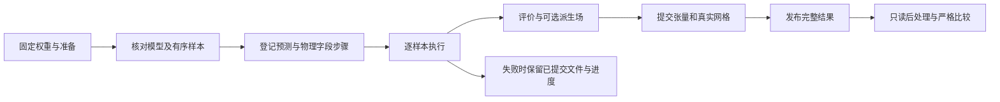

### 5.3 业务状态机

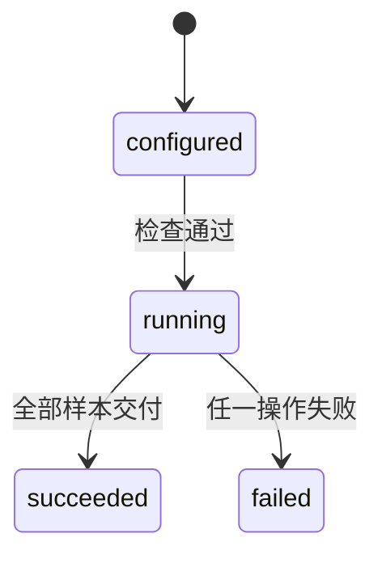

### 5.4 状态值说明

- configured：步骤已登记，模型尚未执行。
- running：显示当前操作、完成样本数及已提交文件。
- succeeded：所有选定样本完成，可读取总体指标。
- failed：保留已经提交的文件及错误，不发布完整成功清单。

### 5.5 功能点清单

1. 固定输入与模型兼容检查
2. 可组合的无梯度推理步骤
3. 派生字段及完整输出
4. 固定结果读取与严格比较

### 5.6 功能点详解

#### 1. 固定输入与模型兼容检查

检查点必须完整且版本有效，准备摘要、样本分片和实际来源一致。只读检查返回轻量元信息，不将模型权重交给管理页面。与检查点 `effective_config` 只比权重结构（`model.parameters`）、数据规格、字段角色和采样方法；模型页采样点数、超节点和锚点数量不同不能判不兼容，也不要求重跑 trainprep。权重结构或数据规格对不上时不能恢复该检查点。运行继续核验模型描述和数据内容，缺失或变化明确失败。仅恢复权重，不恢复优化器。推理设备来自独立选择，不写回训练配置。

#### 2. 可组合的无梯度推理步骤

点流预测固定每样本几何，按声明查询排列分块并回贴，具名输出只做一次物理反变换。显式推理准备优先于训练引用，空样本选择表示当前分片全部样本。网格交付优先消费物理清单中的 VTKHDF，保留源点与单元身份，不要求重新打开原始来源；旧数据适配器回读仍作为未交付物理网格时的路径。

恢复、预测、物理输出、评价、保存和网格交付按调用者登记的顺序执行。模型只恢复一次；样本按声明顺序共用随机流，不逐样本重新设种子。 显式指定的准备引用必须完整验证；现行锚点推理复用训练消费入口恢复冻结变换、分片与采样组件，不重新拟合归一化，也不要求原统计文件仍存在。缺失或变化的准备不能静默回退到重新准备。AB-UPT 保留查询缓存，Transolver 保留完整状态汇总与解码。模型已返回物理量时不重复反归一化。历史锚点接口保留原评价和保存遍历；完整物理路径使用公共样本执行器。检查模式不写结果。

#### 3. 派生字段及完整输出

用户普通函数可在物理输出之后、保存之前增加派生字段。必须绑定同一现有域，声明分量和单位；未知单位明确为空，不猜测。当前完整物理交付支持点场，cell 扩展明确拒绝。形状、有限值和实体覆盖不合法时不能提交样本清单。成功数组随原实体 ID 保存、可读回并进入真实网格，扩展函数来源与参数进入协议。中途失败不抹去已有文件。

原生推理的字段选择发生在物理输出及派生登记之后、评价与保存之前。分量选择约束评价范围，保存以原始完整字段为单位保留向量语义与选择声明。物理量描述优先读取模型输出分量及数据组件元信息，缺失分量声明报错，不按字段名称猜测。

#### 4. 固定结果读取与严格比较

结果索引只保存引用、指标和协议，不保存数组。新后处理校验固定结果及成员后直接消费，即使源检查点已离线也不重新推理。比较要求至少两份完整物理结果，准备、来源、样本顺序、字段、单位和执行口径一致。通用锚点模板的指标对应采样锚点，完整网格查询单独交付原始顶点结果，二者实体集合分开声明；仅所选域写入样本目录和固定文件清单。 历史全元素累计指标使用逐样本累计量复核；新版指标表另按逐样本物理指标计算等权 Mean、Median、P90、Max，两种口径分开命名。缺证据的历史锚点结果返回证据不足；失败、部分交付或不兼容结果不能参与完整排名。

新版轻量结果无需存在预测张量即可列出指标。结果记录逐样本身份、字段、所选指标及真实分项计时；新旧版本保持可读。跨检查点比较按分片分别核对范围、算法和来源，样本等权统计与历史累计值分别命名。固定指标可导出CSV或Excel；保存数组后的重新评价始终消费原结果，不隐式恢复模型。

Checkpoint 查看模式在分片统计之外提供全部分片的逐样本等权统计，保留全批预期样本数，整片缺失不能冒充完整结果。样本查看模式读取一个固定检查点下的逐样本值，不做聚合；性能指标仅使用已登记的预测计时，缺失时提供原因。两种视图共用物理量与指标组合声明，跨域同名字段保留身份，不能在导出中相互覆盖。

导出可接收表格字段配置。Checkpoint 模式将多个物理量—指标及多种聚合方式展开成列，样本模式保留分片与样本并输出所选指标原值。CSV 交付当前表格，Excel 以当前表格为首表并保留原统计、指标明细与来源；这些操作只组织固定结果，不修改清单或重新预测。既有未指定视图的导出和分片统计保持兼容。

## 六、固定推理结果后处理

### 6.1 背景与定位

业务层绑定结果来源、物理域、字段和分量，计算与模型推理分开。

### 6.2 核心业务操作流程图


### 6.3 业务状态机

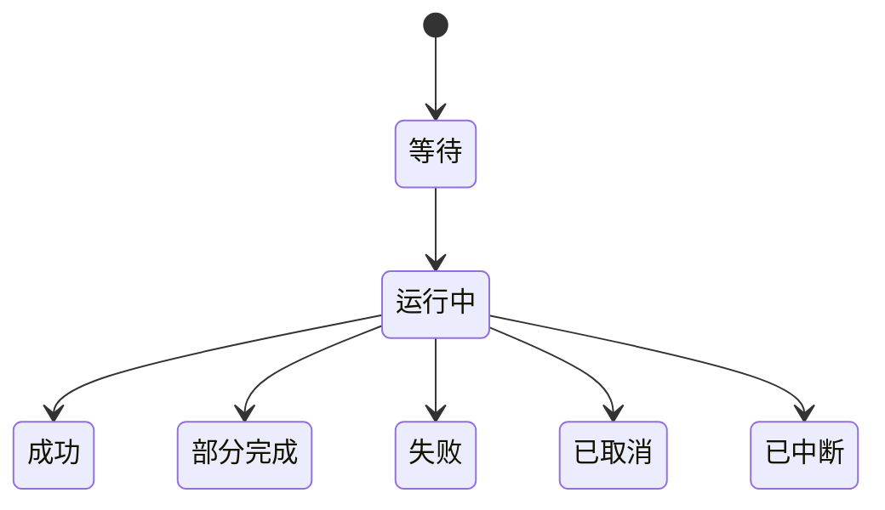

### 6.4 状态值说明

等待表示固定请求已提交；运行中只采用实际完成数量；成功要求全部交付；部分完成保留成功项并披露失败项；取消不发布完整成功；中断不自动重新执行。

### 6.5 功能点清单

1. 来源固定与字段绑定。
2. 实体与有效性检查。
3. 逐样本交付与显式导出。

### 6.6 功能点详解

#### 1. 来源固定与字段绑定

按已保存清单核对成员修订，执行前后验证内容；只读预测、真值与实体声明。缺失字段返回失败行，不猜测历史数据。

#### 2. 实体与有效性检查

形状、实体数量、ID及明确有效性声明必须一致。未声明的非有限值、缺少真值、无有效实体分别报错。零真值范数的相对误差、恒定真值的R²显示不可定义，不填零。

#### 3. 逐样本交付与显式导出

逐样本释放数组并保留成功行；取消和部分失败不冒充完整成功。CSV/JSON只在用户导出时生成，包含完整数值、来源、字段、单位、状态和原因。

后处理目录的历史张量分量通过 `describe_result_fields` 在隔离进程中只读头部获取；使用 FakeTensorMode 保留形状而不加载场数组。不能根据缺失的旧指标记录猜成标量。缺真值或形状不符保留文件浏览并禁用该结果重新评价。

## 七、耦合物理场研究装配

### 7.1 背景与定位

面向多个独立训练场组成的生成系统。领域层绑定场身份、来源、模型与交接；计算仍由能力承担，不要求普通用户组件继承共同协议。不加入平台案例登记。

### 7.2 核心业务操作流程图


### 7.3 业务状态机

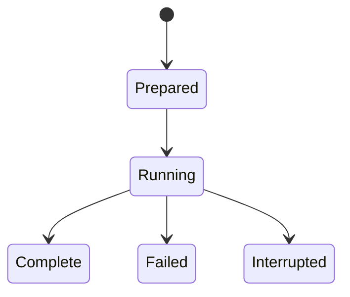

### 7.4 状态值说明

准备完成 Prepared 固定输入；运行中 Running 尚未交付；完成 Complete 已保存实际结果；失败 Failed 和中断 Interrupted 不能算完整成功。

### 7.5 功能点清单

1. 来源准备与分场数据。
2. 独立场训练。
3. 固定权重组与生成。
4. 固定结果分析。

### 7.6 功能点详解

#### 1. 来源准备与分场数据

来源只读，压缩包到独立处理目录。准备冻结样本、物理时间、布局、变换与文件摘要；独立训练允许不同样本，耦合评价按发布数组行与帧配对，缺少额外物理 ID 的限制须披露。

#### 2. 独立场训练

每场独立网络、优化器、调度、EMA 和检查点；按有效更新次数停止。恢复核对目标预算、变换及游标。验证隔离随机流，单场选优和最终耦合评价分开。

#### 3. 固定权重组与生成

权重组冻结各场确切文件摘要；更新次数可不同，准备身份必须相同。场顺序由研究脚本指定，同步或顺序积分由能力执行。已知条件单场生成与耦合生成分别保存。

#### 4. 固定结果分析

分场保存不同形状的预测与真值，记录来源并校验数组摘要。后处理无需模型；原始输出保留，参考平滑和 mask 为独立派生结果；分量指标输出 CSV，并输出逐物理帧曲线。

## 八、控制轨迹研究装配

### 8.1 背景与定位

面向带动作输入和安全约束的轨迹控制研究。物理轨迹、网络预测和动作执行后的响应分别交接；应用不认识某个扩散网络的内部结构，不复用耦合物理场的固定五维结果。

### 8.2 核心业务操作流程图


### 8.3 业务状态机

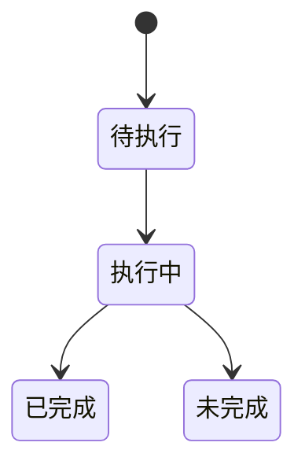

### 8.4 状态值说明

待执行表示仅有参数；执行中表示计算尚未交付；已完成要求对应步骤产物完整；预算耗尽、异常和数据不符均为未完成，不能据此宣称论文达标。

### 8.5 功能点清单

1. 物理数据与模型准备

2. 迭代训练与明确权重

3. 控制结果与独立评价


### 8.6 功能点详解


#### 1. 物理数据与模型准备

来源读取器和变换函数显式注入，保留 train/cal/test；准备记录绑定物理来源和内容摘要。已有目录不覆盖，坏值、错维度或跨案例输入停止下游。


#### 2. 迭代训练与明确权重

接收构造器、目标、数据流、优化器和可选调度/平均权重；检查点保存模型、优化器、随机流、游标及算法状态。恢复先检查阶段和模型契约；不同准备不得继续同一训练。普通采样与参数适配是两种显式操作。


#### 3. 控制结果与独立评价

固定保存身份、物理目标、生成动作、扩散预测、真实响应、有效权重摘要和校准值。Tokamak两类目标分别存放。求解失败不能用数据集真值替代响应。post只读固定数组；派生字段必须声明单位、轴、有效性和共同样本身份。

## 九、时空场预测研究装配

### 9.1 背景与定位

时空场预测领域绑定轨迹身份、模型准备和固定物理结果；不解释具体小波或去噪模型内部算法。它与控制轨迹领域分别持有业务语义，共用数组保存与迭代训练机制。

### 9.2 核心业务操作流程图


### 9.3 业务状态机


### 9.4 状态值说明

已完成只表示所选步骤已交付完整产物；预算中断、参数冲突、数据变化和异常均为未完成。模型精度与论文复现结论独立说明。

### 9.5 功能点清单

1. 物理与准备交接

2. 迭代训练装配

3. 独立预测和固定评价
4. 可扩展固定窗口分析

### 9.6 功能点详解

#### 1. 物理与准备交接

物理数据保存状态、驱动力和样本身份；模型准备只生成训练变换数组，评价保持原始物理条件。准备记录变换来源与物理清单摘要。已有目录拒绝覆盖，失败时不发布完整清单。物理和准备文件放在数据目录，运行日志和检查点由 writer 独占。

#### 2. 迭代训练装配

训练装配支持可选evaluate回调与evaluate_every间隔；省略时保留现有checkpoint_every（默认500）的行为和返回值。指定间隔同时决定检查点触发频率，最终更新也触发回调；领域连接决定是否实际评价。

领域装配可透传局部更新选择，公共装配继续负责恢复、取消、记录和检查点。默认未选择扩展时保留旧迭代器调用参数；显式累积、精度与归约进入恢复合同，缩放器状态随检查点恢复。研究者不需要重写数据流或持久化逻辑。

按显式样本流和目标函数训练，复用已有更新循环。领域无关的迭代装配由 applications/base 提供，控制旧公开入口继续有效。优化器、调度器、EMA 的次序保持调用约定；取消在完整更新边界保存，不将部分更新作为可恢复状态。显式累积、归约、精度与有限轮次边界进入恢复合同；具体边界函数和局部策略的科学身份仍由领域调用方声明。更新目标非法或小于恢复进度时在加载实时模型前拒绝。

#### 3. 独立预测和固定评价

独立预测一次固定一份权重，交付预测、真值、驱动力与样本身份。派生字段必须声明单位和轴并保持样本数，不能覆盖基础字段。post 只读完整固定结果，逐分片调用选择的评价函数，重算时不加载模型或重新采样。
#### 4. 可扩展固定窗口分析

研究者分别传入读取、预测和分析普通函数，领域步骤逐窗口保存数组及身份清单。全部窗口成功后才发布完整结果；独立后处理只读取固定数组。派生函数的新增字段另存为新结果，禁止同名覆盖，保证原预测可追溯。训练可使用带更新计数的可恢复样本流，调度游标与排列一同保存。

## 训练 update 曲线与评估选择（2026-09-18）

训练装配将 `evaluation_fields`、`evaluation_metrics` 和 `evaluation_aggregate` 交给评价能力；报告保留 epoch 汇总并新增 update 粒度 `curves`。`validation_unit` 明确评估间隔按 epoch 或 update 解释，`test_repeat` 只用于重复测试采样。

## 2026-09-18 推理检查与物理数据交接修正

运行记录中的公共 `inputs.*` 配置可由 core 检查进程还原为仅供预检使用的业务视图，并生成独立的数据产物路径；检查不依赖 contrib 的配置装配器。NASA CRM 案例通过 `rawprep.physical.execute` 完成交付，使用 `RawDataset` 的分片和字段契约。分片重挂时，训练/验证与测试可拥有同名样本，目标分片优先选择对应来源记录，避免跨来源覆盖。

模型组件适配层必须公开 core 训练和推理装配所需的 `prepare_inputs`、`collate` 门面；算法内部可以继续使用 `prepare_sample` 等领域名称。旧测试若直接构造 `dataset.*` 或 `paths.*`，应先迁移为公共 `inputs.*`/`data_root`，不能恢复已废弃配置键。


## 十、具名网格场与轨迹装配

### 10.1 背景与定位

在参数化PDE和时空预测中新增公开连接入口，保留既有u/f流程。领域只约束实际消费参数，不要求研究组件继承统一接口。

### 10.2 核心业务操作流程图


### 10.3 业务状态机

本章无业务状态；持久结果只有完整交付后才可消费，失败由执行会话记录。

### 10.4 状态值说明

本章无业务状态，不增加全仓协议或平台状态。

### 10.5 功能点清单

1. 物理准备和模型准备
2. 注入式训练
3. 独立预测与报告

### 10.6 功能点详解

#### 1. 物理准备和模型准备

物理步骤接收样本名单与读取函数，完整交付原网格、逐场PT、身份和相对清单。模型准备显式接收抽取、统计、转换与可选缓存函数，统计只看train；训练网格和邻域不写回物理来源。

#### 2. 注入式训练

接收普通模型、取批、目标函数、优化器和调度器，共用完整状态恢复与执行。检查点间隔可选，默认保持500次有效更新；目标是累计更新数，取消/限时保留可恢复状态。

#### 3. 独立预测与报告

固定结果包含物理预测、真值、身份、拓扑与网格引用。所有网格保存成功才发布完整清单。post仅读回这些结果，不依赖原始数据、检查点或模型，不静默重算预测。资产目录自包含，供Task复制及跨进程消费。


## 十一、地热研究装配

### 11.1 背景与定位

为双场研究提供数据冻结、预测与固定结果分析。专属发布格式和模型组合由调用方注入，core不依赖contrib。

### 11.2 核心业务操作流程图


### 11.3 业务状态机

本章无业务状态，函数调用成功返回结果，失败抛出明确异常。

### 11.4 状态值说明

仅完整交付表示所选步骤完成；异常与中断保留已有记录，不声明完整成功。科学精度另行评价。

### 11.5 功能点清单

1. 数据交接

2. 联合推理

3. 独立后处理

### 11.6 功能点详解

#### 1. 数据交接

校验后复制自包含来源与准备包，保留作者统计量及原始单位。校验摘要、缺文件、错身份或输出位于只读来源目录时失败，不重拟合统计量。

#### 2. 联合推理

分别执行压力与温度网络，反归一化后只用预测场计算井级输出，标签仅用于独立评价；缺少分支不交付完整预测。结果按例保存，保留物理残差。

#### 3. 独立后处理

读取固定清单、核对文件摘要后评价。扩展数组必须声明文件、摘要、单位和样本身份，下游真实读回统计，不重新调用网络。
