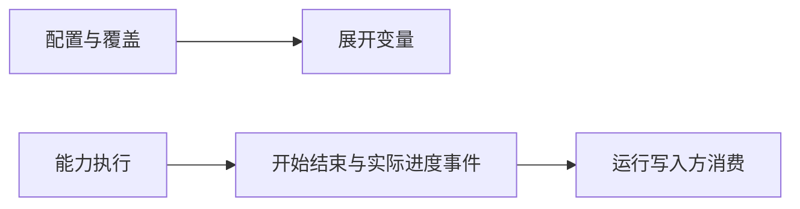

# 配置与事件基础设施

## 目录

- [一、配置与事件](#一配置与事件)
  - [1.1 背景与定位](#11-背景与定位)
  - [1.2 核心业务操作流程图](#12-核心业务操作流程图)
  - [1.3 业务状态机](#13-业务状态机)
  - [1.4 状态值说明](#14-状态值说明)
  - [1.5 功能点清单](#15-功能点清单)
  - [1.6 功能点详解](#16-功能点详解)

## 一、配置与事件

### 1.1 背景与定位

提供配置变量展开和不依赖业务的运行事件。基础设施不认识模型，不读取数据集，不创建运行文件。

### 1.2 核心业务操作流程图

### 1.3 业务状态机

本章无业务状态；配置解析返回映射，事件只观察一次调用。

### 1.4 状态值说明

本章无业务状态。事件开始、结束、失败与运行中不替代 run 的最终状态。

### 1.5 功能点清单

1. 配置插值
2. 能力执行观察

### 1.6 功能点详解

#### 1. 配置插值

组件采用全限定导入路径选择，未声明时沿用既有汽车组件；默认参数由选中的模型解释，避免另一模型的参数混入。配置中的数据根与运行根仍分别解析。

合并显式覆盖后展开 ${...} 引用；未知变量和循环引用直接拒绝。领域路径由脚本运行入口按配置文件解析。最终仅保存一份生效配置。

#### 2. 能力执行观察

计算项可携带来源、分片、样本、块和抽稀起点；异常保留这些身份。单元素跨步张量的内容摘要与同值连续张量一致，摘要不改变随机流。

样本上下文由调用方提供真实样本 ID 和分片下标；批次失败保留全部涉及样本，不猜测其中某一个失败。异常附带阶段、操作及身份，保留原异常类型与原因；退出后恢复外层上下文，不把数组值写入错误信息。

记录实际调用的开始、结束和耗时；能力输入只记录名称、形状等小型事实，不记录数组。长调用每十秒发送运行中事件，不虚构百分比；结束或异常后停止心跳线程。文件处理器由运行写入方集中管理。

能力事件继承运行入口设置的阶段，显示为 `[pre/字段提取/开始]` 等 `[阶段/能力/事件]` 格式，原子能力不依赖具体 recipe。后台心跳保留启动时的阶段与样本身份，异常退出恢复之前的上下文。没有阶段的独立调用保持 `[能力/事件]`，不默认归属 pre。事件携带能力、状态与阶段元信息，供写入方筛选摘要。
