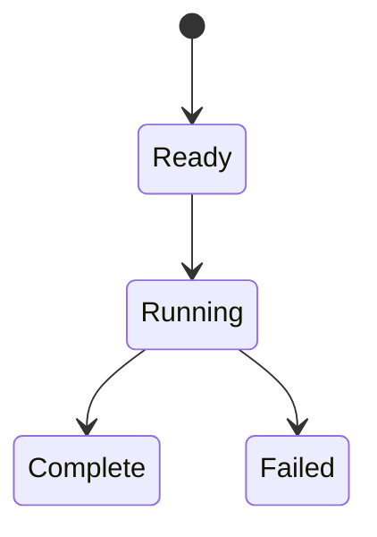
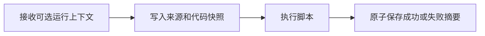

# 顺序执行与运行记录

## 目录

- [三、托管运行来源](#三托管运行来源)
  - [3.1 背景与定位](#31-背景与定位)
  - [3.2 核心业务操作流程图](#32-核心业务操作流程图)
  - [3.3 业务状态机](#33-业务状态机)
  - [3.4 状态值说明](#34-状态值说明)
  - [3.5 功能点清单](#35-功能点清单)
  - [3.6 功能点详解](#36-功能点详解)

- [一、顺序执行与运行记录](#一顺序执行与运行记录)
  - [1.1 背景与定位](#11-背景与定位)
  - [1.2 核心业务操作流程图](#12-核心业务操作流程图)
  - [1.3 业务状态机](#13-业务状态机)
  - [1.4 状态值说明](#14-状态值说明)
  - [1.5 功能点清单](#15-功能点清单)
  - [1.6 功能点详解](#16-功能点详解)
- [二、训练运行桥接](#二训练运行桥接)
  - [2.1 背景与定位](#21-背景与定位)
  - [2.2 核心业务操作流程图](#22-核心业务操作流程图)
  - [2.3 业务状态机](#23-业务状态机)
  - [2.4 状态值说明](#24-状态值说明)
  - [2.5 功能点清单](#25-功能点清单)
  - [2.6 功能点详解](#26-功能点详解)

## 一、顺序执行与运行记录

### 1.1 背景与定位

为普通阶段函数和按需 Dataset 提供一次运行会话，继续复用顺序 Stage 执行。运行器不认识 CFD 字段；保存策略解释业务输出。单写入者场景，不提供整库或跨盘原子事务。

### 1.2 核心业务操作流程图

### 1.3 业务状态机

### 1.4 状态值说明

Ready 表示输入已明确；Running 表示执行中；Complete 表示完整成功；Failed 表示停止或部分失败，已提交样本保留。

### 1.5 功能点清单

1. 配置与脚本会话
2. 按需样本执行
3. 日志与摘要

### 1.6 功能点详解

#### 1. 配置与脚本会话

用户阶段在同一会话内显式顺序执行，直接交接返回值。业务入口注入配置默认展开规则，通用会话不导入外流训练配置。运行仅保留一份启动时最终配置；解析准备引用得到的实际数据路径进入准备与训练报告，不更新输入快照。源码快照定位实际安装模块和用户源码，缺失必需路径时失败，避免生成不完整的成功快照。

合并覆盖、展开插值、相对配置文件解析路径，再预检输出。案例加载函数在启动前展开组件默认并联合校验，写入最终生效 `inputs/config.yaml`；业务阶段只能幂等补齐自身参数副本。训练启动时把案例、核心包和贡献模型打成当次源码快照，含未提交与未跟踪文件、排除忽略规则；安装环境无 git 时仍按实际包源码打包，参考版本另外记录源码内容摘要。`gpu` 映射为 `cuda`。直接前处理与管道只建一次记录，未知或重复阶段拒绝。

#### 2. 按需样本执行

逐样本消费登记的业务步骤并调用保存策略。样本结束释放网格与数组，只累积轻量结果。首错停止或继续模式均如实计数；有失败则退出码非零。检查模式执行校验但不写数据和统计。覆盖策略在数据提交前撤下旧完整清单，保留其备份。

#### 3. 日志与摘要

运行支持调用方提供配置加载函数，不解释五段业务字段。最终配置按启动时复制冻结，仅合并本次阶段选择和通用执行标记；检查点附带同一份配置。业务参数不再覆盖输入快照，原配置写回接口只允许相同内容的幂等确认。实际数据来源、声明和分片进入数据集报告，动态准备及恢复来源进入既有业务报告。保存前预检可接收调用方显式业务设置，运行器只负责转交。

双模型入口继续使用同一运行会话。计算项异常可包含分片和块身份；业务提交训练比较协议及后处理进度，writer 仍独占运行目录写入，不扫描旧产物推断本次成功。

阶段报告按提交时复制，调用方后续修改对象不会悄悄改变已登记摘要。后处理通过现有 writer 原子更新 post-progress.json，在操作边界、样本交付及异常收尾保留最后进度。捕获异常后的最终摘要与最新进度一致；强制终止仅保证最后一次成功发布，不能把正在写入的样本算完成。进度写入失败时运行失败；若已有计算异常，收尾写入错误单独记录，不覆盖原始原因。

原子能力与工作流的实际开始、结束、耗时写入运行日志；批量和统计提供真实进度，长调用每十秒报告运行中。没有计数时不编造百分比。控制台保留工作流摘要，详细异常堆栈单独保存。摘要只保存状态、计数与失败；完整样本信息在数据产物中，不倾倒到日志。

运行入口按实际选中阶段设置日志上下文；直接运行 rawprep 与 pipeline 内的 rawprep 使用相同前缀。阶段开始和结束分别显示 `[rawprep/阶段/开始]`、`[rawprep/阶段/结束]`，train/post 同理。整体运行保留 `[运行/开始]` 和 `[运行/结束]`。阶段内的警告、异常和后台进度均保留阶段归属，退出或失败后不得污染后续阶段或运行。普通警告与异常文本仅加 `[阶段]` 前缀，不编造能力名称。

控制台按事件元信息保留阶段、数据集、批量、统计、清单、进度和错误摘要，完整能力记录仍在 run.log，堆栈仍在 errors.log。迁移后日志消费者应识别新增阶段段落，例如 `[数据集/选择结果]` 改为 `[rawprep/数据集/选择结果]`；历史日志不改写。

## 二、训练运行桥接

### 2.1 背景与定位

训练延续已有脚本会话的配置、日志和运行目录。窄桥接只提供执行意图、报告和检查点提交，避免应用读取会话私有状态或自行创建第二个 writer。

### 2.2 核心业务操作流程图

### 2.3 业务状态机

本章无独立持久业务状态；调用失败向现有运行会话传播。

### 2.4 状态值说明

本章无业务状态值。数据空间与已提交产物在对应功能中明确记录。

### 2.5 功能点清单

1. 单一会话
2. 检查点提交

### 2.6 功能点详解

#### 1. 单一会话

训练脚本复用现有启动、配置及 writer。公开桥接交付 dry-run 意图和轻量报告，不创建第二套运行目录。

#### 2. 检查点提交

阶段准备引用与训练结果摘要由统一写入方原子发布。周期 EMA 使用独立权重标签，后续普通检查点不得覆盖它。普通恢复状态保留 EMA，以支持恢复轨迹一致；这不代表额外发布最终 EMA 权重。

best 严格改善更新，latest 每轮保存，last 正常结束保存。通过唯一 writer 原子写入；失败保留旧文件。轮次恢复包含模型、优化器、调度、随机流、可选 EMA 与缩放状态。latest 满十轮才带 EMA，last 不带；缺 EMA 的检查点按当前模型重新初始化滑动平均。正式网络的小规模轮次恢复在自动选择的设备上验收，无加速器时警告后继续用 CPU。

## 三、托管运行来源

### 3.1 背景与定位

让任务运行具有完整来源，同时保留原有直接脚本使用方式。任务负责提交，运行记录仍由本模块独占写入。

### 3.2 核心业务操作流程图

### 3.3 业务状态机

本章不另建状态机；沿用运行成功或失败摘要，进程管理状态属于任务层。

### 3.4 状态值说明

成功必须有真实会话完成摘要；脚本在启动前失败也留下来源与失败摘要。

### 3.5 功能点清单

1. 保存正式版本与运行来源
2. 托管目录与单次会话校验
3. 启动失败与原子摘要

### 3.6 功能点详解

#### 1. 保存正式版本与运行来源

在计算前保存版本创建记录、资产引用与实际代码快照；最终生效配置仍只保存一份。旧独立脚本不提供上下文时保持原行为。

#### 2. 托管目录与单次会话校验

托管模式使用任务分配的运行目录，代码、数据和运行位置不得交叠。一项运行只能声明一个会话，不能把多次运行混写到同一目录。

#### 3. 启动失败与原子摘要

配置解析或脚本启动失败仍写出来源与失败摘要；已有业务报告保留用于诊断。摘要以临时文件原子提升，避免读到半份记录。
