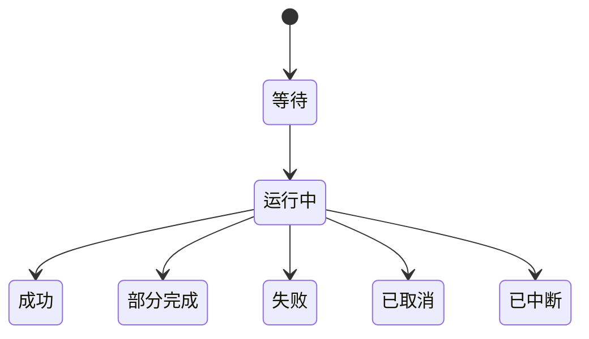

# 平台用例协调

## 目录

- [一、平台用例协调](#一平台用例协调)
  - [1.1 背景与定位](#11-背景与定位)
  - [1.2 核心业务操作流程图](#12-核心业务操作流程图)
  - [1.3 业务状态机](#13-业务状态机)
  - [1.4 状态值说明](#14-状态值说明)
  - [1.5 功能点清单](#15-功能点清单)
  - [1.6 功能点详解](#16-功能点详解)
- [项目任务可视化交接](#项目任务可视化交接)
  - [2.1 背景与定位](#21-背景与定位)
  - [2.2 核心业务操作流程图](#22-核心业务操作流程图)
  - [2.3 业务状态机](#23-业务状态机)
  - [2.4 状态值说明](#24-状态值说明)
  - [2.5 功能点清单](#25-功能点清单)
  - [2.6 功能点详解](#26-功能点详解)
- [三、独立推理用例交接](#三独立推理用例交接)
  - [3.1 背景与定位](#31-背景与定位)
  - [3.2 核心业务操作流程图](#32-核心业务操作流程图)
  - [3.3 业务状态机](#33-业务状态机)
  - [3.4 状态值说明](#34-状态值说明)
  - [3.5 功能点清单](#35-功能点清单)
  - [3.6 功能点详解](#36-功能点详解)
- [四、后处理目录与评价接口](#四后处理目录与评价接口)
  - [4.1 背景与定位](#41-背景与定位)
  - [4.2 核心业务操作流程图](#42-核心业务操作流程图)
  - [4.3 业务状态机](#43-业务状态机)
  - [4.4 状态值说明](#44-状态值说明)
  - [4.5 功能点清单](#45-功能点清单)
  - [4.6 功能点详解](#46-功能点详解)

## 一、平台用例协调

### 1.1 背景与定位

为本机研究工作流提供平台用例协调。复用已有案例和任务事实，不增加算法、任务调度、报告发布或多用户权限。模型/案例目录只用于平台提供候选项和描述；科学语义由 application/provider 提供，Task 仍保持模型无关，Server 不把模型分支写入任务管理。

### 1.2 核心业务操作流程图

### 1.3 业务状态机

研究运行状态由任务管理拥有。辅助显示操作按排队、执行、成功、失败、取消及中断迁移，终态不可被迟到结果覆盖。场景与固定比较是服务自有记录。

### 1.4 状态值说明

成功返回当前记录，失败说明输入、范围或读取原因；连接中断不表示运行失败。

### 1.5 功能点清单

1. 项目与任务。
2. 原始处理。
3. 文件与预览。
    3.1 平台数据集按登记时间倒序列出
4. 研究记录。
5. 阶段配置与产物交接。
6. 可视化操作与场景。

7. 数据集声明驱动的处理接口

### 1.6 功能点详解

#### 1. 项目与任务

训练设置支持保存明确选择的评估指标，名单与默认项由算法能力提供。只覆盖用户编辑的指标列表，显式空列表保持为空，不补回默认；与训练开关、验证间隔一起进入本次运行配置。服务不计算指标、不从日志推算结果。

通过任务公开能力创建、派生、编辑和归档恢复，从两个官方模型和五个起步案例选择任务，数据源只接受启动时授权的根与子目录，服务位置索引不复制研究事实。 已有案例和数据格式保持兼容，未支持请求不得静默转换。

新建界面只提交名称、描述和明确科研案例，任务创建后进入未绑定状态，避免模板开发路径被误用。案例列表由服务显式登记数据集、模型、变体和绑定方式，名称写成「模型 · 数据集」，不从案例标识或显示名称推断。公开数据集目录由任务描述检查提供名单、处理说明和识别规则，服务只扫已登记数据根，只列出完整副本；缺件副本不可选。保存可按公开副本一次写入数据组件、该集处理默认和受控路径，也可继续用旧的受控 `sources` 修订；换数据集必须落在已登记「数据集 + 模型」案例上，否则拒绝且不改配置。读取时动态检查来源范围、存在与类型，并回传数据集名与本机受控地址，失效返回字段位置，不暴露本机绝对路径。历史外流任务若缺少 `components.dataset`，存在 NASA 文件键则按文件绑定，否则按模板默认目录绑定，避免绑定接口 400 阻断选择来源。文件存在不表示样本内容校验通过；完整样本与真实字段仍在案例检查中验证。旧任务保留配置但失效来源不能继续执行。旧创建请求仍可携带受控绑定。

选择明确科研案例时，创建副本同时使用该案例的原始流程脚本和配置，不能只替换参数仍运行其他案例脚本。案例脚本按内容固定登记，任务包展开为新版本；NASA 三类输入纳入运行捕获。历史任务不自动替换脚本，默认通用模板继续兼容。

项目任务列表与工作台使用同一份阶段摘要。浏览位置只控制高亮，不表示研究完成；正式运行与辅助检查分别表达。多阶段失败但缺少逐阶段完成证据时保留无法确认，试跑不成为正式完成事实。

#### 2. 原始处理

原始处理的物理目录、同名冲突、覆盖与成功发布由 Task 独立完成。平台只传递本次确认的覆盖许可，并把同名冲突呈现为可确认响应；取消确认不提交，提交前发生新冲突可重新确认。检查、试跑与正式执行严格分开。

保存既有任务配置，修订冲突拒绝；完整样本和字段校验后提交原始处理，失败保持真实状态。 已有案例和数据格式保持兼容，未支持请求不得静默转换。

正式执行预检读取任务配置里已保存的 `dataset.processed_name`；描述接口不用来源标识冒充已填名称。读取和保存回传 `processed_name_status`（empty/available/reuse/conflict），与预检、成功后登记使用同一份展开配置声明。空名称拒绝提交；同名已存在且未带 `overwrite_processed_name` 仍拒绝，确认覆盖后预检放行并在成功后替换原登记。试跑不要求名称；并行线程、列表顺序和默认展开不进入声明。成功正式运行后按同一声明登记到工作区，供其他项目列出。`rawprep.formats` 与旧 `rawprep.format` 并存时以平台列表为准，旧单键只在没有列表时使用，不因两键不一致提示用户。描述与预检使用覆盖后的 rawprep。ShapeNet 新建任务描述回 VTKHDF 打开，NASA 回关闭。

工作台文件选择与数据绑定一致。ShapeNet-Car 样本身份相对于已绑定目录，浏览引用相对于受控数据根；NASA 文件引用包含各自数据根身份。数量限制先截取显式选择，再校验完整依赖，不自动补齐跨根文件。重新绑定使旧样本目录失效，正式提交再次核验配置及来源。

#### 3. 文件与预览

候选由任务描述与生产标签精确匹配；缺类型或用途的历史记录展示原因并禁选，多个有效候选保留供用户选择。服务保留生产名称标签，文件名只用于页面显示，不根据文件名补用途。结构图操作只登记 application 经 core 生成的两档固定文件与来源；Web/Vis 消费这些引用，服务不接收网络对象。本轮保持已开放页面范围。

只浏览启动时授权范围，独立工作进程检查真实内容，转换失败不回退到旧预览。文件和目录张量使用相同的内容修订规则；目录任一成员变化使预览缓存失效，新旧预览入口的修订保持一致。目录内符号链接拒绝访问，分页读取保留真实成员及偏移。目录资产显式下载为压缩包，保留张量目录必需的隐藏元数据；打包前后核验来源修订，缓存位于服务存储范围，未完成压缩包不发布。 已有案例和数据格式保持兼容，未支持请求不得静默转换。

阶段文件必须有明确运行或当前选择的固定清单；未选择时为空，不回退项目根目录。列举按当前层返回名称、是否文件夹、大小和修改时间，可用 `path` 展开下一层、`query` 按路径搜索；打开树不登记资产、不计算内容摘要。名单额外带上预览用的受控根与相对路径，供原始处理与数据准备产物树走同一套文件预览解析；缺路径时预览可按已登记资产定位。物理输入只展开清单声明的张量成员及附加资产，包括已声明的网格和身份映射；目录张量作为一个完整资产展示，不把内部块文件拆成结果。准备页展示准备记录及归一化产物：处理结果同时列出 `preparation.json` 与该次运行已写出的归一化 PT 副本树。现行写出在 `data_dir/trainprep/normalize`，历史运行也可能在 `data_dir/normalize`；树上仍按 `normalize/` 分层展开，不把副本误当成 artifacts 里的同名文件，也不在进页时核验每个 PT 内容。没有 `preparation.json` 的失败准备保持空列表，不把残留副本显示成成功。后处理限定所选运行的结果范围。草稿中选定的清单可先浏览，读取时仍核验内容修订；遗留清单未声明成员时只展示清单，不猜测相邻文件。完整研究日志可下载，页面清空或筛选不删除运行证据。

工作区已处理数据集单独列出名称、来源、摘要、登记时间和是否可用，不扫描 contrib 源目录。数据准备候选项以平台名称为主，选用后写入公共 `inputs.trainprep.dataset`；不可用登记没有可解析引用，不能执行。受控根增加工作区，以便跨项目解析另一任务下的清单。原始处理提交覆盖 `inputs.rawprep.source`，不再写旧键 `dataset.root`。阶段提交按当前 recipe 投影的 `inputs.*` 捕获输入，不使用创建时冻结的旧入口键。官方脚本特征、已核验摘要及同案例迁移清单归平台官方目录。迁移只在明确发起时调用 Task 显式文件事务；检查、开训和推理不自动替换历史源码。模板缺失或身份未知时拒绝迁移，写入失败恢复旧文件。

##### 3.1 平台数据集按登记时间倒序列出

公开列表与数据准备候选项使用同一登记时间倒序，候选项带回 `created_at`。不按目录名字母序冒充先后，也不因此自动选用最新一项。

#### 4. 研究记录

查询血缘与固定对象比较；报告保存文字与已结束运行证据，同一引用不随新运行漂移。 已有案例和数据格式保持兼容，未支持请求不得静默转换。

#### 5. 阶段配置与产物交接

平台启动或查询时聚合 Task 已发布的项目共享资源，按来源项目与共享资产身份自动补登记；离线 Task 运行无需依赖服务。不同项目同名可并存，同一共享来源只列一条，旧工作区登记仍可读取。正在生产、不可用与正式成功分别表达，平台不通过运行轮询自行发布物理数据。选择、浏览、下载及模型跟踪均消费受控共享引用。

任务模型选项列表只读两个官方模型、当前数据集对应起步 example 的 YAML 目录，以及同项目同数据集用户预设正文；未绑定原数据也可读取。进页列表不对各候选启动 `describe_case`，也不为列出下拉而生成结构或全量核验准备产物。当前模型按任务生效配置识别，创建来源不改写。ShapeNet 的 Transolver-3 带表面/体场变体，NASA 没有体场。点选官方模型、变体或预设时再描述该目标的默认参数与能力；能力原样透传检查门面的损失与采样声明：AB-UPT 提供点、锚点与查询采样，Transolver-3 提供抽稀/分块采样与固定损失行。服务不推断模型页区块，也不在模型阶段提供权重加载入口。

显式换模型需提供官方模型（可带变体）或用户预设，以及预期修订。服务验证同数据集后，在一次保存中完整替换模型草稿、模型组件、全部训练默认和准备声明；选择后继续编辑的模型值保留。物理清单、原数据绑定、原始处理设置与存储目录保持。旧准备和恢复引用解除，初始权重采用目标默认，后处理检查点重置为最近检查点标签；请求不能同时重新绑定旧准备或权重。数据准备阶段可带目标官方案例身份加载该组合的准备声明，选项按当前数据集过滤；模型相同只替换准备段并保留已选权重，模型不同则按换模处理。模型或训练阶段带同一案例身份时只覆盖对应段，不检查任务数据集，且案例必须属于当前模型；不清权重或准备，也不改另一页。场上 scale 非正则拒绝保存。普通保存保持局部合并，修订冲突不得部分更新。 显式换模使用目标模型完整草稿，浏览器附带的旧模型字段删除清单不再按普通编辑字段白名单解释；登记目标和原件修订仍必须通过核验。

明确选择官方模型时同步该案例的准备、训练和推理正文，与配置按原件修订一同提交并备份。历史任务在打开、检查或提交时不自动迁移；用户改过且需要切换科学链的脚本要求显式更新，不覆盖研究修改。

导出模型配置只写入项目共享资产，内容为模型组件与 `model` / `train` / `trainprep`，去掉清单、准备和权重路径；空名、保留名、重名、修订冲突和归档任务拒绝，不写半份。选用时跨数据集拒绝。

保存后消费者重新读取配置、能力、输入和阶段状态。现行 `version=2` 准备只判断能否导入，不因冻结声明或换模拒绝消费；物理清单仍需能读。模型页采样预算不属于准备冻结，点数不同不能拒绝结构跟踪或开训检查。检查点的最近、最新和最优标签不做字面文件检查，真实路径缺失或越界仍返回定位错误。结构跟踪忽略客户端勾选的清单或准备，当次检查解析已选或可导入准备或正式清单并登记输入出处，不回写任务绑定；跟踪按当前模型页参数组模型，准备只提供可读数据。没有任何正式清单时拒绝并提示先完成原始处理。执行门禁不放宽。

标准配置工作台的普通编辑按阶段局部合并，保留未编辑的用户能力参数及字段列表；不增加通用能力编辑页面。原始处理表单按代码语法与已核验版本检查映射。空白、注释及入口文件的排版调整保持可用；已经核验的历史配置加载入口继续消费页面展示的完整默认参数。实际调用、常量、入口或文件集合变化时明确列出文件并拒绝套用已有映射。此检查不改写任务脚本、创建快照或历史运行。

四个设置页面通过同一平台配置门面合成完整配置：只应用明确修改或删除的路径，列表和显式空映射按选择替换，未编辑研究参数保留。格式与采样旧别名、方法专属参数由平台清理，不提示用户手动解决合并冲突。旧请求保留原接口语义，新请求区分未编辑和删除；非法重叠路径拒绝且不保存。Task 完整保存后才允许按新修订检查或提交，配置覆盖不代替物理覆盖许可或冻结产物兼容。

五段工作台使用任务 YAML 作为唯一配置来源，保存核对内容修订且禁止注入统计量。数据准备读取返回模型角色与数据集场匹配清单，以及当前清单的分片总数、样本名单与 train/test/eval 默认人数；已绑定物理清单优先提供场名和张量形状，否则使用案例声明。形状保留完整轴（如 `(N, 3, 2, 3)`），点数轴可不同，其余特征轴必须一致。保存已选绑定须同域且已知形状相容，错域或形状不符拒绝。随机重划时数量之和必须等于全部样本且训练至少 1 个，保持原划分不按数量改写名单。检查不创建运行；执行由已有任务提交门面捕获配置，试跑有独立模式，不进入正式产物候选。训练设置提交开训只打开 `train`，必须已有现行 version=2 准备完成的数据；`prepare_first` 拒绝，不能把数据准备并进开训。早期 version=1 物理准备不能开训、检查或跟踪，服务返回「须按现行数据准备重新生成」，不再用笼统的声明变化句。每次执行按当次平台选择重新合成运行配置：研究参数取已保存设置并补齐每场显式 `scale`（AB-UPT 统一空间缺省 1000，其余 1），输入以本次所选准备为准，清单从该准备记录生成，未再选的续训清空；其他页留下的清单不参与这次运行。官方外流任务里仍是已核验旧物理包装的可编辑脚本，在检查或提交前替换为对应案例的现行模板，冻结版本和用户改写过的脚本不覆盖。继续训练可在这一次提交覆盖 `train.resume`，不写进已保存配置。阶段输入给准备完成的数据带回原始处理登记的数据集名称，以及该准备记录里的 train/test/eval 切片名称、人数和方法/种子；缺的切片人数为 0。页面只展示该名称，不把运行短号或 `preparation.json` 当作选项文案。训练设置另存 `train.training_split`，默认训练集。打开配置、检查、提交或推理预检时，把缺的训练切片补成训练集，并把仍写 `validation` 的评估/写出/后处理分片改成评价集；准备划分已有人数但缺评价项时补 0。不新建研究版本，已显式选过的切片不覆盖。历史准备记录不改字节。原始物理清单、已准备数据和检查点通过受控资产引用显式选择。共享物理清单绑定同名当前资源，新准备捕获当前内容；既有准备记录与检查点保持冻结，不被后续运行改写。

保存阶段设置时，可同时保存或明确清除所选受控输入，二者共用一次配置修订检查；路径写回既有配置，不维护第二份绑定事实。相对输入按任务配置所在目录恢复选择。配置中明确绑定的受控外部文件即使不属于当前任务运行产物，也恢复为固定候选；失效或越界来源保留绑定位置与错误原因，不返回绝对路径、不猜测替代产物。案例模板展开出的清单占位若落在可见根外且文件不存在，视为未绑定，不当成失效来源。根外且文件仍在的路径继续报越界。正式运行产物只要落在项目、任务目录或已登记数据根内即可列入候选。列出阶段输入时按路径与文件戳登记检查点和清单，不把整份权重读进内容摘要；文件大小或修改时间变了旧引用失效。预览、写出和显示资产仍按内容修订核对。新建任务在只选案例、未绑数据时清掉模板清单占位，与已清掉的模板数据根同一规则。检查与执行消费保存后的修订，保存失败不提交后续操作；同次请求的幂等身份保持稳定。保存请求接受页面给出的 `edited_paths`/`removed_paths`（可为空列表），按平台编辑覆盖生成配置，不因这两个字段拒绝。生产者已声明的参数可选范围转成界面选项，未声明范围仅保留现值，不扩展算法能力。

保存模型或训练设置后记下该步完成，未改参数的保存同样落盘并盖住此前失败预检。模型/训练完成只认保存记录；检查或结构跟踪不能冒充成功，也不能清掉已保存。刷新或跳步仍按已保存事实恢复绿色勾。本页参数后来变化只附带过期原因，不把已保存改成未完成。原检查记录不被改写。绑定输入变化仍使依赖该输入的检查失效。历史检查缺少来源信息时不能推断有效。业务错误保留可定位原因；技术异常只在诊断日志保留，页面提供可理解的输入就绪提示。

#### 6. 可视化操作与场景

浏览器以授权根内文件登记固定内容身份。每次访问重新核对范围和内容，拒绝文件变化、目录穿越和外逃链接。显示转换独立进程执行，重型转换同时一个；取消和超时终止进程。服务重启把失去监督的辅助操作标为中断，不自动重放。模型跟踪与配置检查同样使用可取消辅助操作，结构成功后以固定资产展示。新跟踪登记阶段主干与阶段压缩块两档成员，默认仍回主干；历史只有单文件的结果继续只带这一张，不补假第二档。差值读取两次固定运行的真实预测或真值以及同样本清单，严格核对身份、坐标、拓扑、归属和单位，未知单位拒绝计算。场景最多四个窗口，核对来源和视图引用；并发保存通过原子修订检查避免静默覆盖。默认不开启相机联动，缺少两个有效窗口的联动不能保存。

任务创建与来源补充：NASA 训练、测试和拓扑文件可分别通过受控数据根相对路径或固定 AssetRef 绑定；创建请求 `data_sources` 与修订更新 `PUT tasks/{task}/dataset` 共用路径门禁。已绑定来源创建时逐项定位缺件，未绑定模板仍可创建。阶段能力检查失败保留已保存配置编辑，并单独提示检查错误；完整进程异常保存在检查目录日志。

阶段用例边界：HTTP 不持有配置校验和执行规则。domain 保持无 HTTP/持久化依赖，定义只读统计、阶段顺序与输入门禁；application 负责配置修订、受控资产解析和 task 提交。研究日志只属于其真实阶段，模型页不展示最新 post 等无关研究日志。

查看器共享转换按协议版本、来源固定修订、操作和选项去重，幂等键不进入转换指纹。每次新消费者登记独立 subscription_id，带订阅取消只释放自己，最后订阅才终止并回收进程；旧不带订阅取消明确停止整个操作。成功缓存复用前再次核验源与显示资产，源变化不能复用旧成功事实。

版本参数比较使用可选 parameter 路径与两个固定创建版本，返回两侧是否存在、创建值和各自快照修订；缺失不填零。打开固定比较同步模式、左右对象及参数。Web 比较请求按加载代次收敛，选择改变或打开旧记录会使迟到响应失效，正在比较时不能保存混合结果。

#### 7. 数据集声明驱动的处理接口

- 原始处理界面取得数据集默认参数和实际配置，绑定槽位来自数据集描述。打开页面只解析样本名单和代表字段，不给全部来源做内容摘要；同一配置修订的案例描述在步骤间复用。新执行请求选择全部声明样本或指定身份，不按 train/test 分片；`sample_scope` 为全部时 catalog 的输入宇宙是绑定数据集的官方或自身分片，不吃任务里看不见的 `dataset.partitions` 子集；指定样本只写入该次 run。非 NASA 案例的 execute 覆盖写 `unsplit`，平台产物不按官方 train/test 落盘，切分只在数据准备划分。并行线程写入任务 `rawprep.workers` 后随配置提交。保存只改页面可见处理配置与 `processed_name`，不改写 `dataset.partitions`。发布共享数据集只写输出资产，不改绑定源或原数据分片。服务核对受控来源、字段及修订后提交任务。来源变更需重新检查；旧文件勾选请求仍按旧范围执行，不扩大为整库。划分交给数据准备。

## 项目任务可视化交接

### 2.1 背景与定位

服务把当前项目任务与固定来源交付独立可视化模块。所有来源先校验项目、受控根、成员和内容修订；多结果可来自同项目不同任务，保存目标始终只有一个明确任务。

### 2.2 核心业务操作流程图

### 2.3 业务状态机

本章沿用任务归档状态；交互会话与导出状态由独立可视化模块负责，不在本模块复制状态机。

### 2.4 状态值说明

可写任务允许保存和导出；归档任务只允许读取既有配置。数据缺失或修订变化显示错误，不能作为成功重开。

### 2.5 功能点清单

1. 明确任务保存上下文。
2. 固定来源与配置资产交接。
3. 独立工作区与显式输出。
4. 工作区内追加来源

### 2.6 功能点详解

#### 1. 明确任务保存上下文

保存位置属于选定项目任务；不要求迁移原数据，不创建新的研究版本。

#### 2. 固定来源与配置资产交接

只保存引用、处理步骤与显示配置；输入修订和配置修订分别校验。缓存删除不影响读取配置。

#### 3. 独立工作区与显式输出

页面与脚本共享业务入口；图片、视频和提取数据只在明确输出操作时生成。配置保存和导出是两个操作。

#### 4. 工作区内追加来源

来源列表列出任务数据/后处理结果、项目共享数据集和已挂数据根中的可视化网格；目录必须选到成员，非网格后缀不出现。追加前仍核验项目、受控根、成员和修订，将可信绑定通过内部控制通道交给现有会话；公共代理不开放绑定通道。失败保留原工作区，追加成功不创建任务版本。

## 三、独立推理用例交接

### 3.1 背景与定位

为当前任务的独立推理提供受控来源、批次操作和结果交接，连接任务管理与 Web，不实现模型加载、采样、预测或指标算法。批次事实由任务模块产生，服务不维护另一份研究运行数据库。新后处理只消费已生成结果，历史 post 入口按原兼容边界保留。

### 3.2 核心业务操作流程图

### 3.3 业务状态机

本章不新增批次状态机，原样交付任务的固定输入、等待、运行、成功、部分失败、失败、取消及中断事实。服务连接失败与计算失败分开表达；恢复请求由任务核对进程与收据后决定。

### 3.4 状态值说明

兼容候选允许进入正式预检，未知或不兼容候选提供原因；预检通过尚未创建运行。批次终态以任务返回为准，HTTP 成功不替代科学结果成功。结果比较可比、证据不足或不兼容由公开算法门面返回，服务不对缺失值补零。

### 3.5 功能点清单

1. 受控候选和批次预检
2. 提交、查询及显式控制
3. 固定结果与后处理交接
4. 新旧模板与阶段导航兼容

### 3.6 功能点详解

#### 1. 受控候选和批次预检

候选限定当前项目任务的真实训练检查点，携带实际轮次、来源、修订和准备摘要。同内容文件标签可合并展示，不能让同一字节输入被重复计作不同权重。样本查询按检查点身份读取关联准备，并原样交出任务检查里的 `vtk_exports`，不得只抄分片、字段和指标。提交选项未写新导出键时按旧键解释，服务不得先给新键填开。批次预检复核模型与准备语义、配置修订、样本名单和设备。浏览器不传服务器任意文件位置。

#### 2. 提交、查询及显式控制

提交将已声明选择交给任务公开操作，幂等重试返回原对象。刷新读取已有批次与子运行，不重新发起计算；取消、失败重试和中断恢复是不同操作，不能把恢复实现为再次创建相同运行。服务不直接终止模型进程，控制只经任务核验身份。新推理运行不改变研究版本。

#### 3. 固定结果与后处理交接

结果来自对应批次和子运行已提交文件，以及训练或独立推理写在任务数据目录中的预测、网格、导出；核验项目、任务和成员范围后登记内容修订，提供受控下载和预览引用。结果按检查点、运行和样本定位，不用文件显示顺序作为来源身份。后处理通过固定结果引用显示指标或打开 Trame，不恢复模型或重算预测。部分交付和不可比原因继续传递到页面。

平台操作依据任务声明的入口及实际返回结构判断支持范围。新增能力文件、连接或阶段不因官方模板代码结构不同被拒绝；缺操作或输入输出不满足当前页面要求时给出明确错误。源码摘要仅用于来源追踪，科学兼容和受控资产访问仍分别严格校验。旧阶段数字链接继续兼容。

#### 4. 新旧模板与阶段导航兼容

新工作台为九步，推理位于训练运行和后处理之间；稳定阶段标识用于新导航，旧数字地址 6 仍代表后处理、7 仍代表报告。导航位置和最近访问不修改阶段完成事实。

平台提交保持已登记模板的内容核验门禁。新 infer 模板和保留的旧 post API 不意味着任意历史任务已经兼容；已知旧模板仅在内容与登记清单完全匹配时兼容，历史任务工作目录保持不变，未知用户脚本不得按相似名称自动执行或替换。历史运行、准备和权重记录不批量重写。

## 四、后处理目录与评价接口

### 4.1 背景与定位

服务连接任务管理、固定结果评价与可视化来源授权，网页不传任意机器路径。

### 4.2 核心业务操作流程图

### 4.3 业务状态机

### 4.4 状态值说明

等待表示固定请求已提交；运行中只采用实际完成数量；成功要求全部交付；部分完成保留成功项并披露失败项；取消不发布完整成功；中断不自动重新执行。

### 4.5 功能点清单

1. 受控目录与分页。
2. 评价与导出协议。
3. 三维来源追加。

### 4.6 功能点详解

#### 1. 受控目录与分页

提供当前任务批次、运行、样本和字段候选，与按层文件树分开读取。文件树包含本任务平台数据集、推理固定结果、训练运行输出文件夹，以及训练或独立推理写在任务数据目录中的预测、网格、导出；无写出的训练 run 仍列出并说明空态。检查点与日志不进入此树。打开文件树只列当前层，不登记资产、不读文件内容；预览、下载和加入三维时才按受控根与相对路径登记。搜索按路径匹配返回命中文件。隐藏内部路径与进程信息。

#### 2. 评价与导出协议

接受固定结果修订、指标和字段选择；返回评价身份、实际进度、结果行和下载引用。算法错误逐项反馈，协议错误明确拒绝。

#### 3. 三维来源追加

验证同项目来源与修订，按固定来源和成员去重；多个来源整批成功后发布，失败保留旧场景。
