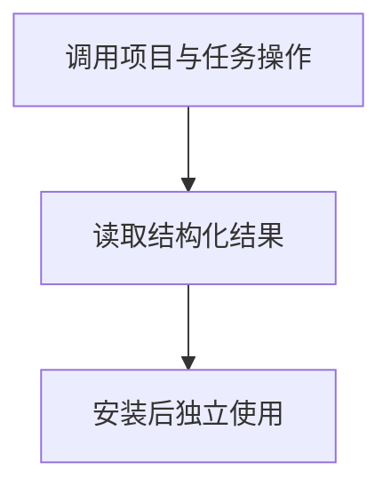

# 命令行与 Python 操作一致性

## 目录

- [一、命令行与 Python 操作一致性](#一命令行与 Python 操作一致性)
  - [1.1 背景与定位](#11-背景与定位)
  - [1.2 核心业务操作流程图](#12-核心业务操作流程图)
  - [1.3 业务状态机](#13-业务状态机)
  - [1.4 状态值说明](#14-状态值说明)
  - [1.5 功能点清单](#15-功能点清单)
  - [1.6 功能点详解](#16-功能点详解)

## 一、命令行与 Python 操作一致性

### 1.1 背景与定位

面向通过 Python 或命令行开展研究的人员，提供命令行与 Python 操作一致性。本期为本地单项目能力，不包含 Web 服务、远程调度或生产规模训练承诺。

### 1.2 核心业务操作流程图

### 1.3 业务状态机

本章无独立业务状态机；操作结果及错误由各功能返回，创建记录不引入草稿或冻结状态。

### 1.4 状态值说明

本章无业务状态；资产核验和比较的结果状态在对应功能中说明。

### 1.5 功能点清单

1. 调用项目与任务操作
2. 读取结构化结果
3. 安装后独立使用

### 1.6 功能点详解

#### 1. 调用项目与任务操作

研究人员通过命令行创建项目、new/fork、查询任务、提交或停止运行；与 Python 调用共享规则和结果。参数错误返回非零退出码，不把提交成功等同训练成功。

#### 2. 读取结构化结果

命令可以输出 JSON，携带稳定身份、运行状态与错误原因，供脚本继续处理；等待超时返回当前状态，不伪装成失败。

#### 3. 安装后独立使用

安装包后即可从源码目录之外使用命令与 Python 导入。管理操作不会提前加载模型；实际执行仍需要案例依赖。
