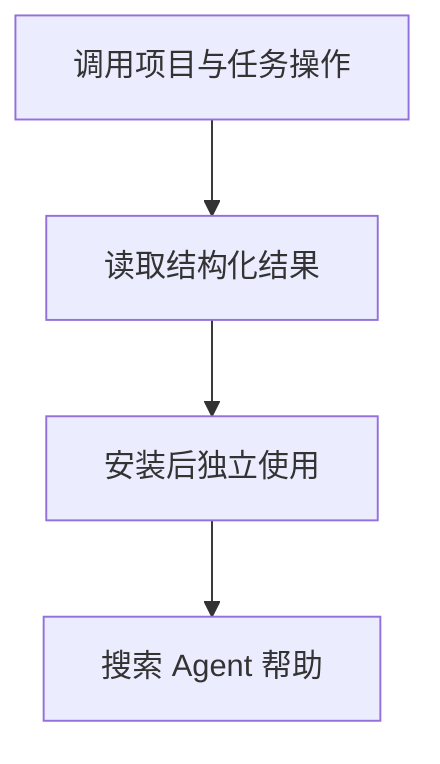

# 命令行与 Python 操作一致性

## 目录

- [一、命令行与 Python 操作一致性](#一命令行与-python-操作一致性)
  - [1.1 背景与定位](#11-背景与定位)
  - [1.2 核心业务操作流程图](#12-核心业务操作流程图)
  - [1.3 业务状态机](#13-业务状态机)
  - [1.4 状态值说明](#14-状态值说明)
  - [1.5 功能点清单](#15-功能点清单)
  - [1.6 功能点详解](#16-功能点详解)

## 一、命令行与 Python 操作一致性

### 1.1 背景与定位

面向通过 Python 或命令行开展研究的人员，提供命令行与 Python 操作一致性。本期为本地单项目能力，不包含 Web 服务、远程调度或生产规模训练承诺。

### 1.2 核心业务操作流程图

### 1.3 业务状态机

本章无独立业务状态机；操作结果及错误由各功能返回，创建记录不引入草稿或冻结状态。

### 1.4 状态值说明

本章无业务状态；资产核验和比较的结果状态在对应功能中说明。

### 1.5 功能点清单

1. 调用项目与任务操作
2. 读取结构化结果
3. 安装后独立使用
4. 发现和复制研究案例
5. 导出 Agent 指南与 skill
6. 定位安装源码和生成 smoke 数据
7. 搜索和读取 Agent 帮助

### 1.6 功能点详解

#### 1. 调用项目与任务操作

项目命令支持共享数据列举、按配置修订绑定和迁移预览或执行。运行覆盖是本次显式选项，与 Python 使用相同冲突、幂等和发布逻辑；不需要启动服务端，也不会把许可保存成任务默认值。

研究人员通过命令行创建项目、new/fork、查询任务、提交或停止运行；与 Python 调用共享规则和结果。参数错误返回非零退出码，不把提交成功等同训练成功。

#### 2. 读取结构化结果

命令可以输出 JSON，携带稳定身份、运行状态与错误原因，供脚本继续处理；等待超时返回当前状态，不伪装成失败。

#### 3. 安装后独立使用

安装包后即可从源码目录之外使用命令与 Python 导入。管理操作不会提前加载模型；实际执行仍需要案例依赖。

#### 4. 发现和复制研究案例

清单只允许 `standalone` 和 `extension` 两种案例类型。standalone 复制完整研究目录；extension 先物化 `base_case`，再叠加声明的覆盖文件并写出 provenance。未知案例、非空目标、缺基案例和未声明冲突直接失败。发现、检查和复制只读取清单与文件树，不导入案例或训练栈。

列表提供研究摘要和数据/流程标签，Python入口支持确定性筛选；详细改写说明由案例正文交付。扩展物化同时保留基案例和变体的说明副本与来源摘要，不再依赖扩展README恰好属于覆盖名单。离线帮助包含正文。

#### 5. 导出 Agent 指南与 skill

安装资源提供启动指南、唯一 skill 源的构建副本和完整 Agent Help Center。支持 Agent Skills 的环境以 `dojo-research/SKILL.md` 为主入口，由 skill 检索帮助中心；不支持 skills 的 Agent 从 guide 定位同一帮助正文。Guide 负责能力地图与边界，Skill 负责研究行动顺序；两者首屏显著链接同一帮助中心。完整新训练任务先选择并复制最接近的完整案例，按 recipe 阶段和训练框架改写；算法工具可自由选择，差异通过本地用户组件与公开扩展点表达。只有网络源码不视为已有完整训练工程；改写先参考训练框架与外部 Web 资料形成初案，再按职责检索工具并更新计划，最后复核计划和实际代码是否遵循框架写法，允许有证据的自定义。该顺序由 Agent 自主推进，不额外引入逐步审批；代码量分析是可选附属能力，不是研究目标或必交统计。用户已有稳定项目和单工具任务采用相应的局部接入方式。两者都要把第一次使用、概念边界、研究工作流、API、用户组件、案例、recipe、故障处理和固定参考分别路由到对应帮助类型，同时给出 Python 检索和离线机器索引入口。

API 签名、参数、返回值、源码、工作流、组件写法和案例不在单页 guide 或 skill 中重复维护。Skill 引导读取相关帮助正文；完整任务在实现前读取复制品的 README、配置、pipeline、阶段脚本和用户组件说明；保留来源与阶段交接，避免将完整自写流程包装成单个组件。导出会按需创建 `.agents/skills/dojo-research/` 和 `docs/agent-help/`，不会创建或修改 `AGENTS.md`，也不把仓库内部导航写入安装后的使用说明。

仓库另提供主控使用的 `dojo-compare` 对照实验技能，负责参数化选型、基线条件、预实验测速、独立会话/隐藏评价和精度、编码成本、代码复用报告；不规定具体数据集、模型、实验设计方法或门槛。它不属于参与组研究指南交付物，现有导出不包含该技能，避免把主控对照、评分和其他组信息注入被试会话。该入口只生成/审查方案及汇总证据，不自动授权执行实验；研究技能原有行为和API不变。 产物实体及逐轮冻结留在独立组内，主控仅存索引、修订摘要和报告，不重复备份数据或运行环境。

能力评估按实际职责拆分：模型构造、权重初始化与映射、结构变换、完整状态恢复分别定位，Guide提供权重能力入口，Skill要求检查相关工具的适配性。结构变换需要自定义不表示加载与映射工具也应自动跳过；复用判断以实际采用的职责为准，不能用构造器包装或导入次数覆盖其他工作。

基础建模导航覆盖经典网络、算子网络与传统代理的公开计算块、可复用阶段和完整模型；教程继续分流到神经网络训练、非梯度拟合、普通对象预测、状态读回及物理约束。POD 表示与系数预测分开，模型状态重建与完整训练恢复分开，避免 Agent 按名称假定统一训练/推理协议。每次能力使用约定变化同步 API 与教程，按需改入口导航；生成资源必须可检索并在安装后离线导出，只有源码 API 页存在不视为可发现性已交付。此项只补文档与资源，不改变运行接口及模型行为。

#### 6. 定位安装源码和生成 smoke 数据

`source` 只定位当前解释器真正可见的模块源码。`smoke-data create` 显式调用 Neumann 数据生成能力，固定最小 train/test、网格和 CPU 预算；数据命令的成功不等于 direct-core 或 Task 训练成功，后续仍须读回阶段产物。

#### 7. 搜索和读取 Agent 帮助

`guide search` 按研究任务、全限定符号、配置键、产物、错误、recipe 或案例查找主题，并可按 kind、layer 和条数限制结果。完全匹配的符号、主题或案例优先于普通文本匹配。`guide topic` 读取一个稳定 topic ID 的元数据和 Markdown 正文；`guide symbol` 返回签名、稳定性、页面锚点、关联案例和源码位置。

三个命令只包装同名 Python 资源 API，输出继续服从文本/JSON 和退出码约定。未知主题、未知符号、空查询、非法条数或过滤值返回明确业务错误；不 import 模型、Torch、example 或 recipe，也不把搜索命中当作组件兼容或运行成功。
