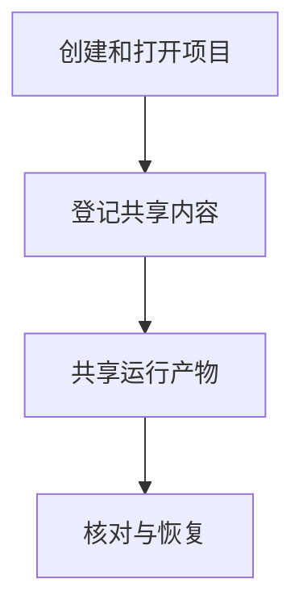

# 项目与共享资产

## 目录

- [一、项目与共享资产](#一项目与共享资产)
  - [1.1 背景与定位](#11-背景与定位)
  - [1.2 核心业务操作流程图](#12-核心业务操作流程图)
  - [1.3 业务状态机](#13-业务状态机)
  - [1.4 状态值说明](#14-状态值说明)
  - [1.5 功能点清单](#15-功能点清单)
  - [1.6 功能点详解](#16-功能点详解)

## 一、项目与共享资产

### 1.1 背景与定位

面向通过 Python 或命令行开展研究的人员，提供项目与共享资产。本期为本地单项目能力，不包含 Web 服务、远程调度或生产规模训练承诺。

### 1.2 核心业务操作流程图

### 1.3 业务状态机

本章无独立业务状态机；操作结果及错误由各功能返回，创建记录不引入草稿或冻结状态。

### 1.4 状态值说明

本章无业务状态；资产核验和比较的结果状态在对应功能中说明。

### 1.5 功能点清单

1. 创建和打开项目
2. 登记共享内容
3. 共享运行产物
4. 核对与恢复

### 1.6 功能点详解

#### 1. 创建和打开项目

新增编辑、归档与恢复，归档不删除任务或资产。旧项目缺少管理字段时仍可读取。

项目身份独立于名称，统一容纳任务与共享资产。创建拒绝覆盖已有目录；缺失数据库时不自动伪造空项目。

#### 2. 登记共享内容

共享目录按资产名称组织，数据集可以在 datasets 下再按名称分组。每项资产带来源、身份和摘要；默认登记外部引用，也可显式复制。

#### 3. 共享运行产物

只能显式选择归属某次运行的产物进行共享，保留任务、正式版本与运行来源，已有同名资产不被覆盖。

#### 4. 核对与恢复

引用内容变化或失效时拒绝继续；中断创建的未登记目录可显式清理。管理数据库需要备份，不能仅靠运行记录恢复全部项目事实。
