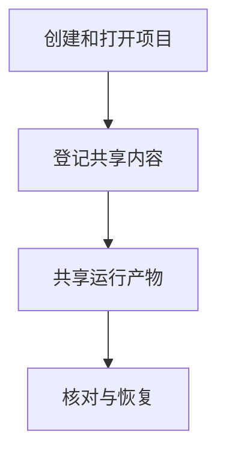

# 项目与共享资产

## 目录

- [一、项目与共享资产](#一项目与共享资产)
  - [1.1 背景与定位](#11-背景与定位)
  - [1.2 核心业务操作流程图](#12-核心业务操作流程图)
  - [1.3 业务状态机](#13-业务状态机)
  - [1.4 状态值说明](#14-状态值说明)
  - [1.5 功能点清单](#15-功能点清单)
  - [1.6 功能点详解](#16-功能点详解)

## 一、项目与共享资产

### 1.1 背景与定位

面向通过 Python 或命令行开展研究的人员，提供项目与共享资产。本期为本地单项目能力，不包含 Web 服务、远程调度或生产规模训练承诺。

### 1.2 核心业务操作流程图

### 1.3 业务状态机

项目创建记录不引入草稿或冻结状态；共享物理数据从生产中进入可用或不可用。显式覆盖将可用资源先置为生产中，保留本次回退副本；失败恢复此前数据与来源，失败运行本身仍为失败。

### 1.4 状态值说明

共享物理数据使用 building（生产中）、available（可用）和 unavailable（不可用）。查询保留失败原因；名称冲突与生产占用是提交错误，不代表新的成功资源。

### 1.5 功能点清单

1. 创建和打开项目
2. 登记共享内容
3. 共享运行产物
4. 核对与恢复

### 1.6 功能点详解

#### 1. 创建和打开项目

新增编辑、归档与恢复，归档不删除任务或资产。旧项目缺少管理字段时仍可读取。

项目身份独立于名称，统一容纳任务与共享资产。创建拒绝覆盖已有目录；缺失数据库时不自动伪造空项目。

#### 2. 登记共享内容

项目内物理数据由发起任务生产，正式输出默认属于项目共享数据目录，归档生产任务不会删除它。共享名称必须显式提供；同名资源无论声明是否相同，重新生产都需要本次明确覆盖许可。泛用共享资产登记仍保持原有不可覆盖语义，不因此变为可变资源。

项目共享查询返回当前清单、来源与可用状态。任务按入口声明绑定清单，保存当前可编辑配置与资产关联，校验配置修订；不创建新版本、不改创建快照。派生任务默认继承共享引用，显式复制则复制完整物理数据及统计依赖。覆盖后新的准备捕获同名当前内容，已有准备和检查点保持原字节并继续遵守原冻结校验。

共享目录按资产名称组织，数据集可以在 datasets 下再按名称分组。每项资产带来源、身份和摘要；默认登记外部引用，也可显式复制。

#### 3. 共享运行产物

只能显式选择归属某次运行的产物进行共享，保留任务、正式版本与运行来源，已有同名资产不被覆盖。公开索引已声明的依赖必须随引用保留并在消费时校验。带外部依赖的主文件不能单独复制后宣称自包含；使用引用，或由领域流程先交付内部使用相对引用的完整目录。发布者可声明自包含目录；共享复制和派生任务复制整体核验并复制该目录，重定位管理引用，科学清单不改写。原目录移除后仍可消费，项目移动后内部引用继续可用。未声明自包含的外部依赖仍拒绝复制。管理层不猜测数组、准备或模型清单的内部引用格式。

#### 4. 核对与恢复

历史迁移默认只预览正式成功原始处理，排除试跑和失败；执行时复制物理成员、网格、实体身份及统计依赖，校验复制前后内容，路径仅在新副本修正。旧平台登记名称与运行时名称不一致时，可按明确选中的名称与正式运行配对迁移，保留用户选择的实际内容；不以其他同名运行替换。相同来源再次迁移直接复用，其他同名内容必须明确覆盖。失败副本不可登记为可用。历史任务、运行、准备与检查点不迁移、不重算。

引用内容变化或失效时拒绝继续；中断创建的未登记目录可显式清理。管理数据库需要备份，不能仅靠运行记录恢复全部项目事实。
