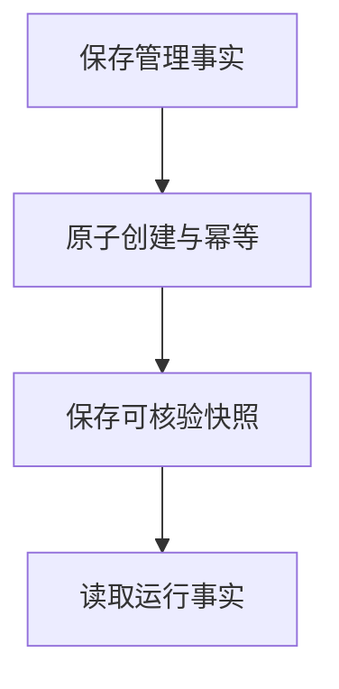
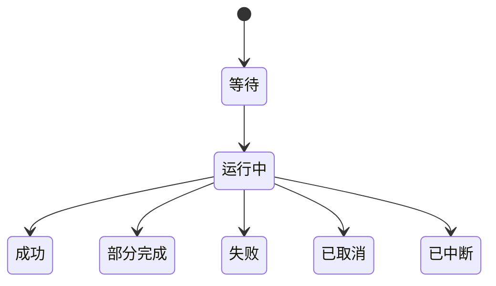
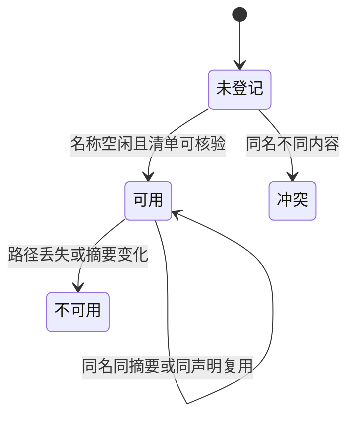

# 管理记录与文件完整性

## 目录

- [四、评价运行与结果存储](#四评价运行与结果存储)
  - [4.1 背景与定位](#41-背景与定位)
  - [4.2 核心业务操作流程图](#42-核心业务操作流程图)
  - [4.3 业务状态机](#43-业务状态机)
  - [4.4 状态值说明](#44-状态值说明)
  - [4.5 功能点清单](#45-功能点清单)
  - [4.6 功能点详解](#46-功能点详解)
- [五、工作区已处理数据集](#五工作区已处理数据集)
  - [5.1 背景与定位](#51-背景与定位)
  - [5.2 核心业务操作流程图](#52-核心业务操作流程图)
  - [5.3 业务状态机](#53-业务状态机)
  - [5.4 状态值说明](#54-状态值说明)
  - [5.5 功能点清单](#55-功能点清单)
  - [5.6 功能点详解](#56-功能点详解)

- [项目任务可视化交接](#项目任务可视化交接)

- [一、管理记录与文件完整性](#一管理记录与文件完整性)
  - [1.1 背景与定位](#11-背景与定位)
  - [1.2 核心业务操作流程图](#12-核心业务操作流程图)
  - [1.3 业务状态机](#13-业务状态机)
  - [1.4 状态值说明](#14-状态值说明)
  - [1.5 功能点清单](#15-功能点清单)
  - [1.6 功能点详解](#16-功能点详解)

- [三、推理固定输入与结果隔离](#三推理固定输入与结果隔离)
  - [3.1 背景与定位](#31-背景与定位)
  - [3.2 核心业务操作流程图](#32-核心业务操作流程图)
  - [3.3 业务状态机](#33-业务状态机)
  - [3.4 状态值说明](#34-状态值说明)
  - [3.5 功能点清单](#35-功能点清单)
  - [3.6 功能点详解](#36-功能点详解)

## 一、管理记录与文件完整性

### 1.1 背景与定位

面向通过 Python 或命令行开展研究的人员，提供管理记录与文件完整性。本期为本地单项目能力，不包含 Web 服务、远程调度或生产规模训练承诺。

### 1.2 核心业务操作流程图

### 1.3 业务状态机

本章无独立业务状态机；操作结果及错误由各功能返回，创建记录不引入草稿或冻结状态。

### 1.4 状态值说明

本章无业务状态；资产核验和比较的结果状态在对应功能中说明。

### 1.5 功能点清单

1. 保存管理事实
2. 原子创建与幂等
3. 保存可核验快照
4. 读取运行事实

### 1.6 功能点详解

#### 1. 保存管理事实

记录继续采用原有 JSON body，管理字段可选且兼容旧记录，不另建同类数据库。配置字节摘要作为修订，任务管理副本随编辑同步。

项目、任务、版本、运行、模板、资产与比较使用本地数据库保存；便携文件由同一操作维护，不提供两套独立修改入口。项目共享资产允许 `kind=model_preset`，只保存模型配置快照，不保存训练权重，也不创建研究版本。

#### 2. 原子创建与幂等

先暂存并核验文件，再在写事务内发布引用。相同幂等请求返回原对象，不同请求复用键时报冲突。失败不发布可用半成品。

#### 3. 保存可核验快照

文件内容使用摘要核对，拒绝复制过程中变化的来源及符号链接。快照内容被改动后不能冒充原始版本。

#### 4. 读取运行事实

运行配置、日志、来源和摘要由计算入口的唯一写入方产生，存储模块只读索引，不回写训练日志或权重。

## 项目任务可视化交接

### 2.1 背景与定位

在现有任务范围内增加可视化区域。索引与修订是持久交付，工作缓存可清理，显式导出独立登记。不写训练运行目录，不复制原始物理数据。

### 2.2 核心业务操作流程图

### 2.3 业务状态机

本章沿用任务归档状态；交互会话与导出状态由独立可视化模块负责，不在本模块复制状态机。

### 2.4 状态值说明

可写任务允许保存和导出；归档任务只允许读取既有配置。数据缺失或修订变化显示错误，不能作为成功重开。

### 2.5 功能点清单

1. 明确任务保存上下文。
2. 固定来源与配置资产交接。
3. 独立工作区与显式输出。

### 2.6 功能点详解

#### 1. 明确任务保存上下文

保存位置属于选定项目任务；不要求迁移原数据，不创建新的研究版本。

#### 2. 固定来源与配置资产交接

只保存引用、处理步骤与显示配置；输入修订和配置修订分别校验。缓存删除不影响读取配置。

#### 3. 独立工作区与显式输出

页面与脚本共享业务入口；图片、视频和提取数据只在明确输出操作时生成。配置保存和导出是两个操作。

## 三、推理固定输入与结果隔离

### 3.1 背景与定位

让长时间批量推理在训练权重继续变化、网页关闭和服务中断时仍保有固定来源与可核对状态。管理记录、权重副本、运行报告和预测数据保持各自所有权。固定输入不等于创建新研究版本，不复制整份原始数据，不写包安装目录。

### 3.2 核心业务操作流程图

### 3.3 业务状态机

本章无独立业务状态。批次生命周期由任务功能维护；存储以未提交与已发布的原子边界保障引用有效，不建立第二套运行状态源。

### 3.4 状态值说明

未提交临时文件不能作为可用权重或结果；已发布固定输入仍须通过内容修订校验。协调进程失联不表示计算成功；已完成文件和部分失败记录均保留，不以清空目录修复状态。

### 3.5 功能点清单

1. 固定实际检查点内容
2. 保存批次意图与幂等身份
3. 隔离管理、运行与数据输出

### 3.6 功能点详解

同一检查点跨分片共享一个完整权重副本，每个子运行的数据各自隔离；只评价仍交付轻量报告。CSV/Excel归任务导出目录，登记文件内容修订及原批次、运行、分片和样本来源，不改写原预测或历史验收记录。

#### 1. 固定实际检查点内容

权重从完整已提交文件逐字节读取，复制到任务私有资产暂存区；校验摘要、写入来源记录后原子发布。来源在复制中发生不符合修订的变化时拒绝，不让一部分旧权重和一部分新权重构成有效输入。副本独立于原文件，禁止使用硬链接。固定操作不修改训练检查点，不保存优化器运行状态为新的训练来源。

#### 2. 保存批次意图与幂等身份

任务管理区域保存批次请求、捕获代码、协调状态与进程收据，复用既有管理存储和幂等机制。同一身份、同一意图返回原批次；同一身份、不同意图拒绝。重启核对已有记录而非从页面重建执行请求；恢复与重试分别保留明确历史。固定失败的临时文件不发布为成功资产。

#### 3. 隔离管理、运行与数据输出

固定权重属于任务私有 assets，批次和执行收据属于任务管理区域；计算 writer 独占运行目录中的配置、日志、进度和轻量结果索引。预测张量、样本清单和网格由数据保存能力写入本次任务数据区域，重试有独立目标。task 只读计算报告，不回写运行进度或生成预测数组。

文件必须属于对应任务及子运行范围，符号链接、越界成员和缺失文件不能当作交付。原数据位置保持不变，后处理可视化保存仍使用既有任务可视化区域。增加预测或显式可视化输出不创建版本，也不修改历史训练记录。

## 四、评价运行与结果存储

### 4.1 背景与定位

评价属于任务内新运行，原训练和推理输出保持不可变。

### 4.2 核心业务操作流程图

### 4.3 业务状态机

### 4.4 状态值说明

等待表示固定请求已提交；运行中只采用实际完成数量；成功要求全部交付；部分完成保留成功项并披露失败项；取消不发布完整成功；中断不自动重新执行。

### 4.5 功能点清单

1. 保存位置。
2. 固定输入与输出身份。
3. 失败与中断。

### 4.6 功能点详解

#### 1. 保存位置

管理意图归任务管理区，配置、日志和运行摘要归运行写入方；指标数据及显式输出归任务data/post。禁止输出到包源码或安装目录。

#### 2. 固定输入与输出身份

请求保存结果身份与成员修订，不复制原预测。导出不会改变原评价身份；旧推理指标及历史配置摘要不重写。

#### 3. 失败与中断

同级临时文件原子发布；失败保留此前交付，未提交文件不计入目录。未知进程不能据此宣称成功。

## 五、工作区已处理数据集

### 5.1 背景与定位

给研究者一份跨项目可按名称选用的平台数据资源。正式原始处理成功后登记名称、清单路径、内容摘要和来源声明；张量文件仍留在产生它的任务数据目录，不复制到 contrib 源数据集，也不另造第二套算法清单格式。删除来源任务不级联删除登记。

### 5.2 核心业务操作流程图

### 5.3 业务状态机

### 5.4 状态值说明

| 中文含义 | 标识 | 业务说明 |
| --- | --- | --- |
| 可用 | available | 清单仍在且摘要一致，数据准备可选用 |
| 不可用 | unavailable | 路径丢失或摘要变化，不能当作准备输入 |
| 冲突 | processed_dataset_name_conflict | 同名已被不同内容占用，必须换名 |

### 5.5 功能点清单

1. 按名称登记已处理数据集
    1.1 名称必填且符合标识规则
    1.2 同名同摘要复用，同名不同内容拒绝
2. 核验可用性
    2.1 路径丢失或摘要变化标为不可用
    2.2 删除来源任务不级联删除登记
3. 按登记时间倒序列出
    3.1 缺登记时间时用登记文件修改时间
    3.2 同时间按名称稳定排序

### 5.6 功能点详解

#### 1. 按名称登记已处理数据集

工作区根下 `datasets/<name>/dataset.json` 保存名称、清单绝对路径、内容摘要、来源任务/运行和声明指纹。试跑或不完整产物不登记。名称写在任务配置 `dataset.processed_name`；研究者改名称只动这一项。

##### 1.1 名称必填且符合标识规则

空名称不能正式执行。合法标识以字母开头，后接字母、数字或下划线，长度不超过 64。

##### 1.2 同名同摘要复用，同名不同内容拒绝

再次登记同一份清单时复用已有记录。同名且声明相同的新成功运行可更新指向；同名但声明或摘要指向另一份数据时拒绝，避免其他项目悄悄换数据。声明指纹只计入来源与处理产物语义，不含 `rawprep.workers`；改并行线程不算另一份数据。

#### 2. 核验可用性

列出与选用时重新核对清单文件和摘要。不可用项保留名称，数据准备不能把它当作有效输入。

##### 2.1 路径丢失或摘要变化标为不可用

文件被挪走、删除或内容被改写后，状态为不可用并给出原因，不自动改名或补造。

##### 2.2 删除来源任务不级联删除登记

历史名称仍在工作区；选用时再提示失效，避免误删其他项目仍在引用的登记。

#### 3. 按登记时间倒序列出

公开列表与数据准备候选项使用同一顺序：最近登记的名称在前。不按目录名字母序冒充先后，也不因此自动选用最新一项。

##### 3.1 缺登记时间时用登记文件修改时间

旧记录没有 `created_at` 时，用 `dataset.json` 的修改时间参与排序，避免无时间字段的名称挤到最前。

##### 3.2 同时间按名称稳定排序

登记时间相同或都缺时间时，按名称升序，保证刷新后顺序稳定。
