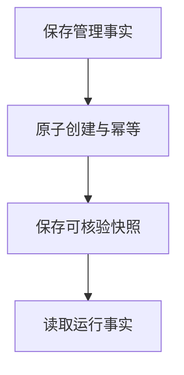

# 管理记录与文件完整性

## 目录

- [一、管理记录与文件完整性](#一管理记录与文件完整性)
  - [1.1 背景与定位](#11-背景与定位)
  - [1.2 核心业务操作流程图](#12-核心业务操作流程图)
  - [1.3 业务状态机](#13-业务状态机)
  - [1.4 状态值说明](#14-状态值说明)
  - [1.5 功能点清单](#15-功能点清单)
  - [1.6 功能点详解](#16-功能点详解)

## 一、管理记录与文件完整性

### 1.1 背景与定位

面向通过 Python 或命令行开展研究的人员，提供管理记录与文件完整性。本期为本地单项目能力，不包含 Web 服务、远程调度或生产规模训练承诺。

### 1.2 核心业务操作流程图

### 1.3 业务状态机

本章无独立业务状态机；操作结果及错误由各功能返回，创建记录不引入草稿或冻结状态。

### 1.4 状态值说明

本章无业务状态；资产核验和比较的结果状态在对应功能中说明。

### 1.5 功能点清单

1. 保存管理事实
2. 原子创建与幂等
3. 保存可核验快照
4. 读取运行事实

### 1.6 功能点详解

#### 1. 保存管理事实

项目、任务、版本、运行、模板、资产与比较使用本地数据库保存；便携文件由同一操作维护，不提供两套独立修改入口。

#### 2. 原子创建与幂等

先暂存并核验文件，再在写事务内发布引用。相同幂等请求返回原对象，不同请求复用键时报冲突。失败不发布可用半成品。

#### 3. 保存可核验快照

文件内容使用摘要核对，拒绝复制过程中变化的来源及符号链接。快照内容被改动后不能冒充原始版本。

#### 4. 读取运行事实

运行配置、日志、来源和摘要由计算入口的唯一写入方产生，存储模块只读索引，不回写训练日志或权重。
