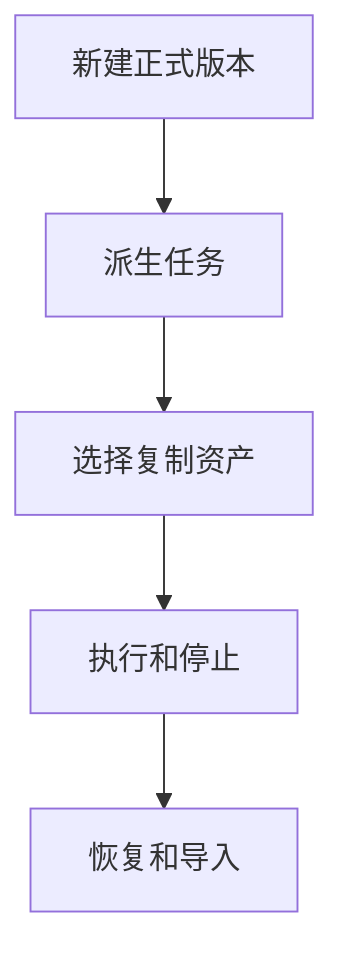
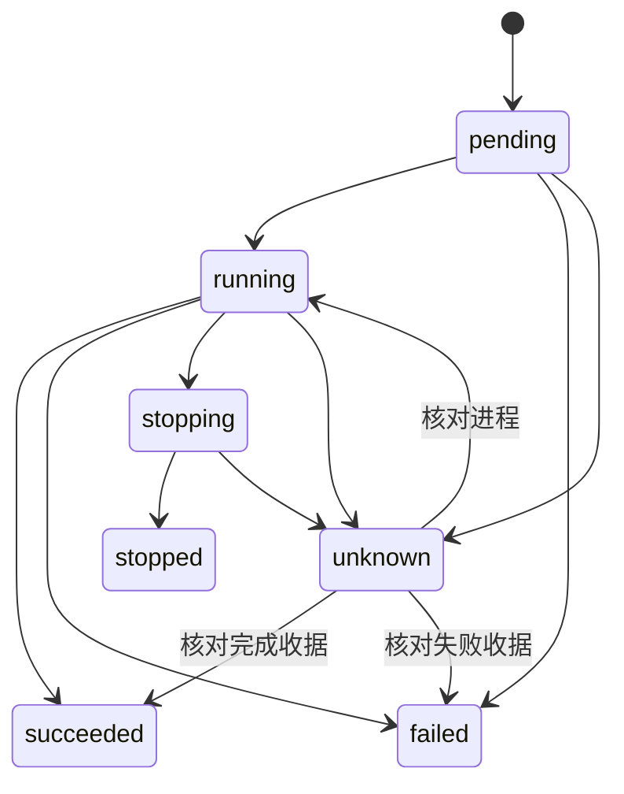

# 任务创建、派生与本地运行

## 目录

- [一、任务创建、派生与本地运行](#一任务创建、派生与本地运行)
  - [1.1 背景与定位](#11-背景与定位)
  - [1.2 核心业务操作流程图](#12-核心业务操作流程图)
  - [1.3 业务状态机](#13-业务状态机)
  - [1.4 状态值说明](#14-状态值说明)
  - [1.5 功能点清单](#15-功能点清单)
  - [1.6 功能点详解](#16-功能点详解)

## 一、任务创建、派生与本地运行

### 1.1 背景与定位

面向通过 Python 或命令行开展研究的人员，提供任务创建、派生与本地运行。本期为本地单项目能力，不包含 Web 服务、远程调度或生产规模训练承诺。

### 1.2 核心业务操作流程图

### 1.3 业务状态机

### 1.4 状态值说明

| 中文含义 | 标识 | 业务说明 |
| --- | --- | --- |
| 待启动 | pending | 已保存执行意图 |
| 运行中 | running | 进程身份已核对 |
| 成功 | succeeded | 真实运行摘要与完成收据一致 |
| 失败 | failed | 启动或计算失败 |
| 停止中 | stopping | 等待确认 |
| 已停止 | stopped | worker 已结束并确认停止请求 |
| 待核对 | unknown | 不具备足够证据，不自动重提 |

### 1.5 功能点清单

1. 新建正式版本
2. 派生任务
3. 选择复制资产
4. 执行和停止
5. 恢复和导入
6. 阶段检查与正式产物

### 1.6 功能点详解

#### 1. 新建正式版本

新增配置修订读取及原子保存，编辑和运行不新增版本。旧修订拒绝覆盖，归档任务拒绝配置保存。模板尚未绑定数据允许创建任务，执行输入检查仍严格。

new 从模板、用户目录或空目录创建任务，同时建立正式版本。受信任调用方可在创建快照前注入已登记案例配置，因此案例选择属于版本创建事实；浏览器不提供任意 Python 路径。空代码任务可编辑，但没有有效入口时不能运行。

平台选择案例但尚未绑定数据时，任务配置保留明确的空来源；不会把模板开发机路径自动视为用户输入。后续绑定通过公开配置保存更新任务副本，不创建新版本。首次读取仍核验真实路径，失效来源不能当作有效数据。

#### 2. 派生任务

fork 默认采用父任务当前代码，也可选创建快照或固定运行。只复制代码与选择的资产，不复制历史运行；直接父来源与比较基线分别记录。

#### 3. 选择复制资产

数据集、准备产物、检查点分别选择，默认不复制。未复制输入保持来源引用，选中资产复制后更新子任务输入位置。复制权重不自动恢复训练。父任务已完成运行的准备产物与检查点也可按模板声明复制；默认最近完整成功运行，可指定固定运行。复制结果保留来源及依赖，独立列出，不自动绑定训练输入。

#### 4. 执行和停止

每次执行捕获代码与配置，结果保存在对应任务内。停止等待进程确认；无法确认的状态保留待核对，不重复启动。

#### 5. 恢复和导入
6. 阶段检查与正式产物

恢复采用指定运行的捕获代码与配置并注入检查点，创建新的运行记录，不增加正式版本。离线导入核对身份与内容冲突，旧记录来源未知时明确标注。

#### 6. 阶段检查与正式产物

任务检查使用固定配置修订，在独立进程调用受信任的领域检查入口，管理进程不加载模型。提交时在任务事务中再次核对配置修订。试跑与正式运行模式保存在任务记录，试跑不进入正式物理清单、准备记录或检查点候选。产物候选只来自真实成功运行和当前存在的文件；输入来源由调用方显式选择。多阶段模板可由受信任调用方指定本次阶段实际消费的已声明输入子集；默认提交仍严格捕获全部输入。原始处理不校验尚未生成的下游清单，准备、训练和后处理仍要求各自真实输入。

版本分阶段详情采用 creation_snapshot 固定参数和快照摘要；其后编辑工作目录不影响创建事实。附属运行各自保存 run_id、阶段、模式、状态与时间，读取者不能把当前最新运行归到所有阶段。
