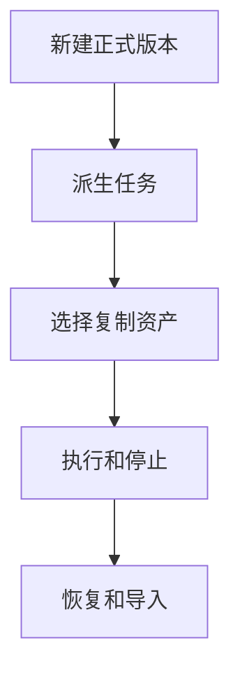
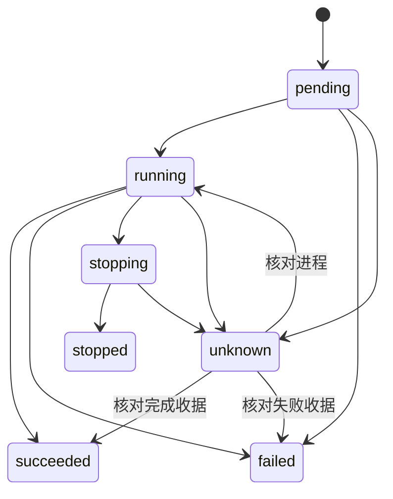
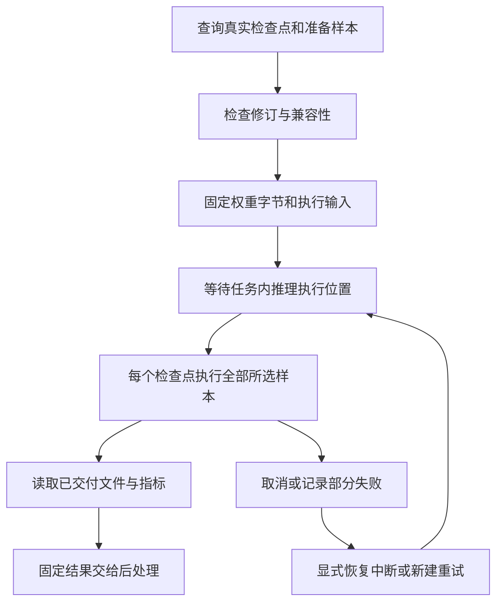
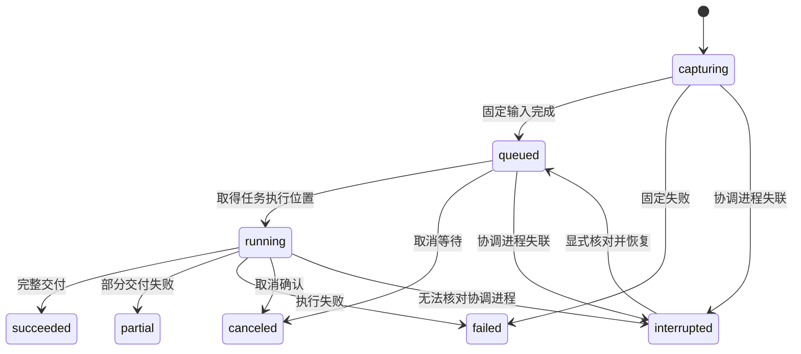
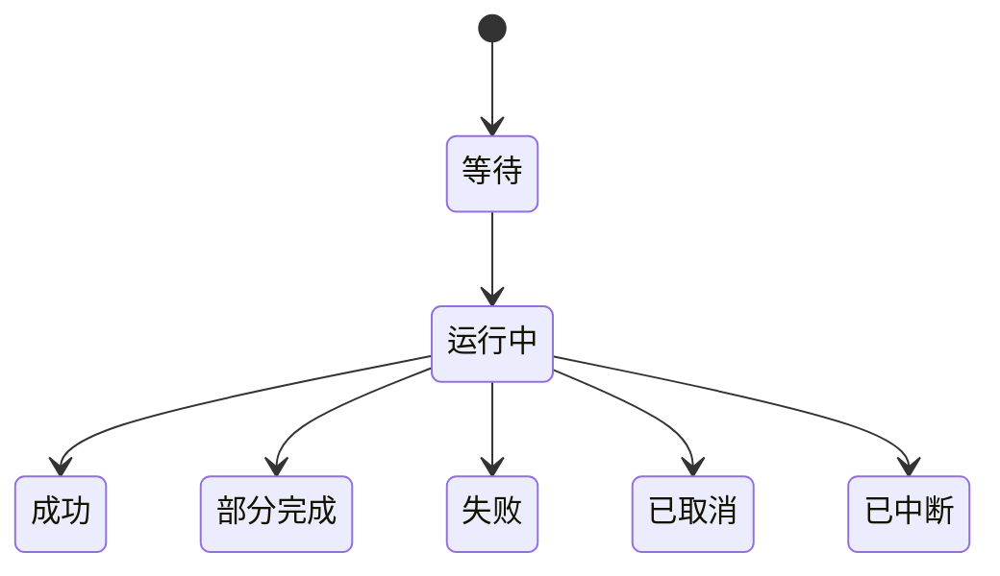

# 任务创建、派生与本地运行

## 目录

- [四、固定结果目录与评价管理](#四固定结果目录与评价管理)
  - [4.1 背景与定位](#41-背景与定位)
  - [4.2 核心业务操作流程图](#42-核心业务操作流程图)
  - [4.3 业务状态机](#43-业务状态机)
  - [4.4 状态值说明](#44-状态值说明)
  - [4.5 功能点清单](#45-功能点清单)
  - [4.6 功能点详解](#46-功能点详解)

- [项目任务可视化交接](#项目任务可视化交接)

- [一、任务创建、派生与本地运行](#一任务创建、派生与本地运行)
  - [1.1 背景与定位](#11-背景与定位)
  - [1.2 核心业务操作流程图](#12-核心业务操作流程图)
  - [1.3 业务状态机](#13-业务状态机)
  - [1.4 状态值说明](#14-状态值说明)
  - [1.5 功能点清单](#15-功能点清单)
  - [1.6 功能点详解](#16-功能点详解)

- [三、独立推理批次](#三独立推理批次)
  - [3.1 背景与定位](#31-背景与定位)
  - [3.2 核心业务操作流程图](#32-核心业务操作流程图)
  - [3.3 业务状态机](#33-业务状态机)
  - [3.4 状态值说明](#34-状态值说明)
  - [3.5 功能点清单](#35-功能点清单)
  - [3.6 功能点详解](#36-功能点详解)

## 一、任务创建、派生与本地运行

### 1.1 背景与定位

面向通过 Python 或命令行开展研究的人员，提供任务创建、派生与本地运行。本期为本地单项目能力，不包含 Web 服务、远程调度或生产规模训练承诺。

### 1.2 核心业务操作流程图

### 1.3 业务状态机

### 1.4 状态值说明

| 中文含义 | 标识 | 业务说明 |
| --- | --- | --- |
| 待启动 | pending | 已保存执行意图 |
| 运行中 | running | 进程身份已核对 |
| 成功 | succeeded | 真实运行摘要与完成收据一致 |
| 失败 | failed | 启动或计算失败 |
| 停止中 | stopping | 等待确认 |
| 已停止 | stopped | worker 已结束并确认停止请求 |
| 待核对 | unknown | 不具备足够证据，不自动重提 |

### 1.5 功能点清单

1. 新建正式版本
2. 派生任务
3. 选择复制资产
4. 执行和停止
5. 恢复和导入
6. 阶段检查与正式产物

7. 原始处理配置与检查
8. 显式配置替换

### 1.6 功能点详解

#### 1. 新建正式版本

新增配置修订读取及原子保存，编辑和运行不新增版本。旧修订拒绝覆盖，归档任务拒绝配置保存。模板尚未绑定数据允许创建任务，执行输入检查仍严格。

new 从模板、用户目录或空目录创建任务，同时建立正式版本。受信任调用方可在创建快照前注入已登记案例配置，因此案例选择属于版本创建事实；浏览器不提供任意 Python 路径。空代码任务可编辑，但没有有效入口时不能运行。

平台选择案例但尚未绑定数据时，任务配置保留明确的空来源；不会把模板开发机路径自动视为用户输入。后续绑定通过公开配置保存更新任务副本，不创建新版本。首次读取仍核验真实路径，失效来源不能当作有效数据。

#### 2. 派生任务

fork 默认采用父任务当前代码，也可选创建快照或固定运行。只复制代码与选择的资产，不复制历史运行；直接父来源与比较基线分别记录。

#### 3. 选择复制资产

数据集、准备产物、检查点分别选择，默认不复制。未复制输入保持来源引用，选中资产复制后更新子任务输入位置。复制权重不自动恢复训练。父任务已完成运行的准备产物与检查点也可按模板声明复制；默认最近完整成功运行，可指定固定运行。复制结果保留来源及依赖，独立列出，不自动绑定训练输入。

#### 4. 执行和停止

每次执行捕获代码与配置，结果保存在对应任务内。停止等待进程确认；无法确认的状态保留待核对，不重复启动。

阶段摘要来自正式运行记录，查询不会创建执行。最新正式记录表达相应阶段状态；试跑不标记正式完成。多阶段运行失败且缺少逐阶段终态时显示无法确认，不由阶段顺序或报告存在推测已完成。摘要不覆盖历史记录，也不证明修改后的配置已通过检查。

#### 5. 恢复和导入

恢复采用指定运行的捕获代码与配置并注入检查点，创建新的运行记录，不增加正式版本。离线导入核对身份与内容冲突，旧记录来源未知时明确标注。

#### 6. 阶段检查与正式产物

任务检查使用固定配置修订，在独立进程调用受信任的领域检查入口，管理进程不加载模型。子进程失败取标准错误最后一行；`KeyError` 保留字段名并写成「检查缺少必要字段 …」，避免页面只出现单独的 `'dataset'`。提交时在任务事务中再次核对配置修订。试跑与正式运行模式保存在任务记录，试跑不进入正式物理清单、准备记录或检查点候选。物理清单与准备候选来自真实成功运行和当前存在的文件；文件可落在项目、任务目录或调用方给出的可见根内，不只认项目相对路径。推理专用检查点候选另允许训练中完整已提交权重，仍须核验元信息和内容修订；输入来源由调用方显式选择。多阶段模板可由受信任调用方指定本次阶段实际消费的已声明输入子集；默认提交仍严格捕获全部输入。原始处理不校验尚未生成的下游清单，准备、训练和推理要求各自真实输入，新后处理消费固定结果。

版本分阶段详情采用 creation_snapshot 固定参数和快照摘要；其后编辑工作目录不影响创建事实。附属运行各自保存 run_id、阶段、模式、状态与时间，读取者不能把当前最新运行归到所有阶段。

#### 7. 原始处理配置与检查

- 新建平台任务将数据集默认值展开为任务配置，普通读取不增加修订。ShapeNet 官方案例展开后 VTKHDF 为开，NASA 为关；已保存关闭保持原值。原始处理完整保存可替换该段，其他阶段不变；编辑、检查、试跑和执行均不创建任务版本。检查通过独立数据组件门面进行，保存核对配置修订，不能信任客户端传入的能力描述。

#### 8. 显式配置替换

普通配置保存合并未编辑字段，保留用户扩展；调用方明确指定整段替换时，允许替换原始处理、模型、训练及准备段。旧段先移除再装入新内容，旧键和不兼容的旧节点类型不参与合并。替换范围必须受控且请求包含对应内容；修订不一致拒绝整次写入，保存不新增研究版本。

换模型的业务默认值由平台提供，任务只执行受控保存。调用者提供候选配置时，仅允许独立描述，不执行、训练或写入任务；候选描述仍核对任务修订。复制目录的脚本与自定义能力入口保持原样，普通保存继续保留未编辑扩展；显式替换的段不继承旧扩展。

## 项目任务可视化交接

### 2.1 背景与定位

任务提供明确的可视化保存位置，读取和保存不会新增研究版本。归档任务不能接受新保存或导出；任务内已保存配置可继续读取。

### 2.2 核心业务操作流程图

### 2.3 业务状态机

本章沿用任务归档状态；交互会话与导出状态由独立可视化模块负责，不在本模块复制状态机。

### 2.4 状态值说明

可写任务允许保存和导出；归档任务只允许读取既有配置。数据缺失或修订变化显示错误，不能作为成功重开。

### 2.5 功能点清单

1. 明确任务保存上下文。
2. 固定来源与配置资产交接。
3. 独立工作区与显式输出。

### 2.6 功能点详解

#### 1. 明确任务保存上下文

保存位置属于选定项目任务；不要求迁移原数据，不创建新的研究版本。

#### 2. 固定来源与配置资产交接

只保存引用、处理步骤与显示配置；输入修订和配置修订分别校验。缓存删除不影响读取配置。

#### 3. 独立工作区与显式输出

页面与脚本共享业务入口；图片、视频和提取数据只在明确输出操作时生成。配置保存和导出是两个操作。

默认展开在 tasks/create.py 创建版本快照前调用 tasks/rawprep.py 的独立检查进程完成，刚创建的工作目录与版本配置一致；fork 保留原配置语义。

## 三、独立推理批次

### 3.1 背景与定位

面向当前任务的研究人员，选择多个训练检查点和同一准备记录中的样本，生成可追溯、互不覆盖的预测结果。推理创建运行记录，不创建正式研究版本，不修改训练设置或权重；本地同任务串行执行，不承担通用集群调度。模型兼容和数值评价交给公开算法能力，管理进程不加载模型。

### 3.2 核心业务操作流程图

### 3.3 业务状态机

### 3.4 状态值说明

| 中文含义 | 标识 | 业务说明 |
| --- | --- | --- |
| 固定输入 | capturing | 捕获配置、代码和实际权重字节，尚不代表模型开始计算 |
| 等待执行 | queued | 等待同任务推理执行位置 |
| 运行中 | running | 子运行正在执行，进度来自实际交付账本 |
| 成功 | succeeded | 选定检查点及样本完整交付 |
| 部分失败 | partial | 保留已交付结果，不冒充总体成功 |
| 失败 | failed | 固定、启动或计算失败，原因保留 |
| 已取消 | canceled | 取消已确认，成功文件仍可读取 |
| 已中断 | interrupted | 协调进程失联，需要显式核对，不能盲目重跑 |

批次与子运行各自保留状态。样本结果完成数和完成检查点数分别显示，不按页面停留时间推算进度。

### 3.5 功能点清单

1. 查询和检查推理来源
2. 固定权重与执行输入
3. 串行批次、取消和恢复
4. 交付固定结果及历史兼容

### 3.6 功能点详解

#### 1. 查询和检查推理来源

检查点可来自当前任务不同训练运行，包括训练中已经完整提交的文件；临时文件和虚构轮次不可选。选择必须包含内容修订。同一批次检查准备摘要和模型声明，样本必须属于所选分片，不接受重复样本或重复内容的检查点标签。候选通过不表示任意当前配置兼容，正式预检仍核对配置与来源。没有选择时不自动填最近权重或全部样本。

设备列表反映实际可用设备及已知任务占用；自动选择优先避开占用，否则使用 CPU。用户可以明确共享设备，计算失败不静默换设备或缩减样本。外部进程占用不作为本地管理模块能够完整识别的承诺。

#### 2. 固定权重与执行输入

检查点按用户选定内容完整复制并核对摘要后发布到任务私有资产区，禁止以可变标签路径或硬链接代替。本次输入不随后续训练更新；候选修订变化须重新选择。代码、配置、准备引用及有序样本声明在执行前捕获；排队期间修改任务不改变已提交批次。源数据继续引用，不因批量推理复制整份数据集。

#### 3. 串行批次、取消和恢复

每个检查点与分片组合产生一个子运行，在其中处理该分片所选样本，各组合顺序执行；同任务的不同批次等待同一推理锁。关闭页面不停止批次。取消作用于该批次待启动项和活动推理，不停止训练。失败保留已提交文件，其他检查点可继续；重试生成新批次和新运行，不覆盖原结果。

重复提交按同一请求身份返回原对象，身份复用但内容变化必须报冲突。协调进程中断时显式核对进程和完成收据；无法确认的子运行不自动重复提交。批次创建、取消、恢复和重试都不新增研究版本。

跨分片选择按“检查点×分片”拆分子运行，单检查点完整字节只固定一次。检查点数、子运行数和预测样本组数分别记录；当前批次完整状态覆盖推理步骤摘要。重试保留原成功子运行来源，并为失败分片创建新运行；部分失败不能因最后一个子运行成功而显示完成。

#### 4. 交付固定结果及历史兼容

只列出完整报告或账本确认已经提交的文件，不扫描残留目录推测成功。每组结果保留检查点修订、运行、样本和字段声明。指标是否可比由算法能力判断，部分结果允许读取但不能发布完整总体比较。

新独立推理交付结果给后处理，后处理读取不重新恢复模型。旧 post 调用入口保留历史执行语义；平台旧模板必须先被明确识别，兼容范围仍在核验，不能根据文件名放行未知修改，也不批量替换用户脚本或改写历史产物。

只评价的轻量指标同样进入结果目录。跨分片样本身份始终包括分片，不合并同名样本。统计和CSV/Excel导出从固定结果生成，经隔离计算调用完成，管理进程不加载模型；新旧结果资产均可被下游登记和选择。

## 四、固定结果目录与评价管理

### 4.1 背景与定位

任务内可浏览全部结果，独立提交评价记录，不改变研究版本。

### 4.2 核心业务操作流程图

### 4.3 业务状态机

### 4.4 状态值说明

等待表示固定请求已提交；运行中只采用实际完成数量；成功要求全部交付；部分完成保留成功项并披露失败项；取消不发布完整成功；中断不自动重新执行。

### 4.5 功能点清单

1. 任务结果目录。
2. 评价提交与恢复。
3. 查询取消与导出。

### 4.6 功能点详解

#### 1. 任务结果目录

按推理批次、checkpoint、样本和真实文件组织，历史后处理单独分组。评价目录只读清单得到样本和物理量，不给结果文件做内容摘要；文件树按当前层列举，点开再取子项，搜索才按路径匹配尚未展开的文件。单个坏分支提示错误，其他结果仍可访问；不把未提交文件作为成功结果。提交评价时才固定成员内容修订。

#### 2. 评价提交与恢复

校验当前任务、归档状态、固定结果修订及指标选择。相同请求身份复用记录，冲突拒绝。后台执行独立于页面，进程失联标记中断，需要显式重新计算。

#### 3. 查询取消与导出

查询进度和已提交行；取消在样本边界生效，已完成行保留。导出绑定固定评价及行身份，筛选与分页不应误丢结果。
