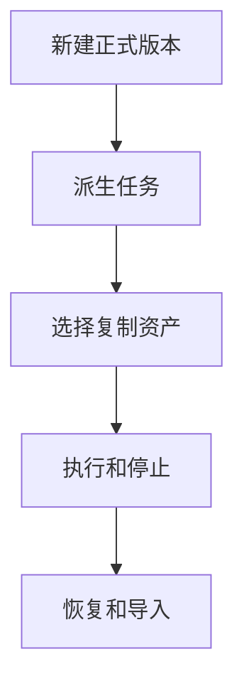
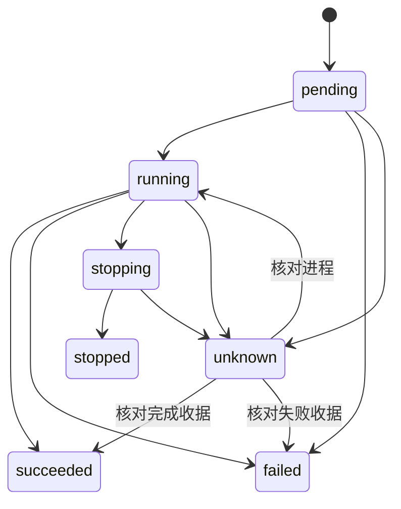
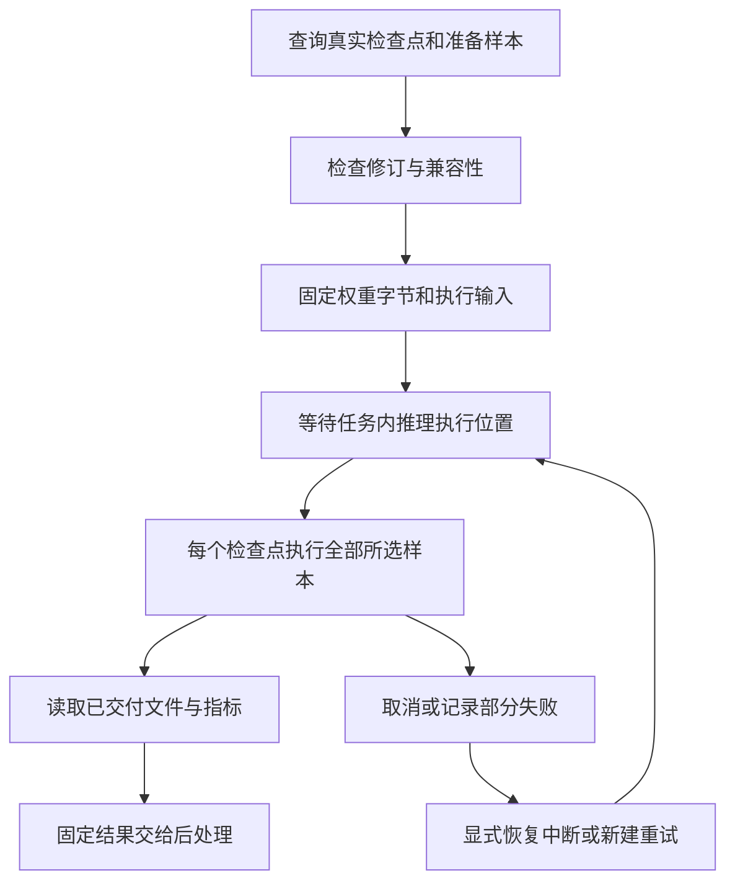
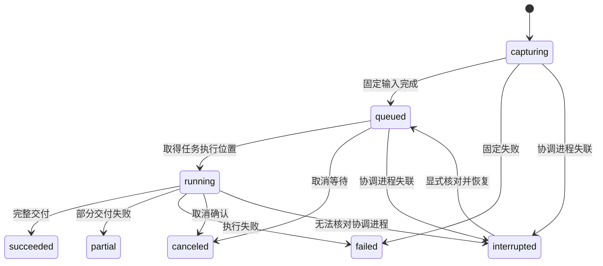
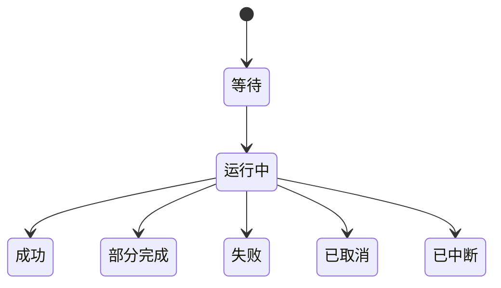

# 任务创建、派生与本地运行

## 目录

- [一、任务创建、派生与本地运行](#一任务创建派生与本地运行)
  - [1.1 背景与定位](#11-背景与定位)
  - [1.2 核心业务操作流程图](#12-核心业务操作流程图)
  - [1.3 业务状态机](#13-业务状态机)
  - [1.4 状态值说明](#14-状态值说明)
  - [1.5 功能点清单](#15-功能点清单)
  - [1.6 功能点详解](#16-功能点详解)
- [项目任务可视化交接](#项目任务可视化交接)
  - [2.1 背景与定位](#21-背景与定位)
  - [2.2 核心业务操作流程图](#22-核心业务操作流程图)
  - [2.3 业务状态机](#23-业务状态机)
  - [2.4 状态值说明](#24-状态值说明)
  - [2.5 功能点清单](#25-功能点清单)
  - [2.6 功能点详解](#26-功能点详解)
- [三、独立推理批次](#三独立推理批次)
  - [3.1 背景与定位](#31-背景与定位)
  - [3.2 核心业务操作流程图](#32-核心业务操作流程图)
  - [3.3 业务状态机](#33-业务状态机)
  - [3.4 状态值说明](#34-状态值说明)
  - [3.5 功能点清单](#35-功能点清单)
  - [3.6 功能点详解](#36-功能点详解)
- [四、固定结果目录与评价管理](#四固定结果目录与评价管理)
  - [4.1 背景与定位](#41-背景与定位)
  - [4.2 核心业务操作流程图](#42-核心业务操作流程图)
  - [4.3 业务状态机](#43-业务状态机)
  - [4.4 状态值说明](#44-状态值说明)
  - [4.5 功能点清单](#45-功能点清单)
  - [4.6 功能点详解](#46-功能点详解)

## 一、任务创建、派生与本地运行

### 1.1 背景与定位

面向通过 Python 或命令行开展研究的人员，提供任务创建、派生与本地运行。本期为本地单项目能力，不包含 Web 服务、远程调度或生产规模训练承诺。

Task 的产品边界是研究管理，不是模型领域。任务保存项目、版本、输入绑定、运行、资产、检查点引用、结果和恢复事实；模型结构、损失、采样、物理约束以及检查点科学兼容性由任务声明的 application/provider 负责解释。Task 不按模型或案例分支，也不要求不同领域共享同一科学数据结构，这样不同领域仍可用相同管理维度进行比较。

### 1.2 核心业务操作流程图

### 1.3 业务状态机

### 1.4 状态值说明

| 中文含义 | 标识 | 业务说明 |
| --- | --- | --- |
| 待启动 | pending | 已保存执行意图 |
| 运行中 | running | 进程身份已核对 |
| 成功 | succeeded | 真实运行摘要与完成收据一致 |
| 失败 | failed | 启动或计算失败 |
| 停止中 | stopping | 等待确认 |
| 已停止 | stopped | worker 已结束并确认停止请求 |
| 待核对 | unknown | 不具备足够证据，不自动重提 |

### 1.5 功能点清单

1. 新建正式版本
2. 派生任务
3. 选择复制资产
4. 执行和停止
5. 恢复和导入
6. 阶段检查与正式产物

7. 原始处理配置与检查
8. 显式配置替换

### 1.6 功能点详解

输入槽改绑后，资产捕获先核对继承引用是否仍指向当前路径；不匹配则重新查找共享资产，保留新资产的依赖闭包与可搬移目录。派生复制不得因该槽曾绑定旧文件而只复制新清单。此行为适用于所有具名准备资产，不解释其领域格式；既有资产与历史快照不改写。

#### 1. 新建正式版本

新增配置修订读取及原子保存，编辑和运行不新增版本。旧修订拒绝覆盖，归档任务拒绝配置保存。模板尚未绑定数据允许创建任务，执行输入检查仍严格。

new 从模板、用户目录或空目录创建任务，同时建立正式版本。受信任调用方可在创建快照前注入已登记案例配置，因此案例选择属于版本创建事实；浏览器不提供任意 Python 路径。空代码任务可编辑，但没有有效入口时不能运行。

平台选择案例但尚未绑定数据时，任务配置保留明确的空来源；不会把模板开发机路径自动视为用户输入。后续绑定通过公开配置保存更新任务副本，不创建新版本。首次读取仍核验真实路径，失效来源不能当作有效数据。

#### 2. 派生任务

fork 默认采用父任务当前代码，也可选创建快照或固定运行。只复制代码与选择的资产，不复制历史运行；直接父来源与比较基线分别记录。

#### 3. 选择复制资产

数据集、准备产物、检查点分别选择，默认不复制。未复制输入保持来源引用，选中资产复制后更新子任务输入位置。复制权重不自动恢复训练。父任务已完成运行的准备产物与检查点按公共资产索引发现，可指定固定运行。复制权重保留来源，不自动绑定训练输入。发布者声明自包含目录的数组清单随整个目录复制，管理引用随子任务重定位，科学清单字节不改。未声明或含外部依赖的非便携资产拒绝复制，仍可引用；不能只复制清单后声称数据已独立。

#### 4. 执行和停止

新提交同时保存可选应用来源。应用来源固定入口、静态可发现依赖、声明的动态模块与资源，以及实际导入解析位置。来源记录 version=2；内容变化或同名遮蔽拒绝执行，新增无关能力文件允许。动态依赖通过应用模块的 SOURCE_DEPENDENCIES.modules/files 声明，资源相对声明模块定位。只覆盖应用依赖，不冻结解释器、驱动或整个第三方运行环境。历史记录缺少依赖覆盖时对应操作明确不可用，固定历史文件仍可读取，不自动补写来源。用户本地依赖随代码副本重定位，外部依赖保留真实位置；描述与原始处理缓存使用完整来源修订，排队后启动、恢复、固定评价和导出再次核验，失败形成终态，不切换到当前任务另一入口。

静态发现扫描 Python 导入及常量模块名；运行时拼接的模块名和读取的资源需要显式声明。`source_dependencies.RUNTIME_PACKAGES` 列出的数值、存储及展示运行库只固定直接导入文件、解析位置和发行版本，不递归检查运行库全部内部实现；用户安装的应用包仍递归发现。来源门禁不等同于完整运行环境可复现或对任意动态 Python 行为的沙箱保证。

应用操作接收运行身份、状态与目录引用，不内嵌读取运行时附带的 summary、lineage 科学产物。应用按固定运行目录读取原件，管理层不把未评价的无穷占位当作有效指标，也不修改历史摘要。依赖内嵌摘要的自定义应用应改为读取所交接运行目录；其他请求与响应仍遵守严格 JSON 约束。

正式原始处理按入口分配共享物理目录，运行记录仍属于发起任务，准备副本、训练和预测归任务。本次覆盖许可参与捕获请求和幂等指纹，明确替换配置时，可由调用方附带受控脚本清单与原件修订，在同一事务内保存配置和脚本，并保留备份。任一文件修订冲突或替换失败都回退本次文件变更；不创建研究版本，不解释模型或识别官方代码。

普通配置保存不能授权下次覆盖；相同幂等请求只执行一次，同名生产互斥。失败、中断、未知进程与发布失败均不能把半成品登记为完整数据。长时间复制和内容校验不持有项目数据库写事务。

每次执行捕获代码与配置，结果保存在对应任务内。停止等待进程确认；无法确认的状态保留待核对，不重复启动。

阶段摘要来自正式运行记录，查询不会创建执行。最新正式成功或失败记录表达相应阶段状态；试跑不标记正式完成。已成功的正式执行不会被后来的 unknown 读盘改成未运行，再次正式执行才按新结果更新该步。多阶段运行失败且缺少逐阶段终态时显示无法确认，不由阶段顺序或报告存在推测已完成。摘要不覆盖历史记录，也不证明修改后的配置已通过检查。

#### 5. 恢复和导入

公共配置迁移与数值恢复分开。离线迁移保留可编辑目录原件、候选差异与回滚日志，核验源码未在准备后改变才应用；应用后又被用户修改时拒绝覆盖回滚。旧运行、准备、检查点和正式版本快照不改写。旧源码迁移必须核验完整原件，导入或函数名相同不能证明用户没有改正文。Server 官方目录提供识别与候选清单；只有明确迁移时才按清单执行替换。打开、检查和提交任务不自动升级历史源码，本轮不执行历史任务迁移。阶段替换与任务捕获串行，普通写入异常恢复本次已替换的文件并保留失败收据。

恢复采用指定运行的捕获代码与配置并注入检查点，创建新的运行记录，不增加正式版本。离线导入核对身份与内容冲突，旧记录来源未知时明确标注。

#### 6. 阶段检查与正式产物

应用按配置修订和入口来源修订声明输入类别、标签需求、阶段及管理操作。候选标签逐项按 JSON 类型精确匹配；类型或用途缺失不得算匹配，多个匹配保留选择。候选名称保留生产者标签，文件名单独用于显示。生产标签随复制、共享与输入捕获保留；正式消费仍由应用检查科学适用性。普通脚本未提供描述仍可托管执行。

共享可用与本任务原始处理成功分别显示：复用另一任务的数据不会伪造本任务处理运行。旧运行的共享输出已被覆盖时，历史查询不得展示新数组为旧运行结果；比较使用当次发布与输入的固定内容摘要，而非仅凭同名。

任务检查使用固定配置修订，在独立进程调用受信任的领域检查入口，管理进程不加载模型。结构图操作由 application 准备网络、真实输入和两档显示参数，并调用 core ability 生成完整 HTML 与来源。Task 检查进程只传递请求和可序列化结果，不读取网络或调用 Vis；失败不发布半份页。可选检查入口只读公共配置 `components.application`；缺失时明确该操作不可用，不从历史描述文件或创建快照回填，也不按案例身份补写。子进程失败取标准错误最后一行；`KeyError` 保留字段名并写成「检查缺少必要字段 …」，避免页面只出现单独的 `'dataset'`。提交时在任务事务中再次核对配置修订。试跑与正式运行模式保存在任务记录，试跑不进入正式物理清单、准备记录或检查点候选。物理清单与准备候选来自真实成功运行和当前存在的文件；已停止或失败的正式运行，仅将公开索引中完整提交且仍存在的检查点列为训练恢复候选，不开放其余阶段产物、未登记残留或试跑权重；文件可落在项目、任务目录或调用方给出的可见根内，不只认项目相对路径。切步列举这些候选时只核公开索引结构、文件仍在且落在可见根内，不把检查点整文件再打一遍内容摘要；恢复训练、提交推理和读取准备仍核验元信息与内容修订，内容已变由执行侧拒绝。推理专用检查点候选另允许训练中完整已提交权重，选用时仍须核验元信息和内容修订；输入来源由调用方显式选择。多阶段模板可由受信任调用方指定本次阶段实际消费的已声明输入子集；默认提交按 inputs 的选定阶段严格捕获非空外部路径。原始处理不校验尚未生成的下游清单，准备、训练和推理要求各自真实输入，新后处理消费固定结果。

版本分阶段详情采用 creation_snapshot 固定参数和快照摘要；其后编辑工作目录不影响创建事实。附属运行各自保存 run_id、阶段、模式、状态与时间，读取者不能把当前最新运行归到所有阶段。

#### 7. 原始处理配置与检查

- 新建平台任务将数据集默认值展开为任务配置，普通读取不增加修订。ShapeNet 官方案例展开后 VTKHDF 为开，NASA 为关；已保存关闭保持原值。原始处理完整保存可替换该段，其他阶段不变；编辑、检查、试跑和执行均不创建任务版本。检查通过独立数据组件门面进行，保存核对配置修订，不能信任客户端传入的能力描述。

#### 8. 显式配置替换

明确换模可附带受控脚本清单和原件修订，与完整配置在同一事务保存。任何失败回退本次配置及脚本，备份与收据保留，不创建研究版本。Task 不识别模型或官方正文。

普通保存只负责修订核验、合并和原子提交。替换段可为任意合法顶层配置名称，不识别采样旧键。页面编辑联动由平台合成完整配置；旧科学配置通过应用显式转换。

平台已经合成完整配置时，可按当前修订完整保存；旧键不参与二次合并，删除、空映射和关闭选择不会恢复。该方式不迁移采样或解释算法参数，与普通补丁保存共用任务状态、共享输入绑定及原子提交约定。并发修订过期整次拒绝，编辑不新增版本；历史运行和创建快照不改写。保存成功后任务入口按当前 `config.yaml` 重新投影公共 `inputs.*`，不再保留创建时的 `dataset.root` / `train.manifest` 旧键；任务资产也只保留仍属于公共输入的绑定。

普通配置保存合并未编辑字段，保留用户扩展；调用方明确指定整段替换时，允许替换原始处理、模型、训练及准备段。旧段先移除再装入新内容，旧键和不兼容的旧节点类型不参与合并。替换范围必须受控且请求包含对应内容；修订不一致拒绝整次写入，保存不新增研究版本。

换模型的业务默认值由平台提供，任务只执行受控保存。调用者提供候选配置时，仅允许独立描述，不执行、训练或写入任务；候选描述仍核对任务修订。复制目录的脚本与自定义能力入口保持原样，普通保存继续保留未编辑扩展；显式替换的段不继承旧扩展。

## 项目任务可视化交接

### 2.1 背景与定位

任务提供明确的可视化保存位置，读取和保存不会新增研究版本。归档任务不能接受新保存或导出；任务内已保存配置可继续读取。

### 2.2 核心业务操作流程图

### 2.3 业务状态机

本章沿用任务归档状态；交互会话与导出状态由独立可视化模块负责，不在本模块复制状态机。

### 2.4 状态值说明

可写任务允许保存和导出；归档任务只允许读取既有配置。数据缺失或修订变化显示错误，不能作为成功重开。

### 2.5 功能点清单

1. 明确任务保存上下文。
2. 固定来源与配置资产交接。
3. 独立工作区与显式输出。

### 2.6 功能点详解

#### 1. 明确任务保存上下文

保存位置属于选定项目任务；不要求迁移原数据，不创建新的研究版本。

#### 2. 固定来源与配置资产交接

只保存引用、处理步骤与显示配置；输入修订和配置修订分别校验。缓存删除不影响读取配置。

#### 3. 独立工作区与显式输出

页面与脚本共享业务入口；图片、视频和提取数据只在明确输出操作时生成。配置保存和导出是两个操作。

默认展开在 tasks/create.py 创建版本快照前调用 tasks/rawprep.py 的独立检查进程完成，刚创建的工作目录与版本配置一致；fork 保留原配置语义。

## 三、独立推理批次

### 3.1 背景与定位

面向当前任务的研究人员，选择多个训练检查点和同一准备记录中的样本，生成可追溯、互不覆盖的预测结果。推理创建运行记录，不创建正式研究版本，不修改训练设置或权重；本地同任务串行执行，不承担通用集群调度。模型兼容和数值评价交给公开算法能力，管理进程不加载模型。

### 3.2 核心业务操作流程图

### 3.3 业务状态机

### 3.4 状态值说明

| 中文含义 | 标识 | 业务说明 |
| --- | --- | --- |
| 固定输入 | capturing | 捕获配置、代码和实际权重字节，尚不代表模型开始计算 |
| 等待执行 | queued | 等待同任务推理执行位置 |
| 运行中 | running | 子运行正在执行，进度来自实际交付账本 |
| 成功 | succeeded | 选定检查点及样本完整交付 |
| 部分失败 | partial | 保留已交付结果，不冒充总体成功 |
| 失败 | failed | 固定、启动或计算失败，原因保留 |
| 已取消 | canceled | 取消已确认，成功文件仍可读取 |
| 已中断 | interrupted | 协调进程失联，需要显式核对，不能盲目重跑 |

批次与子运行各自保留状态。样本结果完成数和完成检查点数分别显示，不按页面停留时间推算进度。

### 3.5 功能点清单

1. 查询和检查推理来源
2. 固定权重与执行输入
3. 串行批次、取消和恢复
4. 交付固定结果及历史兼容

### 3.6 功能点详解

#### 1. 查询和检查推理来源

检查点可来自当前任务不同训练运行，包括训练中已经完整提交的文件；临时文件和虚构轮次不可选。选择必须包含内容修订。application 返回带作用域的执行身份，Task 只核验其存在且类型和值相等；样本必须属于所选分片，不接受重复样本或重复内容的检查点标签。候选通过不表示任意当前配置兼容，正式预检仍核对配置与来源。没有选择时不自动填最近权重或全部样本。

设备列表反映实际可用设备及已知任务占用；自动选择优先避开占用，否则使用 CPU。用户可以明确共享设备，计算失败不静默换设备或缩减样本。外部进程占用不作为本地管理模块能够完整识别的承诺。

#### 2. 固定权重与执行输入

检查点按用户选定内容完整复制并核对摘要后发布到任务私有资产区，禁止以可变标签路径或硬链接代替。本次输入不随后续训练更新；候选修订变化须重新选择。代码、配置、准备引用及有序样本声明在执行前捕获；排队期间修改任务不改变已提交批次。源数据继续引用，不因批量推理复制整份数据集。

#### 3. 串行批次、取消和恢复

每个检查点与分片组合产生一个子运行，在其中处理该分片所选样本，各组合顺序执行；同任务的不同批次等待同一推理锁。关闭页面不停止批次。取消作用于该批次待启动项和活动推理，不停止训练。失败保留已提交文件，其他检查点可继续；重试生成新批次和新运行，不覆盖原结果。

重复提交按同一请求身份返回原对象，身份复用但内容变化必须报冲突。协调进程中断时显式核对进程和完成收据；无法确认的子运行不自动重复提交。批次创建、取消、恢复和重试都不新增研究版本。登记还在但状态文件已不在的批次，读取时明确说批次不存在或已被清理，不能冒充数据根未配置；列出历史时跳过这些空登记，不让整份列表失败。

跨分片选择按“检查点×分片”拆分子运行，单检查点完整字节只固定一次。检查点数、子运行数和预测样本组数分别记录；当前批次完整状态覆盖推理步骤摘要。重试保留原成功子运行来源，并为失败分片创建新运行；部分失败不能因最后一个子运行成功而显示完成。

#### 4. 交付固定结果及历史兼容

只列出完整报告或账本确认已经提交的文件，不扫描残留目录推测成功。每组结果保留检查点修订、运行、样本和字段声明。指标是否可比由算法能力判断，部分结果允许读取但不能发布完整总体比较。

独立推理批次执行 application 给出的子运行参数、输入位置与阶段，交付固定结果给后处理。进度来自应用提交的管理记录，缺记录保持未知，不能从保存、评价或预测分支猜测完成数。读取、重试和恢复固定同一应用来源；历史缺来源记录时科学操作明确不可用，保留普通文件浏览，不切换当前任务入口。官方脚本更新仅接受显式迁移操作，本轮不自动升级历史任务。

只评价的轻量指标同样进入结果目录。跨分片样本身份始终包括分片，不合并同名样本。统计和CSV/Excel导出从固定结果生成，经隔离计算调用完成，管理进程不加载模型；新旧结果资产均可被下游登记和选择。

结果查询同时交付逐分片统计与全部分片样本等权统计。全样本预期数量包含失败或未交付分片以及重试继承的成功范围，由任务固定输入确定；算法通过隔离调用计算，缺少某片结果时不会缩小预期范围。样本原始指标与记录中的性能计时统一交付给两种结果视图；表格配置、图表切换与导出均不创建推理子运行。

## 四、固定结果目录与评价管理

### 4.1 背景与定位

任务内可浏览全部结果，独立提交评价记录，不改变研究版本。

### 4.2 核心业务操作流程图

### 4.3 业务状态机

### 4.4 状态值说明

等待表示固定请求已提交；运行中只采用实际完成数量；成功要求全部交付；部分完成保留成功项并披露失败项；取消不发布完整成功；中断不自动重新执行。

### 4.5 功能点清单

1. 任务结果目录。
2. 评价提交与恢复。
3. 查询取消与导出。

### 4.6 功能点详解

#### 1. 任务结果目录

按推理批次、checkpoint、样本和真实文件组织，历史后处理单独分组；结果文件同时列出本任务发布或当前绑定的平台数据集、训练运行文件夹和推理批次。平台数据集用「平台数据集 ·」加名称，训练 run 用「训练运行 ·」加短号。处理后样本与推理 VTK 共用 `param1/<设计号>`；文件树用全角斜线把该编号收成一段，显示名仍是原来的 sample_id。有写出的预测、网格、分析与导出时按层展开 `data_dir` 中的这些目录。成功训练若关闭写出开关、或尚未写出，仍保留该 run 文件夹并说明没有预测或网格；失败开训同样可见，但不冒充已有结果。推理样本没有网格时列出「未写出VTK」及清单原因。评价目录只读已提交清单得到样本和物理量，训练若未写出清单则只出现在结果文件而不进入评价指标。不给结果文件做内容摘要；文件树按当前层列举，点开再取子项，搜索才按路径匹配尚未展开的文件。检查点、运行日志、原始处理和数据准备副本不进入结果文件。单个坏分支提示错误，其他结果仍可访问；不把未提交文件作为成功结果。提交评价时才固定成员内容修订。

#### 2. 评价提交与恢复

校验当前任务、归档状态、固定结果修订及指标选择。相同请求身份复用记录，冲突拒绝。后台执行独立于页面，进程失联标记中断，需要显式重新计算。

#### 3. 查询取消与导出

查询读取已发布快照或完整的增量结果行，不把中断的末尾半行计为交付；最终导出消费完整固定快照。评价操作可由任务局部连接提供，运行器持有取消、日志和运行记录，领域操作不创建第二套会话。

查询进度和已提交行；取消在样本边界生效，已完成行保留。导出绑定固定评价及行身份，筛选与分页不应误丢结果。
## 推理结果与平台数据集来源（2026-09-18）

推理结果目录按 checkpoint 保留完整结果状态；无统计值的 checkpoint 也必须可见。后处理结果文件按当前训练任务绑定的平台数据集、训练 run 和固定推理批次组织，不回退展示全部历史登记数据集。
