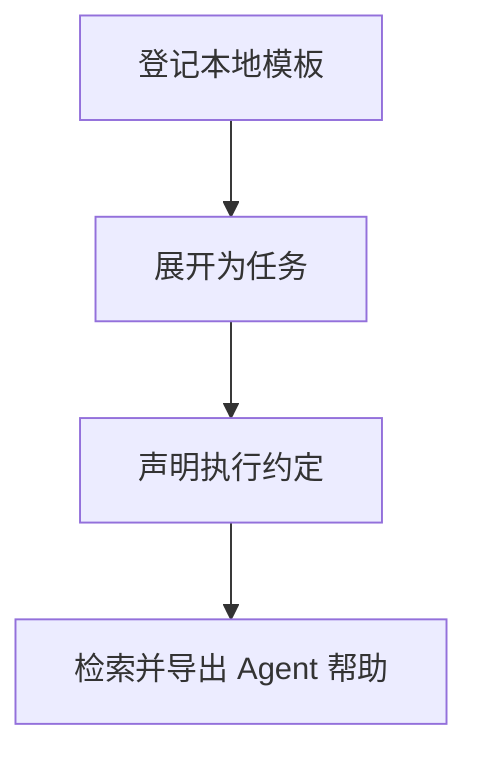

# 任务模板接入

## 目录

- [一、任务模板接入](#一任务模板接入)
  - [1.1 背景与定位](#11-背景与定位)
  - [1.2 核心业务操作流程图](#12-核心业务操作流程图)
  - [1.3 业务状态机](#13-业务状态机)
  - [1.4 状态值说明](#14-状态值说明)
  - [1.5 功能点清单](#15-功能点清单)
  - [1.6 功能点详解](#16-功能点详解)

## 一、任务模板接入

### 1.1 背景与定位

面向通过 Python 或命令行开展研究的人员，提供任务模板接入。本期为本地单项目能力，不包含 Web 服务、远程调度或生产规模训练承诺。

### 1.2 核心业务操作流程图

### 1.3 业务状态机

本章无独立业务状态机；操作结果及错误由各功能返回，创建记录不引入草稿或冻结状态。

### 1.4 状态值说明

本章无业务状态；资产核验和比较的结果状态在对应功能中说明。

### 1.5 功能点清单

1. 登记本地模板
2. 展开为任务
3. 声明执行约定
4. 检索并导出 Agent 帮助

### 1.6 功能点详解

#### 1. 登记本地模板

官方模板用 inputs 按阶段集中声明外部路径；科学参数和能力选择保留在所属阶段。任务不导入案例或转换模型参数。

模板保存名称、来源与摘要，官方案例和用户目录同等处理，不另复制维护一套官方算法。

#### 2. 展开为任务

复制模板得到独立工作目录，模板变化不影响已创建版本。输入相对路径按来源配置文件定位，不因副本位置改变语义。

#### 3. 声明执行约定

任务从复制目录的 pipeline.py 和 config.yaml 发现执行入口，不再读取逐案例 task-entry.json。`recipe_entry` 按当前配置投影公共 `inputs.*`，保存成功后刷新任务入口，不沿用创建时冻结的 `dataset.root` / `train.manifest`。直接运行与托管运行执行同一份 Python 正文；阶段选择仅限定范围，实际顺序由 Python 决定。

inputs 按阶段列出外部路径或空值；只固定本次所选阶段的非空输入。同次返回值由正文交接，独立阶段由用户选择固定来源。缺少配置、操作或产物索引只使相应管理功能不可用；已明确选择但缺失、损坏的输入阻止本次消费。源目录和输入路径不因复制位置改变语义。

运行报告和科学数据分开保存。正式共享输出使用项目数据名称，试跑使用任务私有目录，检查不发布。自由脚本允许编辑阶段和参数结构；未遵循公共约定的内容不会被管理层猜测补齐，进程成功也不自动证明研究阶段完成。

平台检查、评价和导出从所选领域模块发现可选公开操作，缺项只表示该操作不可用。旧任务若仍保留 `task-entry.json` 的 operations 声明则按该声明调用；当前副本写成空对象后不再从创建快照恢复。源码摘要保留来源，不按模板全文限制用户修改。旧配置和任务需显式离线迁移并保留原件；新执行入口不暗中改写旧脚本或挂接旧格式适配器。公共约定迁移仍在专项验收中，历史任务未因此自动切换。

#### 4. 检索并导出 Agent 帮助

安装资源同时提供 Agent Help Center。它按研究工作流、ability、application、recipe、Task、用户组件和案例组织 Markdown，并提供主题、符号、案例及源码位置的机器索引。支持 skill 的 Agent 先由 `dojo-research` 路由；无 skill 环境从启动指南定位同一帮助正文。

Python 调用方可以读取帮助版本和入口，按 kind、layer、domain 或案例列举主题，按自然语言、全限定符号、配置键、产物及错误搜索，读取一个主题正文，或按符号取得现行签名、稳定性、正文锚点和源码位置。明确任务词命中优先于泛化描述命中，精确符号、主题、案例和标题仍优先。搜索和读取只处理静态文本，不加载案例、recipe、模型或训练栈；可选 contrib 未安装时仍可查其说明。

帮助导出在目标目录创建 `docs/agent-help`，现有 guide 导出同时交付 skill、启动指南和完整帮助中心，不创建或修改目标目录的 `AGENTS.md`。未知主题、未知符号、非法过滤条件、损坏索引和缺失资源分别报告，不能回退到猜测结果。

帮助参考覆盖源码中公开外观的 ability、application 和 recipe 符号，但通过 stable、extension、advanced 与 internal-visible 区分兼容承诺。符号出现在索引中不表示训练有效或组件天然兼容；单个能力验证真实输入输出，完整流程验证阶段交接及固定产物读回。

能力导航按数据、几何采样、模型、损失、训练恢复、推理、评价、后处理和运行管理组织。研究技能、无技能指南与帮助首页使用同一份教程声明生成直达菜单，避免要求用户先知道函数名或猜搜索词。每个分支提供输入输出、真实小例子、适用边界和进一步说明，教程与机器索引随安装资源和离线导出一起交付。

用户可以选择单工具调用、接入已有研究代码或复制完整领域案例。单工具不要求项目、完整案例或统一配置树；已有代码保留科学目标，只在所选能力的合同处适配；完整案例继续遵循原复制、直接运行与按需托管流程。输入输出及数值语义相容时优先复用，具体科学或性能缺口可由用户函数承担并记录原因。这一调整只改变发现和接入指引，不改变数值 API 或已有案例的数学定义。
