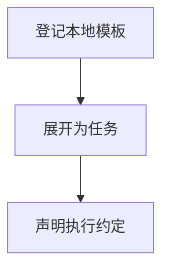

# 任务模板接入

## 目录

- [一、任务模板接入](#一任务模板接入)
  - [1.1 背景与定位](#11-背景与定位)
  - [1.2 核心业务操作流程图](#12-核心业务操作流程图)
  - [1.3 业务状态机](#13-业务状态机)
  - [1.4 状态值说明](#14-状态值说明)
  - [1.5 功能点清单](#15-功能点清单)
  - [1.6 功能点详解](#16-功能点详解)

## 一、任务模板接入

### 1.1 背景与定位

面向通过 Python 或命令行开展研究的人员，提供任务模板接入。本期为本地单项目能力，不包含 Web 服务、远程调度或生产规模训练承诺。

### 1.2 核心业务操作流程图

### 1.3 业务状态机

本章无独立业务状态机；操作结果及错误由各功能返回，创建记录不引入草稿或冻结状态。

### 1.4 状态值说明

本章无业务状态；资产核验和比较的结果状态在对应功能中说明。

### 1.5 功能点清单

1. 登记本地模板
2. 展开为任务
3. 声明执行约定

### 1.6 功能点详解

#### 1. 登记本地模板

案例模板显式绑定 trainprep.normalization.statistics，指标采样条件读取 trainprep.sampling；任务本身不导入案例或转换其配置。

模板保存名称、来源与摘要，官方案例和用户目录同等处理，不另复制维护一套官方算法。

#### 2. 展开为任务

复制模板得到独立工作目录，模板变化不影响已创建版本。输入相对路径按来源配置文件定位，不因副本位置改变语义。

#### 3. 声明执行约定

模板显式声明执行脚本、配置文件、输入资产类别、输出绑定及可选恢复键、运行产物类别与指标语义；未声明入口不可托管运行，不猜测案例字段。
