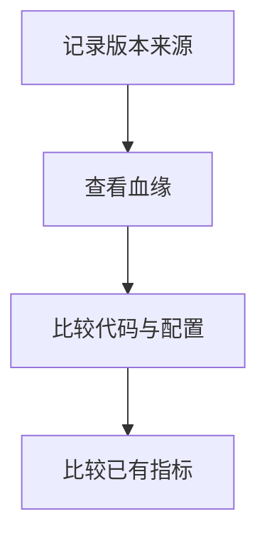

# 正式版本与血缘比较

## 目录

- [一、正式版本与血缘比较](#一正式版本与血缘比较)
  - [1.1 背景与定位](#11-背景与定位)
  - [1.2 核心业务操作流程图](#12-核心业务操作流程图)
  - [1.3 业务状态机](#13-业务状态机)
  - [1.4 状态值说明](#14-状态值说明)
  - [1.5 功能点清单](#15-功能点清单)
  - [1.6 功能点详解](#16-功能点详解)

## 一、正式版本与血缘比较

### 1.1 背景与定位

面向通过 Python 或命令行开展研究的人员，提供正式版本与血缘比较。本期为本地单项目能力，不包含 Web 服务、远程调度或生产规模训练承诺。

### 1.2 核心业务操作流程图

### 1.3 业务状态机

本章无独立业务状态机；操作结果及错误由各功能返回，创建记录不引入草稿或冻结状态。

### 1.4 状态值说明

本章无业务状态；资产核验和比较的结果状态在对应功能中说明。

### 1.5 功能点清单

1. 记录版本来源
2. 查看血缘
3. 比较代码与配置
4. 比较已有指标

### 1.6 功能点详解

#### 1. 记录版本来源

所有已声明的动态比较条件必须能够读取；缺失时指标标记 missing（证据缺失），即使两侧都缺失也不能判为相同。不同实际条件仍判为 incompatible（不可比）。

只有 new/fork 创建正式版本。创建记录保留完整快照；后续编辑与运行不改变它。单父血缘支持多根与多层派生，基线可独立选择。

#### 2. 查看血缘

按父版本查询整棵树或指定子树，不把测试次数作为正式版本节点。

#### 3. 比较代码与配置

正式版本比较默认使用创建快照；工作目录比较显示创建后变化；运行比较使用固定运行实际代码和配置。

#### 4. 比较已有指标

指标由运行公共索引提供，必须具有字段、单位、分片、归约定义及数据身份。比较前核验所有指标来源文件；文件缺失或变化为证据缺失，不从日志、模板或默认值补齐。没有指标索引时仍可比较代码和配置。

只有完整成功且量的字段、域、单位、分片及统计定义一致时标为可用；其他情况显示缺失、待完成或不可比及原因。保存比较固定引用，不随最新运行漂移。

分阶段查看使用 `read_version_details` 公开门面：先校验创建快照摘要，再读取其中固定配置，按 rawprep/trainprep/model/train/post 返回创建参数。关联运行附带明确 run_id、模式、状态、时间；当前工作目录修改不重写创建值。平台将某参数加入比较时保留 `stage.key` 路径与左右创建版本，缺失参数明确为 unavailable，不采用最新工作目录补值。
