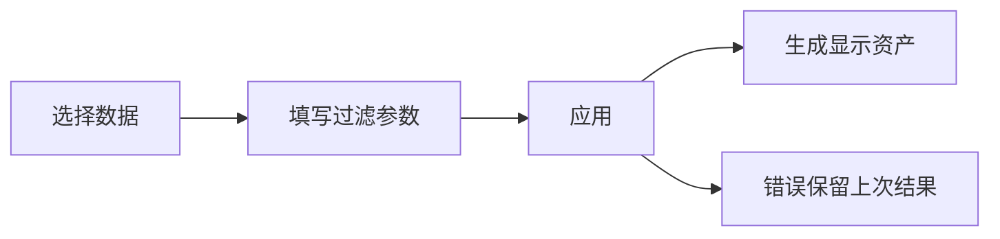

# 科学显示过滤

## 目录

- [一、显示过滤](#一显示过滤)
  - [1.1 背景与定位](#11-背景与定位)
  - [1.2 核心业务操作流程图](#12-核心业务操作流程图)
  - [1.3 业务状态机](#13-业务状态机)
  - [1.4 状态值说明](#14-状态值说明)
  - [1.5 功能点清单](#15-功能点清单)
  - [1.6 功能点详解](#16-功能点详解)

## 一、显示过滤

### 1.1 背景与定位
研究人员需要观察原始体网格内部或表面范围。过滤改变显示资产，不覆盖研究文件，不计算跨模型数值差异。

### 1.2 核心业务操作流程图

### 1.3 业务状态机
属性草稿尚未应用，提交后运行，成功形成派生显示资产，失败保留原资产。

### 1.4 状态值说明
读取、过滤和交付为转换阶段；无百分比时不显示虚假进度。生成实体不等同原节点。

### 1.5 功能点清单
1. 有限过滤。
2. 身份与类型门禁。

### 1.6 功能点详解

#### 1. 有限过滤
支持表面、平面切片/裁切、阈值和点标量等值。体数据先过滤，避免提前表面化丢失内部。表面切片通常产生线，不伪造封闭截面。
#### 2. 身份与类型门禁
点和单元字段分别处理；等值不自动转单元标量；点云不自动构建体。参数错误或字段不支持明确拒绝。新实体标记为派生，不能作为原始身份比较。

读取已有 `original_point_id` / `original_cell_id` 时，将其作为原始身份映射保留，不能替换为显示局部行号；原声明必须为与对应实体数一致的唯一整数数组。显示过滤可能生成新点，此时只声明派生身份。缺少原声明的普通网格使用该文件内的原始行序，来源修订同时固定。
