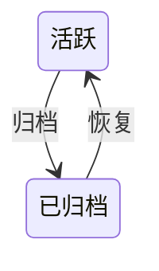
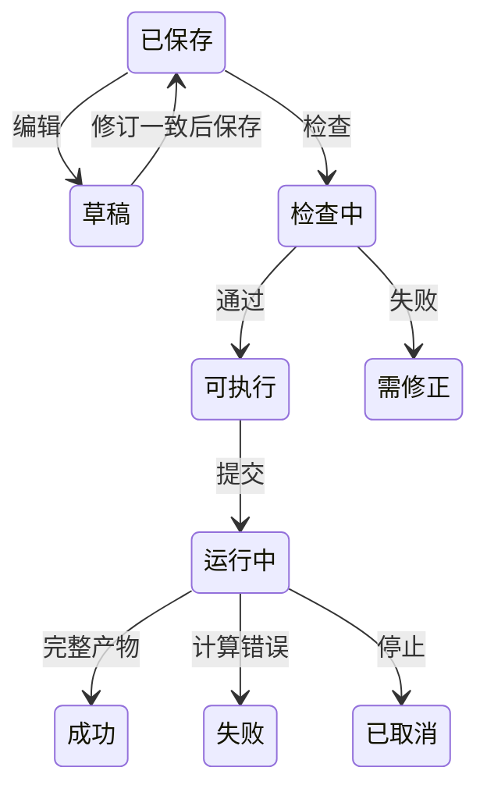

# Dojo WEB 平台产品设计

唯一交互基准：[工作台整合原型](../../../prototypes/dojo-web-integrated.html)。原型中的示例数据只作布局参考，正式界面消费真实业务。

> 版本：v2 整合平台，2026-09-10。状态：圈定真实链路及最终18项自动化浏览器验收通过。实际数据规模、原型尺寸对照和未开放范围见 `.context/mvp/web-integrated-acceptance.md`，不承诺所有状态逐像素一致或生产训练精度。
> 架构见[权威架构文档第 19 节](<../../../AI4E_Dojo_ARCHITECTURE (1).md#19-dojo-web--server-架构草案-v2>)。

## 目录

- [一、项目管理](#一项目管理)
  - [1.1 背景与定位](#11-背景与定位)
  - [1.2 核心业务操作流程图](#12-核心业务操作流程图)
  - [1.3 业务状态机](#13-业务状态机)
  - [1.4 状态值说明](#14-状态值说明)
  - [1.5 功能点清单](#15-功能点清单)
  - [1.6 功能点详解](#16-功能点详解)
- [二、任务工作台](#二任务工作台)
  - [2.1 背景与定位](#21-背景与定位)
  - [2.2 核心业务操作流程图](#22-核心业务操作流程图)
  - [2.3 业务状态机](#23-业务状态机)
  - [2.4 状态值说明](#24-状态值说明)
  - [2.5 功能点清单](#25-功能点清单)
  - [2.6 功能点详解](#26-功能点详解)

## 一、项目管理

### 1.1 背景与定位

围绕工程问题管理可追溯研究任务。项目六页签保留，项目报告、批量派生和排队运行不在本轮开放范围。管理记录与工作目录、运行事实区分，不能从目录存在推断成功。

### 1.2 核心业务操作流程图

### 1.3 业务状态机

### 1.4 状态值说明

活跃允许管理和执行；已归档保留记录但禁止新增运行，恢复后可继续操作。运行状态独立于管理状态。

### 1.5 功能点清单

1. 项目导航与管理
2. 任务管理与版本来源
3. 版本树与阶段详情
4. 固定比较
5. 项目报告
6. 文件管理
7. 批量运行

### 1.6 功能点详解

#### 1. 项目导航与管理

创建、查询、编辑、归档和恢复项目。列表显示真实名称、时间与状态，重启后恢复。归档保留历史，不等同于删除文件；已归档项目禁止新增研究运行。

首页采用整合原型的项目管理布局：范围页签、搜索与排序、两列封面卡、任务数、基线与日期、负责人区域以及明确的“进入项目”操作。封面是研究领域装饰示意，不作为计算结果；业务信息来自已登记记录，缺失信息显示未记录，不填原型示例值。侧栏整行可点击，选中状态和面包屑由当前页面决定。项目入口进入任务管理，任务列表明确提供“进入工作台”；首次点击侧栏工作台可选择真实项目任务，有有效最近任务时可继续。不能用提示用户自行寻找深层链接的占位页替代入口。

#### 2. 任务管理与版本来源

创建任务仅填写名称、描述并明确选择四组已登记的数据集与模型案例，选项直接展示数据集与模型，不预选默认案例，也不在创建弹窗绑定数据。弹窗错误留在窗内并保留已填内容；案例列表失败可重试。创建成功直接进入原始数据处理，继续选择该案例的数据来源。编辑任务仅修改名称和描述；派生继承来源任务的案例、配置和数据绑定，不能在派生弹窗改换模型或来源。只有创建和派生新增版本，编辑配置、检查、试跑和再次执行不新增版本。

新建、编辑与派生弹窗只借整合 HTML 最终浅蓝主题的字号、边框、圆角和主按钮颜色：宽 520、控件高 36、标签距 6、项距 16；窄屏两侧各留 24，长内容只滚正文。原型没有对应三字段表单，因此不宣称与不存在的原型表单逐像素一致。任务表以整合原型最终生效疏密为唯一对照，进度行左右 12px、步骤居中，不恢复原型 100px 左缩进；常用入口是进入工作台和血缘，编辑、派生与归档放在更多操作中。列表状态与筛选对照原型用已完成、运行中、草稿，并保留运行失败与已归档。工作台 Recipe 条对照整合 HTML 外壳，只写真实案例名和输入输出交接滚动，不提供示意模板配置或执行范围弹窗。列表显示真实阶段摘要，不用页面计时模拟进度。任务表与任务弹窗样式限定在任务管理，不作用到其它弹窗或工作台。

#### 3. 版本树与阶段详情

由真实来源关系构建树，节点可进入对应任务并查看阶段记录。创建版本、当前工作目录、固定运行是三种不同来源，详情必须明确显示，不能将当前编辑内容冒充历史创建状态。

页面对照整合 HTML 最终浅蓝主题：右侧 Fork、左图右检两栏、血缘图画布带缩放、节点卡片与来源连线、阶段下拉和输入/输出/参数分组。节点位置与连线按真实父版本计算，不使用原型固定 SVG 示意树或示例版本号。右侧只读创建快照参数和已有固定运行；当前工作目录不在此页展开。Fork 走真实派生，三字段约定与任务弹窗相同。

#### 4. 固定比较

比较配置和实际指标；缺失值保持缺失，不填零。保存比较固定任务版本、运行与资产修订，新运行不替换旧证据。同网格差值必须校验样本、实体、坐标、归属和单位，不因点数相同而放行；不自动插值或配准。三维比较使用统一工作区，每个窗口默认独立。

页外壳对照整合 HTML 的左侧 表格 / 趋势 / 三维可视化 导轨和对比参数条；表格承载真实创建记录、当前目录与固定运行比较。趋势不把文本或缺失值画成零；三维只接受已保存的固定运行。加入项目报告按钮不开放。

#### 5. 项目报告

入口保留但本轮不开放编辑、生成、审批或导出。既有历史报告记录不删除；不能把不可用按钮或演示文本计入交付。页面对照整合 HTML 两栏外壳与 PROJECT REPORT 提示，正文区只显示未开放说明和只读历史记录。

#### 6. 文件管理

按项目、任务、运行、类型筛选真实文件，支持查询、排序、刷新和下载；时间显示到分钟。刷新保留仍有效的选择。文件引用固定内容修订，内容变化后需要重新检查。预览显示实际文本、表格、张量、网格与字段，不使用原型示例结果。浏览器以登记身份访问文件，越界拒绝。页头对照整合 HTML「项目文件」工具条：任务版本、文件搜索、类型、排序与重置；表列用真实目录的范围、类型、大小和更新时间，不填示意文件行。

#### 7. 批量运行

批量派生、模拟排队及批量执行入口未开放，不创建假运行记录。单任务继续使用真实执行门面。页面对照整合 HTML 计划表与运行策略两栏外壳，不提供生成计划或演示运行。

## 二、任务工作台

### 2.1 背景与定位

将原型第 2–7 步接入现有案例工作流。配置保存在任务副本，数据统计留在产物；平台不实现数值算法，不提供未声明模型能力，不承诺生产规模精度。

### 2.2 核心业务操作流程图

### 2.3 业务状态机

### 2.4 状态值说明

草稿尚未保存；可执行只表示对应修订通过检查；成功要求真实运行完整交付。失败、取消、服务中断和源修订失效分别呈现，部分产物不可视为整体成功，未知进度不填百分比。

保存、检查与提交按钮在请求期间原生禁用并设置 aria-busy，名称保持业务动作。加载图标只是装饰，必须 aria-hidden，请求结束直接移除；快速响应不能因组件动画残留改变按钮名称或阻止下一操作。真实响应完成后恢复可操作状态，不以旧成功提示替代本次完成确认。

### 2.5 功能点清单

1. 任务上下文与操作
2. 数据采样
3. 原始数据处理
4. 数据准备
5. 模型设置
6. 训练设置
7. 训练运行
8. 后处理与三维工作区
9. 任务报告

### 2.6 功能点详解

#### 1. 任务上下文与操作

八步导航保持整合原型外壳：标题带状态与任务/项目/版本元信息，步骤条用最终浅蓝主题的圆形序号与连线，不用 Ant Design Steps。任务表与工作台共用「数据采样 / 原始处理 / 数据准备 / 模型设置 / 训练设置 / 训练运行 / 后处理 / 报告」。第 2–7 步接入真实工作流，第 1 步数据采样和第 8 步报告保留未开放入口。每阶段一个统一执行区，检查、试跑、正式运行分别表达；不为每项清洗单独落盘。编辑任务配置需要保存修订，取消不修改已保存内容。原始处理在绑定有效且已选文件时可以执行；若设置未保存，执行会先写入当前修订再提交，不另拦主按钮。冲突明确提示，不能静默覆盖。并行线程固定为一并置灰。试跑产物独立标记，不作为默认正式输入。步骤条下对照整合 HTML 放 Recipe 条：真实案例徽章、流程文案和「输入输出交接」滚到本页真实绑定；不复刻模板配置、执行范围或示例产物弹窗。第 2–7 步内部对照对应细节页（三栏原始处理 / 数据准备，两栏模型与训练，运行监控摘要加左右栏，后处理横向配置与页签），不改成示意两栏配置页。

#### 2. 数据采样

CAE 采样入口暂不开放。它与模型的点、锚点、查询采样不同，不能把模型采样移入此页或把模拟排队当真实执行。

#### 3. 原始数据处理

数据来源在当前阶段按案例绑定：ShapeNet 选择一个数据目录，NASA 分别选择训练、测试和拓扑文件，允许来自不同受控数据根。用户通过真实目录浏览选择，不能手填任意本机路径。未绑定或来源失效时禁止执行；来源有效仅表示范围、存在性与文件类型通过检查，不代表完整样本已通过检查。修改绑定前先保存当前处理设置，绑定保存核对配置修订；冲突明确报错。成功后重新读取当前配置并清空旧文件和样本选择，避免把上一来源的选择带入新计算。

左侧文件区对照细节原型：第一行是「原始数据处理 / 处理结果」页签与已选计数，第二行左侧刷新、右侧绑定。处理页浏览已绑定来源，结果页浏览运行产物。NASA 三个来源分别保留受控根与文件身份，文件不自动勾选或补齐。不放示意模板匹配或导入目录。执行配置用标题说明、执行设置盒、数量行和主执行按钮；检查与试跑留在盒内次要入口。

优先 ShapeNet 表面与 NASA CRM 表面。保留原型文件、处理设置、执行三栏及底部日志。文件数量与文件内样本数量分别展示；全部选择开启时数量同步且不可编辑，关闭后按稳定顺序截取，完整样本校验缺件拒绝，不自动补齐。NASA 共享拓扑依赖由数据适配描述，不能套用汽车文件命名。字段树读取真实文件，几何、点、单元与全局成员分开。提取容器可增删改，输出切换同步勾选，取消不提交草稿。多输出保留成员归属和实体身份，不强制拼接。落盘对照细节原型勾选 PT 与可选 VTKHDF，Zarr 标明待接入；训练分片统计用三项策略勾选，不下手填数值。弹窗无格式和目录控件。结果统一从文件列表打开，执行区不放假结果卡片。

#### 4. 数据准备

三栏对照细节原型：左栏「数据集 / 处理结果」页签选正式物理清单并列出真实文件，中栏处理方法卡编辑字段映射、归一化方法和物化，右栏执行盒启动准备。栏间距 9px、三栏等高 640px，步骤条高 56、上下 15/10，布局顶距 10，底部日志高 62。均值、标准差、Min/Max 统计只能从训练数据计算或读取已冻结记录，彻底移除手工输入。验证与测试不参与拟合；更换数据、字段、模型输入或模型采样后检查准备兼容性。Min-Max 与旧坐标归一化使用统一能力，目标区间与数据统计明确区分。PT/Zarr 都可直接读取。采样配置移到模型页，准备页只读冻结声明，避免过期记录被训练复用。

#### 5. 模型设置

参数来自所选案例 YAML，支持已接入 AB-UPT 与 Transolver-3 的合法配置。点、锚点和查询采样在模型设置管理；旧单键兼容，旧新键同时出现拒绝。结构通过真实模型、真实配置和合法输入执行 TorchVista 跟踪，异步返回资产与来源；跟踪失败显示真实原因，不替换为示意结构图。加载权重初始化与恢复训练分开。没有配置入口的既有算法能力列为待确认差异，不自行暴露任意 Python 组件。

#### 6. 训练设置

训练轮次、批大小、优化器、调度、精度、EMA、诊断和评估只展示当前案例实际支持且有配置的参数，按类型与合法范围编辑，不把对象当自由文本。能力不存在就不提供；能力已存在但 YAML 未接入时单独确认。保存参数不自动训练，配置检查不能冒充正式训练结果。

#### 7. 训练运行

按已冻结输入提交准备并训练或消费兼容准备记录。展示真实运行状态、实际损失与评价记录、日志和本机资源；没有的 Cd/Cl、百分比或硬件指标保持不可用，不合成曲线。停止不保证产生新检查点，恢复只选择已存在且兼容的检查点。断线后重新读取快照和事件，不重复提交、不把连接失败改成运行失败。

#### 8. 后处理与三维工作区

消费固定检查点和准备产物，显示真实评价、预测及文件。页面对照整合 HTML 后处理步：阶段标题下用横向配置条选择运行、准备记录、检查点与已有后处理开关，再用「指标数据 / 图表 / 结果可视化」下划线页签；默认打开三维三栏（结果文件、可视化资产、三维窗口）。指标与图表只展示当前运行真实评价，不复刻示意多模型徽章、假曲线或假弹窗。统一工作区分开数据源、管线、表示、窗口；最多四窗口。基础 VTK 支持网格、点云、切片、裁切、阈值、等值线或面；体网格先过滤再生成显示表面，点云不自动重建。点场、单元场、向量分量、模长和无效值明确表达。属性草稿应用成功才替换有效结果。相机联动默认关闭，字段和色标独立启用，不兼容坐标或单位不能精确联动。场景固定源修订保存，重开恢复；截图是显示证据，不是新的科学数组。关闭窗口释放资源，一个窗口失败不清空其他窗口。

#### 9. 任务报告

本轮保留未开放入口，不提供报告编辑、发布、审批或导出，不删除既有记录。研究证据通过固定运行、比较和场景保存。
