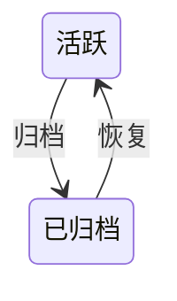
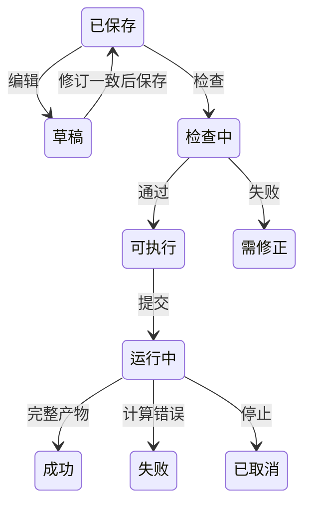

# Dojo WEB 平台产品设计

唯一交互基准：[工作台整合原型](../../../prototypes/dojo-web-integrated.html)。原型中的示例数据只作布局参考，正式界面消费真实业务。

> 版本：v2 整合平台，2026-09-10。状态：圈定真实链路及最终18项自动化浏览器验收通过。实际数据规模、原型尺寸对照和未开放范围见 `.context/mvp/web-integrated-acceptance.md`，不承诺所有状态逐像素一致或生产训练精度。
> 架构见[权威架构文档第 19 节](<../../../AI4E_Dojo_ARCHITECTURE (1).md#19-dojo-web--server-架构草案-v2>)。

## 目录

- [项目任务可视化交接](#三项目任务可视化交接)

- [一、项目管理](#一项目管理)
  - [1.1 背景与定位](#11-背景与定位)
  - [1.2 核心业务操作流程图](#12-核心业务操作流程图)
  - [1.3 业务状态机](#13-业务状态机)
  - [1.4 状态值说明](#14-状态值说明)
  - [1.5 功能点清单](#15-功能点清单)
  - [1.6 功能点详解](#16-功能点详解)
- [二、任务工作台](#二任务工作台)
  - [2.1 背景与定位](#21-背景与定位)
  - [2.2 核心业务操作流程图](#22-核心业务操作流程图)
  - [2.3 业务状态机](#23-业务状态机)
  - [2.4 状态值说明](#24-状态值说明)
  - [2.5 功能点清单](#25-功能点清单)
  - [2.6 功能点详解](#26-功能点详解)

## 一、项目管理

### 1.1 背景与定位

围绕工程问题管理可追溯研究任务。项目六页签保留，项目报告、批量派生和排队运行不在本轮开放范围。管理记录与工作目录、运行事实区分，不能从目录存在推断成功。

### 1.2 核心业务操作流程图

### 1.3 业务状态机

### 1.4 状态值说明

活跃允许管理和执行；已归档保留记录但禁止新增运行，恢复后可继续操作。运行状态独立于管理状态。

### 1.5 功能点清单

1. 项目导航与管理
2. 任务管理与版本来源
3. 版本树与阶段详情
4. 固定比较
5. 项目报告
6. 文件管理
7. 批量运行

### 1.6 功能点详解

#### 1. 项目导航与管理

创建、查询、编辑、归档和恢复项目。列表显示真实名称、时间与状态，重启后恢复。后端断开、代理空响应或无效数据分别显示可理解的服务提示，不暴露 JSON 解析异常，不将加载失败当成成功空列表；恢复服务后刷新重新读取。服务提供的明确业务错误优先展示，有 `error.message` 时用它，否则用 `detail`。归档保留历史，不等同于删除文件；已归档项目禁止新增研究运行。

首页采用整合原型的项目管理布局：范围页签、搜索与排序、两列封面卡、任务数、基线与日期、负责人区域以及明确的“进入项目”操作。封面是研究领域装饰示意，不作为计算结果；业务信息来自已登记记录，缺失信息显示未记录，不填原型示例值。侧栏整行可点击，选中状态和面包屑由当前页面决定。项目入口进入任务管理，任务列表明确提供“进入工作台”；首次点击侧栏工作台可选择真实项目任务，有有效最近任务时可继续。不能用提示用户自行寻找深层链接的占位页替代入口。

#### 2. 任务管理与版本来源

创建任务仅填写名称、描述并明确选择四组已登记的数据集与模型案例，选项直接展示数据集与模型，不预选默认案例，也不在创建弹窗绑定数据。弹窗错误留在窗内并保留已填内容；案例列表失败可重试。创建成功直接进入原始数据处理，继续选择该案例的数据来源。编辑任务仅修改名称和描述；派生继承来源任务的案例、配置和数据绑定，不能在派生弹窗改换模型或来源。只有创建和派生新增版本，编辑配置、检查、试跑和再次执行不新增版本。

新建、编辑与派生弹窗只借整合 HTML 最终浅蓝主题的字号、边框、圆角和主按钮颜色：宽 520、控件高 36、标签距 6、项距 16；窄屏两侧各留 24，长内容只滚正文。原型没有对应三字段表单，因此不宣称与不存在的原型表单逐像素一致。任务表以整合原型最终生效疏密为唯一对照，进度行左右 12px、步骤居中，不恢复原型 100px 左缩进；常用入口是进入工作台和血缘，编辑、派生与归档放在更多操作中。列表状态与筛选对照原型用已完成、运行中、草稿，并保留运行失败与已归档。工作台 Recipe 条对照整合 HTML 外壳，只写真实案例名和输入输出交接滚动，不提供示意模板配置或执行范围弹窗。列表显示真实阶段摘要，不用页面计时模拟进度。任务表与任务弹窗样式限定在任务管理，不作用到其它弹窗或工作台。

#### 3. 版本树与阶段详情

由真实来源关系构建树，节点可进入对应任务并查看阶段记录。创建版本、当前工作目录、固定运行是三种不同来源，详情必须明确显示，不能将当前编辑内容冒充历史创建状态。

页面对照整合 HTML 最终浅蓝主题：右侧 Fork、左图右检两栏、血缘图画布带缩放、节点卡片与来源连线、阶段下拉和输入/输出/参数分组。节点位置与连线按真实父版本计算，不使用原型固定 SVG 示意树或示例版本号。右侧只读创建快照参数和已有固定运行；当前工作目录不在此页展开。Fork 走真实派生，三字段约定与任务弹窗相同。

#### 4. 固定比较

比较配置和实际指标；缺失值保持缺失，不填零。保存比较固定任务版本、运行与资产修订，新运行不替换旧证据。同网格差值必须校验样本、实体、坐标、归属和单位，不因点数相同而放行；不自动插值或配准。三维比较使用统一工作区，每个窗口默认独立。

页外壳对照整合 HTML 的左侧 表格 / 趋势 / 三维可视化 导轨和对比参数条；表格承载真实创建记录、当前目录与固定运行比较。趋势不把文本或缺失值画成零；三维只接受已保存的固定运行。加入项目报告按钮不开放。

#### 5. 项目报告

入口保留但本轮不开放编辑、生成、审批或导出。既有历史报告记录不删除；不能把不可用按钮或演示文本计入交付。页面对照整合 HTML 两栏外壳与 PROJECT REPORT 提示，正文区只显示未开放说明和只读历史记录。

#### 6. 文件管理

按项目、任务、运行、类型筛选真实文件，支持查询、排序、刷新和下载；时间显示到分钟。刷新保留仍有效的选择。文件引用固定内容修订，内容变化后需要重新检查。预览显示实际文本、表格、张量、网格与字段，不使用原型示例结果。浏览器以登记身份访问文件，越界拒绝。页头对照整合 HTML「项目文件」工具条：任务版本、文件搜索、类型、排序与重置；表列用真实目录的范围、类型、大小和更新时间，不填示意文件行。

#### 7. 批量运行

批量派生、模拟排队及批量执行入口未开放，不创建假运行记录。单任务继续使用真实执行门面。页面对照整合 HTML 计划表与运行策略两栏外壳，不提供生成计划或演示运行。

## 二、任务工作台

### 2.1 背景与定位

将原型第 2–7 步接入现有案例工作流。配置保存在任务副本，数据统计留在产物；平台不实现数值算法，不提供未声明模型能力，不承诺生产规模精度。

### 2.2 核心业务操作流程图

### 2.3 业务状态机

### 2.4 状态值说明

草稿尚未保存；可执行只表示对应修订通过检查；成功要求真实运行完整交付。失败、取消、服务中断和源修订失效分别呈现，部分产物不可视为整体成功，未知进度不填百分比。

保存、检查与提交按钮在请求期间原生禁用并设置 aria-busy，名称保持业务动作。加载图标只是装饰，必须 aria-hidden，请求结束直接移除；快速响应不能因组件动画残留改变按钮名称或阻止下一操作。真实响应完成后恢复可操作状态，不以旧成功提示替代本次完成确认。

### 2.5 功能点清单

1. 任务上下文与操作
2. 数据采样
3. 原始数据处理
4. 数据准备
    4.1 平台数据集下拉按登记时间倒序且点选互不联动
5. 模型设置
6. 训练设置
7. 训练运行
8. 独立推理与批次结果
9. 后处理与三维工作区
10. 任务报告

### 2.6 功能点详解

#### 1. 任务上下文与操作

九步导航使用稳定阶段标识；历史数字地址继续保留原含义，旧后处理与报告收藏不会因插入推理而错位。访问页面只记录最近位置，不标记阶段完成，完成状态来自正式运行或检查记录。九步导航保持整合原型外壳：标题带状态与任务/项目/版本元信息，步骤条用圆形序号与连线，不用 Ant Design Steps。已完成且非当前的步骤用与任务「已完成」徽章相同的成功绿，当前步骤保持主色蓝；点回已完成步骤时该步为蓝底对勾。任务表进度行同一套颜色。任务表与工作台共用「数据采样 / 原始处理 / 数据准备 / 模型设置 / 训练设置 / 训练运行 / 推理 / 后处理 / 报告」。第 2–7 步接入真实工作流，第 1 步数据采样和第 9 步报告保留未开放入口。计算阶段各自提供统一执行区，后处理只消费固定结果，检查、试跑、正式运行分别表达；不为每项清洗单独落盘。编辑任务配置需要保存修订，取消不修改已保存内容。原始处理在绑定有效且已选文件时可以执行；若设置未保存，执行会先写入当前修订再提交，不另拦主按钮。冲突明确提示，不能静默覆盖。执行配置可改并行线程，写入 `rawprep.workers`，范围 1–64，缺省 1 为顺序；每个线程处理不同样本，线程数不改变平台数据集声明。同名已被不同处理声明占用时提示换名，不能静默覆盖。试跑产物独立标记，不作为默认正式输入。步骤条下对照整合 HTML 放 Recipe 条：真实案例徽章、流程文案和「输入输出交接」滚到本页真实绑定；不复刻模板配置、执行范围或示例产物弹窗。第 2–7 步内部对照整合 HTML 内嵌页面（三栏原始处理 / 数据准备，两栏模型与训练，运行监控摘要加左右栏，后处理横向配置与页签），不改成示意两栏配置页。

浏览位置、当前检查有效性与历史运行成功分别展示。导航不会把前序步骤标记为成功；任务列表与工作台共用真实阶段事实，缺少证据显示无法确认。配置或输入修订变化令旧检查失效，但保留历史成功。检查、试跑、执行及结构生成统一先保存草稿再提交，保存冲突保留草稿并停止；保存成功而提交失败分别反馈。同一请求重试沿用身份，不能因断线重复启动。

#### 2. 数据采样

CAE 采样入口暂不开放。它与模型的点、锚点、查询采样不同，不能把模型采样移入此页或把模拟排队当真实执行。

#### 3. 原始数据处理

已有任务不会仅因模板格式整理或已核验的默认加载升级而被阻断；保存与执行使用同一有效配置。真正改变处理逻辑时，提示需要核对的脚本或入口文件，保留当前编辑内容。

数据来源改为选择 contrib 公开数据集及其本机完整副本。当前名单是 ShapeNet-Car 与 NASA CRM；Burgers 等生成式 PDE 不进入绑定名单。选中后一次接上该集处理方式、处理默认和平台在已登记数据根上识别出的本机地址，不手填绝对路径，也不另建第二套数据登记。可改选另一公开数据集，但只有当前模型与新数据集已有登记案例时生效；没有对应案例则拒绝，不留下半套组件。换绑一次写入数据组件、该集处理默认和受控路径，旧路径和旧字段选择不带到新计算，不新增研究版本。未绑定或来源失效时禁止执行；来源有效仅表示范围、存在性与文件类型通过检查，不代表完整样本已通过检查。取消绑定草稿不保存；确认绑定时自动先保存当前处理设置，再以返回的配置修订保存绑定；冲突明确报错。成功后重新读取当前配置；左栏不再展示数据集名、处理方式说明和本机地址。页签右侧刷新与修改绑定并排，其下直接是搜索框。

左侧文件区对照细节原型：第一行是「原始数据处理 / 处理结果」页签，右侧刷新与修改绑定并排，其下直接是搜索框，不放绑定说明文字。处理页浏览已绑定来源；处理结果只属于原始处理。原始数据、数据准备和后处理结果文件共用同一棵树表：首次只列出当前一层，点开文件夹再取下一层，默认不全部展开；搜索由服务端按路径匹配尚未展开的文件并保留祖先。列举不登记资产；预览、下载和加入三维时才按受控根与相对路径登记。处理结果按产物相对路径展开为目录树；文件夹和文件名用与来源表相同的样式图标，按钮无障碍名只含路径名，叶子「预览」带文件名标签。预览优先用阶段文件的受控根与相对路径，缺这两项时用已登记资产定位，不能对空路径发预览请求。无正式运行或尚无产物时给出空态，不回退项目根目录。数据准备的数据集与处理结果改走同一套产物树表，列对齐且操作含预览；后处理继续共用该树。NASA 三个来源分别保留受控根与文件身份，文件不自动勾选或补齐。不放示意模板匹配或导入目录。执行配置上方填写平台数据集名称，可预填来源标识，但预填不等于已写入 `dataset.processed_name`；检查、试跑和正式执行前把输入框名称写入配置，空名称不能正式执行。成功后其他项目的数据准备可按此名称选用。检查与试跑留在盒内次要入口。执行配置的执行、刷新样本与字段、校验、试跑四个按钮点下后立刻改同一条进度条、日志状态和说明：校验与刷新用不确定进度，操作说明只在开始时写入一行普通日志，不钉在底部，不新建运行；试跑与正式执行接到这次运行。有完成数与总数时进度与之一致，没有计数就不填百分比。再点任一按钮立刻去掉上一动作的完成态，先显示本次进行中。同页多次执行时日志往下叠加，不整页换掉；下载仍只取当前这次运行文件。刷新后仍显示最近一次正式执行的进度或终态。

优先 ShapeNet 表面与 NASA CRM 表面。保留原型文件、处理设置、执行三栏及底部日志。文件数量与文件内样本数量分别展示；全部选择开启时数量同步且不可编辑，关闭后按稳定顺序截取，完整样本校验缺件拒绝，不自动补齐。NASA 共享拓扑依赖由数据适配描述，不能套用汽车文件命名。字段树读取真实文件，几何、点、单元与全局成员分开。每个从源文件提取的 `.pt` 是提取列表里的一行：添加按钮在列表上方，配置在固定高度容器内滚动，名称与说明同一行，编辑和删除用图标。法向、SDF 等依赖几何能力的输出不进提取列表，改在对应几何派生项同一行右侧用输入框命名（不带 `.pt`）；一项能力同一行右侧命名并对齐；点到网格表面距离的三个产物纵向列出。最近顶点距离只命名 `volume_sdf`，体积法向是独立勾选项并命名 `volume_normals`；勾选能力才写入 `save_fields`。数值稳定阈值按声明默认写入，页面不展示。数据集默认提取场预填；可添加、编辑、删除。对话框列出数据集声明的源文件和已检查样本目录里的 VTK/场文件，不依赖左侧是否展开；编辑时回填该场的默认源文件、已检查字段和当前勾选。读文件后只勾选一个物理量或坐标，格式固定 `.pt`，不能把多个场打进同一文件。取消不提交草稿。保存提示与执行进度写在执行栏内，避免掉到三栏下面看不见。落盘格式按当前能力以 PT 与 Zarr 复选，可同时写出两种容器，至少勾一种；VTKHDF 是独立附加输出，仅数据集已接入时显示。ShapeNet 官方案例写入打开，故新任务默认勾选；NASA 未接入不显示；已保存关闭保持原值，恢复案例默认才回到清单/案例默认。配置回显与执行格式一致，未知能力不可选；统计用三项策略勾选，不下手填数值。原始处理不按 train/test 分片，划分交给数据准备。弹窗无格式和目录控件。结果统一从文件列表打开，执行区不放假结果卡片。

- 进入原始处理页即可看到实际参数与默认提取卡片。绑定来源后自动检查真实字段及代表样本范围；默认场预填为每个 `.pt` 一张卡片，用户可再添加、编辑换场或删除（必需场除外）。恢复案例默认回到数据集名单。执行默认全部声明样本，也可指定个别样本；不提供 train/test 分片选择，划分交给数据准备。执行配置可改并行线程（`rawprep.workers`，1–64，缺省 1）。文件浏览不改变执行范围。结果页展示真实产物，转换成功与下游具备模型必需字段分别判断。

#### 4. 数据准备

三栏对照细节原型：左栏「数据集 / 处理结果」页签先选平台数据集名称，再浏览该清单成员；中栏处理方法卡上方标明「模型输入」与「数据集字段」，把模型 `data_specs` 角色与物理场下拉匹配并对照张量形状，并提供 train/test/eval 数量与抽取方法；右栏执行盒对照原始处理，展示已选平台数据集名称与执行范围（全部已处理样本或指定样本），不再放无效执行数量，并显示与原始处理相同的进度条与状态。栏间距 9px、三栏等高 640px，整体纵向位置以整合原型最终生效样式为准；长内容在领域正文滚动。字段不再手填；形状写成 `(N, 3)` 或 `(N, 3, 2, 3)`，不写「1维/3维」。同域但特征轴不相容的场不可选，保存时拒绝错域或形状不符。指定样本先缩小样本池；分片默认显示当前范围内原人数，缺的为 0，三者之和须等于执行范围内的样本，训练至少 1 个，test/eval 可为 0；方法为保持原划分或随机，种子写入准备记录，不改官方名单、不重算张量。数量不合或未指定样本时主执行不可用。均值、标准差、Min/Max 统计只能从训练数据计算或读取已冻结记录，彻底移除手工输入。验证与测试不参与拟合；更换数据、字段、模型输入或模型采样后检查准备兼容性。归一化拆成方法（恒等、标准化、最小最大）与统一空间勾选；勾选后仍按共享边界坐标变换，页面不再出现「Min-Max（兼容坐标）」。旧配置 `method: coordinate` 读成最小最大且已勾统一空间，写出仍可用原方法名，避免历史准备记录失效。坐标相关字段默认勾选统一空间。保存归一化副本对新任务默认勾选。PT/Zarr 都可直接读取。采样配置移到模型页且仅当模型声明点、锚点或查询采样时展示，准备页只读冻结声明，避免过期记录被训练复用。

数据集页签只浏览明确选择的平台数据集成员。处理结果只浏览选定准备运行产物，列与原始处理产物树对齐且操作含预览。没有固定来源时显示空态，不回退整个项目，也不自动选择最新清单与最新准备记录。已有平台数据集或正式运行产物但尚未选择时，下拉写明可选数量，空态提示先选平台数据集，主执行按钮不可用，不报来源不可用。案例模板里指向开发数据根的清单占位不当成已绑定来源，不报「来源不可用」。真正失效时用「平台数据集」和「所选文件不在可访问范围内」说明，不写内部键名。路径丢失或摘要变化的登记不可选用。刷新保留仍有效的选择。任务摘要未返回前步骤不显示「未运行」。三栏之下的执行日志与原始处理同一套完整面板，可搜索、分级、跟随、清空显示、下载和停止，不压成单行摘要；栏内默认最近 500 行，更早行存储后向上展开，自动滚动开关必须真正停住或钉住最新行。再点执行立刻清掉完成态与进度条，日志向下叠加，下载仍只取当前这次。检查不拉正式进度条。

##### 4.1 平台数据集下拉按登记时间倒序且点选互不联动

选择器以平台名称为主，同一清单只出现一条且点选互不联动；已登记平台名称的文件不再并列任务历史，本任务未命名历史清单仍可作兼容项。选项按登记时间倒序，旧记录缺时间时跟公开列表同一回退规则，不自动勾最新。

#### 5. 模型设置

模型设置第一项为模型类型与结构版本。类型只列两个官方模型：AB-UPT 与 Transolver-3。ShapeNet 任务的 Transolver-3 另选表面或体场，这是同一模型的应用变体；NASA 没有体场。结构版本只展示当前默认档，没有明确编号时显示“案例默认”。创建任务仍选官方起步案例，名称写成「模型 · 数据集」，派生弹窗继承配置。当前模型依据生效配置展示，创建来源保留为历史事实。

选择另一官方模型或已导出预设时，参数草稿与可编辑能力同时换为目标默认值，旧结构图清除；用户可以继续修改再保存。重复选择当前项不重置；切回之前模型重新采用官方默认。选项失败保留已有参数，可重试；任务切换后的迟到结果不覆盖新任务。普通参数保存不重新套用训练默认。

显式换模保存完整替换模型段、模型组件、全部训练默认和准备声明。训练轮数、设备、优化器、调度、日志与保存设置统一重置；原数据绑定、原始处理设置、物理清单与数据和运行目录保留。旧准备、初始权重和续训引用解除，新推理需重新明确选择兼容检查点，历史文件和运行不删除。保存只增加配置修订，不新增研究版本；冲突保留草稿并停止后续操作。

「导出模型」把当前已保存的模型、训练和准备段另存为项目内命名预设，不含权重、数据绑定或运行目录。同数据集任务下次能选到；空名、官方保留名、重名、未保存修订冲突和归档任务拒绝导出，不写半份预设。跨数据集选用拒绝。

模型页不再展示或要求勾选物理清单、准备记录。生成真实结构时由后台取最近一次与当前模型相容的准备，否则取最近一次正式清单；都没有则提示先完成原始处理。自动选中的来源只写入当次检查记录，不回写训练或推理已选绑定。模型页不显示检查点告警。检查点标签不当作字面文件路径，但推理仍检查实际权重。换模后需重新准备；物理清单缺少目标模型字段时，检查提示缺失，不能自动假设兼容。

参数来自当前数据集对应的官方起步 YAML 或用户预设，支持已接入 AB-UPT 与 Transolver-3 的合法配置。模型采样跟随当前模型自己的字段并随换模整段替换：AB-UPT 展示点、锚点和查询预算，Transolver-3 展示种子、抽稀步长、查询分块和随机流，参考抽稀步长只读；没有采样键才隐藏该区块，不沿用上一模型字段。切片数量属于 Transolver 主干参数。损失不可配时仍展示固定 MSE 与目标行，不能改成其他损失。旧单键兼容，旧新键同时出现拒绝。结构通过真实模型、真实配置和后台解析的物理来源执行 TorchVista 跟踪，现行 version=2 准备按训练同一条消费链取样，异步返回资产与来源；跟踪失败显示真实原因，不替换为示意结构图。模型设置不提供权重加载；从检查点继续只在训练运行。没有配置入口的既有算法能力列为待确认差异，不自行暴露任意 Python 组件。

修改模型配置后，旧结构标记过期；生成结构使用保存后的配置。紧凑分组可折叠，结构宿主与参数区分开滚动。

#### 6. 训练设置

训练轮次、批大小、优化器、调度、精度、EMA、诊断和评估只展示当前案例实际支持且有配置的参数，按类型与合法范围编辑，不把对象当自由文本。能力不存在就不提供；能力已存在但 YAML 未接入时单独确认。保存参数不自动训练，配置检查不能冒充正式训练结果。

#### 7. 训练运行

按已冻结输入提交准备并训练或消费兼容准备记录。展示真实运行状态、实际损失与评价记录、日志和本机资源；没有的 Cd/Cl、百分比或硬件指标保持不可用，不合成曲线。停止不保证产生新检查点，恢复只选择已存在且兼容的检查点。断线后重新读取快照和事件，不重复提交、不把连接失败改成运行失败。

损失曲线使用真实 epoch 或 updates 坐标，单点仍可见，缺失值不补零，也不补造验证曲线。日志保留原文，可搜索和按已有级别筛选；栏内默认只显示最近 500 行，更早行留在内存，向上滚动再展开。自动滚动勾选时钉在最新行，取消后不因新日志抢滚动；向上离开底部即取消，再滚回底部才重新打开。清空只影响当前显示，下载保留完整运行日志。

#### 8. 独立推理与批次结果

工作台按照推理参考图组织四栏选择、横向推理配置、独立指标表和独立图表。批次历史、真实进度、完整日志及文件交接位于折叠区；运行时展开进度。加载、未配置、运行、部分完成、失败与成功分别表达。其他步骤保留原平台布局与九步语义。

检查点与样本初始不自动选择。检查点支持搜索、排序、兼容/已选筛选、Best、Latest及默认3个的Top N；排名只使用同分片、同口径且记录在对应step的评价值，没有证据明确禁用。相同完整字节的别名合并。样本在训练、验证、测试页签间保留选择，身份包含分片；每页50条，当前页全选和当前分片筛选范围全选独立。分页和搜索不扩大已经提交的范围。

物理量来自实际模型及数据声明，展示域、字段、分量、单位和适用条件。未知单位保持未知；热、结构等分类没有对应输出时明确不可用。选择向量部分分量时仅评价所选分量，保存保留完整向量。指标默认相对L2、MAE、RMSE、Max Error、R²，并提供MSE、相对MAE、平均逐点相对误差、MAPE及真实预测性能信息，公式由算法目录统一提供。

设备来自实际可用设备及占用信息。查询块默认16384，设置实际影响模型查询。显示检查点、样本、物理量和指标预算；先预检再计算，关闭保存同时关闭网格导出。提交后固定权重和输入，编辑页面不改变正在执行的批次，不写训练配置、不增加任务版本。相同提交失败重试沿用幂等身份。

每个检查点、每个分片对应一个串行子运行；完整批次状态决定步骤是否完成，最后一个成功分片不能覆盖其他失败。取消、恢复中断与失败重试分别操作；刷新或关闭页面不取消后台计算，历史批次可重新选择。日志复用平台完整面板。

指标表按检查点、分片、物理量和指标展示样本等权Mean、Median、P90、Max及有效数量。历史全元素累计结果单独展示，不与样本等权值混名。默认图表横轴为Checkpoint，系列为Mean、Median、P90；支持折线、散点、柱状、范围和线性/对数配置。非正对数值不绘制，零分母与恒定真值保留不可定义原因。表格、图表和CSV/Excel导出消费相同固定结果，不再次预测。只评价也保存轻量指标，保存预测后可下载数组、重新评价及进入后处理；跳转以批次、运行、分片和样本精确定位，不靠模糊文字搜索。

#### 9. 后处理与三维工作区

后处理直接展示「指标 / 结果文件 / 三维物理场可视化」，默认指标；批次与样本筛选只影响所在Tab，不提供页面级统一选择器。推理页深链接进入结果文件并定位原批次和样本，不自动导入三维。

指标页按参考图使用紧凑横向配置带、浅蓝状态带、有边界的指标表和底部分页；宽屏尽量同排，窄屏按组换行。表格采用紧凑行高，长样本身份省略显示并可查看完整详情，不改变导出内容。导出及筛选浮层随所在页签隐藏，不能覆盖其他页面。指标页左上选择一个或多个批次、样本、物理量及指标，点击计算才提交。物理量按域、point/cell及分量区分，一行对应样本、checkpoint和物理量，不平均不同单位。默认相对L2、RMSE、MSE和MAE，可选R²。配置变化保留旧表并标记待计算；展示真实进度、部分失败、详情、历史、排序与分页。导出选中行，未勾选则导出当前筛选全部行，支持CSV/XLSX/JSON。未采集的推理耗时与显存显示未记录，不从当前评价耗时推算。

文件页左约40%为与原始处理一致的树形表格，右约60%为单文件预览，中间可调整。文件状态、批次和搜索位于树表上方，“批量加入三维物理场”位于文件列表标题右侧；勾选独立成列，展开箭头和文件类型图标表达层次。窄面板优先保留文件名与操作，修改时间及大小逐级收起，拖宽后恢复。预览区按标题、视口、底部下载分区，网格视口填满可用高度。打开结果文件只取当前层，点开再加载；指标页不拉文件树。目录覆盖任务全部批次和历史结果，按checkpoint、样本、真实路径分组；搜索保留祖先，刷新保留选择。每文件提供预览及按能力开放的可视化；顶部批量加入仅提交有明确三维几何声明的文件，加入时才登记。网格紧凑预览复用现有读取和视口，数组分页查看，文本及图片直接查看，支持放大、关闭和下载。预览不修改主三维场景。

首次进入三维页或加入文件时创建Trame，三个Tab间切换保持同一iframe、对象、相机和草稿。隐藏暂停当前播放但保持心跳，返回恢复尺寸与交互；已可见时重复通知不触发工作进程再读网格。追加来源不重建工作台、不重置相机，重复来源去重。离开页面或切换任务回收会话，迟到响应也须清理。显式重开或组件重建时先关闭旧会话再创建，把带会话地址的iframe传给独立应用；并发占满时提示关闭其他预览并允许重试，不留下无会话的空壳。刷新及重新进入仍通过显式保存配置重开，本期没有自动保存草稿。保存只写来源引用和配置，不复制网格、不增加任务版本。鼠标轨道只回写相机，不因交互把整网从盘重读一遍。

#### 10. 任务报告

本轮保留未开放入口，不提供报告编辑、发布、审批或导出，不删除既有记录。研究证据通过固定运行、比较和场景保存。

## 三、项目任务可视化交接

### 3.1 背景与定位

文件、后处理和比较入口复用独立三维物理场工作台。无目标任务时用户先选择已有任务；界面提供保存、已保存配置重开、导出和状态。原有限预览保留，切换不会创建研究版本。

### 3.2 核心业务操作流程图

### 3.3 业务状态机

本章沿用任务归档状态；交互会话与导出状态由独立可视化模块负责，不在本模块复制状态机。

### 3.4 状态值说明

可写任务允许保存和导出；归档任务只允许读取既有配置。数据缺失或修订变化显示错误，不能作为成功重开。

### 3.5 功能点清单

1. 明确任务保存上下文。
2. 固定来源与配置资产交接。
3. 独立工作区与显式输出。
4. 统一三维对象工作台。

### 3.6 功能点详解

#### 1. 明确任务保存上下文

保存位置属于选定项目任务；不要求迁移原数据，不创建新的研究版本。

#### 2. 固定来源与配置资产交接

只保存引用、处理步骤与显示配置；输入修订和配置修订分别校验。缓存删除不影响读取配置。

#### 3. 独立工作区与显式输出

页面与脚本共享业务入口；图片、视频和提取数据只在明确输出操作时生成。配置保存和导出是两个操作。

#### 4. 统一三维对象工作台

文件、后处理、比较共用同一个独立工作台。物理控件由 Trame 提供，宿主通过带请求身份的同源消息提供来源选择与追加；验证消息来源窗口，离开页面清理监听。保存、外部配置、动画表单由 Vis 弹窗承载；来源可跨同项目任务，保存目标仍须明确。

原始处理中的 VTK 网格预览、阶段文件中的网格预览直接打开 Trame，不要求再次点击启动按钮；着色、表示方式与分析操作在工作台内完成，不叠加旧查看器的字段和分页控件。网格预览弹窗默认加高可视区域，外框至少 760px、内嵌独立可视化 iframe 至少 720px（默认宿主 iframe 保底 600px），标题提供放大到当前视口全屏；放大后对象树、属性和三维窗口都要露出，不能只剩工具条和白底。普通弹窗里左下属性加高并可滚动。退出全屏后回到加高弹窗，不使用浏览器系统全屏。后处理“三维物理场可视化”页仍用 820px 独立滚动窗口，嵌套 iframe 铺满该窗口且保底 600px，页面和阶段窗口都可向下滚动；对象树与三维窗口必须露出。其他阶段同样使用 820px 独立滚动窗口。已有任务上下文自动带入；项目文件缺少任务时，先选择已有目标任务。首次进入且尚未选定网格时显示空场景，可通过“文件 → 导入结果”追加已登记来源。关闭预览或切换到其他平台页面时释放对应会话；连接返回较晚也不会重新打开已关闭的预览。

历史旧场景仍按原协议显式恢复，保留切换到三维物理场工作台的入口；原始处理网格预览保留完整Trame入口；后处理文件页提供紧凑单文件预览，三维页进入完整Trame。连接失败或并发会话已满时显示可理解的错误并允许重试，不把空响应显示为 JSON 解析异常，也不在没有会话地址时渲染iframe。

显式重开配置时以新会话ID替换iframe文档，避免hash路由复用旧会话接管状态；普通Tab切换不改变该ID。
