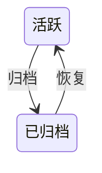
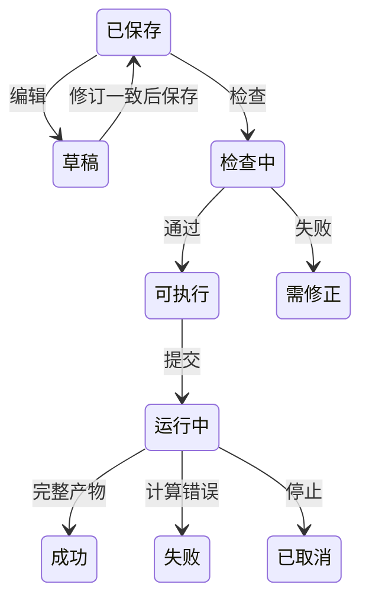

# Dojo WEB 平台产品设计

唯一交互基准：[工作台整合原型](../../../prototypes/dojo-web-integrated.html)。原型中的示例数据只作布局参考，正式界面消费真实业务。

> 版本：v2 整合平台，2026-09-10。状态：圈定真实链路及最终18项自动化浏览器验收通过。实际数据规模、原型尺寸对照和未开放范围见 `.context/mvp/web-integrated-acceptance.md`，不承诺所有状态逐像素一致或生产训练精度。
> 架构见[权威架构文档第 19 节](<../../../AI4E_Dojo_ARCHITECTURE (1).md#19-web--server-当前架构>)。

## 目录

- [一、项目管理](#一项目管理)
  - [1.1 背景与定位](#11-背景与定位)
  - [1.2 核心业务操作流程图](#12-核心业务操作流程图)
  - [1.3 业务状态机](#13-业务状态机)
  - [1.4 状态值说明](#14-状态值说明)
  - [1.5 功能点清单](#15-功能点清单)
  - [1.6 功能点详解](#16-功能点详解)
- [二、任务工作台](#二任务工作台)
  - [2.1 背景与定位](#21-背景与定位)
  - [2.2 核心业务操作流程图](#22-核心业务操作流程图)
  - [2.3 业务状态机](#23-业务状态机)
  - [2.4 状态值说明](#24-状态值说明)
  - [2.5 功能点清单](#25-功能点清单)
  - [2.6 功能点详解](#26-功能点详解)
- [三、项目任务可视化交接](#三项目任务可视化交接)
  - [3.1 背景与定位](#31-背景与定位)
  - [3.2 核心业务操作流程图](#32-核心业务操作流程图)
  - [3.3 业务状态机](#33-业务状态机)
  - [3.4 状态值说明](#34-状态值说明)
  - [3.5 功能点清单](#35-功能点清单)
  - [3.6 功能点详解](#36-功能点详解)

## 一、项目管理

### 1.1 背景与定位

围绕工程问题管理可追溯研究任务。项目六页签保留，项目报告、批量派生和排队运行不在本轮开放范围。管理记录与工作目录、运行事实区分，不能从目录存在推断成功。

### 1.2 核心业务操作流程图

### 1.3 业务状态机

### 1.4 状态值说明

活跃允许管理和执行；已归档保留记录但禁止新增运行，恢复后可继续操作。运行状态独立于管理状态。

### 1.5 功能点清单

1. 项目导航与管理
2. 任务管理与版本来源
3. 版本树与阶段详情
4. 固定比较
5. 项目报告
6. 文件管理
7. 批量运行

### 1.6 功能点详解

#### 1. 项目导航与管理

创建、查询、编辑、归档和恢复项目。列表显示真实名称、时间与状态，重启后恢复。后端断开、代理空响应或无效数据分别显示可理解的服务提示，不暴露 JSON 解析异常，不将加载失败当成成功空列表；恢复服务后刷新重新读取。服务提供的明确业务错误优先展示，有 `error.message` 时用它，否则用 `detail`。归档保留历史，不等同于删除文件；已归档项目禁止新增研究运行。

首页采用整合原型的项目管理布局：范围页签、搜索与排序、两列封面卡、任务数、基线与日期、负责人区域以及明确的“进入项目”操作。封面是研究领域装饰示意，不作为计算结果；业务信息来自已登记记录，缺失信息显示未记录，不填原型示例值。侧栏整行可点击，选中状态和面包屑由当前页面决定。项目入口进入任务管理，任务列表明确提供“进入工作台”；首次点击侧栏工作台可选择真实项目任务，有有效最近任务时可继续。不能用提示用户自行寻找深层链接的占位页替代入口。

#### 2. 任务管理与版本来源

创建任务仅填写名称、描述并明确选择四组已登记的数据集与模型案例，选项直接展示数据集与模型，不预选默认案例，也不在创建弹窗绑定数据。弹窗错误留在窗内并保留已填内容；案例列表失败可重试。创建成功直接进入原始数据处理，继续选择该案例的数据来源。编辑任务仅修改名称和描述；派生继承来源任务的案例、配置和数据绑定，不能在派生弹窗改换模型或来源。只有创建和派生新增版本，编辑配置、检查、试跑和再次执行不新增版本。

新建、编辑与派生弹窗只借整合 HTML 最终浅蓝主题的字号、边框、圆角和主按钮颜色：宽 520、控件高 36、标签距 6、项距 16；窄屏两侧各留 24，长内容只滚正文。原型没有对应三字段表单，因此不宣称与不存在的原型表单逐像素一致。任务表以整合原型最终生效疏密为唯一对照，进度行左右 12px、步骤居中，不恢复原型 100px 左缩进；常用入口是进入工作台和血缘，编辑、派生与归档放在更多操作中。列表状态与筛选对照原型用已完成、运行中、草稿，并保留运行失败与已归档。工作台标题只保留单行：任务名、流程状态和任务/项目/版本元信息，字号与上下间隔收紧；不再放案例徽章、可复制 Recipe、输入输出交接、切换任务或返回任务管理。切换任务走侧栏工作台入口，返回任务列表走顶栏项目面包屑。列表显示真实阶段摘要，不用页面计时模拟进度。任务表与任务弹窗样式限定在任务管理，不作用到其它弹窗或工作台。

#### 3. 版本树与阶段详情

由真实来源关系构建树，节点可进入对应任务并查看阶段记录。创建版本、当前工作目录、固定运行是三种不同来源，详情必须明确显示，不能将当前编辑内容冒充历史创建状态。

页面对照整合 HTML 最终浅蓝主题：右侧 Fork、左图右检两栏、血缘图画布带缩放、节点卡片与来源连线、阶段下拉和输入/输出/参数分组。节点位置与连线按真实父版本计算，不使用原型固定 SVG 示意树或示例版本号。右侧只读创建快照参数和已有固定运行；当前工作目录不在此页展开。Fork 走真实派生，三字段约定与任务弹窗相同。

#### 4. 固定比较

比较配置和实际指标；缺失值保持缺失，不填零。保存比较固定任务版本、运行与资产修订，新运行不替换旧证据。同网格差值必须校验样本、实体、坐标、归属和单位，不因点数相同而放行；不自动插值或配准。三维比较使用统一工作区，每个窗口默认独立。

页外壳对照整合 HTML 的左侧 表格 / 趋势 / 三维可视化 导轨和对比参数条；表格承载真实创建记录、当前目录与固定运行比较。趋势不把文本或缺失值画成零；三维只接受已保存的固定运行。加入项目报告按钮不开放。

#### 5. 项目报告

入口保留但本轮不开放编辑、生成、审批或导出。既有历史报告记录不删除；不能把不可用按钮或演示文本计入交付。页面对照整合 HTML 两栏外壳与 PROJECT REPORT 提示，正文区只显示未开放说明和只读历史记录。

#### 6. 文件管理

按项目、任务、运行、类型筛选真实文件，支持查询、排序、刷新和下载；时间显示到分钟。刷新保留仍有效的选择。文件引用固定内容修订，内容变化后需要重新检查。预览显示实际文本、表格、张量、网格与字段，不使用原型示例结果。浏览器以登记身份访问文件，越界拒绝。页头对照整合 HTML「项目文件」工具条：任务版本、文件搜索、类型、排序与重置；表列用真实目录的范围、类型、大小和更新时间，不填示意文件行。

#### 7. 批量运行

批量派生、模拟排队及批量执行入口未开放，不创建假运行记录。单任务继续使用真实执行门面。页面对照整合 HTML 计划表与运行策略两栏外壳，不提供生成计划或演示运行。

## 二、任务工作台

### 2.1 背景与定位

将原型第 2–7 步接入现有案例工作流。配置保存在任务副本，数据统计留在产物；平台不实现数值算法，不提供未声明模型能力，不承诺生产规模精度。

### 2.2 核心业务操作流程图

### 2.3 业务状态机

### 2.4 状态值说明

草稿尚未保存；可执行只表示对应修订通过检查；成功要求真实运行完整交付。失败、取消、服务中断和源修订失效分别呈现，部分产物不可视为整体成功，未知进度不填百分比。

保存、检查与提交按钮在请求期间原生禁用并设置 aria-busy，名称保持业务动作。加载图标只是装饰，必须 aria-hidden，请求结束直接移除；快速响应不能因组件动画残留改变按钮名称或阻止下一操作。真实响应完成后恢复可操作状态，不以旧成功提示替代本次完成确认。

### 2.5 功能点清单

1. 任务上下文与操作
2. 数据采样
3. 原始数据处理
4. 数据准备
    4.1 平台数据集下拉按登记时间倒序且点选互不联动
5. 模型设置
6. 训练设置
7. 训练运行
8. 独立推理与批次结果
9. 后处理与三维工作区
10. 任务报告

### 2.6 功能点详解

#### 1. 任务上下文与操作

九步导航使用稳定阶段标识；历史数字地址继续保留原含义，旧后处理与报告收藏不会因插入推理而错位。访问页面只记录最近位置，不标记阶段完成，完成状态来自正式成功执行，或模型/训练设置页的成功保存。检查、试跑、结构跟踪和页面打开不能冒充完成。九步导航保持整合原型外壳：标题收成单行，带状态与任务/项目/版本元信息，步骤条用圆形序号与连线，不用 Ant Design Steps。已完成且非当前的步骤用与任务「已完成」徽章相同的成功绿，当前步骤保持主色蓝；点回已完成步骤时该步为蓝底对勾。任务表进度行同一套颜色。任务表与工作台共用「数据采样 / 原始处理 / 数据准备 / 模型设置 / 训练设置 / 训练运行 / 推理 / 后处理 / 报告」。第 2–7 步接入真实工作流，第 1 步数据采样和第 9 步报告保留未开放入口。计算阶段各自提供统一执行区，后处理只消费固定结果，检查、试跑、正式运行分别表达；不为每项清洗单独落盘。编辑任务配置需要保存修订，取消不修改已保存内容。原始处理在绑定有效且已选文件时可以执行；若设置未保存，执行会先写入当前修订再提交，不另拦主按钮。冲突明确提示，不能静默覆盖。执行配置可改并行线程，写入 `rawprep.workers`，范围 1–64，缺省 1 为顺序；每个线程处理不同样本，线程数不改变平台数据集声明。读取配置即回传名称状态；名称已存在时在名称框下写明差异（如 VTKHDF 开关），点执行先保存再询问是否覆盖，取消不提交，确认后带覆盖标记提交并替换原登记，不能静默覆盖。试跑产物独立标记，不作为默认正式输入。标题行不再附 Recipe 条或右侧操作；输入输出交接只留在各阶段本页。不复刻模板配置、执行范围或示例产物弹窗。第 2–7 步内部对照整合 HTML 内嵌页面（三栏原始处理 / 数据准备，两栏模型与训练，运行监控摘要加左右栏，后处理横向配置与页签），不改成示意两栏配置页。

浏览位置、当前检查有效性与历史运行成功分别展示。导航不会把前序步骤标记为成功；任务列表与工作台共用后端阶段摘要，刷新或退出重进按已保存、已成功执行的事实恢复绿色勾。缺少证据显示无法确认，不把过期检查显示成未运行。保存配置在配置已读且未忙碌时可用，未改参数也可保存。切步骤时阶段配置与产物列表分开读取并先渲染已到的配置，不把整页停在产物列表上；同任务在途列表请求合并。模型设置同一语义：已保存参数随配置先出，可选择的模型下拉独立转圈后到，失败只坏下拉；同任务 `model-options` 与 `stage-inputs` 一样合并在途请求并短时复用。原始处理同一语义：三栏与已保存配置先出，文件树、处理结果名单和运行记录在栏内补齐，不用整页等待；同任务 `stage-inputs` 与样本目录复用在途合并和短时缓存。产物列表失败仍展示已读配置，树失败只坏树，不再把整页收成单一 HTTP 500。配置或输入修订变化令旧检查失效，但保留历史成功。检查、试跑、执行及结构生成统一先保存草稿再提交，保存冲突保留草稿并停止；保存成功而提交失败分别反馈。同一请求重试沿用身份，不能因断线重复启动。

#### 2. 数据采样

CAE 采样入口暂不开放。它与模型的点、锚点、查询采样不同，不能把模型采样移入此页或把模拟排队当真实执行。

#### 3. 原始数据处理

原始处理、数据准备、模型与训练设置均以平台明确编辑覆盖原配置，其余研究参数保留；取消、清空和关闭均有效。保存后按服务端结果刷新草稿，检查与执行消费该修订，不弹出参数合并确认。并发编辑、输入不合法和同名物理数据覆盖仍分别处理。

正式结果默认属于当前项目共享数据。同名再次处理必须确认覆盖物理内容，许可仅随本次请求提交；取消不执行。覆盖失败显示不可用，不把旧成功状态当作当前数据可用。项目内冲突由 Task 判定，跨项目同名不互相占用名称。

已有任务不会仅因模板格式整理或已核验的默认加载升级而被阻断；保存与执行使用同一有效配置。真正改变处理逻辑时，提示需要核对的脚本或入口文件，保留当前编辑内容。

数据来源改为选择 contrib 公开数据集及其本机完整副本。当前名单是 ShapeNet-Car 与 NASA CRM；Burgers 等生成式 PDE 不进入绑定名单。选中后一次接上该集处理方式、处理默认和平台在已登记数据根上识别出的本机地址，不手填绝对路径，也不另建第二套数据登记。可改选另一公开数据集，但只有当前模型与新数据集已有登记案例时生效；没有对应案例则拒绝，不留下半套组件。换绑一次写入数据组件、该集处理默认和受控路径，旧路径和旧字段选择不带到新计算，不新增研究版本。未绑定或来源失效时禁止执行；来源有效仅表示范围、存在性与文件类型通过检查，不代表完整样本已通过检查。取消绑定草稿不保存；确认绑定时自动先保存当前处理设置，再以返回的配置修订保存绑定；冲突明确报错。成功后重新读取当前配置；左栏不再展示数据集名、处理方式说明和本机地址。页签右侧刷新与修改绑定并排，其下直接是搜索框。

左侧文件区对照细节原型：第一行是「原始数据处理 / 处理结果」页签，右侧刷新与修改绑定并排，其下直接是搜索框，不放绑定说明文字。处理页浏览已绑定来源；处理结果只属于原始处理，并可选择工作区已登记的平台数据集浏览产物，按登记时间倒序列出，不自动勾最新；未点选时若本任务已有正式运行仍显示该运行产物。原始数据、数据准备和后处理结果文件共用同一棵树表：首次只列出当前一层，点开文件夹再取下一层，默认不全部展开；点开只展开，不把文件夹行标为选中，也不勾选其下文件。搜索由服务端按路径匹配尚未展开的文件并保留祖先。列举不登记资产；预览、下载和加入三维时才按受控根与相对路径登记。处理结果按产物相对路径展开为目录树；文件夹和文件名用与来源表相同的样式图标，按钮无障碍名只含路径名，叶子「预览」带文件名标签。预览优先用阶段文件的受控根与相对路径，缺这两项时用已登记资产定位，不能对空路径发预览请求。无正式运行或尚无产物时给出空态，不回退项目根目录。数据准备的数据集与处理结果改走同一套产物树表，列对齐且操作含预览；后处理继续共用该树。NASA 三个来源分别保留受控根与文件身份，文件不自动勾选或补齐。不放示意模板匹配或导入目录。执行配置上方填写平台数据集名称，可预填来源标识，但预填不等于已写入 `dataset.processed_name`；检查、试跑和正式执行前把输入框名称写入配置，空名称不能正式执行。成功后其他项目的数据准备可按此名称选用。检查与试跑留在盒内次要入口。执行配置的执行、刷新样本与字段、校验、试跑四个按钮点下后立刻改同一条进度条、日志状态和说明：校验与刷新用不确定进度，操作说明只在开始时写入一行普通日志，不钉在底部，不新建运行；试跑与正式执行接到这次运行。有完成数与总数时进度与之一致，没有计数就不填百分比。再点任一按钮立刻去掉上一动作的完成态，先显示本次进行中。同页多次执行时日志往下叠加，不整页换掉；下载仍只取当前这次运行文件。刷新后仍显示最近一次正式执行的进度或终态。没有正式运行时不显示「处理中」，日志空快照不能冒充进行中。

优先 ShapeNet 表面与 NASA CRM 表面。保留原型文件、处理设置、执行三栏及底部日志。文件数量与文件内样本数量分别展示；全部选择开启时数量同步且不可编辑，关闭后按稳定顺序截取，完整样本校验缺件拒绝，不自动补齐。NASA 共享拓扑依赖由数据适配描述，不能套用汽车文件命名。字段树读取真实文件，几何、点、单元与全局成员分开。每个从源文件提取的 `.pt` 是提取列表里的一行：添加按钮在列表上方，配置在固定高度容器内滚动，名称与说明同一行，编辑和删除用图标。法向、SDF 等依赖几何能力的输出不进提取列表，改在对应几何派生项同一行右侧用输入框命名（不带 `.pt`）；一项能力同一行右侧命名并对齐；点到网格表面距离的三个产物纵向列出。最近顶点距离只命名 `volume_sdf`，体积法向是独立勾选项并命名 `volume_normals`；勾选能力才写入 `save_fields`。数值稳定阈值按声明默认写入，页面不展示。数据集默认提取场预填；可添加、编辑、删除。对话框列出数据集声明的源文件和已检查样本目录里的 VTK/场文件，不依赖左侧是否展开；编辑时回填该场的默认源文件、已检查字段和当前勾选。读文件后只勾选一个物理量或坐标，格式固定 `.pt`，不能把多个场打进同一文件。取消不提交草稿。保存提示与执行进度写在执行栏内，避免掉到三栏下面看不见。落盘格式按当前能力以 PT 与 Zarr 复选，可同时写出两种容器，至少勾一种；VTKHDF 是独立附加输出，仅数据集已接入时显示。ShapeNet 官方案例写入打开，故新任务与缺键默认勾选；NASA 未接入不显示；已保存关闭保持原值，恢复案例默认才回到清单/案例默认。配置回显与执行格式一致，未知能力不可选；统计用三项策略勾选，不下手填数值。原始处理不按 train/test 分片，划分交给数据准备。弹窗无格式和目录控件。结果统一从文件列表打开，执行区不放假结果卡片。

- 进入原始处理页即可看到三栏、已保存参数与默认提取卡片，不必等文件树或样本目录到齐；绑定名称和执行区先可用，必要数据未到时禁用执行。绑定来源后自动检查真实字段及代表样本范围，检查在后台进行；默认场预填为每个 `.pt` 一张卡片，用户可再添加、编辑换场或删除（必需场除外）。文件结构树和处理结果树在左栏内转圈或空态，列举只按当前层文件戳，不在进页时核验每个样本内容。恢复案例默认回到数据集名单。执行默认全部声明样本（来自绑定数据集官方/自身分片），也可指定个别样本且只影响这次执行；页面不编辑 `dataset.partitions`，执行区写明处理样本数来源，并把来源文件数与样本量分开。不提供 train/test 分片选择；平台提交非 NASA 案例用 `unsplit`，产物不按官方切分落盘，划分交给数据准备。执行配置可改并行线程（`rawprep.workers`，1–64，缺省 1）。文件浏览不改变执行范围。结果页展示真实产物，转换成功与下游具备模型必需字段分别判断。当次输出只作为处理结果历史反显，不能变成下次输入。

#### 4. 数据准备

共享候选同时显示名称与来源项目，选项身份使用来源项目和共享资产身份；相同来源去重，不同项目同名可区分。已绑定共享数据即使本任务没有原始处理运行，也能浏览并独立准备；步骤显示可复用事实，不伪造本任务原始处理成功。覆盖后新的准备使用当前数据，已有任务记录不主动改写。

三栏对照细节原型：左栏「数据集 / 处理结果」页签先选平台数据集名称，再浏览该清单成员；中栏处理方法卡上方标明「模型输入」与「数据集字段」，把模型 `data_specs` 角色与物理场下拉匹配并对照张量形状，并提供 train/test/eval 数量与抽取方法；右栏执行盒对照原始处理，展示已选平台数据集名称与执行范围（全部已处理样本或指定样本），不再放无效执行数量，并显示与原始处理相同的进度条与状态。栏间距 9px、三栏等高 640px，整体纵向位置以整合原型最终生效样式为准；长内容在领域正文滚动。字段不再手填；形状写成 `(N, 3)` 或 `(N, 3, 2, 3)`，不写「1维/3维」。同域但特征轴不相容的场不可选，保存时拒绝错域或形状不符。指定样本先缩小样本池；分片默认显示当前范围内原人数，缺的为 0，三者之和须等于执行范围内的样本，训练至少 1 个，test/eval 可为 0；方法为保持原划分或随机，种子写入准备记录，不改官方名单、不重算张量。保持原划分时中栏人数只作对照，不会改发布名单；无官方切分的产物会发布为训练集=全部，测试集和评价集为 0。数量不合或未指定样本时主执行不可用。均值、标准差、Min/Max 统计只能从训练数据计算或读取已冻结记录，彻底移除手工输入。验证与测试不参与拟合；更换数据、字段、模型输入或几何/域采样方法声明后，现行准备仍可导入，计算按当前页面参数进行。模型页采样预算（几何点数、超节点、锚点点数）不属于准备冻结，变化不单独要求重跑 trainprep，也不能挡模型可视化前向；结构跟踪按当前模型页参数组模型，准备只提供可读清单与场。数据准备中栏先选当前数据集下的官方数据集-模型组合，选完即加载该案例的处理声明；模型不同时按换模规则替换训练默认，已导入的现行准备不因声明不同解除。原「归一化与转换」现称「数据转换」：每场有归一化方法、统一空间和可见 scale，缺省 1。勾选统一空间仍按共享边界坐标变换并写出 `method: coordinate`，方法目标为 `[0, 1]`，附加放大只写在 scale。统一空间已勾选时归一化方法只读为最小最大，取消统一空间后才能选择其他方法。保存归一化副本对新任务默认勾选。PT/Zarr 都可直接读取。采样配置移到模型页且仅当模型声明点、锚点或查询采样时展示，准备页展示当前平台声明，计算不再拿冻结声明挡现行参数。

数据集页签只浏览明确选择的平台数据集成员。处理结果只浏览最近一次正式准备运行产物：同时列出 `preparation.json` 与已写出的归一化 PT 副本树，按层展开，不在进页时核验每个 PT；列与原始处理产物树对齐且操作含预览。没有固定来源时显示空态，不回退整个项目，也不自动选择最新清单与最新准备记录。已有平台数据集或正式运行产物但尚未选择时，下拉写明可选数量，空态提示先选平台数据集，主执行按钮不可用，不报来源不可用。案例模板里指向开发数据根的清单占位不当成已绑定来源，不报「来源不可用」。目录里未选用且失效的平台登记，或空的共享名，不能盖过当前已选的有效清单。真正失效时用「平台数据集」和「所选文件不在可访问范围内」说明，不写内部键名。路径丢失或摘要变化的登记不可选用。刷新保留仍有效的选择。任务摘要未返回前步骤不显示「未运行」。三栏之下的执行日志与原始处理同一套完整面板，可搜索、分级、跟随、清空显示、下载和停止，不压成单行摘要；栏内默认最近 500 行，更早行存储后向上展开，自动滚动开关必须真正停住或钉住最新行。运行失败且日志正文为空时，仍展示运行记录中的错误原因，不只显示「等待运行日志」。再点执行立刻清掉完成态与进度条，日志向下叠加，下载仍只取当前这次。检查不拉正式进度条。

##### 4.1 平台数据集下拉按登记时间倒序且点选互不联动

选择器以平台名称为主，同一清单只出现一条且点选互不联动；已登记平台名称的文件不再并列任务历史，本任务未命名历史清单仍可作兼容项。选项按登记时间倒序，旧记录缺时间时跟公开列表同一回退规则，不自动勾最新。

#### 5. 模型设置

模型设置第一项为模型类型、已导出的模型配置和当前参数来源。类型只列两个官方模型：AB-UPT 与 Transolver-3。类型之下可选官方「数据集-模型」组合（名称含数据集，按当前模型列出全部案例，不按任务数据集过滤）；选完只覆盖本页主干、采样和输入输出，不清权重，不改训练或数据准备。训练参数页有独立的同一套组合，选完只覆盖训练预算与优化器。ShapeNet 任务的 Transolver-3 另选表面或体场，这是同一模型的应用变体；NASA 没有体场。「已导出的模型配置」列出本项目用导出保存过的参数组合，不含权重；选中后只替换本页参数，点保存才写入任务。「当前参数来源」只读展示来自官方案例默认还是某份已导出配置，不能在此切换。创建任务仍选官方起步案例，名称写成「模型 · 数据集」，派生弹窗继承配置。当前模型依据生效配置展示，创建来源保留为历史事实。点保存即记下本步完成，未改参数也会落盘；刷新或跳步不因过期检查清掉绿色勾。

进页先反显当前已保存模型参数，不必等待候选列表。下拉只列官方模型与同数据集预设目录；点选另一模型或预设时再取该目标的默认值与能力，并与参数草稿同时替换，旧结构图清除。用户可以继续修改再保存。重复选择当前项不重置；切回之前模型重新采用官方默认。选项失败保留已有参数，可重试；任务切换后的迟到结果不覆盖新任务。普通参数保存不重新套用训练默认。不把结构跟踪、生成结构图或全量核验准备产物当作进页列出候选的前提。

显式换模保存完整替换模型段、模型组件、全部训练默认和准备声明。训练轮数、设备、优化器、调度、日志与保存设置统一重置；原数据绑定、原始处理设置、物理清单与数据和运行目录保留。旧准备、初始权重和续训引用解除，新推理需重新明确选择兼容检查点，历史文件和运行不删除。保存只增加配置修订，不新增研究版本；冲突保留草稿并停止后续操作。

「导出模型配置」把当前已保存的模型、训练和准备段另存为项目内命名预设，不含权重、数据绑定或运行目录。同数据集任务下次能选到；空名、官方保留名、重名、未保存修订冲突和归档任务拒绝导出，不写半份预设。跨数据集选用拒绝。

模型页不再展示或要求勾选物理清单、准备记录。生成真实结构时由后台取最近一次与当前模型相容的准备，否则取最近一次正式清单；都没有则提示先完成原始处理。自动选中的来源只写入当次检查记录，不回写训练或推理已选绑定。模型页不显示检查点告警。检查点标签不当作字面文件路径，但推理仍检查实际权重。换模后需重新准备；物理清单缺少目标模型字段时，检查提示缺失，不能自动假设兼容。

参数来自当前数据集对应的官方起步 YAML 或用户预设，支持已接入 AB-UPT 与 Transolver-3 的合法配置。模型采样跟随当前模型自己的字段并随换模整段替换：AB-UPT 展示点、锚点和查询预算，Transolver-3 展示种子、抽稀步长、查询分块和随机流，参考抽稀步长只读；没有采样键才隐藏该区块，不沿用上一模型字段。切片数量属于 Transolver 主干参数。损失不可配时仍展示固定 MSE 与目标行，不能改成其他损失。旧单键兼容，旧新键同时出现拒绝。结构通过真实模型、真实配置和后台解析的物理来源取样组网，由可视化模块一次写出阶段主干和阶段压缩块；公开子模块能收成阶段盒时，图上应看到 encoder / 几何块 / 嵌入 / 物理块 / 解码 / 读出，而不是整网一个盒子或校验算子。页面用两个按钮切换已发布的档，不重跑跟踪。生成或载入任一档时视窗只显示加载文案和占位块，先卸掉旧 iframe，不能继续展示旧图或把空白当完成。历史只有单图的记录继续打开这一张，不显示假切换。跟踪失败显示真实原因，不替换为示意结构图。正式网络图按宽度显示并可拖动画布，不把整图缩进一屏。模型设置不提供权重加载；从检查点继续只在训练设置。没有配置入口的既有算法能力列为待确认差异，不自行暴露任意 Python 组件。

修改模型配置后，旧结构标记过期；生成结构使用保存后的配置。紧凑分组可折叠，结构宿主与参数区分开滚动。

#### 6. 训练设置

训练页可独立选择官方数据集-模型组合并只覆盖本页训练参数，不改模型或数据准备。训练轮次、批大小、优化器、调度、精度、EMA、诊断和评估只展示当前案例实际支持且有配置的参数，按类型与合法范围编辑，不把对象当自由文本。能力不存在就不提供；能力已存在但 YAML 未接入时单独确认。预检只核验本页训练参数，不要求已有准备记录。点保存即记下完成，未改参数也会落盘并盖住此前失败预检；跳到下一步或刷新页面仍按已保存事实恢复绿色勾，不能因导航或重载清掉。改的是另一页参数时，本页完成态保持。本页选择已准备完成的数据集、其中的切片和训练模式；下拉只显示原始处理时登记的数据集名称，不显示运行短号或 `preparation.json`。切片来自该准备记录在数据准备时写好的 train/test/eval，默认训练集，空切片不能开训并提示所选切片没有样本；评估与写出切片也只从这份准备里选。继续训练再选检查点。点开始训练后按本页当次选择提交训练阶段执行并进入训练运行，服务按所选现行准备合成这次运行配置，不夹带数据准备页留下的清单。选中早期准备时页面展示须重新生成的说明，不能继续开训。保存参数不自动训练，配置检查不能冒充正式训练结果。关闭测试评估时，运行页仍显示 Loss 曲线和训练批在线分项；打开后按验证间隔写入测试评估，不把在线分项当成测试集结果。官方案例默认仍关闭测试评估；现行训练入口可按能力启用。评估指标可多选 MSE、MAE、相对 L2，保存后按选择实际计算各物理量的误差，不只是筛选表格。未配置时沿用原三项，显式清空只保留评估 Loss；关闭评估时保留选择但不计算。启用时评估分片须有样本，验证间隔沿用首轮、每隔指定轮数及最后一轮的规则。评估不会写出预测或网格；历史受限入口仍按其能力只读。训练结束写出预测、网格和分片默认关闭；打开后在本次训练成功结束时按所选分片写出，后处理结果文件可浏览。只开网格、不开预测时拒绝。写出不创建推理批次，也不增加任务版本。

#### 7. 训练运行

只展示已经提交的训练运行。开训、已准备完成的数据集、训练模式和检查点都在训练设置页完成，本页不再选数据、不再开始训练、也不再从检查点继续。查看运行只切换正在看的那次训练。展示真实运行状态、已完成轮次的实际损失曲线、在线分项与测试评估、日志和本机资源；没有的 Cd/Cl、百分比或硬件指标保持不可用，不合成曲线，不从日志拼指标。每个轮次结束后即可看到截至该轮的曲线和在线分项；测试评估仅在训练设置已打开且该轮写过评价时出现。停止不保证产生新检查点。断线后重新读取快照和事件，不重复提交、不把连接失败改成运行失败。

训练曲线提供 Loss、更新步、学习率三个页签，默认 Loss。横轴使用实际 epoch；没有轮次记录时使用实际累计更新步。更新步页纵轴为累计有效更新数，学习率页显示运行记录的学习率。各页独立筛选有效记录，单点和零值仍可见，缺失值不补零，也不补造验证曲线。每个页签右侧有配置图标，点击打开该维度的空配置面板，本期没有可编辑项、不保存设置。日志保留原文，可搜索和按已有级别筛选；栏内默认只显示最近 500 行，更早行留在内存，向上滚动再展开。自动滚动勾选时钉在最新行，取消后不因新日志抢滚动；向上离开底部即取消，再滚回底部才重新打开。清空只影响当前显示，下载保留完整运行日志。

#### 8. 独立推理与批次结果

工作台按照推理参考图组织四栏选择、推理配置、独立指标表和独立图表。各区块标题不带序号。推理配置按控件行、预算与说明分行排布，卡片高度随内容，不再压成单行固定条。输出选项为评估指标、导出点云数据、导出VTK网格化数据，后两项默认勾选且都含真值；样本目录缺少 `vtk_exports`、检查失败或 `mesh.available` 不为真时网格化项置灰。关闭任一项的警告留在配置卡内，不覆盖下方表格。指标表与折线图区域高于原参考图，区内保留滚动，不因外壳高度截断。批次历史、真实进度、完整日志及文件交接位于折叠区；运行时展开进度。加载、未配置、运行、部分完成、失败与成功分别表达。其他步骤保留原平台布局与九步语义。

检查点与样本初始不自动勾选。进入推理页先用第一份兼容检查点的样本、物理量和指标目录填满四栏，再后台核对其余检查点；各检查点一致时继续共用，不必先勾选权重。某一份失败或目录不一致时提示，并回到先选检查点再加载，不把泛化缺文件说成数据根未配置。成功加载后清掉过期红条。检查点按服务返回的所属训练运行收成树：父级为「训练运行 ·」加 run_id 前 8 位及可区分的状态/时间，子级为该次运行下的检查点；缺少 run_id 的项单独归入「未归属运行」，不按文件名猜测。勾选父级等于选中该运行下全部兼容叶子；全选、Best、Latest 与 Top N 仍只提交检查点叶子。检查点支持搜索、排序、兼容/已选筛选、Best、Latest、全选及默认3个的Top N；排名只使用同分片、同口径且记录在对应step的评价值，没有证据明确禁用。相同完整字节的别名合并。样本页签固定为该检查点关联准备里的训练、测试、评价切片，人数为 0 的切片仍可见；默认优先测试集，没有测试样本再落到评价或训练。身份包含分片；每页50条，当前页全选和当前分片筛选范围全选独立。物理量与指标按当前分类提供全选。分页和搜索不扩大已经提交的范围。浏览器里记住的历史批次若已被清理，不把缺文件说成数据根未配置，也不挡住当前选择。

物理量来自实际模型及数据声明，展示域、字段、分量、单位和适用条件。未知单位保持未知；热、结构等分类没有对应输出时明确不可用。选择向量部分分量时仅评价所选分量，保存保留完整向量。指标默认相对L2、MAE、RMSE、Max Error、R²，并提供MSE、相对MAE、平均逐点相对误差、MAPE及真实预测性能信息，公式由算法目录统一提供。

设备来自实际可用设备及占用信息。查询块默认16384，设置实际影响模型查询。显示检查点、样本、物理量和指标预算；先预检再计算。点云与网格化导出独立勾选，任一导出都会保存预测张量；缺目录字段或网格化不可用时置灰。关闭导出须提示本次不会写出对应 VTK。提交后固定权重和输入，编辑页面不改变正在执行的批次，不写训练配置、不增加任务版本。相同提交失败重试沿用幂等身份。未填写名称时按本地墙钟写成 `infer-YYYYMMDD-HHMMSS`，精确到秒，不再默认「批量推理」；同一选择的重试复用已生成的身份，不因跨秒再换名。结果文件页按清单区分未写出点云和未写出网格化。推理结果指标页签写「聚合」。

每个检查点、每个分片对应一个串行子运行；完整批次状态决定步骤是否完成，最后一个成功分片不能覆盖其他失败。取消、恢复中断与失败重试分别操作；刷新或关闭页面不取消后台计算，历史批次可重新选择。日志复用平台完整面板。

指标表的「配置」打开独立表格字段弹窗。Checkpoint 对比模式每行一个检查点，默认聚合本批次全部分片的全部样本；Mean、Median、P90、Max 可多选，每个物理量—指标—聚合组合生成一列。样本对比模式明确选择一个检查点，每行一个样本并显示所属分片，不显示聚合控件，同名跨分片样本保持独立。物理量下仅列出已有推理结果中的指标，允许同时选择多个物理量及其不同指标；同名物理量补充域和字段身份。空结果时弹窗仍可打开，缺少必要字段时禁用应用。

图表的「配置」打开独立坐标弹窗：X 轴由表格模式确定为 Checkpoint 或样本，只读展示；Y 轴可多选当前表格的数值列，每列对应一条系列。表格字段改变时移除失效系列，无原系列可保留时选取前面至多三列；默认检查点模式显示 Mean、Median、P90。支持折线、散点、柱状及线性/对数坐标；并可开关轴刻度、选择刻度疏密、开关网格线，以及是否在每个点上显示数值。默认显示刻度与网格、不显示点数值。非正对数值不绘制，零分母与恒定真值保留不可定义原因。样本横轴保留分片身份，密集样本减少标签数量但保留全部数据点。两种弹窗分别保存草稿，应用后生效，取消或关闭不改变视图。图表显示选项与坐标选择写入该任务的图表配置，刷新或重开推理页后仍在。

表格、图表和导出消费相同固定结果，不再次预测。CSV 为当前配置的表格字段；Excel 首表为当前表格，同时保留统计、逐样本明细、单位、算法和来源。跨分片统计直接汇集逐样本指标，以样本等权计算，不将分片均值再次平均；部分交付标明有效/预期数量，不参与完整检查点比较。历史全元素累计结果单独命名。只评价也保存轻量指标，保存预测后可下载数组、重新评价及进入后处理；跳转以批次、运行、分片和样本精确定位，不靠模糊文字搜索。

#### 9. 后处理与三维工作区

后处理直接展示「结果文件 / 三维物理场可视化」，默认结果文件。两个页签用紧凑条：12px 字号、4px 上下内边距，不设最小宽度，不占整行大块。指标表与图表在推理页查看，后处理不再设指标页签，也不留空壳入口。批次与样本筛选只影响所在Tab，不提供页面级统一选择器。推理页深链接进入结果文件并定位原批次和样本，不自动导入三维。旧地址若带 `tab=metrics` 或未知页签，落到结果文件，不报错、不留空白。评价接口仍可供程序调用，不作为后处理导航。

文件页左约40%为与原始处理一致的树形表格，右约60%为单文件预览，中间可调整。文件状态、批次和搜索位于树表上方，“批量加入三维物理场”位于文件列表标题右侧；勾选独立成列，展开箭头和文件类型图标表达层次。窄面板优先保留文件名与操作，修改时间及大小逐级收起，拖宽后恢复。预览区按标题、视口、底部下载分区，网格视口填满可用高度。打开结果文件只取当前层，点开再加载。批次下拉展示可区分身份：新批次用 `infer` 加创建日期时间；旧「批量推理」有创建时间则格式化成同一口径，自定义名称保留。目录覆盖本任务平台数据集、推理固定结果、训练运行输出文件夹，以及历史后处理；按批次或训练/推理运行、样本、真实路径分组。平台数据集用「平台数据集 ·」加名称，训练 run 用「训练运行 ·」加短号。处理后样本与推理 VTK 用同一 `param1/<设计号>`。无写出时仍显示该 run 并说明没有预测或网格，失败开训不冒充有结果。没有训练运行、平台数据集和推理结果时说明「暂无训练运行、平台数据集或推理固定结果」，不要求必须先推理。搜索保留祖先，刷新保留选择。检查点与日志不出现在此树。每文件提供预览及按能力开放的可视化；顶部批量加入仅提交有明确三维几何声明的文件，加入时才登记。网格紧凑预览复用现有读取和视口，数组分页查看，文本及图片直接查看，支持放大、关闭和下载。预览不修改主三维场景。

首次进入三维页或加入文件时创建Trame，两个Tab间切换保持同一iframe、对象、相机和草稿。隐藏暂停当前播放但保持心跳，返回恢复尺寸与交互；已可见时重复通知不触发工作进程再读网格。追加来源不重建工作台、不重置相机，重复来源去重。离开页面或切换任务回收会话，迟到响应也须清理。显式重开或组件重建时先关闭旧会话再创建，把带会话地址的iframe传给独立应用；并发占满时提示关闭其他预览并允许重试，不留下无会话的空壳。刷新及重新进入仍通过显式保存配置重开，本期没有自动保存草稿。保存只写来源引用和配置，不复制网格、不增加任务版本。鼠标轨道只回写相机，不因交互把整网从盘重读一遍。

#### 10. 任务报告

本轮保留未开放入口，不提供报告编辑、发布、审批或导出，不删除既有记录。研究证据通过固定运行、比较和场景保存。

## 三、项目任务可视化交接

### 3.1 背景与定位

文件、后处理和比较入口复用独立三维物理场工作台。无目标任务时用户先选择已有任务；界面提供保存、已保存配置重开、导出和状态。原有限预览保留，切换不会创建研究版本。

### 3.2 核心业务操作流程图

### 3.3 业务状态机

本章沿用任务归档状态；交互会话与导出状态由独立可视化模块负责，不在本模块复制状态机。

### 3.4 状态值说明

可写任务允许保存和导出；归档任务只允许读取既有配置。数据缺失或修订变化显示错误，不能作为成功重开。

### 3.5 功能点清单

1. 明确任务保存上下文。
2. 固定来源与配置资产交接。
3. 独立工作区与显式输出。
4. 统一三维对象工作台。

### 3.6 功能点详解

#### 1. 明确任务保存上下文

保存位置属于选定项目任务；不要求迁移原数据，不创建新的研究版本。

#### 2. 固定来源与配置资产交接

只保存引用、处理步骤与显示配置；输入修订和配置修订分别校验。缓存删除不影响读取配置。

#### 3. 独立工作区与显式输出

页面与脚本共享业务入口；图片、视频和提取数据只在明确输出操作时生成。配置保存和导出是两个操作。

#### 4. 统一三维对象工作台

文件、后处理、比较共用同一个独立工作台。物理控件由 Trame 提供，宿主通过带请求身份的同源消息提供来源选择与追加；验证消息来源窗口，离开页面清理监听。保存、外部配置、动画表单由 Vis 弹窗承载；来源可跨同项目任务，保存目标仍须明确。

原始处理中的 VTK 网格预览、阶段文件中的网格预览直接打开 Trame，不要求再次点击启动按钮；着色、表示方式与分析操作在工作台内完成，不叠加旧查看器的字段和分页控件。网格预览弹窗默认加高可视区域，外框至少 760px、内嵌独立可视化 iframe 至少 720px（默认宿主 iframe 保底 600px），标题提供放大到当前视口全屏；放大后对象树、属性和三维窗口都要露出，不能只剩工具条和白底。普通弹窗里左下属性加高并可滚动。退出全屏后回到加高弹窗，不使用浏览器系统全屏。后处理“三维物理场可视化”页相对原 820px 至少加高 40%（不低于 1148px），并尽量铺满剩余视口；嵌套 iframe 贴合该窗口且保底 840px，页面和阶段窗口都可向下滚动；对象树与三维窗口必须露出。后处理宿主不再提供「打开已保存配置」下拉，重开配置走工作台文件菜单。其他阶段仍使用 820px 独立滚动窗口。已有任务上下文自动带入；项目文件缺少任务时，先选择已有目标任务。首次进入且尚未选定网格时显示空场景，可通过“文件 → 导入结果”在任务产物、项目共享数据集和已挂数据根内选可视化网格，目录必须选到成员。关闭预览或切换到其他平台页面时释放对应会话；连接返回较晚也不会重新打开已关闭的预览。

历史旧场景仍按原协议显式恢复，保留切换到三维物理场工作台的入口；原始处理网格预览保留完整Trame入口；后处理文件页提供紧凑单文件预览，三维页进入完整Trame。连接失败或并发会话已满时显示可理解的错误并允许重试，不把空响应显示为 JSON 解析异常，也不在没有会话地址时渲染iframe。

显式重开配置时以新会话ID替换iframe文档，避免hash路由复用旧会话接管状态；普通Tab切换不改变该ID。
## 训练运行、推理结果与后处理一致性（2026-09-18）

- 训练运行页以 update 粒度曲线展示 Loss 和学习率；Loss 横轴可选 epoch 或 updates，更新步不作为独立页签。
- 测试评估独立于 Loss，训练设置同时选择评估物理量、指标和是否聚合；`test_repeat` 表示重复测试采样，不表示评估间隔。
- 推理结果按用户选择的 checkpoint 保留占位行，运行中禁止重复提交；后处理结果文件只列训练绑定平台数据集。
- 三维物理场容器使用约 714px 最小高度；prediction/truth 的字段身份由固定结果资产交接保证。
