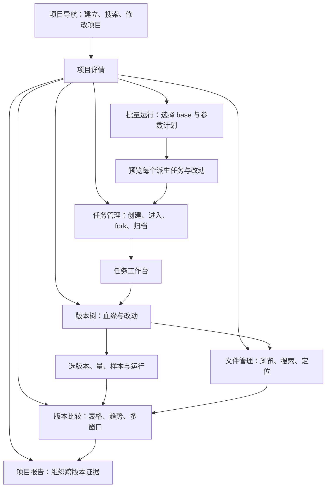
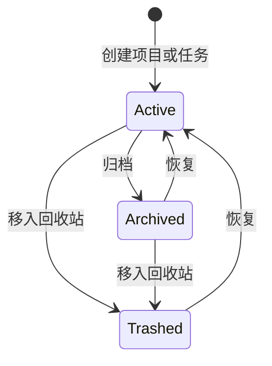
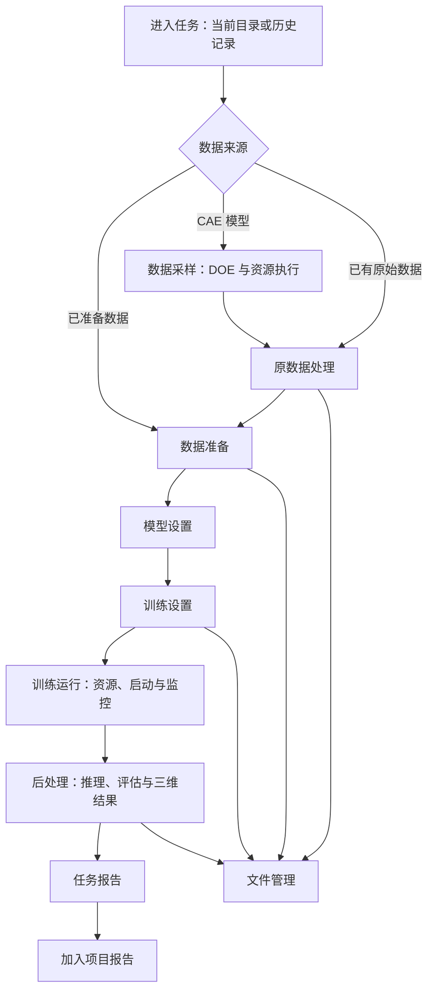
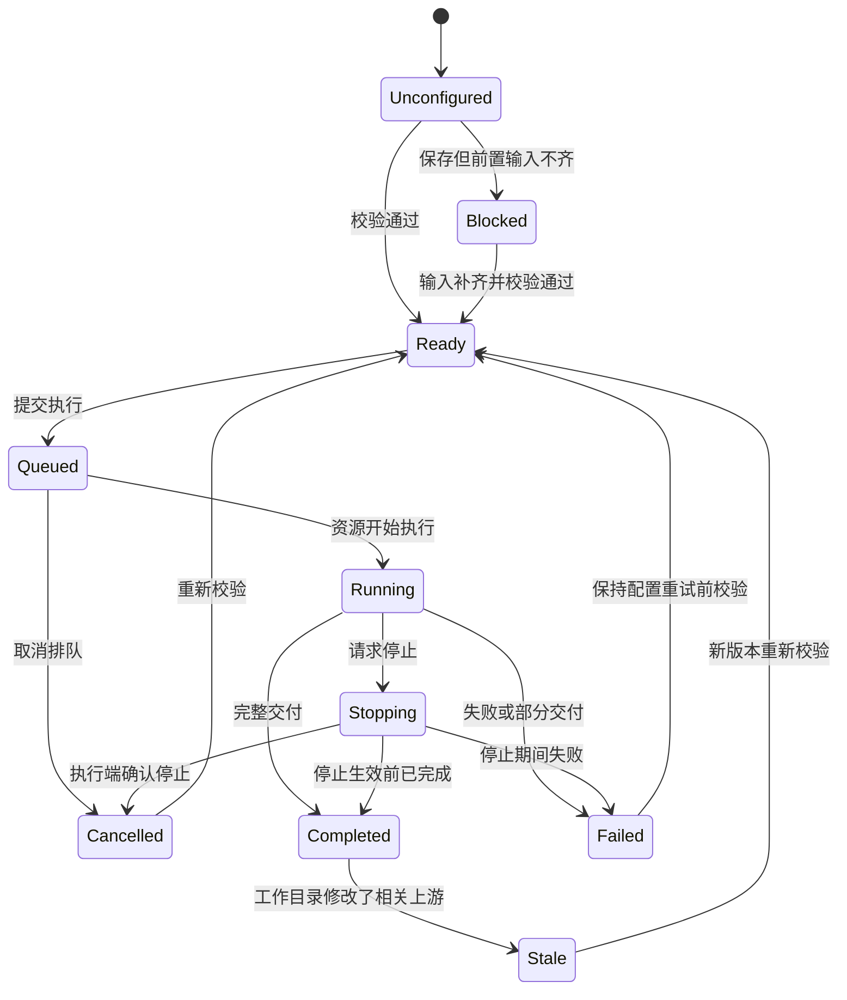

# Dojo WEB 平台产品设计

> 版本：v2，2026-09-09。状态：产品设计草案，待审阅，不代表平台功能已实现。
> 读者：研究人员、产品设计者及开发者。覆盖项目管理和任务工作台两个入口。
> 本文是 Web 产品功能正文；跨包职责和代码结构见[权威架构文档第 19 节](<../../../AI4E_Dojo_ARCHITECTURE (1).md#19-dojo-web--server-架构草案-v2>)。
> 项目、任务、版本、运行的关系以及以下交互默认值为本版建议，可在评审中调整。

## 目录

- [一、项目管理](#一项目管理)
  - [1.1 背景与定位](#11-背景与定位)
  - [1.2 核心业务操作流程图](#12-核心业务操作流程图)
  - [1.3 业务状态机](#13-业务状态机)
  - [1.4 状态值说明](#14-状态值说明)
  - [1.5 功能点清单](#15-功能点清单)
  - [1.6 功能点详解](#16-功能点详解)
- [二、任务工作台](#二任务工作台)
  - [2.1 背景与定位](#21-背景与定位)
  - [2.2 核心业务操作流程图](#22-核心业务操作流程图)
  - [2.3 业务状态机](#23-业务状态机)
  - [2.4 状态值说明](#24-状态值说明)
  - [2.5 功能点清单](#25-功能点清单)
  - [2.6 功能点详解](#26-功能点详解)

## 一、项目管理

### 1.1 背景与定位

研究人员围绕一个工程问题建立项目，在项目中不断派生任务、修改方案、运行验证并总结结论。项目管理让用户回答：做过哪些方案、从哪里改出来、改了什么、结果如何变化、哪些证据支撑结论。

平台有两个一级入口：项目管理与任务工作台。项目管理包含项目导航和项目详情；任务工作台从具体任务进入。没有任务上下文时，工作台入口显示最近任务和选择入口，不自动创建空任务。

本设计配有[可点击 HTML 线框稿](../../../prototypes/dojo-web-wireframe.html)，用于审阅布局、步骤和页面跳转。原型的任务、数值、文件与三维线框均为示意，仅在当前浏览会话中保留操作；新增项目共用示例内容。它允许自由切换步骤，不代表正式执行门禁、数据库或真实计算已实现。

左侧可收起菜单只放项目管理和任务工作台两个一级入口。项目详情主视区在项目标题下保留六个 Tab：任务管理、版本树、版本比较、项目报告、文件管理、批量运行；这些入口不进入左侧菜单。切换 Tab 保留筛选和选择。

**研究对象的含义**

- 项目：承载同一研究目标的任务、版本、文件、比较和报告。
- 任务：一个有名称、操作人、创建时间、更新时间和阶段进度的研究方案；一个任务只对应自己的一个版本，不细分子版本。
- 版本：任务方案的唯一版本标识；同时展示来源（直接父版本）和基线版本（比较基准）。只有 new/fork 创建正式版本，工作目录可编辑，每次运行记录实际快照。
- 分支：任务之间通过来源关系形成的派生路线。显式 fork 创建新任务及其正式版本；编辑和运行不在原任务内增加正式版本。
- 运行：一次执行尝试。同一版本可以重试并产生多个运行，比较结果必须明确选用了哪次运行。

例如：基线任务版本 A1，延长训练任务版本 A2 来源于 A1；增加锚点任务版本 B1 也来源于 A1，学习率调整任务 B2 来源于 B1。四个节点对应四个任务，基线都可指定为 A1。B1 原配置失败重试仍属于同一任务和版本，只增加运行尝试。首版支持单父派生，不做 Git merge 或 rebase。

### 1.2 核心业务操作流程图

### 1.3 业务状态机

项目与任务采用上述管理状态；运行状态独立显示。存在执行中作业时，先完成停止或等待结束，再允许归档、移入回收站。

正式版本由 new/fork 创建，创建记录不可变，任务工作目录可继续编辑；版本可被标记为基线、候选或不再推荐，这些标签不改写其来源和内容。批量计划从编辑进入已冻结、执行中，再进入全部成功、部分失败、失败或已停止；执行中不修改已冻结计划。

### 1.4 状态值说明

| 对象 | 标识 | 中文含义与业务说明 |
| --- | --- | --- |
| 项目／任务 | active | 可编辑管理信息、fork 新任务或进入工作台 |
| 项目／任务 | archived | 只读保留，恢复后可继续工作 |
| 项目／任务 | trashed | 默认隐藏，可恢复；引用与文件不随之物理删除 |
| 批量计划 | draft / frozen | 可编辑／已冻结；冻结记录 base、差异、完整配置与资源选择 |
| 批量计划 | running | 已开始派生和执行，可查看逐行状态 |
| 批量计划 | succeeded / partial_failed / failed / stopped | 全部成功／部分失败／全部失败／已停止；不以成功子集冒充完整成功 |

### 1.5 功能点清单

1. 项目导航与详情：建立、查询、编辑、删除与恢复项目；进入六个 Tab。
2. 任务管理与版本语义：任务增删改查、进入工作台、创建版本与 fork。
3. 版本树：查看血缘、参数差异、版本结果及跳转。
4. 版本比较：选量、全版本展开、表格趋势、文件与三维多窗口、保存比较。
5. 项目报告：组织跨任务版本的演进过程和比较证据。
6. 文件管理：项目文件浏览、搜索、引用定位与预览。
7. 批量运行：多 base 派生计划、参数组合、运行与失败处理。

### 1.6 功能点详解

#### 1. 项目导航与详情

- 原型 v3 按用户 UI 图采用浅蓝主题、双列封面项目卡片、主视区 Tab、任务进度列表和纵向血缘图。项目范围提供全部／我负责的／我参与的／已归档，配合关键词、研究领域和排序；封面与数据仅为示意。

- 项目导航支持列表／卡片切换、关键词搜索、按更新时间和状态排序，展示名称、研究目标、任务数量、运行概况和最近活动。
- 创建项目填写名称与研究目标；文件存储位置和默认执行资源可继承平台设置并明确显示。
- 点击项目进入详情，顶部保留项目名称、简介、当前路径和新建任务入口；主视区标题下通过六个 Tab 提供项目内功能入口。
- 编辑名称不改变项目身份或已有链接。“删除”默认移入回收站，列明受影响的任务和引用，不直接清空物理文件。首版不提供永久清除；后续清理需单独检查引用。

#### 2. 任务管理与版本语义

- 任务列表展示任务名称、版本、来源、基线版本、操作人、创建时间和更新时间。每个任务下方显示八步进度条，区分已完成、当前和未开始，点击步骤直接进入该任务对应阶段。支持搜索、新建、编辑、归档和删除。
- 新建任务可使用模板、空配置或已有数据；从版本 fork 时创建新任务代码目录，继承 base 完整配置和固定数据引用，只突出本次修改。
- 点击“进入”到任务工作台，默认打开当前工作目录及最近操作步骤；查看历史版本时进入只读模式，可 fork 创建新任务及其版本。
- 配置与代码编辑保存在任务工作目录。每次执行捕获快照，保留已有结果的输入解释；编辑和运行不增加正式版本，只有 new/fork 新建版本。
- 一个任务只对应一个版本。版本、来源、基线三个字段分别展示，不把任务名称当作版本号。用户可以指定代表运行，默认使用此任务版本最近完整成功的运行；保存比较时固定运行引用。

#### 3. 版本树

- 主区展示分支泳道与版本节点；节点摘要含版本名、任务名、核心改动、结果可用性与运行状态。布局保持父节点先于子节点，时间只辅助定位。
- 中间树展示任务来源关系；点击任务后右侧显示该任务的版本／来源／基线及差异。右侧不再提供版本切换器，选中对象始终由树节点决定；支持切换八个工作台阶段，在各阶段内查看输入、输出和参数。
- 点击节点选中一个版本；多选后可直接“比较所选版本”。选中一个量后可将所有可见版本着色，缺失值用独立状态表示，不按零值着色。
- 用户先勾选阶段内的一个或多个量，再点击“添加选中项到对比参数”；选择累积到比较清单，并显示数量。独立“前往版本比较”按钮负责跳转，不再提供未选参数就直接比较全部的快捷操作。
- “项目全部版本”包括当前筛选外的版本，操作前明确显示数量；归档版本可勾选包含，回收站对象默认不参与。大项目使用筛选、分页明细和按需加载，不能把隐藏节点误当全部版本。
- 版本树视图保留单父血缘；独立创建的任务可形成多个根节点。不存在先后血缘的分支不能自动绘成连续演化曲线。

#### 4. 版本比较

推荐采用**版本树选对象、比较清单积累选择、比较工作区切换表达**的交互。用户在版本树、文件管理或任务结果中点击“加入比较”，选择加入现有比较或新建比较；切换 Tab 不丢失选择。

**比较工作区布局**：左侧提供占位更大、辨识度更强的“表格”“趋势”“三维可视化”三个入口。对比参数、版本范围、基线、分片及比较属性作为高优先级功能放入各工作区内部，不用常驻左右栏挤压视图。切换入口保留参数清单。

- 量的身份使用语义信息确定：字段／指标名称、物理域、point/cell 归属、分量、单位、数据分片、样本、统计方式；相同显示名称不自动认为是同一量。
- 点击“全部版本的该量”会在项目范围检索同一语义对象，列出可比较、缺失和不兼容版本及原因。缺失值保留为空，允许跳转到对应任务补充计算。
- 配置参数以“版本为行、参数为列”的表格展示，可只看变化项；指标表格增加基线差值和相对变化。基线为零时相对变化显示不适用。排序不改变血缘。
- 趋势默认沿选定血缘路径绘制，横轴为路径上的版本顺序，分叉拆为不同系列；整个项目默认使用散点／分组视图并辅以表格。训练曲线横轴明确选 epoch、step 或耗时，不静默对齐不同训练长度。
- 每个结果注明版本、运行、分片、样本范围、单位和计算定义。数据集或指标定义变化时标记“条件不同”，不能只按数值排名给出优劣结论。
- 文件对象先按可视化类型分派：文本／配置显示差异，表格显示列与行比较，图片并排，曲线叠加或分面，三维结果进入多窗口。未知格式提供元信息和下载，不伪造预览。
- 原“多窗口”入口改名“三维可视化”；用户主动添加、关闭窗口并为每个窗口选择版本。左侧仿照 ParaView 提供 Pipeline Browser 和 Properties，包含源对象可见性、Clip/Slice/Contour/Threshold、Apply、字段、表示方式、透明度和色标；顶部提供相机与视图操作。每个窗口固定显示版本、运行、样本、字段、单位和时间步。支持联动相机、相同字段和统一色标，独立色标必须醒目标记。
- 三维差值只有在实体身份、坐标与单位可对齐时启用；不同网格先提供并排观察。插值／配准必须通过显式计算生成新资产并记录方法，不能只因点数相同直接相减。
- 大文件加载显示进度、取消与单窗口重试；一个窗口失败不清空其余窗口。PT 文件通过受控服务读取元数据或转换预览，浏览器不执行反序列化代码。
- 比较可命名保存，记录版本集合、运行、基线、量、图表和视图参数。“全部版本”实时查询与“已保存快照”区分；刷新有新版本时提示更新，已有报告内容不自动漂移。
- 任一比较表、图或多窗口视图均可“加入项目报告”；同时保存可复现的查看配置和静态预览。

#### 5. 项目报告

- 项目报告总结跨任务版本的研究进化：研究目标、基线路线、分支假设、关键修改、比较证据、阶段结论与下一步。
- 用户从版本树选择一段演进路径生成报告骨架，再从比较工作区或文件管理加入表格、趋势、图片和三维视图快照；可拖动排序、编辑文字与说明。
- 每个证据块保留版本、运行、资产和视图配置，支持跳回原始比较。任务报告也可引用为项目报告的一部分，并标明来源。
- 草稿允许更新引用；发布时冻结报告版本及所引用证据。发现更新结果时提示另发新报告，不能静默替换旧报告中的图。
- 产品目标支持 HTML／PDF 导出；导出失败保留可编辑草稿与诊断。三维互动内容导出为静态视图及来源链接，不宣称 PDF 保留交互。

#### 6. 文件管理

- 文件页最左上角提供任务版本搜索和下拉筛选；版本选择属于筛选条件，不以左侧固定目录代替。另提供文件搜索、类型／阶段筛选，以及更新时间、文件名、大小排序，可重置全部条件。
- 从任务或版本树跳转时自动定位并高亮目标；清除筛选后可查看全项目文件。反向可跳回生成任务、版本和运行。
- 文件详情显示格式、大小、来源、生成阶段、所属版本与运行、引用关系及预览能力；支持上传登记、下载、添加比较和加入报告。
- 原始数据、处理数据、检查点、结果和报告按用途分类，同一文件可被多版本引用，只显示共享关系而不重复复制。
- 文件有稳定身份；相同路径被替换不能覆盖旧版本所引用的内容。重命名展示名称不改变身份；删除引用和删除物理文件分开，仍被版本或报告引用的资产不能直接清除。
- 不支持预览、源文件离线或校验失败时明确显示原因，仍保留可追踪来源。项目文件浏览不暴露任意服务器目录。

#### 7. 批量运行

- 选择一个或多个固定 base 创建记录，声明要修改的参数及候选值。默认逐 base 展开笛卡尔积，也可明确选择逐行配对；界面显示展开规则与预计任务数。
- 参数包括模型、训练、数据处理或 DOE 参数；每个 base 单独校验路径、类型、范围和能力支持。缺少参数的 base 显示错误行，不静默新增未知配置。
- “生成计划表”后逐行展示 base、任务名、继承内容、本次差异、随机种子、执行范围、资源和可用的预计成本；估算未知时显示未知。
- 默认每行创建新任务分支，完整配置等于 base 创建配置应用该行差异；数据和组件版本也固定。计划表可以删行和编辑，运行前再次校验并冻结。
- 点击运行后按已冻结行创建任务和版本并提交执行，重复点击或网络重试不得重复派生。显示计划行、任务与执行记录的一一对应关系。
- 默认从所选流程的首个执行步骤完整运行；只有用户明确启用“复用未变化上游产物”且系统验证输入、配置和产物身份一致时才跳过计算，并记录复用来源。
- 已有数据模式完整运行从原数据处理或已准备数据对应入口开始，不自动新增 CAE 采样。资源与并发策略独立于模型参数，默认单任务并发，可按可用资源调整。
- 一个任务失败不默认终止其余任务。支持停止未启动项、请求停止运行项、只重试失败项；重试保留原任务及版本，创建新执行尝试。修改参数后属于新派生计划。
- 批量结束自动提供成功率、失败原因和快捷比较入口；失败或缺失结果保留在表格中。点击任一任务进入其工作台。

## 二、任务工作台

### 2.1 背景与定位

工作台让研究人员沿八个步骤完成一个任务：**数据采样 → 原数据处理 → 数据准备 → 模型设置 → 训练设置 → 训练运行 → 后处理 → 报告**。

八个步骤固定在内容区中间上方的横向步骤条，可直接切换；中央为当前步骤的配置和结果，侧栏展示输入、输出、资源、校验和日志。顶部常驻项目／任务／版本、工作目录或历史快照状态、保存状态和返回项目入口。已完成步骤可回看，未满足前置条件的步骤允许提前配置但不能执行。

步骤是用户操作分组，不要求每一步对应独立计算任务。模型设置和训练设置共同构成训练方案；模型可检查或构建验证，训练设置负责配置，新增训练运行步骤负责资源确认、启动、停止和运行监控。资源选择和执行反馈在所有计算步骤保持一致。

平台既支持从 CAE 模型生成数据，也支持接入已有原始数据或已准备数据，允许明确跳过已有资产对应的步骤。报告和三维交互、CAE/DOE 接入属于新增平台目标；原数据处理、训练准备、模型装配、训练与后处理可复用现有业务能力，但页面和服务接入尚未实现。现有监督损失不能等同于已实现物理约束。

### 2.2 核心业务操作流程图

### 2.3 业务状态机

状态机表达工作台步骤投影。仅配置步骤校验通过即可视为配置完成，不制造排队或运行状态；引用已有产物时显示“已复用”及来源。上游修改只把当前工作目录的相关下游标为需更新，历史版本的已完成状态与产物保持不变。

### 2.4 状态值说明

| 标识 | 中文含义 | 用户感知 |
| --- | --- | --- |
| unconfigured / blocked | 未配置／前置阻塞 | 提示缺少的配置、数据或能力 |
| ready | 可执行 | 当前配置和前置条件已通过检查 |
| queued / running | 排队／运行中 | 分开展示资源等待与实际计算进度 |
| stopping / cancelled | 正在停止／已停止 | 请求停止不等于进程已退出 |
| completed | 已完成 | 必需产物完整并通过交付检查 |
| failed | 失败 | 展示错误、部分产物和重试入口，不显示完整成功 |
| stale | 需更新 | 当前工作目录相关输入已变化，旧结果只可参考 |
| reused | 已复用 | 引用已核验的上游产物，展示来源版本及运行 |

浏览器连接状态单独显示“已连接／重连中／离线”，不替代步骤或执行状态。

### 2.5 功能点清单

1. 工作台公共交互：工作目录、版本、步骤校验、资源与执行反馈。
2. 数据采样：CAE 输入输出、DOE 计划、资源执行与数据集交付。
3. 原数据处理：结构浏览、清洗校验、字段提取和格式交付。
4. 数据准备：字段绑定、划分、归一化、转换与训练采样。
5. 模型设置：模型查看、参数、学习目标、约束和优化器配置。
6. 训练设置：批次轮次、调度精度、监控、回调、保存与恢复配置。
7. 训练运行：执行资源、提交、停止、监控、日志与检查点。
8. 后处理：推理、指标评估、完整网格结果和可视化。
9. 任务报告：组织任务内证据并汇入项目报告。

### 2.6 功能点详解

#### 1. 工作台公共交互

- 顶部新增模板配置、执行范围、输入输出交接三个入口，展示当前 recipe 配置快照与四阶段对八个用户步骤的映射。连续运行自动交接产物；独立运行才选择已有准备记录或检查点，不要求预填未来产物。原型不执行或回写模板。
- 原始处理交付数据清单；训练准备冻结归一化、数据摘要、采样与拼批声明；训练交付摘要和检查点；后处理按评估／预测／网格分别记录结果及部分失败状态。

- 工作目录支持保存与冲突反馈，执行使用本次捕获的代码和配置。保存、编辑和运行不增加正式版本；new/fork 创建新任务及正式版本。
- 每步都有文本、表格和三维查看入口，打开可放大／还原的可视化弹窗；弹窗可切换查看方式，三维内可增减视图。第 2–6 步按数据结构／校验清洗／字段输出、输入划分／归一化采样、模型目标／优化器、预算调度／监控保存、资源运行／指标日志分组细化。
- 每步展示输入、操作、输出、校验四个区域；执行前预览将使用的资产、参数、资源和输出范围。允许单步执行及按顺序执行后续已就绪步骤。
- 修改上游时展示受影响步骤：改归一化可能影响训练与推理；仅改报告说明不要求重训。未建立可靠依赖判定时保守标记下游需更新，不默认复用。
- 计算步骤支持资源选择、提交、排队、进度、停止和重试。预计时长与实际时长分别显示；无估算依据不展示虚构进度百分比。
- 阶段产物可直接预览、定位文件、加入比较或报告。整体失败时保留成功提交的产物，并说明未完成部分。

#### 2. 数据采样

- 选择 CAE 模型或仿真模板，查看输入参数、类型、单位、范围、约束和输出量；只支持已接入的求解器与运行入口。
- 选择 DOE 策略：参数网格、随机采样、拉丁超立方等作为目标能力，具体可用项由执行端声明。设置样本数、随机种子和输入参数关联约束。
- 预览采样计划表，每行展示样本标识、输入组合和合法性；允许排除样本并冻结计划。采样策略修改后形成新计划版本。
- 选择求解资源、并发和支持的许可证资源，提交后逐样本展示排队、执行、成功与失败；失败样本可单独重试。
- 输出版本化原始数据集，记录每个样本输入、输出文件、求解器版本和执行状态。部分失败时可查看部分数据，但必须显式选择成功样本子集形成可用数据集，不能发布为完整成功。
- 此处采样改变 CAE 输入并产生新仿真样本；数据准备中的点／锚点采样服务训练，二者分别配置。

#### 3. 原数据处理

- [原始数据处理独立细节原型](../../../prototypes/dojo-rawprep-detail.html)：以已落盘文件为统一浏览对象，文本、张量和三维文件共用文件树、类型筛选、搜索和弹出预览；所有数据与查看器均为示意。输出计划不进入已落盘清单。
- 字段提取通过独立宽面板完成：选择代表性源文件，分别查看几何坐标、PointData 和 CellData，勾选字段，设置唯一逻辑输出名称、输出目录与 PT／VTKHDF 格式。不同物理域和实体归属分组保存，未知单位不猜测；新字段需要明确映射到数据集声明。取消不应用本轮编辑。
- 清洗、几何派生结果也只通过落盘文件查看；中间诊断文件、重合点 mask 独立导出、结构化重建及插值属于产品提案。最近顶点距离为非负距离，不能以 sdf 名称推断其有符号。PT 可保存筛选后的实体，VTKHDF 保留原网格拓扑并按原始 ID 回贴，未保留位置为 NaN；Zarr 为待接入选项。

- 页面采用数据文件、处理设置、执行与结果三栏，底部为阶段日志。文件栏支持示例匹配、勾选和预览；设置分字段校验、几何筛选、保存统计和用户组件；执行栏展示预检、错误／覆盖策略及结果卡片。
- 当前模板对应 ShapeNet-Car 的表面压力与体积速度、原始字段和实体身份校验、mask／重合点筛选、可选几何派生、PT 和可选 VTKHDF 及实体关联。统计可引用参考、完整训练分片拟合或不计算；单位未知时明确显示。
- 当前样本执行是顺序执行；不把参考图中的并行线程、自动缺失值填充或 Parquet 输出标为既有能力。预检不写数据，部分失败不发布完整清单；原型所有操作仅改变界面状态。

- 浏览数据集文件树、样本目录与可预览的原始文件；检查不同样本的结构差异、缺失文件和字段。
- 配置字段来源、物理域、point/cell 归属、分量、单位和输入／标签用途；预览提取后的字段，不凭文件名猜测含义。
- 配置有效性校验、标记／筛选、重合点处理和可选几何派生；展示规则、受影响实体数和样本级诊断。原始数据保留，可回溯筛选原因。
- 输出支持的 VTKHDF／PT 数据及关联记录：VTKHDF 保留网格与场，PT 承载训练张量。目标为按用途选择格式；首期接入尊重现有写出能力，不承诺所有格式可独立互转。
- 样本、字段、实体身份、输出映射与数据清单一并交付；部分失败不能发布完整清单。几何处理显式开启，不需要的计算不执行。

#### 4. 数据准备

- 加载处理后数据清单，绑定物理域、模型输入／输出、局部特征及全局／几何条件；展示字段顺序与维度检查。
- 设置训练／验证／测试划分，查看各分片样本数量和来源；统计与归一化拟合默认只使用训练分片。
- 设置字段转换、归一化及可选物化，展示冻结统计、逆变换方式和单位。更换数据版本后必须重新验证统计与数据匹配。
- 设置点、查询点、锚点等训练采样以及拼批声明，明确采样发生在准备阶段还是训练迭代中；现有在线采样不得展示为已预先生成固定样本。
- 交付冻结数据摘要、归一化记录和采样／拼批声明；训练前检查匹配。缺字段、身份不一致或统计过期时阻止训练并定位原因。

#### 5. 模型设置

- 选择可用模型，查看输入输出要求、模型结构说明、参数规模与版本；结构预览的真实支持范围由模型能力决定。
- 设置模型参数、初始化权重、冻结范围及学习目标；监督项明确绑定预测、标签、比较方法和权重。
- 支持构建约束的产品目标，区分监督损失与物理约束。当前物理约束未交付，不能把不可执行配置呈现为可运行能力。
- 按用户心智在本步骤编辑优化器类型、学习率及相关参数；与训练设置共享同一配置来源，执行时仍由训练装配创建优化器，不复制两套参数。
- 模型结构版本和权重兼容性必须检查。AB-UPT 结构版本 2 权重不能直接续训结构版本 3；只加载权重与恢复完整训练状态分别展示。

#### 6. 训练设置

- 设置 batch、epoch、梯度累积、训练设备、评估频率、监控指标、学习率调度、受支持 callback 和检查点保存策略。
- 提交前汇总数据准备、模型、优化器和训练参数，标明最终生效值。训练端再校验，不以页面校验代替真实消费检查。

#### 7. 训练运行

- 独立于训练设置，确认最终配置、设备、恢复模式和资源，提供启动、停止及日志入口。
- 展示当前轮次、学习率、验证指标、轮次表、训练曲线、检查点和资源使用；数据仍由执行端提供。
- 运行状态独立于浏览器连接，失败重试保留任务与版本，增加运行记录。
- 训练过程展示当前阶段、轮次、损失／指标曲线、学习率、已用资源和日志；不能获得的指标不伪造。浏览器关闭后训练继续，重开可恢复查看。
- 支持停止并保留已提交产物，以及从兼容检查点恢复。恢复训练明确是否包含优化器、调度器和轮次状态；以实际支持能力为准。
- 设备默认可自动选择，但提交摘要需展示最终设备与回退提示。设备能力与验收状态按当前证据展示，不沿用过期的硬件状态描述。

#### 8. 后处理

- 选择确定的检查点、数据分片与样本，执行推理、评估和结果导出；配置发生变化时产生新的版本或执行记录，不能覆盖原训练结果。
- 展示逐样本及汇总指标，注明单位、误差定义、归一化或物理量空间；test 结果标明测试集用途，调参比较默认优先使用验证集，避免混淆。
- 后处理以 ParaView 风格的管线浏览器、属性面板、过滤器工具栏及渲染视图为主体，另提供“指标”“图表”入口。支持选域、选场、分量、色标、视角和增减视图；指标表与图表不混入三维渲染。原型只示意交互，正式版按真实能力接入。
- 可复用现有权重恢复、test 评估、逐样本输出及网格回贴；三维查看器和跨版本联动为新增能力，未接入时提供文件与指标入口。
- 保存三维视图时同时保存数据引用和视图参数；截图可加入任务报告，也可加入项目版本比较。

#### 9. 任务报告

- 以本任务选定版本／运行的流程为骨架，组织 DOE 概况、数据质量、准备摘要、模型设置、训练曲线、后处理图表及结论。
- 从前面步骤选择可视化资产加入报告，支持文字、表格、图片与三维静态视图的排序和说明；不依赖截图手工回忆数据来源。
- 任务报告侧重一次研究路线的执行证据；项目报告侧重跨任务、跨版本演进，两者共享报告编辑和发布能力，通过范围区分。
- 发布时冻结证据与报告版本；可将任务报告或其中证据加入项目报告。报告生成尚未实现，产品目标不视为当前框架已交付能力。
