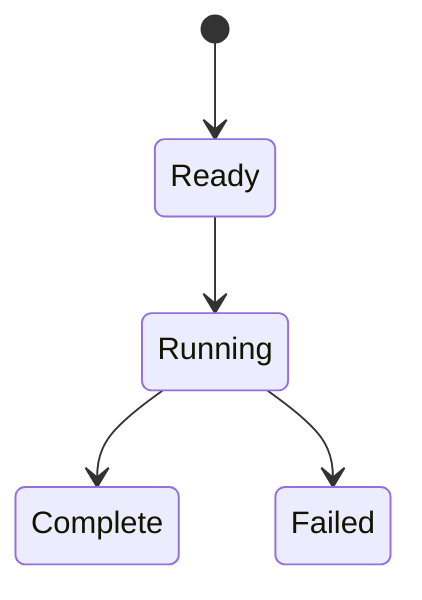

# 前处理模板

## 目录

- [三、任务模板接入](#三任务模板接入)
  - [3.1 背景与定位](#31-背景与定位)
  - [3.2 核心业务操作流程图](#32-核心业务操作流程图)
  - [3.3 业务状态机](#33-业务状态机)
  - [3.4 状态值说明](#34-状态值说明)
  - [3.5 功能点清单](#35-功能点清单)
  - [3.6 功能点详解](#36-功能点详解)

- [一、前处理模板](#一前处理模板)
  - [1.1 背景与定位](#11-背景与定位)
  - [1.2 核心业务操作流程图](#12-核心业务操作流程图)
  - [1.3 业务状态机](#13-业务状态机)
  - [1.4 状态值说明](#14-状态值说明)
  - [1.5 功能点清单](#15-功能点清单)
  - [1.6 功能点详解](#16-功能点详解)
- [二、准备与训练入口](#二准备与训练入口)
  - [2.1 背景与定位](#21-背景与定位)
  - [2.2 核心业务操作流程图](#22-核心业务操作流程图)
  - [2.3 业务状态机](#23-业务状态机)
  - [2.4 状态值说明](#24-状态值说明)
  - [2.5 功能点清单](#25-功能点清单)
  - [2.6 功能点详解](#26-功能点详解)

## 一、前处理模板

### 1.1 背景与定位

案例前处理入口与阶段名是 rawprep。当前公开入口拒绝旧阶段名 pre/datapre 和旧顶层采样/归一化键；历史产物消费按冻结语义单独核验。旧 YAML 自动迁移政策仍待确认。

面向研究人员的普通可复制目录。用户安装框架与共享能力，模板本身不安装。当前交付前处理、统计、归一化准备和显式训练；默认 pipeline 依次执行 rawprep、trainprep、train、post。

后续以真实科研使用驱动案例扩展：优先接入新模型和数据集、完成研究实验，再根据接入中暴露的问题改进框架。通用能力从多个案例中已经出现的共同需求提炼；框架能力比较中的建议不自动成为独立实施任务或案例接入的前置条件。该演进约定不改变已有案例的运行行为，也不承诺尚未选择的新案例。

### 1.2 核心业务操作流程图

### 1.3 业务状态机

### 1.4 状态值说明

Ready 表示输入已明确；Running 表示执行中；Complete 表示完整成功；Failed 表示停止或部分失败，已提交样本保留。

### 1.5 功能点清单

1. 直接执行与阶段串接
2. 实验选择与共享适配
3. 路径插值与产物交付

### 1.6 功能点详解

#### 1. 直接执行与阶段串接

同一个外流模板提供五个独立 example：汽车 AB-UPT 联合域、NASA Transolver 表面、NASA AB-UPT 表面、汽车 Transolver 表面与汽车 Transolver 体积。五段配置保持不变；通过 components.model 选择模型，模型参数与准备字段相应修改。一个 example 对应一次独立训练，不声明多实例。已有物理 PT 可从 trainprep 开始；原始读取仍可独立执行。五组交叉实验配置单轮训练和固定五测试样本，最后权重用于完整点场评价，前三样本用于图像比较。

同一套阶段脚本支持两个数据来源、两种模型组成的五个独立可复制配置案例。脚本只选择组件和调用业务装配，模型与数据集切换无需改框架源码或编写训练循环。

本案例设备参数不改变标准业务流程。研究者无需预填未来统计、准备、检查点或比较协议；运行自行产生证据。布局 feature_dim 描述模型接口，实际物理特征输入由 trainprep.use_physics_features 决定；默认 false 不要求用户额外填入 sdf/normals。短训仅验收装配与设备执行，不代表收敛、泛化或论文精度。

模板包含说明、用户配置、配置模块及四阶段脚本。直接执行前处理与从管道调用共用运行机制，不重复创建记录。旧安装模块入口已移除。

#### 2. 实验选择与共享适配

用户配置按 rawprep（原始处理）、trainprep（训练准备）、model（模型）、train（训练）、post（后处理）组织。共用采样和归一化归训练准备；案例配置模块负责校验、默认展开、路径解析与阶段参数提取。库仍消费原有输入契约，不随文件名和用户配置分组改名。旧用户键及旧阶段名拒绝，内部旧接口仍有效。

用户显式选择样本、分片、字段、分量要求、几何和过滤参数；底层文件结构与原始字段映射由可查看的 manifest/adapter 提供。按需数据视图不一次性加载整库；循环在框架内封装。

#### 3. 路径插值与产物交付

使用 ${data_root}/train 等明确路径表达式，各项均可独立覆盖。变量先展开，相对路径按配置文件解析；未知变量与循环引用拒绝。代码、数据和运行记录不强制嵌套。未配置分片及未执行归一化目录不创建。统计只拟合本次完整训练分片，失败不发布完整清单；输入快照仅保存最终生效配置。

## 二、准备与训练入口

### 2.1 背景与定位

研究者在可复制 YAML 中选择准备预算、网络参数和训练设置，通过同一个脚本会话逐步从只读探测进入准备与正式训练。用户通过 rawprep、trainprep、train 三个独立入口或连续流水线运行。旧阶段名 `pre` 不再接受。

### 2.2 核心业务操作流程图

### 2.3 业务状态机

本章无独立持久业务状态；调用失败向现有运行会话传播。

### 2.4 状态值说明

本章无业务状态值。数据空间与已提交产物在对应功能中明确记录。

### 2.5 功能点清单

1. 模式选择
2. 公开设置

### 2.6 功能点详解

#### 1. 模式选择

默认流水线依次执行 rawprep、trainprep、train。rawprep 交付数据与官方统计，trainprep 校验全部分片并交付冻结参数及数据摘要，train 消费准备引用并返回权重和指标位置。直接运行 train 时可指定已有准备引用；未指定则对已有数据执行同一准备链。独立 prepare/probe 模式保留。

准备引用可跨进程使用；修改输入声明、组件或数据内容后必须重新准备。检查模式不发布准备产物或训练检查点；整条流水线检查不会虚构未落盘的上游数据，下游检查列为待执行。

#### 2. 公开设置

NASA 默认正式宽度 256、24 层、8 头、64 切片，两轮训练、种子 2、AdamW 学习率 0.001。数据分片种子 42，二十路跨步分块；数值对照固定相对容差 1e-5、绝对容差 1e-6，身份和拓扑严格一致。正式规模数值对标通过；旧公开 YAML 自动兼容仍为未决项。

YAML 只要求已有输入、任务声明和实验选择；统计数值、准备摘要、未来检查点和逐样本输出文件名由流程生成。完整流程自动交接准备与检查点，独立运行时才提供已有产物引用；预测字段和分量是任务输入，不是预填预测结果。后处理额外交付按测试顺序编号的兼容张量包和点云，默认查询块长为 16384。YAML 显示各采样方法、预算、种子、网络参数、损失权重、按场比较方法与训练默认值。设备默认 `auto`，可显式写成 cpu、cuda 或 mps；找不到加速器时警告后继续用 CPU；MPS 的邻域检索回到 CPU，网络训练及推理在 MPS；个人配置的完整流程已实跑，严格数值一致未通过，不能把运行成功视为与 Noether 完全等价。比较方法默认均方误差，可改为平均绝对误差、Huber 或相对 L2。默认优化器为 Lion，调度为 5% 预热余弦落到 `1e-6`，可改为 Adam/AdamW 与恒定学习率；累积默认 1，重复评估次数默认 10，但每轮重复评估默认关闭，与官方回调配置一致，源码快照默认打开。默认内存准备，可显式物化和启用公共网格输出。`model.data_specs` 定义有序域、输出字段、特征与条件，`trainprep` 定义来源及物理派生，`sampling.domains` 定义 anchor/query 独立预算。`model.supervision` 替代旧 losses/loss_weights。默认零 query、不输入物理特征和条件；保留官方预设的特征投影结构以对齐相同种子的初始化。post 入口只注入贡献组件：默认打开测试评估、预测保存、锚点点云和完整网格回贴；`sample_indices` 默认只处理测试名单第 0 辆，网格写在数据目录 `predictions/mesh_vtk/`。检查点可空（用本次运行的 `last`）或显式给出。独立 post 默认 `post.random_stream=global`，从配置种子重建模型并沿参考随机流采样；锚点与网格两路隔离，结束后恢复调用方状态。旧独立样本采样可显式选择 independent。检查模式不写网格。新模型直接构造任务头；锁定 ShapeNet 默认配置的 CPU 完整训练已对照最终权重与指标；产品检查点不作为 Noether 互换格式，旧模型配置及检查点明确拒绝。正式模型运行需启用 abupt 可选依赖；当前 macOS ARM 环境已通过正式网络的小规模拟合和恢复验收。

## 三、任务模板接入

### 3.1 背景与定位

让既有四阶段案例能够通过项目任务创建和派生，保留普通脚本可直接执行的使用方式。

### 3.2 核心业务操作流程图

### 3.3 业务状态机

本章无独立状态机；任务和运行状态由任务管理提供，模板本身不引入发布或冻结流程。

### 3.4 状态值说明

模板展开完成只表示代码已创建，不表示数据、训练或后处理已执行。

### 3.5 功能点清单

1. 声明输入与输出位置
2. 托管运行与指标比较

### 3.6 功能点详解

#### 1. 声明输入与输出位置

声明原始数据、已有清单、准备记录和权重的输入类别；运行与预测输出由任务分配独立位置。复制资产后更新引用，默认不复制大文件。动态自定义输入需要补充声明，框架不猜测路径。

#### 2. 托管运行与指标比较

同一流水线可以从命令或普通脚本运行。复制到服务器后须重新绑定数据与几何路径并生成冻结准备；更改训练预算使用独立实验输出，已登记成功运行不会自动重训。离线报告连同图像资源交付，服务器硬件能力以实际预检为准。托管运行保存来源与捕获代码，既有准备、训练和 post 仍由原业务装配执行。相对误差指标声明字段、域、单位、分片及采样定义，使用固定运行结果比较，不由任务重算物理误差。

本轮采样迁移：规范输入与默认展开写入 `model.sampling`。旧 `trainprep.sampling` 单键仍可读取，新旧键同时出现拒绝；内部算法继续消费原采样语义，已有冻结产物不因页面分组变化失效。`rawprep.extraction.entries[].outputs[].members[]` 描述源字段到输出成员；`rawprep.format` 独立选择 pt/zarr，不在字段弹窗配置路径与格式。模型采样值变化仍触发准备一致性拒绝。

任务比较迁移同时更新当前 `task-entry.json` 的采样选择器到 `model/sampling`；旧运行继续按本次运行冻结的 entry 与 inputs/config.yaml 读取旧 `trainprep/sampling`。真实 task 双运行测试证明工作目录后续改动不改变既有比较语义。模板 entry 明确登记已有默认组件，历史缺少 components 的任务仅由 task 指定可信默认提供者适配，不由浏览器决定组件提供者。
