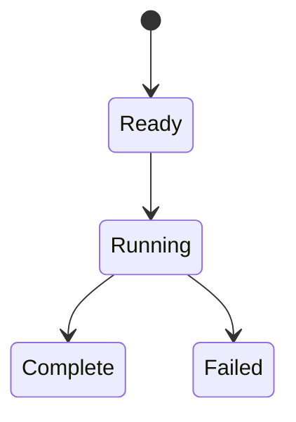

# 前处理模板

## 目录

- [一、前处理模板](#一前处理模板)
  - [1.1 背景与定位](#11-背景与定位)
  - [1.2 核心业务操作流程图](#12-核心业务操作流程图)
  - [1.3 业务状态机](#13-业务状态机)
  - [1.4 状态值说明](#14-状态值说明)
  - [1.5 功能点清单](#15-功能点清单)
  - [1.6 功能点详解](#16-功能点详解)
- [二、准备与训练入口](#二准备与训练入口)
  - [2.1 背景与定位](#21-背景与定位)
  - [2.2 核心业务操作流程图](#22-核心业务操作流程图)
  - [2.3 业务状态机](#23-业务状态机)
  - [2.4 状态值说明](#24-状态值说明)
  - [2.5 功能点清单](#25-功能点清单)
  - [2.6 功能点详解](#26-功能点详解)
- [三、任务模板接入](#三任务模板接入)
  - [3.1 背景与定位](#31-背景与定位)
  - [3.2 核心业务操作流程图](#32-核心业务操作流程图)
  - [3.3 业务状态机](#33-业务状态机)
  - [3.4 状态值说明](#34-状态值说明)
  - [3.5 功能点清单](#35-功能点清单)
  - [3.6 功能点详解](#36-功能点详解)

## 一、前处理模板

### 1.1 背景与定位

案例前处理入口与阶段名是 rawprep。当前公开入口拒绝旧阶段名 pre/datapre 和旧顶层采样/归一化键；历史产物只判断现行记录能否导入。旧 YAML 使用显式转换生成新副本；冻结产物不因配置转换自动升级。

面向研究人员的普通可复制目录。用户安装框架与共享能力，模板本身不安装。当前交付前处理、统计、归一化准备、显式训练、独立推理和固定结果后处理；默认 pipeline 依次执行 rawprep、trainprep、train、infer、post。

后续以真实科研使用驱动案例扩展：优先接入新模型和数据集、完成研究实验，再根据接入中暴露的问题改进框架。通用能力从多个案例中已经出现的共同需求提炼；框架能力比较中的建议不自动成为独立实施任务或案例接入的前置条件。该演进约定不改变已有案例的运行行为，也不承诺尚未选择的新案例。

### 1.2 核心业务操作流程图

### 1.3 业务状态机

### 1.4 状态值说明

Ready 表示输入已明确；Running 表示执行中；Complete 表示完整成功；Failed 表示停止或部分失败，已提交样本保留。

### 1.5 功能点清单

1. 直接执行与阶段串接
2. 实验选择与共享适配
3. 路径插值与产物交付

4. 数据集默认值与逐场输出

### 1.6 功能点详解

#### 1. 直接执行与阶段串接

配置转换可以在未启动运行时调用；执行正文显式传入会话，使输出落在本次阶段目录。独立配置检查不会创建输出目录。不同案例保留自己的领域连接，路径约定一致不意味着用同一算法正文覆盖所有模型。

五个官方案例原始处理透传平台生成的多格式列表，单格式旧配置仍可读取；列表中的每种格式都必须实际保存并记录到物理清单。已有任务的版本和运行快照不改写；已核验官方包装的可编辑副本可按对应案例迁移。

同一个外流模板提供七个独立 example：原有汽车/NASA 的 AB-UPT、Transolver-3 五例，以及 ShapeNet-Car、NASA CRM 两个静态 MeshGraphNet 例。五段配置保持不变；通过 components.model 选择模型，模型参数与准备字段相应修改。一个 example 对应一次独立训练。已有平台物理数据可从 trainprep 开始；图案例要求清单同时提供逐场 PT、VTKHDF 和实体身份。原始读取仍可独立执行。原五组交叉实验的既有预算不因新增图案例改变。

同一套阶段脚本支持两个数据来源、三类模型组成的七个独立可复制配置案例。脚本显式选择并组合业务步骤，显示参数和产物交接；各例允许来源读取和完整物理预测的局部差异，模型与数据集切换无需编写训练循环。`trainprep.topology` 存在时走物理网格图准备，并把当前训练/推理采样预算交给准备步骤缓存核心分区与 halo，再执行静态图训练和完整分区拼回；缺少该配置时保持原锚点准备、训练和推理数值路径。

本案例设备参数不改变标准业务流程。研究者无需预填未来统计、准备、检查点或比较协议；运行自行产生证据。布局 feature_dim 描述模型接口，实际物理特征输入由 trainprep.use_physics_features 决定；默认 false 不要求用户额外填入 sdf/normals。平台数据准备按 `model.data_specs` 角色与物理场匹配，两边张量形状须相容。短训仅验收装配与设备执行，不代表收敛、泛化或论文精度。

模板包含说明、用户配置、配置模块及四阶段脚本。直接执行前处理与从管道调用共用运行机制，不重复创建记录。旧安装模块入口已移除。

#### 2. 实验选择与共享适配

研究者需要修改实际研究方法，因此 recipe 是可编辑流程正文，不以最短转发脚本为目标。Python 决定步骤顺序，YAML 只提供参数和能力选择；application 负责业务绑定/校验，ability 负责计算，run 负责通用执行和记录。新增参数允许在复制案例 configuration.py 中声明，不要求修改框架注册表；文件、命令行覆盖和程序入口共用校验。

字段示例在提取后插入速度模长普通函数，以实体参照声明输出并完成保存、统计、归一化、模型特征消费。采样示例改变实际训练取样，保留模型随机流和轮次语义。目标、指标、变换与预测使用各自公开契约，非法形状/身份/状态明确失败。新模板不再调用整段 workflow，旧入口保留为兼容包装。仓库外复制与实际 wheel 安装均属验收范围，证据见 `.context/mvp/recipe-explicit-acceptance.md`。

用户配置按 rawprep（原始处理）、trainprep（训练准备）、model（模型）、train（训练）、post（后处理）组织。共用采样和归一化归训练准备；案例配置模块负责校验、默认展开、路径解析与阶段参数提取。库仍消费原有输入契约，不随文件名和用户配置分组改名。旧用户键及旧阶段名拒绝，内部旧接口仍有效。

用户显式选择样本、分片、字段、分量要求、几何和过滤参数；底层文件结构与原始字段映射由可查看的 manifest/adapter 提供。按需数据视图不一次性加载整库；循环在框架内封装。

#### 3. 路径插值与产物交付

使用 ${data_root}/train 等明确路径表达式，各项均可独立覆盖。变量先展开，相对路径按配置文件解析；未知变量与循环引用拒绝。代码、数据和运行记录不强制嵌套。未配置分片及未执行归一化目录不创建。统计只拟合本次完整训练分片，失败不发布完整清单；输入快照仅保存最终生效配置。

#### 4. 数据集默认值与逐场输出

- 案例从数据集声明补充原始处理默认配置，显式参数覆盖默认值，配置路径相对配置文件解析。Python 保留真实步骤顺序，用户在复制案例中通过公开字段映射插入计算，并声明实体、单位与物理状态；新增输出必须加入保存与后续消费。新模板默认写出 PT，并可在 `rawprep.formats` 同时声明 Zarr；旧 `rawprep.format` 单键继续有效。数据集默认已改为 `formats: [pt]`；与平台选项合并时以页面 `formats` 覆盖，不向用户报冲突。ShapeNet 与 NASA CRM 的来源均有真实拓扑，清单能力和默认值打开 VTKHDF；案例写 false 会盖掉清单默认，但图 trainprep 会因缺网格资产明确拒绝。已保存任务保持原值，不因清单默认改写。新任务默认保存归一化副本；坐标场可勾统一空间（配置里仍写 `method: coordinate`），方法映射到 `[0, 1]`，场上 `scale` 默认 1。AB-UPT 官方案例坐标预填 `scale: 1000`，Transolver-3 官方案例为 1。研究者改平台数据集名称只动 `dataset.processed_name`。

## 二、准备与训练入口

### 2.1 背景与定位

研究者在可复制 YAML 中选择准备预算、网络参数和训练设置，通过同一个脚本会话逐步从只读探测进入准备与正式训练。用户通过 rawprep、trainprep、train 三个独立入口或连续流水线运行。旧阶段名 `pre` 不再接受。

### 2.2 核心业务操作流程图

### 2.3 业务状态机

本章无独立持久业务状态；调用失败向现有运行会话传播。

### 2.4 状态值说明

本章无业务状态值。数据空间与已提交产物在对应功能中明确记录。

### 2.5 功能点清单

1. 模式选择
2. 公开设置
3. 独立推理与固定结果后处理

### 2.6 功能点详解

#### 1. 模式选择

通用模板及七个外流案例提供独立物理量和指标选择；参数由YAML提供，字段选择在Python阶段正文显式登记于物理输出之后。推理选择不影响训练配置。新版指标默认相对L2、MAE、RMSE、最大绝对误差、R²；只评价仍可交付轻量结果。新后处理消费固定结果，新旧结果读取与用户配置兼容分别判断；PI-BSNet不在本次迁移范围。原生后处理缺少固定结果时拒绝；仅明确设置历史预测兼容模式才允许调用旧计算流程，该模式用于已有算术对照，不由新页面自动开启。

默认流水线依次执行 rawprep、trainprep、train。rawprep 按全部或指定样本处理并交付数据与官方统计，不在此步选择 train/test 分片；平台提交时用 `unsplit` 覆盖，产物不写官方切分。`rawprep.workers` 大于 1 时并行处理样本。trainprep 校验已声明分片并交付冻结参数及数据摘要，可选 `trainprep.split` 把当前清单全部已处理样本重划为 train/test/eval，官方 `partition.yaml` 保持原样；新记录固定写出三个切片，空切片人数为 0。train 消费准备引用并按 `training_split` 取其中一个切片开训，默认训练集；准备记录里的名单优先于物理清单原划分。直接运行 train 时可指定已有准备引用；未指定则对已有数据执行同一准备链。独立 prepare/probe 模式保留。无评估分片时训练跳过该路评价。`train.export_predictions`、`train.export_vtk`、`train.export_split` 控制训练成功后是否写出预测或网格，默认关闭；只开网格拒绝。`train.export_vtk` 只管训练结束写出，和推理页拆开后的点云/网格化不是同一个键。写出复用独立推理锚点保存正文并消费现行 version=2 准备，不走旧物理准备接口，也不解开训练期评价。

准备引用可跨进程使用；修改输入声明、组件或数据内容后必须重新准备。检查模式不发布准备产物或训练检查点；整条流水线检查不会虚构未落盘的上游数据，下游检查列为待执行。

#### 2. 公开设置

NASA 默认正式宽度 256、24 层、8 头、64 切片，两轮训练、种子 2、AdamW 学习率 0.001。数据分片种子 42，二十路跨步分块；数值对照固定相对容差 1e-5、绝对容差 1e-6，身份和拓扑严格一致。正式规模数值对标通过；旧公开 YAML 自动兼容仍为未决项。

YAML 提供输入、路径、能力选择与实验参数，Python 明确步骤顺序。准备交付冻结记录，训练消费准备并交付检查点，infer 显式选择样本并保存固定预测与真值，post 读取这些结果。独立运行时提供已有准备、检查点或结果引用；完整 pipeline 自动传递前序返回值。推理默认 CPU，查询块长默认 16384，空样本名单不扩大为全体。训练设备默认 auto，按 CUDA/MPS/CPU 选择；硬件可用不代表数值等价。AB-UPT 模型结构版本 3，检查点容器版本 2；检查点不作为 Noether 互换格式。归一化与监督配置跟随模型当前声明，ShapeNet 官方配置启用归一化物化及 VTKHDF，NASA 不强开未接入格式。既有全网格与锚点数值函数由 infer 维护，历史 post 导入门面保留兼容；新 post 不重建模型。旧实验的预算和精度结论继续以原专项证据为准。

#### 3. 独立推理与固定结果后处理

模板和五例均提供独立推理阶段，按恢复、预测、物理输出、评价、保存、网格交付明确排列步骤。用户可直接插入普通函数派生字段或替换预测函数，数组必须完成保存及读回交接。步骤顺序由 Python 决定，不新增配置工作流。

新版默认顺序为 rawprep → trainprep → train → infer → post；需要独立流程时明确选择 trainprep → train → infer → post，或单独 infer。infer 参数包含 checkpoint、preparation、split、samples、device、query_chunk_size、evaluate、save_predictions、export_pointcloud、export_mesh。模板 `config.yaml` 仍可只写旧 `export_vtk`，未拆键时两种导出一起开。页面置灰看当次绑定的来源文件或连接关系路径，不看模板默认键。样本必须显式选择，空列表不自动扩大为全体；推理默认 CPU，查询块长默认 16384。点云与网格化默认打开并含真值。Recipe 只调用 application 装配，不直接写 VTK。用户关闭导出须在清单、日志和页面写明原因；缺拓扑或点数对不上则该样本失败，原因进清单，整批不冒充全部成功。相对输入按配置目录解析。

兼容模板保留 post 计算参数，但它们只用于历史 post-only 执行，原生 infer 不读取这些值。原生捕获配置可删除旧 post 计算键，仅保留 results；结果可通过 post.results 或 infer.results 指定。两个结果引用同时存在且不相同时拒绝，避免打开错误结果。连续流水线直接传递推理结果；新后处理不产生第二轮预测，不修改历史准备和检查点。旧脚本及旧配置仍使用原计算入口，不批量重写。

`recipes/aero_cfd/legacy-profile.json` 保留本次独立推理迁移前六套模板的完整脚本与 AST 摘要。该基线保留来源记录。当前宿主按任务显式声明的检查、评价和导出操作调用，不因新增组件文件或修改研究连接而拒绝；缺某项声明只使相应平台操作不可用。安装验收实际构建 core wheel，在仓库外复制 NASA 案例执行训练、infer 和只读 post，并核对包安装文件未改变。

## 三、任务模板接入

### 3.1 背景与定位

让既有官方案例能够通过项目任务创建和派生，保留普通脚本可直接执行的使用方式。现行默认阶段为 rawprep、trainprep、train、infer、post。

### 3.2 核心业务操作流程图

### 3.3 业务状态机

本章无独立状态机；任务和运行状态由任务管理提供，模板本身不引入发布或冻结流程。

### 3.4 状态值说明

模板展开完成只表示代码已创建，不表示数据、训练或后处理已执行。

### 3.5 功能点清单

1. 声明输入与输出位置
2. 托管运行与指标比较

### 3.6 功能点详解

#### 1. 声明输入与输出位置

Task 托管时原始物理数据默认进入项目共享目录，需要显式共享名称；准备与预测仍归任务。独立脚本继续按用户 YAML 的路径执行。共享输出和阶段输入只约束托管交接，Python 中读取、派生、选择、保存、统计的步骤仍可自由修改；新增字段必须保存并由另一任务读回消费。

声明原始数据、已有清单、准备记录和权重的输入类别；运行与预测输出由任务分配独立位置。复制资产后更新引用，默认不复制大文件。动态自定义输入需要补充声明，框架不猜测路径。

#### 2. 托管运行与指标比较

同一流水线可以从命令或普通脚本运行。复制到服务器后须重新绑定数据与几何路径并生成冻结准备；更改训练预算使用独立实验输出，已登记成功运行不会自动重训。离线报告连同图像资源交付，服务器硬件能力以实际预检为准。托管运行保存来源与捕获代码，既有准备、训练和 post 仍由原业务装配执行。相对误差指标声明字段、域、单位、分片及采样定义，使用固定运行结果比较，不由任务重算物理误差。

本轮采样迁移：规范输入与默认展开写入 `model.sampling`。旧 `trainprep.sampling` 单键仍可读取，新旧键同时出现拒绝；内部算法继续消费原采样语义，已有冻结产物不因页面分组变化失效。`rawprep.extraction.entries[].outputs[].members[]` 描述源字段到输出成员；`rawprep.format` 独立选择 pt/zarr，不在字段弹窗配置路径与格式。几何/域采样方法或自定义入口变化不再挡现行准备导入；模型页采样预算（几何点数、超节点、锚点点数）、种子和训练批次不属于准备冻结，变化不单独要求重跑 trainprep，也不能挡开训或模型可视化。参数更新走平台页面与 core 模板。

任务比较迁移同时更新当前 `task-entry.json` 的采样选择器到 `model/sampling`；旧运行继续按本次运行冻结的 entry 与 inputs/config.yaml 读取旧 `trainprep/sampling`。真实 task 双运行测试证明工作目录后续改动不改变既有比较语义。模板 entry 明确登记已有默认组件，历史缺少 components 的任务仅由 task 指定可信默认提供者适配，不由浏览器决定组件提供者。
