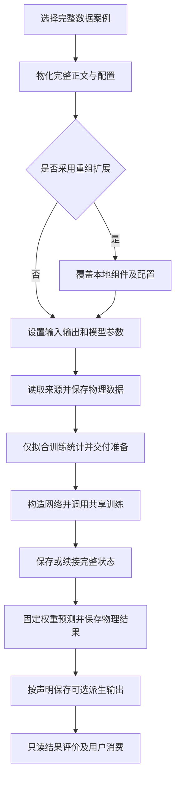

# 经典网络可复制研究

## 目录

- [一、经典数据案例与网络重组](#一经典数据案例与网络重组)
  - [1.1 背景与定位](#11-背景与定位)
  - [1.2 核心业务操作流程图](#12-核心业务操作流程图)
  - [1.3 业务状态机](#13-业务状态机)
  - [1.4 状态值说明](#14-状态值说明)
  - [1.5 功能点清单](#15-功能点清单)
  - [1.6 功能点详解](#16-功能点详解)

## 一、经典数据案例与网络重组

### 1.1 背景与定位

研究者可以复制三个完整案例，在已有数据身份和统计交接上选择经典网络，或注入普通用户组件形成跨族组合。流程正文显示原始处理、训练准备、共享训练、固定推理与独立后处理，算法和领域装配分别由相应能力和应用提供。交付源码与可复制资源，支持真实小数据训练、恢复和独立安装后的Python/Task流程；本期范围是结构与功能可用，不表示论文精度或网页模型选择。

### 1.2 核心业务操作流程图

### 1.3 业务状态机

本章无业务状态。流程选择是执行范围，阶段产物负责实际交接；任务与运行生命周期使用既有机制。缺少独立阶段所需输入时失败，不通过目录存在猜测此前阶段已完成。

### 1.4 状态值说明

本章无业务状态值。训练目标为累计更新数，恢复时继续已有进度；训练模式、循环隐藏状态与有效域标记都不承担业务完成态。

### 1.5 功能点清单

1. 完整案例复制与参数改写
2. 显式五阶段与独立执行
3. 网络组合扩展与本地构造器
4. 派生输出保存与固定消费
5. 恢复、预算和结果范围

### 1.6 功能点详解

#### 1. 完整案例复制与参数改写

三个完整案例分别绑定Darcy二维系数解场、ShapeNet-Car三维体速度和双圆柱真实时间预测。默认静态案例选择MLP，时间案例选择基础RNN；模型参数可以在各自有效数据表示内改写。模型计算本身来自核心公共能力，来源字段和监督布局属于贡献连接。

复制后显式填写来源、运行根与数据根，路径按配置位置解析。ShapeNet距离输入是来源体顶点无符号面距离插值到规则格的近似，不能当作格点精确最近面距离。独立模型默认值不是整个网络家族的唯一标准，不把小输入ResNet场预测变体称为原图像分类模型。已有来源和历史冻结记录不批量迁移，新研究输出使用独立目录。

#### 2. 显式五阶段与独立执行

Python正文决定原始处理、训练准备、训练、推理、后处理的顺序，配置仅选择执行范围。连续执行直接交接上游返回值；独立执行显式绑定所需数据、准备、检查点或固定结果。显式外部输入与上游交接不一致时拒绝，不静默选择其中之一。

训练通过公共迭代机制推进优化、记录进度和保存恢复状态，流程正文不实现另一套循环。推理使用独立设备设置并恢复固定权重；后处理只读结果，不以缺预测为由自动运行网络。停止或预算结束不能据此认定整个研究已成功。

#### 3. 网络组合扩展与本地构造器

残差U-Net和注意力瓶颈U-Net均从Darcy完整案例物化。前者用公共残差阶段替换编码器与瓶颈，后者显式将瓶颈网格转换为token、使用标准注意力再重建；两者保留局部通道在前转换和多尺度跳连交接。

CNN-RNN从双圆柱完整案例物化，逐帧共享卷积后沿真实时间循环，保留完整历史网格并预测下一帧。该组合使用custom布局连接且关闭点采样，不能以基础RNN配置把空间点当时间或丢掉卷积邻域。默认每次调用从初始隐藏状态开始，显式续接须保持空间实体顺序。

扩展以普通可导入构造器接入，不需要修改框架注册表。覆盖集须先叠加完整基案例；只复制扩展文件不构成独立训练工程。改变组件后重新核对形状、状态和权重兼容，不承诺旧检查点可继续使用。

#### 4. 派生输出保存与固定消费

推理允许调用本地派生函数，将新增数组和单位、实体、有效域声明一起保存；独立后处理再从固定结果读回并调用消费者。示例提供预测末轴范数及形状、有限性核对，不仅在内存中产生值。

Darcy标量范数是绝对值；双圆柱混合物理分量范数不具有速度模长含义。没有共同单位声明时保留unknown。要研究物理速度模长，需显式选择速度分量与单位；保存成功不能替代科学语义确认。无效格点只作占位，不纳入有效域误差。

#### 5. 恢复、预算和结果范围

恢复训练显式绑定准备和完整检查点，累计目标更新数必须体现续训意图；推理按训练时统计反变换。模型结构、数据声明或状态不相容时拒绝，不静默部分加载。固定结果与准备应以实际相对引用整体搬移，不能只带清单却依赖旧源路径补全。ShapeNet准备自带物理快照，推理固定保存原网格数组和样本偏移，后处理独立报告原点覆盖及支撑域误差。

默认100次更新是可编辑起点。当前用户约定先完成各组集成与架构复核，再由主控串行训练；同一模型与数据组合的测速、参考、Dojo、失败重试、恢复和评价合计不超过三小时。单次训练时限只约束局部执行，不能替代总预算账本。

报告区分组件数值一致、可重组、真实学习效果、完整流程和安装证据。小样本、局部支持域或短训结论保留原范围，不由零参考差值或资源登记推断论文复现、生产精度或全点覆盖。
