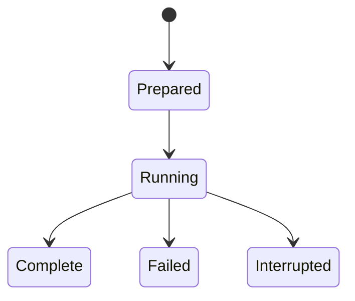

# GenCP 研究流程

## 目录

- [一、GenCP 研究流程](#一gencp-研究流程)
  - [1.1 背景与定位](#11-背景与定位)
  - [1.2 核心业务操作流程图](#12-核心业务操作流程图)
  - [1.3 业务状态机](#13-业务状态机)
  - [1.4 状态值说明](#14-状态值说明)
  - [1.5 功能点清单](#15-功能点清单)
  - [1.6 功能点详解](#16-功能点详解)

## 一、GenCP 研究流程

### 1.1 背景与定位

为人和 Agent 提供可以复制、修改和逐阶段执行的生成式耦合研究正文。当前六组为限时缩小训练，完整论文训练另行验收；不包含平台页面。

### 1.2 核心业务操作流程图

### 1.3 业务状态机

### 1.4 状态值说明

准备完成 Prepared 固定输入；运行中 Running 尚未交付；完成 Complete 已保存实际结果；失败 Failed 和中断 Interrupted 不能算完整成功。

### 1.5 功能点清单

1. 显式研究阶段。
2. 独立场与耦合变体。
3. 固定结果与研究评价。
4. 限时和结论范围。

### 1.6 功能点详解

#### 1. 显式研究阶段

研究脚本显示原始处理、准备、独立场训练、单场验证、耦合推理和固定结果 post 的顺序与返回值交接。配置只提供参数和能力选择。

#### 2. 独立场与耦合变体

每个场独立配置和恢复，可替换一个场权重后新建组。条件函数、构造器和积分更新为普通可替换能力；实际算法来源应保存，实验输出写独立目录。

`examples/recipe_extensions/gencp/retrain.py` 展示只重训流体并保留其他场字节固定权重；每场 `fields.<field>.updates` 可覆盖默认更新数。新组随后真实执行 infer/post，原组保持不变。精确恢复仍要求原预算和优化设置，修改预算的重训不复用旧恢复状态。

#### 3. 固定结果与研究评价

原预测、参考后处理和论文目标分别保存。新增派生输出须保存、读回并由下游评价消费；独立 post 不重新训练或推理。

#### 4. 限时和结论范围

每组参考与 Dojo 累计不超过三小时，重试共用预算。工程数值一致性、缩小训练的学习效果和论文复现分别报告；未完成不标成功。
