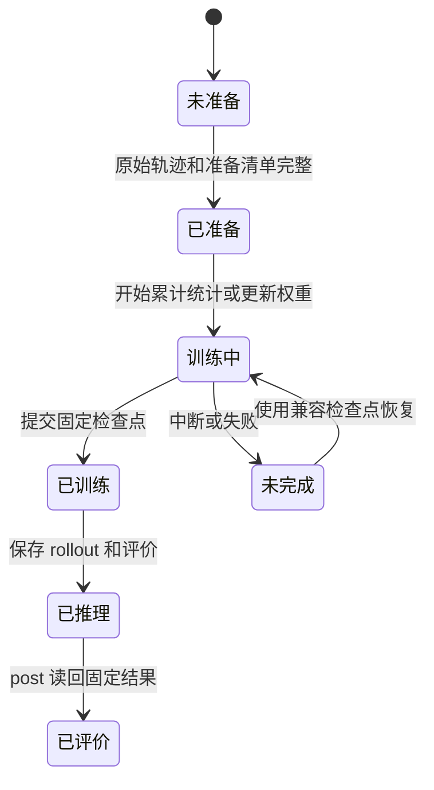

# MeshGraphNets / CylinderFlow Recipe

## 目录

- [一、CylinderFlow 时空预测研究流程](#一cylinderflow-时空预测研究流程)
  - [1.1 背景与定位](#11-背景与定位)
  - [1.2 核心业务操作流程图](#12-核心业务操作流程图)
  - [1.3 业务状态机](#13-业务状态机)
  - [1.4 状态值说明](#14-状态值说明)
  - [1.5 功能点清单](#15-功能点清单)
  - [1.6 功能点详解](#16-功能点详解)

## 一、CylinderFlow 时空预测研究流程

### 1.1 背景与定位

本 Recipe 为固定二维网格上的 CylinderFlow 速度预测提供可复制研究流程。Python
阶段正文决定顺序，YAML 提供参数和执行范围。它使用 core 的通用图、训练与轨迹
能力，并由 contrib 解释 MeshGraphNet 和 CylinderFlow 语义。本目录继续只处理 CylinderFlow
时空预测；ShapeNet-Car 与 NASA CRM 的静态工程扩展属于 `aero_cfd` Recipe，不改变
本目录的轨迹、rollout 或论文指标边界。动态重网格与平台 Web 模型注册仍不在范围内；
工程闭环也不等于论文精度复现。

### 1.2 核心业务操作流程图

### 1.3 业务状态机

### 1.4 状态值说明

| 中文含义 | 标识 | 业务说明 |
| --- | --- | --- |
| 未准备 | `unprepared` | 尚无可消费的轨迹清单 |
| 已准备 | `prepared` | 分片、轨迹身份和来源已固定 |
| 训练中 | `training` | 正在累计统计或执行参数更新 |
| 已训练 | `trained` | 固定步数检查点及恢复收据完整 |
| 已推理 | `inferred` | 预测、真值、拓扑和指标已经保存 |
| 已评价 | `evaluated` | post 已读回固定结果，不重新运行模型 |
| 未完成 | `incomplete` | 保留已提交产物，但不发布完整成功结论 |

### 1.5 功能点清单

1. CylinderFlow 原始轨迹接入
   1.1 官方 TFRecord 分片
   1.2 显式 torch 小样本
2. 固定网格图训练
   2.1 逐时间步监督与变长图收批
   2.2 在线归一化、噪声和 mask
   2.3 固定检查点恢复
3. 多步 rollout 与固定结果
   3.1 边界保持和速度增量积分
   3.2 累计时间步指标
4. 直接运行与 Task 托管

### 1.6 功能点详解

#### 1. CylinderFlow 原始轨迹接入

输入必须显式给出官方数据目录或按分片保存的小样本。读取后保留样本身份、二维
坐标、三角形拓扑、节点类别、时间轴和速度；字段缺失、shape 不符或类别越界时失败。

##### 1.1 官方 TFRecord 分片

官方目录以 `meta.json` 解释 train、valid、test 记录。轨迹条数限制只影响本次输出，
不改写源分片。CRC、protobuf 字节和业务字段分层解析，避免 core 认识数据集字段。

##### 1.2 显式 torch 小样本

研究者可以提供按 split 划分的张量包，用于流程检查和变体开发。小样本身份与完整
官方数据身份分开，不能据此宣称论文级结果。

#### 2. 固定网格图训练

训练使用 MeshGraphNet 的 Encoder/Processor/Decoder，并把图构造、收批、噪声、mask
和归一化交给中立能力。模型专属配置不进入 Task。

##### 2.1 逐时间步监督与变长图收批

完整轨迹按原协议取中间帧及其后一帧，节点和边数量可跨轨迹变化。batch 拼接只偏移
局部边索引，不填充或改变节点身份。

##### 2.2 在线归一化、噪声和 mask

节点、边和速度增量统计随训练 batch 累计；预热阶段只积累统计。噪声只施加于普通
流体节点，损失只选择普通和出流节点，并按速度分量求和后按节点平均。

##### 2.3 固定检查点恢复

检查点保存模型、优化器、归一化统计、随机状态、进度和协议收据。只有模型结构、
batch、噪声、预热及学习率协议一致时可继续增加总更新目标。

#### 3. 多步 rollout 与固定结果

推理从固定检查点恢复，逐步预测速度增量并保存每条轨迹的预测、真值、坐标、拓扑、
节点类别、样本指标及聚合指标。不同轨迹可以有不同节点数，不要求堆叠成等长网格。

##### 3.1 边界保持和速度增量积分

普通和出流节点使用模型预测更新；其他节点保持初始边界速度。步数为 `all` 时覆盖
目标轨迹全部可用帧，显式步数超过真值长度时拒绝执行。

##### 3.2 累计时间步指标

`mse_H_steps` 对第 1 到 H 个预测帧累计求均方误差，再按轨迹等权汇总。初始真值帧
不参与误差；没有足够时间长度的 horizon 不伪造指标。

#### 4. 直接运行与 Task 托管

直接 Recipe 和 Task 使用同一 `pipeline.py` 与 `config.yaml`。Task 只管理公共输入、
运行状态、资产摘要和恢复引用，不导入 Recipe 或 MeshGraphNet 内部对象。post 只读取
infer 的固定结果和指标，不能重新加载模型或重新计算预测。
