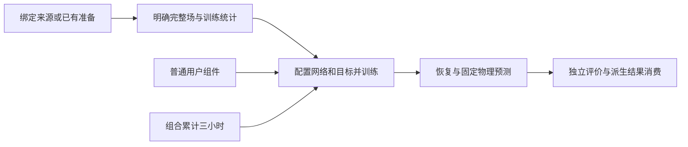

# 算子学习研究模板

## 目录

- [一、可复制算子学习流程](#一可复制算子学习流程)
  - [1.1 背景与定位](#11-背景与定位)
  - [1.2 核心业务操作流程图](#12-核心业务操作流程图)
  - [1.3 业务状态机](#13-业务状态机)
  - [1.4 状态值说明](#14-状态值说明)
  - [1.5 功能点清单](#15-功能点清单)
  - [1.6 功能点详解](#16-功能点详解)

## 一、可复制算子学习流程

### 1.1 背景与定位

这组模板让研究者在三类已存在的场任务上使用可组合算子网络，同时保留可编辑的阶段正文和公共训练机制。它交付工程流程与扩展位置；短预算、组件正确性、真实训练、安装和论文精度分开确认。

### 1.2 核心业务操作流程图

### 1.3 业务状态机

本章无业务状态。阶段的执行、失败和运行记录由既有运行会话管理；这里描述数据和能力的显式连接，不新增任务状态机。

### 1.4 状态值说明

本章无业务状态值。准备、模型状态和固定结果是独立交接产物，不能把文件存在当作研究验收完成。

### 1.5 功能点清单

1. 三案例的显式五阶段
2. 完整场与训练状态交接
3. 可替换能力与物理约束
4. 预算、复制与迁移范围

### 1.6 功能点详解

#### 1. 三案例的显式五阶段

Darcy、ShapeNet-Car 体积规则格及 DoubleCylinder 各自提供可复制的完整研究正文。Python 决定原始处理、训练准备、训练、推理和后处理的顺序；配置只选择执行范围和参数。Darcy、ShapeNet 可选择 FNO 或 DeepONet，DoubleCylinder 使用历史通道 FNO。阶段外部输入与上游返回值冲突时拒绝，不搜索“最近一次”结果。

#### 2. 完整场与训练状态交接

准备复用既有物理数据和训练独立统计，传感器与查询、有效网格及真实历史按案例明确连接。训练保存初始化与完整更新状态，独立推理恢复同结构权重并反变换；后处理消费固定物理结果，不重新加载网络。完整谱域不允许用空间分块替代，ShapeNet 在有支撑的原点域报告覆盖和误差。

#### 3. 可替换能力与物理约束

研究者通过普通构造器替换实际网络部分，新增派生数组需要保存单位、实体和有效域并由结果消费者读回。Darcy 物理扩展复用已有残差损失，惩罚经来源准入的非负解违约；它不是对采样外圈施加零边界，也不表示完整 PDE 残差或新增 PINN。默认关闭物理项，非 Darcy 案例拒绝该项。

#### 4. 预算、复制与迁移范围

单组合累计不得超过三小时，独立参考、准备、Dojo、失败重试及恢复核对计入同一预算；训练阶段局部截止不能替代主控硬时限。源码可调用与复制资源存在不等于统一科学矩阵、安装或 Task 已验收；当前真实训练和安装按本批专项记录继续。新模板不自动开放网页模型，不迁写旧准备和检查点。
