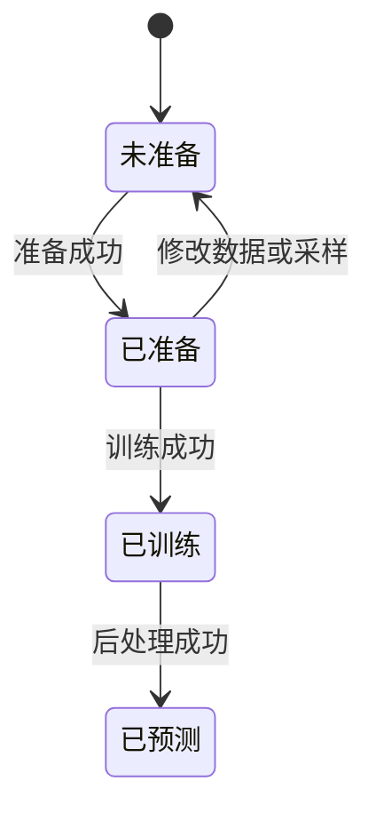

# 参数化 PDE 案例模板

## 目录

- [一、案例研究流程](#一案例研究流程)
  - [1.1 背景与定位](#11-背景与定位)
  - [1.2 核心业务操作流程图](#12-核心业务操作流程图)
  - [1.3 业务状态机](#13-业务状态机)
  - [1.4 状态值说明](#14-状态值说明)
  - [1.5 功能点清单](#15-功能点清单)
  - [1.6 功能点详解](#16-功能点详解)

## 一、案例研究流程

### 1.1 背景与定位

研究人员复制模板并配置已有物理数据、模型、边界和采样，直接使用贡献方程或自己的 PyTorch 函数。
模板不包含算法和训练循环，不提供 Web 配置或自动符号编译。数据生成先于训练独立执行。

### 1.2 核心业务操作流程图

### 1.3 业务状态机

### 1.4 状态值说明

未准备表示没有匹配的完整准备资产；已准备可训练；已训练有可恢复权重；已预测表示声明的测试样本全部完成。
失败只保留已提交产物，不自动推进状态。

### 1.5 功能点清单

1. 配置案例与组件
2. 独立执行和恢复
3. 用户 PyTorch 扩展

### 1.6 功能点详解

#### 1. 配置案例与组件

五段配置表达用户意图，采样位于模型设置但在准备阶段执行。边界按边界名、字段和条件类型组织，训练权重独立。
路径相对配置文件，未知键、旧采样位置、失效边界和周期冲突拒绝。缺失参考不静默使用其他数据。
梯形唯一示例采用用户选定的主文十实例范围：控制网格100×20×20、3000轮逐实例Adam更新、数据/PDE权重1/0.001、CPU/FP32。该协议保留原数据与样条数值近似，并非已消除论文所有冲突。

#### 2. 独立执行和恢复

预测由 infer 独立恢复明确权重并保存完整数组和成员摘要；post 只读固定结果重算逐实例与逐时刻指标，成员内容变化即拒绝。公共输入归 inputs，输出归本次阶段数据目录。旧用户配置须显式转换，历史科学准备与检查点继续由原合同核验；不能通过更换目录绕开科学兼容检查。

准备与训练须显式允许执行；数据、准备和预测各用独立输出目录。新实验不覆盖历史冻结资产。梯形迁移需独立重新生成及准备，拒绝旧数据协议和旧模型检查点。公共组件来源摘要变化时历史其他案例的准备也不能直接按新来源续用；已完成预测和旧源码快照仍保留为证据，不自动重训。
Neumann与Advection当前示例选择完整实验验证过的原代码路径，显式CPU及新的数据/准备/运行目录；Neumann整轮汇总、Advection逐实例更新。旧准备与检查点不得无记录续用。正式文献验证锁定预算；研究实验延长轮次可以恢复；改变模型、数据、训练目标或优化协议时不能当作原实验继续。独立预测显式指定检查点，后处理显式指定固定结果。

参考配置按文献优先、锁定源码补足缺失参数。完整网格 PDE 配点包含初边界；非 Neumann 初值和周期罚项默认权重为零，仅监测。改变这些设置属于研究配置，重新准备并披露协议变化，不能直接沿用参考精度结论。

迁移前允许对已确认的论文与源码冲突建立独立对照矩阵：固定数据与初始化，分别验证导数解释及更新分组，使用各自完整轮数并报告实际更新次数。实验不自动修改已安装模型或案例；标准物理导数解释与论文未明确的离散细节须分开披露，不能按误差选优就认定论文算法。

独立参考实验区分原仓库完整基线、论文参数差异验证与完整算法复现。论文和代码冲突须先确认；论文内部冲突可分别建立具名实验，不能挑选最接近论文的一组冒充唯一设置。参数验证保留明确列出的未决算法差异，并冻结来源、获批修改、实际更新数和完整测试输出；报告声明尚未对齐的随机名单及指标口径。启动失败单独保留，不能计作训练完成，也不覆盖既有基线产物。

#### 3. 用户 PyTorch 扩展

内置方程直接接收张量并返回残差；用户可以直接计算自己的损失。自定义训练计算通过完整导入路径接入，不要求继承框架基类。
模型和数据由组件绑定；原子计算不感知模板。用户只修改研究相关组件，不重写运行生命周期。
