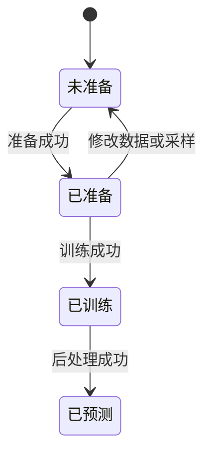
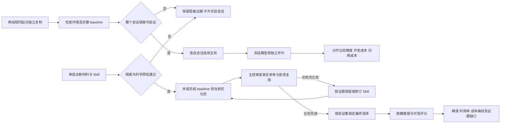
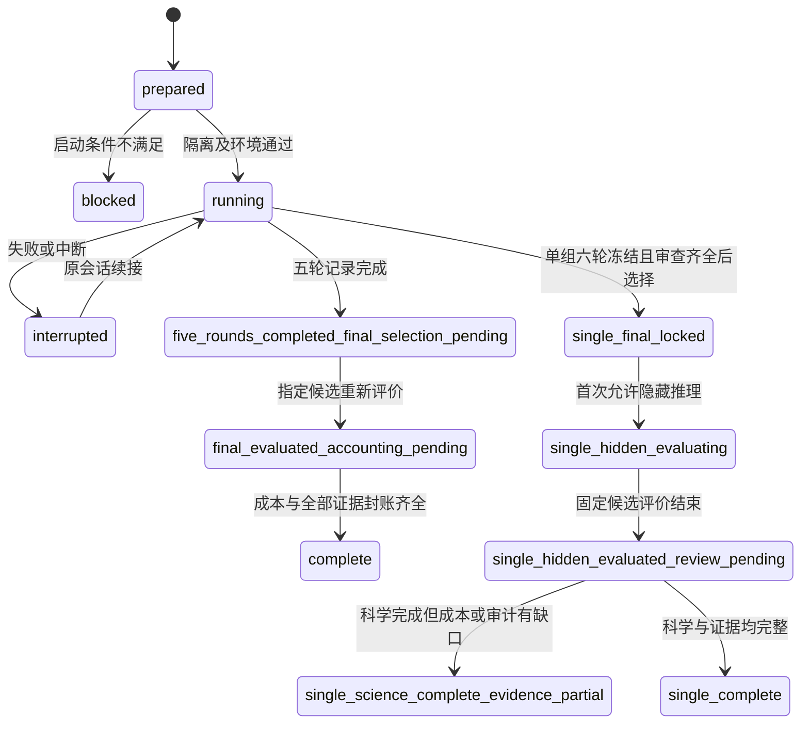

# 参数化 PDE 案例模板

## 目录

- [一、案例研究流程](#一案例研究流程)
  - [1.1 背景与定位](#11-背景与定位)
  - [1.2 核心业务操作流程图](#12-核心业务操作流程图)
  - [1.3 业务状态机](#13-业务状态机)
  - [1.4 状态值说明](#14-状态值说明)
  - [1.5 功能点清单](#15-功能点清单)
  - [1.6 功能点详解](#16-功能点详解)

- [二、独立双组研究实验](#二独立研究对照实验)
  - [2.1 背景与定位](#21-背景与定位)
  - [2.2 核心业务操作流程图](#22-核心业务操作流程图)
  - [2.3 业务状态机](#23-业务状态机)
  - [2.4 状态值说明](#24-状态值说明)
  - [2.5 功能点清单](#25-功能点清单)
  - [2.6 功能点详解](#26-功能点详解)

## 一、案例研究流程

### 1.1 背景与定位

研究人员复制模板并配置已有物理数据、模型、边界和采样，直接使用贡献方程或自己的 PyTorch 函数。
模板不包含算法和训练循环，不提供 Web 配置或自动符号编译。数据生成先于训练独立执行。

### 1.2 核心业务操作流程图

### 1.3 业务状态机

### 1.4 状态值说明

未准备表示没有匹配的完整准备资产；已准备可训练；已训练有可恢复权重；已预测表示声明的测试样本全部完成。
失败只保留已提交产物，不自动推进状态。

### 1.5 功能点清单

1. 配置案例与组件
2. 独立执行和恢复
3. 用户 PyTorch 扩展

### 1.6 功能点详解

#### 1. 配置案例与组件

五段配置表达用户意图，采样位于模型设置但在准备阶段执行。边界按边界名、字段和条件类型组织，训练权重独立。
路径相对配置文件，未知键、旧采样位置、失效边界和周期冲突拒绝。缺失参考不静默使用其他数据。
梯形唯一示例采用用户选定的主文十实例范围：控制网格100×20×20、3000轮逐实例Adam更新、数据/PDE权重1/0.001、CPU/FP32。该协议保留原数据与样条数值近似，并非已消除论文所有冲突。

#### 2. 独立执行和恢复

预测由 infer 独立恢复明确权重并保存完整数组和成员摘要；post 只读固定结果重算逐实例与逐时刻指标，成员内容变化即拒绝。公共输入归 inputs，输出归本次阶段数据目录。旧用户配置须显式转换，历史科学准备与检查点继续由原合同核验；不能通过更换目录绕开科学兼容检查。

准备与训练须显式允许执行；数据、准备和预测各用独立输出目录。新实验不覆盖历史冻结资产。梯形迁移需独立重新生成及准备，拒绝旧数据协议和旧模型检查点。公共组件来源摘要变化时历史其他案例的准备也不能直接按新来源续用；已完成预测和旧源码快照仍保留为证据，不自动重训。
Neumann与Advection当前示例选择完整实验验证过的原代码路径，显式CPU及新的数据/准备/运行目录；Neumann整轮汇总、Advection逐实例更新。旧准备与检查点不得无记录续用。正式文献验证锁定预算；研究实验延长轮次可以恢复；改变模型、数据、训练目标或优化协议时不能当作原实验继续。独立预测显式指定检查点，后处理显式指定固定结果。

参考配置按文献优先、锁定源码补足缺失参数。完整网格 PDE 配点包含初边界；非 Neumann 初值和周期罚项默认权重为零，仅监测。改变这些设置属于研究配置，重新准备并披露协议变化，不能直接沿用参考精度结论。

迁移前允许对已确认的论文与源码冲突建立独立对照矩阵：固定数据与初始化，分别验证导数解释及更新分组，使用各自完整轮数并报告实际更新次数。实验不自动修改已安装模型或案例；标准物理导数解释与论文未明确的离散细节须分开披露，不能按误差选优就认定论文算法。

独立参考实验区分原仓库完整基线、论文参数差异验证与完整算法复现。论文和代码冲突须先确认；论文内部冲突可分别建立具名实验，不能挑选最接近论文的一组冒充唯一设置。参数验证保留明确列出的未决算法差异，并冻结来源、获批修改、实际更新数和完整测试输出；报告声明尚未对齐的随机名单及指标口径。启动失败单独保留，不能计作训练完成，也不覆盖既有基线产物。

#### 3. 用户 PyTorch 扩展

内置方程直接接收张量并返回残差；用户可以直接计算自己的损失。自定义训练计算通过完整导入路径接入，不要求继承框架基类。
模型和数据由组件绑定；原子计算不感知模板。用户只修改研究相关组件，不重写运行生命周期。

两项可物化的研究扩展基于现有 Darcy 完整案例，继续使用原网格读取、训练统计、模型装配、公共迭代入口和固定结果后处理。尾批扩展允许样本数不整除批量，每轮按用户产生的有序记录收批，默认保留尾项，按实际批次数设置轮次调度；样本游标、完整当轮记录和随机状态随检查点恢复，不跨轮补入被显式丢弃的数据。

研究状态扩展从原训练名单显式留出验证样本，原测试分片保持独立；训练统计只拟合剩余训练样本，验证和测试读取同一冻结统计。采用外部准备时必须具备独立验证分片，不以测试数据替代。用户验证回调比较普通和滑动平均权重；保存成功后再提交选择值、位置及来源，完整检查点同时保存选择状态和真正受评权重快照。验证与保存周期独立，用户状态通过普通保存、预检和恢复函数接入公共训练入口，不要求新训练循环或组件基类。

选定权重与完整恢复状态分别交付：固定推理使用选定权重，继续训练使用最新完整检查点；后者包含此前最佳快照，即使旧最佳文件不在仍能恢复选择。独立后处理只消费固定预测、真值及派生数组，不重新构建模型。扩展允许改损失、批量和派生结果，但不改变旧案例默认行为；短预算对照只验证状态与交接，不代表该策略提升科学精度。

## 二、独立研究对照实验

### 2.1 背景与定位

研究者用一个 Neumann 案例比较普通代码与可使用 Dojo 的两个 AI 会话。精度优先，编码耗时和编码 token 单列，训练成本不直接证明框架开发效率。此工具属于仓库验证流程，不增加安装包 API 或 Web 能力。已提供材料、环境、独立评价、账本及正式 Codex CLI 调度。正式会话在操作系统整进程沙箱中运行，包含其文件工具和子进程；模拟调度只用于工具测试。完整实验仍须等待五轮、独立重放与计量封账。

新增 JOREK RMHD 独立协议吸取原实验的数据暴露与前置准备问题：两组只领相同网络、初始化、科学规则、原始训练/验证数据及通用安装材料；环境安装和数据处理均属于各组实际工作。主控预实验只证明案例可行，不进入组上下文。隐藏测试在双方最终选择冻结前不执行，避免把多轮训练优化变成反复适配测试集。原Neumann记录保留原定义，不追改。

同一科学协议另支持单组 Skill 适应性研究：主控逐轮审查参考与复用，只在轮间交付 Skill，评估其指导是否到位，不将单组结果当作双组因果对照。

### 2.2 核心业务操作流程图

### 2.3 业务状态机

### 2.4 状态值说明

`prepared` 表示材料就绪，不代表隔离通过；`blocked` 表示未创建正式会话；`running` 表示真实执行或明确标记的测试执行；`interrupted` 保留同一会话及所有失败尝试。`five_rounds_completed_final_selection_pending` 等待候选选择；`final_evaluated_accounting_pending` 已重新评价但计量尚未封账。两者均不代表正式完成。`complete` 需要最终推理和完整计量。模拟输出统一标记 `simulation`，缺失记录的汇总标记 `incomplete`。

RMHD 单独使用 `science_passed` / `science_gate_failed` 标记真实500epoch MPS预实验；材料交付后是 `materials_prepared_isolation_pending`。整进程、MPS和公开网络预检通过才进入 `ready` / `running`。`both_finals_locked` 是首次允许隐藏推理的门槛；`hidden_evaluating` 可原样重试基础设施故障，不能换候选；`hidden_evaluated_accounting_pending` 等待计量。缺证据或最终延迟不合格时保持 `evaluated_evidence_incomplete`。

单组独立使用 `single_final_locked`、`single_hidden_evaluating`、`single_hidden_evaluated_review_pending`，分别表示选择已锁定、隐藏评价中和主控待审查。`single_science_complete_evidence_partial` 表示真实科学轨迹已完成但证据仍有缺口，不冒充完整验收；`single_complete` 只适用于证据齐全的完成状态。轮间审查停留在研究状态，不能绕过最终锁定。

### 2.5 功能点清单

1. 独立工作根和同等前提
2. Neumann baseline 与官方精度
3. 阶段成本和证据留存
4. 五轮调度及结果解释
5. RMHD 原始数据、隐藏评价和推理准入
6. 单组 Skill 适应性研究
7. 固定 Skill 四会话对照

### 2.6 功能点详解

#### 1. 独立工作根和同等前提

会话绑定 `neumann-plain/` 或 `neumann-dojo/`，各自实验写入其下独立 `experiment-UUID/`，不能绑定共同父目录或将实验子目录误当会话根。baseline、数据、权重、环境和缓存独立保存；配对关系只在主会话比较目录。非空组根拒绝新建，历史记录不删除。可共享前提材料只读、置于两组根之外，不能含任何动态实验结果。文件隔离需要实际拒绝跨组、父目录列举和软链接，必须覆盖整个会话工具；单独命令沙箱只证明命令。

Dojo 组额外提供 `DOJO_AGENT_GUIDE.md`、dojo-research、Agent Help Center、索引、完整案例和对应运行时。实际使用前阅读入口、检索签名；学习时间和 token 计入开发成本。普通组不预置 Dojo 材料，公共互联网不限制。依赖环境通过文件复制与独立 wheel 安装准备，不重装主环境。

#### 2. Neumann baseline 与官方精度

共同 baseline 为 50/10 实例、128×128 网格、40×40 五次样条、1→128→128→1600 网络、223168 参数，CPU 单线程 FP32、seed42、Adam 0.001、5000 次更新，原参数导数和 1/5/2/2 损失权重。数据、初始化、矩阵、梯度和更新须与原路径核对。此定义是研究起点，后续架构与预算自由改变。短训标 smoke，不能冒充完整 baseline。

主指标 `final_mean_relative_l2` 为十实例完整时空场相对 L2 的算术平均，独立 FP64 复算。保存逐样本值、总体标准差、中位数、P90、最大值、MAE、绝对 L2、最大绝对误差、初值误差、预测范数比及时间片误差。时间片稳定项为 1e-12，仅诊断；完整场零范数、非有限值、错形状、漏样本或摘要漂移拒绝整批。损失保存初始/最终/最佳值及分项，注明更新前或更新后，不用于跨目标排序。

#### 3. 阶段成本和证据留存

coding、training、evaluation、environment_setup、data_preparation、idle_or_wait 分别保存活动时间，端到端取实际墙钟。并行活动允许重叠，不简单相加或相减；未记账区间明确报告。失败训练与重试属于真实成本。供应商 usage 按请求 ID 去重，输入和输出总量中已含的缓存与推理 token 不再累加；不可获得字段使用 null。编码与训练观察按活动分类，混合请求保留标记。

混合工具调用以真实子命令和文件修改区间拆分计时，不能把等待训练的整段工具调用归为编码。混合请求 token 不作比例估计：纯编码量为下界，加上混合量为上界；两组区间重叠时编码 token 排名保持不确定。主控将本组调用间隙与另一组实际执行窗口的交集列为 `executor_queue_seconds`，全部调用间等待列为 `orchestration_wait_seconds`，两者均已包含在墙钟中，不再次相加。

RMHD 中无法判断用途的命令与混合工具区间单列为 `unclassified_seconds`，不得默认转成编码或等待；有具体阶段收据覆盖的部分采用实际阶段，其余保持未知。此类未知存在时成本状态不完整，编码时间只表示可观察且已归类的部分。无明确编码行为的请求不进入编码 token 下界，保留在未知区间；重算报告使用这一保守口径，不改历史原始事件或实验组材料。

源码、配置、命令、原始响应、usage、事件、checkpoint、预测、评价及环境身份逐次留档。缺失证据不得用零补齐。只给出 fake 响应或读取文件成功不能证明真实会话隔离与完整成本。

#### 4. 五轮调度及结果解释

round-00 测共同起点，round-01 至 round-05 在同一新会话继续，轮内尝试不限。会话 ID 在首轮执行前保存，失败不无声创建新会话，恢复跳过完成轮次。轮末冻结候选，由主会话独立评价；真实候选从冻结源码、权重和只含参数坐标的输入重放；推理进程不能读取 baseline 真值或可变工作区。第五轮、最佳轮及最终提交分别报告，不悄悄替用户选优。

精度、编码时间和编码 token 各自排序，不加权为单一分数；训练耗时、模型大小、更新数和完整成本用来解释差异。只对本案例两条连续优化轨迹陈述结果，不当作五次独立重复。桌面创建接口不满足隔离参数时，使用真实 CLI 全新会话；每组专用状态目录保存原始请求和同一会话的续接记录。内部重复沙箱由外层操作系统隔离替代，公网访问开放，本机服务、其他工作根与用户全局记忆不可访问。首次初始化、失败、框架学习和测量缺项分别保留；不以已创建会话宣布五轮完成。现有参数化 PDE 配置、模型和训练语义不因本工具新增而迁移。

#### 5. RMHD 原始数据、隐藏评价和推理准入

二维简化RMHD数据使用整轨迹70/15/15切分，六场保持作者网格，输入10帧、预测40帧。round00固定U-Net、500epoch、MPS FP32，统计以训练全轨迹FP64总体口径拟合。首次读取、编写处理、安装、失败与完整训练均计本组成本；不得预交张量、统计或缓存。组工作根为各自案例组级目录，真实实验使用各自独立子目录；测试全集不作为共享材料。

所有优化反馈仅来自开发验证。最终选择必须来自已冻结的baseline或五轮候选，不能在看到测试分数后再选。候选工作进程只见当前历史输入、冻结资产与独立环境；未来真值和评分留在不同进程。主指标为每轨迹、每窗口、每字段完整40帧相对L2的等权均值；零范数、缺样本或非有限值拒绝官方总分。静态背景诊断保留最后帧保持法和变化量误差，不替换主指标。

隐藏评价器的创建也受双方最终锁定约束；读取测试来源前先验证状态及两份最终选择，正式评分前重核隐藏文件摘要。来源变化属于基础设施故障，恢复原始字节后才可重试，不向实验组反馈或放宽候选冻结。冷启动与预测归档耗时单独保留。

推理要求单例完整40帧P95不超过50ms，包含必要前后处理、设备搬运及统一主控通信开销。常驻模型，冷启动与磁盘归档另报。最终超时不放宽门槛，保留精度但不进入合格精度排序。公网搜索通过只接公网地址的主控代理；完全断网的隐藏worker拒绝本机服务与本机真值。公开数据仍可被重新发现，网络目标记录不能证明TLS内容，污染审计及其缺口必须披露。

每次新建或恢复会话的权限仅来自主控比较配置，组内protocol须通过初始摘要核验；不以组内可写字段扩展工作根、运行时白名单或模型设置。原始CLI事件与供应商usage由主控留档；组内计时文件只能作为补充。请求去重，混合token给编码上下界，缺失项保留未知。主控报告分别展示最终选择、第五轮和事后测试最优；两组测试曲线仅在双方最终锁定后生成。

科学运行完成与成本证据完整分别报告。历史估计区间、没有独立计时的训练内验证及未回传usage的连接重试必须明确；已有请求总量对账成功不代表未知失败请求消费为零。存在此类缺口时保持证据不完整状态，不能用重新计时或补填数值追认原实验完整验收。

已退出的会话尝试若有阶段开始记录但缺结束记录，报告该阶段的终点与退出码未知，成本状态保持不完整。续接后成功提交不补写旧阶段结束时间，token总量对账不能替代阶段成本核验；仍在运行的活动不提前判作中断。

会话续接的CLI用量摘要可能覆盖此前请求，或从某次续接重新累计，不能把各轮摘要直接相加。账本以原始请求身份去重为准，并逐份核验摘要对应的连续请求范围，再按范围并集对账。无法唯一定位、字段缺失或未覆盖请求保留未完成；已核对的缓存子项不重复计入总量。这一复核不补造供应商未上报的重试消费。

存在事件流却缺整次会话进程退出收据时，也必须显示该尝试与缺失状态；不能因普通汇总只读已结束进程而遗漏。最后一次事件只说明当时观察到活动，不代表实际开始或退出时间。 首末已观察事件形成的区间仅作为未知活动范围；计算编排等待和跨组排队时先扣除此范围，不能把缺失收据的活动误算成等待。无法区分仍在运行与主控中断时保留未知；后续恢复或用量对账成功不补齐此时间缺口。

#### 6. 单组 Skill 适应性研究
7. 固定 Skill 四会话对照

仅新建一个 Dojo 可用研究会话，baseline 与五轮科学设置继承已冻结 RMHD 协议；组级根及实验 ID 全新，不暴露旧代码、指标、统计或缓存。主会话逐轮读取原始事件与候选，对固定职责清单核实双来源参考和实际复用；Skill 在轮间按证据修订并记录摘要，框架运行时保持冻结。Guide 描述能力，Skill 指定新训练优先评估框架及实现前同时参考 Dojo 与 Web 的决策方式；具体不适配允许自定义，不以导入次数代替利用率。

采用率分直接工具、框架内变体、可复用却自写、有理由自写、不适用及未知；未知保留上下界，分母按预先声明的职责与可适用性审查，不因某轮只使用一个工具而缩小任务范围。主控分析/文档更新成本与研究 Agent 成本分开。六个候选与逐轮审查齐备后锁定选择，单组隐藏门禁独立于双组状态机；评分结果仅保存在主控。相同会话学习与 Skill 改进同时发生，结果不支持单独归因 Skill 的因果结论。

报告展示基线与五轮的验证和隐藏误差、最终选择、六场误差、完整预测延迟、职责采用和编码成本曲线。训练进程中的验证回调可提供冻结起止记录，但只作为经主控外层时间区间核对的补充分解；不得据此声称独立可信计量。重复使用隐藏分片、连接重试缺失用量或主控未独立计量时明确标注，科学完成与证据完整状态分别交付。

#### 7. 固定 Skill 四会话对照

指定网络/自主选模与白板/Dojo形成BP、BD、NP、ND四个独立单元。BP/BD仅共享网络定义、初始化及科学配方；NP/ND不获得模型推荐或历史实验专用实现。四组只领原始训练/验证包，自行建环境和处理。Dojo两组资料从同一私有源码快照构建wheel与帮助，整个实验不更新Skill或补发能力建议。

每组绑定独立组级根，独立UUID子目录；主控可信配置决定访问与模型设置。启动需要当前真实完整预实验、四份材料差异审计、整进程隔离/MPS、公网、CLI新建与续接以及原始usage证据。先随机四组顺序，逐轮轮换，计算串行。每轮连同环境冻结，防止后续依赖更新改变历史候选。

四组完成全部24候选后按合格验证误差选择已有轮次；`all_finals_locked`之前无隐藏评价入口。隐藏推理无真值、无网络，可信评分器不执行提交代码，随机延迟三批各225次。`hidden_evaluated_audit_pending`只表示预测结束；科学、隔离、成本与复用审计分别报告。四条连续轨迹无独立重复，不做显著性推断。

交付逐轮精度、延迟、编码时间/token曲线及适用职责、本地来源、实际调用函数体展开复用三种证据；未知保留缺口，纯导入和未执行模块不算复用。训练路径与最终推理路径分别审计，复制源码与库调用同源去重；代码体积不能解释为独立手写最少量或劳动节省率。历史双组与单组适应性实验保留原样。

成本图同时提供逐轮与累计口径，六场验证/隐藏误差单列。审计以`responsibilities`、`whole_pipeline`、`prediction`分别表达职责及两个源码范围；图表附每点分子分母和CSV。追踪源码须与记录摘要一致，重复文件不重复计量；复制来源映射需要复制事件和源码证据。未覆盖子进程、恢复或编译路径保持未知，不能用局部重放宣称全部研究路径完整。

活动标签只覆盖所属操作，不能将同一复合命令内随后发生的训练整体计为编码。编码与训练混合且缺可靠子区间时保留未知；修订分类须对全部组一致应用，并保留旧版账本与更正依据。分类调整不改变原始请求总量。报告图使用中文标题、坐标与完整分组说明，图内及正文附口径解释；功能采用、案例来源和库函数展开量不得统称为同一种代码覆盖率。

轮次曲线只累计明确归属初始方案和五轮研究的活动；最终选择等未归轮请求须另列，并计入全程成本，不能静默遗漏或伪称曲线终点就是完整总额。复制来源只核验完整文件时，来源复用率标为已核验下界；改写部分不据相似文本推定。函数体展开量另列实际执行行，排除公共交付与主控审计胶水，不把未调用分支算成已执行。

冻结后可在主控副本验证未采用能力的数值与性能适用性，不修改正式候选或反馈参与者；未验证能力保持未知。整流程短重放与全预算训练复现分开。当重复数组写盘、解包被只读内容核验替代时，只声明计算路径证据，不声称覆盖新写盘路径。科学结果、有限范围的复用审计、历史成本缺口可分别交付，不因报告生成而自动宣称完整证据。

仅由模块导入触发的注册与初始化调用单列排除，不能充当科学流程采用证据；同一函数在后续真实处理、训练或推理中调用时正常计入。排除规则记录实际识别范围，特殊加载方式未覆盖时保持证据局限。

启动还需在同款隔离环境实测Python HTTPS、SQLite、Dojo公开案例/帮助/项目API和core组件；只测curl与Torch不能代表框架运行时可用。只读运行库登记最终文件及动态加载器需要的精确链接别名，不开放整个软件目录。发现基础设施改变工具可用性时，保留失败尝试并重新建立干净会话，不把其成本/利用率混入有效对照。APFS写时复制是独立inode的逻辑副本，修改互不可见；不允许硬链接或共享可写环境。

主控冻结环境的重复运行库可按相同摘要合并底层存储：替换为独立inode的APFS副本，前后核验内容、模式和扩展属性，保留收据且不改权限及候选字节。该动作不改变已冻结依赖版本；失败保留原文件。预实验、隔离诊断、无效尝试与主控开发成本独立列账，未对账部分不能进入已完成成本结论。
