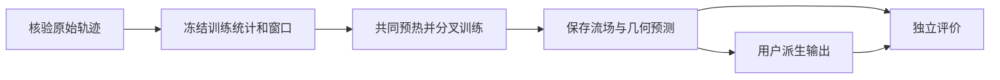
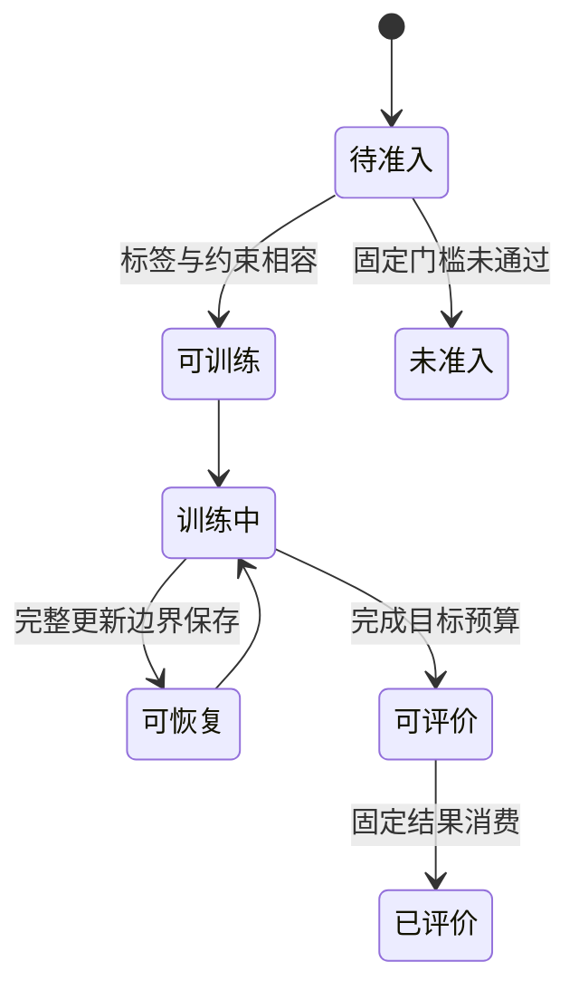

# PCNO 圆柱研究模板

## 目录

- [一、圆柱流动研究](#一圆柱流动研究)
  - [1.1 背景与定位](#11-背景与定位)
  - [1.2 核心业务操作流程图](#12-核心业务操作流程图)
  - [1.3 业务状态机](#13-业务状态机)
  - [1.4 状态值说明](#14-状态值说明)
  - [1.5 功能点清单](#15-功能点清单)
  - [1.6 功能点详解](#16-功能点详解)

## 一、圆柱流动研究

### 1.1 背景与定位

研究者用已知历史预测双圆柱未来流场和几何，比较相同数据监督加入连续性软约束的效果。
本功能是二维时空方法变体，不复现原地热论文精度，也不开放Web。CylinderFlow来源已取得但物理准入未通过。

### 1.2 核心业务操作流程图

### 1.3 业务状态机

### 1.4 状态值说明

未准入不发布可训练结论；可恢复仅表示已保存完整状态；已评价不自动表示物理约束有收益或达到论文精度。

### 1.5 功能点清单

1. 来源与窗口准备
2. 配对训练和完整恢复
3. 固定预测、评价与扩展
4. 安装使用及生成数据清理

### 1.6 功能点详解

#### 1. 来源与窗口准备

使用五条训练轨迹与一条验证轨迹，保留原始时间与网格。训练统计只来自训练分片，准备产物保存索引及统计而非重复场数组。数据为外部只读依赖，复制案例仍须显式绑定可访问来源。字段、数值、坐标或内容摘要不符时失败。

#### 2. 配对训练和完整恢复

普通数据监督始终存在；先预热，再增加梯度误差与散度权重。监督对照采用相同初始化、样本顺序和梯度调度，仅散度项为零。流体组共用预热，结构分支共用一份；恢复包含优化器、随机状态、样本及阶段游标。改变科学预算或配置应开始新实验。

#### 3. 固定预测、评价与扩展

网络只读取已知历史；未来真实几何只用于损失和离线共同评价有效域。验证固定十二帧窗口，不称为整轨迹滚动预测。分别报告误差、连续性及预测几何覆盖，后处理不构建网络。研究者可以替换普通构造器、修改参数并插入速度模长步骤；新增数组单独保存且实际被后处理读取。

#### 4. 安装使用及生成数据清理

完整复制目录既可直接运行，也可由Task执行同一正文。运行与数据目录分离；最终模型、配置、统计、指标与代表性预测保留。仅按准确清单清理本次生成的大文件，原始输入和官方子集不删除。清理后再次核验模型和结果可读。
