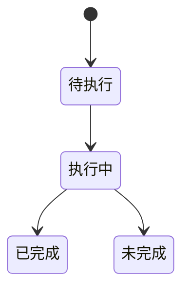

# SafeDiffCon 研究模板

## 目录

- [一、可复制控制研究流程](#一可复制控制研究流程)
  - [1.1 背景与定位](#11-背景与定位)
  - [1.2 核心业务操作流程图](#12-核心业务操作流程图)
  - [1.3 业务状态机](#13-业务状态机)
  - [1.4 状态值说明](#14-状态值说明)
  - [1.5 功能点清单](#15-功能点清单)
  - [1.6 功能点详解](#16-功能点详解)

## 一、可复制控制研究流程

### 1.1 背景与定位

研究人员编辑Python步骤顺序和YAML参数，以原数据完成训练、控制和固定结果评价。只提供代码能力；每案例参考与Dojo及失败重试合计最多三小时。继续执行沿用原账本，不保留完整论文训练另计的执行安排；原论文精度仍是研究目标，缩小变体不承诺达到。

### 1.2 核心业务操作流程图

### 1.3 业务状态机

### 1.4 状态值说明

待执行表示仅有参数；执行中表示计算尚未交付；已完成要求对应步骤产物完整；预算耗尽、异常和数据不符均为未完成，不能据此宣称论文达标。

### 1.5 功能点清单

1. 独立步骤与完整流程

2. 两案例预算与对标

3. 研究者扩展

### 1.6 功能点详解

#### 1. 独立步骤与完整流程

流程正文显示rawprep→trainprep→train→posttrain→infer→post。pipeline 只导入本次选择的阶段；仅执行 trainprep 时不加载训练、后训练或推理专属依赖。每步可单独启动，独立阶段须明确绑定输入；不存在缺数据时自动重训或post自动推理。运行报告与数据目录分开。

模板现提供Task托管入口，可从本地模板新建正式任务，通过Python或命令行提交完整流程或阶段子集。阶段选择只裁剪Python固定研究顺序，空或重复选择拒绝；未实现的选择标为研究未完成，选择排列不能改变算法顺序。Task捕获当前配置与代码，管理运行身份及任务私有输出；算法继续由原领域步骤执行。普通独立脚本入口保持原行为。两个案例均为自包含可复制目录，管理入口从公共配置和同一研究正文发现，不依赖额外任务声明。

复用已准备数据时，预训练绑定三份准备清单；后训练独立提交须绑定预训练权重，推理须绑定完整后训练权重；同次连续阶段直接传递返回产物。后处理只绑定固定结果，即使原始数据、模型构造或求解器不可用仍可评价。执行和失败不增加正式任务版本。当前接入使用通用Task运行接口，未声明平台模型选择、推理批次工作台或专项评价操作；原始处理在任务私有数据目录交付，不自动登记为平台共享数据集。

新公开输入按阶段分组，运行记录与数据输出分开；求解器模型资源属于推理输入，解释器属于执行环境并保留虚拟环境身份。显式旧配置转换仅生成新副本并按原位置解析相对路径，不改写旧准备、检查点和运行快照；旧自定义流程需经离线候选审阅。

物理、准备和固定推理结果支持完整数组目录共享；依赖被改动后不能作为可用输入。预训练、两轮后训练与适配权重保留阶段身份。指标比较核对固定真值、样本、单位、定义和归约；不同预测可比较，不同科学口径不可比较。自定义指标没有声明语义时只作结果展示。

#### 2. 两案例预算与对标

默认dim64/batch16/4000预训练更新、DDIM50、校准200、两轮后训练和1次实际推理适配。全部50测试样本执行真实响应。每案例使用同一个累计账本，175分钟软停止、180分钟硬停止。论文指标保留为参考，短训不承诺原论文精度。

继续训练的总更新目标可以在当前短实验上限20000以内显式调整，但必须先按本机实测耗时与账本余额冻结参数；阶段限时为最终50样本评价预留时间。更换目录不重置累计成本。只保留最近完整预训练状态、必要后训练交接和适配后的有效权重；后训练轮内续训专用入口不属于当前保证范围。

参考证据区分原训练器预训练、原定义校准/后训练/适配独立编排和公共响应/结果适配。Tokamak 源码输出目标与数据目标分别报告；未核清论文目标来源及时间归约时，不能把其中一个字段直接解释为论文达标。

#### 3. 研究者扩展

仓库外复制后可替换普通模型构造器、修改安全引导、在响应后插入派生物理量；扩展量连同单位、轴和有效性写入固定结果，由独立post读回。三种示例的真实短运行证据由专项验收记录列出，变体目录与基线分开。

控制模板提供可选任务描述，声明训练、校准、测试用途及预训练、两轮后训练的权重阶段。候选必须满足全部标签；缺标签或冲突不可选，多个候选保留供研究者选择。复制的本地 application 扩展示范增加校准生产名称条件，普通输入仍只保存路径；不要求自由脚本采用此描述，也不新增控制领域页面。
