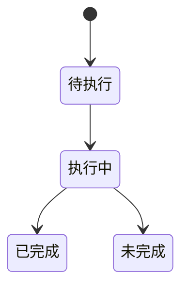

# WDNO 研究模板

## 目录

- [一、可复制小波预测流程](#一可复制小波预测流程)
  - [1.1 背景与定位](#11-背景与定位)
  - [1.2 核心业务操作流程图](#12-核心业务操作流程图)
  - [1.3 业务状态机](#13-业务状态机)
  - [1.4 状态值说明](#14-状态值说明)
  - [1.5 功能点清单](#15-功能点清单)
  - [1.6 功能点详解](#16-功能点详解)

## 一、可复制小波预测流程

### 1.1 背景与定位

研究者与 Agent 编辑普通 Python 步骤和 YAML 参数，以作者数据完成基础预测。当前已完成三小时原账本内的基础预测缩小迁移及直接运行与任务托管适配；实施者已运行组件变体，独立 Agent 也已通过公开材料完成缩小预算下的研究组合、续训和固定结果读回；该结论限于已执行任务，不代表任意科学变体均已验证。完整论文精度、Smoke、超分及控制仍属后续工作，不能把“未完成完整复现”写成“尚未集成基础模型”。

### 1.2 核心业务操作流程图

### 1.3 业务状态机

### 1.4 状态值说明

已完成只表示所选步骤已交付完整产物；预算中断、参数冲突、数据变化和异常均为未完成。模型精度与论文复现结论独立说明。

| 中文含义 | 标识 | 业务说明 |
| --- | --- | --- |
| 待执行 | 待执行 | 已选择流程，尚未开始计算 |
| 执行中 | 执行中 | 正在处理数据或执行模型计算 |
| 已完成 | 已完成 | 所选步骤完整交付，精度结论另行评价 |
| 未完成 | 未完成 | 中断或失败，保留已有证据供排查与恢复 |

### 1.5 功能点清单

1. 独立阶段与完整流程

2. 参数、能力与新变体

3. 恢复与对照

### 1.6 功能点详解

#### 1. 独立阶段与完整流程

Python 正文明确依次调用 rawprep、trainprep、train、infer、post。每个阶段可独立启动；独立执行必须提供上一阶段的明确清单或检查点。YAML 不维护另一份流程顺序。输出和运行目录位于 recipe 代码之外，已有数据拒绝覆盖。直接运行与Task托管共用同一份流程和阶段参数；Task自动发现公共脚本与配置，不要求额外任务入口文件。新建任务后可分别提交处理、准备、训练、推理和后处理；每次检查最终状态和真实产物，提交成功本身不代表计算完成。外部输入按阶段逐个声明路径，连续执行使用前序返回值；同时提供的不同输入拒绝冲突。运行器为每次执行分配数据目录，阶段发布已有资产和带口径指标，管理层不解释WDNO算法。

模板和基础案例分别支持原样复制后执行，任务托管消费同一流程。基础入口不自动叠加扩展示例。已登记的物理数组和准备按自包含目录复制，检查点按完整文件复制；研究者须明确绑定复制品，复制动作不自动选择训练输入。历史来源路径作为出处保留，实际数组按清单内相对位置读取。原始来源协议引用外部大文件时，复制协议不代表数据已复制。

#### 2. 参数、能力与新变体

研究者可在完整配置中按需增加优化器、调度器或单次更新函数选择，只编写变化部分，继续复用数据流、取消、日志与恢复。新增键不要求旧目录迁移；未选择时原默认不变。自定义更新限单优化器、完整精度、无额外持久状态。扩展文件先覆盖到完整模板，不能把局部示例当作完整运行目录。

修改宽度、层数、分组、学习率、更新次数和采样步数形成参数变体；复制目录中定义普通函数即可替换网络、目标或预测。扩展覆盖文件集提供完整配置、研究正文和普通能力文件，须覆盖到完整模板副本使用。示例将网络层级改成两层、损失权重改为一半，并保存按空间平均的能量场；预测后新增能量读回步骤，以固定预测独立重算，缺字段、形状不符、非有限值或数值不符均失败，检查模式不写成功报告。变体独立输出，单位与样本身份一并读回，不声称优于原版。可在Python中插入普通结果步骤，两种入口均执行；示例检查随预测执行，需要单独选择自定义阶段时，在复制目录的范围校验中明确扩展。

#### 3. 恢复与对照

Dojo 完整状态用于继续训练，原仓库文件仅用于明确权重导入。修改目标总步数不重置已完成更新。原版与 Dojo 在同一环境、同一划分和同一预算下对照，报告学习效果、迁移一致性与论文精度三类结论。旧用户配置需显式转换成新副本，正常加载拒绝旧键及新旧混用；原数组清单和检查点按既有科学合同消费，配置换位置不重写历史。运行和续训不创建任务版本。指标比较核对样本和真值身份、单位、统计定义及评价函数，缺项不可比。本实验计算由既有累计账本监督，阶段时限不能代替总上限，续接时账本不存在明确失败，不自动重新建账。此次正式使用入口是隔离安装后的Python recipe和Task；正式Web冒烟不适用。

增加训练量与中断恢复分开：前者选择已有准备和完整检查点、提高总更新目标并提交独立训练；后者恢复该独立训练运行的冻结代码及原目标。已完成训练的恢复不会自动增加更新次数。运行与恢复不增加正式版本，只有新建和分叉产生新版本。

新指标同时绑定结果清单及全部数组，包括预测、真值、样本身份和派生量；任一依赖缺失或变化，指标不可用于有效比较。预测值只参与完整性核验，不加入科学可比身份，因此不同模型仍可按同一真值和评价定义比较。历史指标不自动回写，需独立后处理生成新记录才能获得完整依赖保护。
