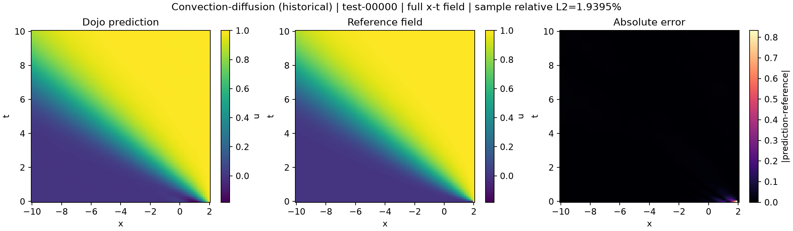
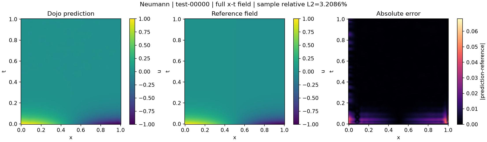
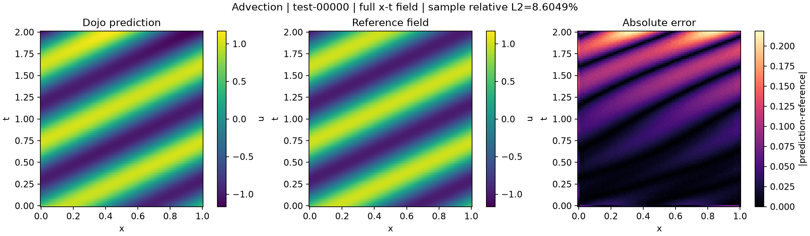
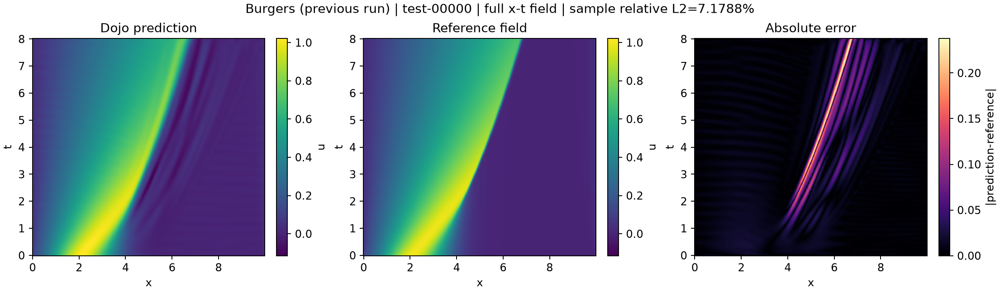
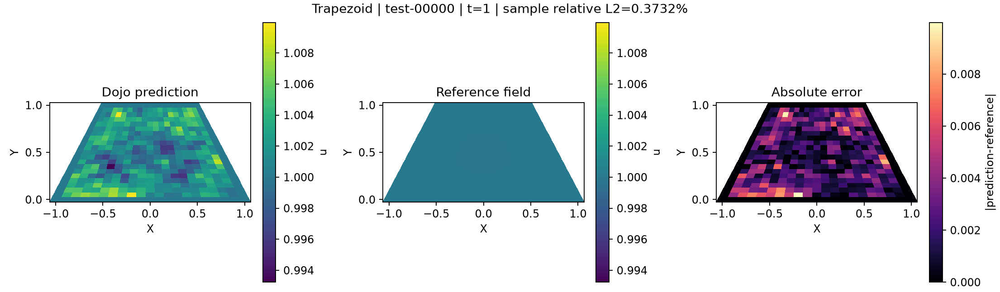

# PI-BSNet 五案例 Dojo 精度与文献对照报告

更新日期：2026-09-14。本文汇总已保存的完整实验结果，本次整理没有新增训练或修改算法。

**Neumann 与论文非常接近，Advection 误差低于论文均值；梯形仍有差距。对流–扩散和 Burgers 展示此前 Dojo 实跑结果，不能声明五例均已完成当前版本的重新验证。**

## 1. 指标与比较口径

预测对象是随坐标变化的标量场，而不是一个固定数值。下表报告预测场与参考场之间的平均相对 L2 误差，越小越好；它不是“准确率”，也不能直接用 100% 减去误差作为准确率。

对流–扩散、Neumann、Advection 和 Burgers 按每个测试实例的完整场计算 `||预测−参考||₂ / ||参考||₂`，再对实例取算术平均。梯形按每个时间片计算空间相对 L2，再对时间与测试实例平均，保留该案例原评价方式。

差距的绝对值使用“百分点”；相对变化为 `(Dojo误差 / 论文误差 − 1) × 100%`。负值表示 Dojo 误差更小。不同测试名单、环境和重复运行次数，仅支持数值对照，不能据此宣称统计上优于论文。论文的 ± 值按原报告保留，不解释成置信区间。

## 2. 五案例精度汇总

| 案例及预测物理量 | Dojo 平均相对 L2 误差 | 文献误差 | Dojo 与文献差距 | 实跑版本与范围 |
| --- | ---: | ---: | --- | --- |
| 对流–扩散：恢复概率场 s(x,t) | **1.9395%** | **约 1% 量级**，Figure 4 图示估读 | 不计算精确差值 | 历史 Dojo 完整训练，5000 轮、1 个测试实例；当前整轮求和算术顺序变更后未重跑 |
| Neumann 扩散：标量场 u(x,t) | **1.8814%** | **1.932%** | **−0.0506 个百分点**；误差相对低 **2.62%** | 当前原代码迁移版，5000 轮 / 5000 更新，50 训练、10 测试实例 |
| Advection：周期对流标量场 u(x,t) | **10.4270%** | **14.44% ± 13.52 个百分点** | **−4.0130 个百分点**；误差相对低 **27.79%** | 当前原代码迁移版，2000 轮 / 200000 更新，100 训练、30 测试实例 |
| Burgers：非线性标量场 u(x,t) | **10.0607%** | **7.294% ± 1.908 个百分点** | **+2.7667 个百分点**；误差相对高 **37.93%** | 此前 Dojo 完整训练，5000 轮 / 500000 更新，100 训练、20 测试实例；尚未按原算法重新迁移 |
| 梯形域扩散：标量场 u(X,Y,t) | **0.5405%** | **0.3172% ± 0.1580 个百分点** | **+0.2233 个百分点**；误差相对高 **70.38%** | 已选十实例迁移版，3000 轮 / 30000 更新，10 训练、10 测试实例 |

未取整的已保存指标：Neumann `0.01881386627241883`；Advection `0.10427001951814978`；梯形 `0.0054045460485998955`。历史对流–扩散与 Burgers 的 FP64 重算汇总分别为 `0.01939550`、`0.10060746`。

## 3. 逐案例解释

### 对流–扩散

当前可引用的 Dojo 完整实验误差为 1.9395%。论文对应 §5.1 / D.1、Figure 4，结果约为 1% 量级，不能把图示估读当作精确的 1.0000%。Dojo 的单测试实例也不能代替论文十次独立运行统计。

此前 Dojo 修改了物理导数、端点、数据计算和初始控制行处理，自由系数为 600，而原代码为 576。本轮公共整轮求和的算术顺序也有修改，尚未完成该案例新版本的全预算重跑，因此表中明确标为历史结果。目前没有证据分离各项改动对误差的贡献。

### Neumann 扩散

Dojo 的 1.8814% 与论文 C.4 / Table 1 的 1.932% 非常接近。当前保留原参数空间导数、原二阶递推与端点、初始化随机消耗，以及整轮损失顺序求和后一次反传的更新方式。

同环境独立原函数与 Dojo 的全部最终权重、5000 条轮次损失和 10 个测试预测场逐值一致。这支持迁移数值行为已经对齐；不证明作者未公开的测试名单与本次相同。真值为 `u(x,t)=cos(πx)exp(−νπ²t)`。

### Advection

Dojo 的 10.4270% 低于论文 §5.2 / D.2 的均值 14.44%。当前保留原初始控制行插值、参数导数、融合 MSELoss 和逐实例 Adam 更新，不再以解析初值 lifting 替换原实现。

同环境独立原函数与 Dojo 的全部最终权重、2000 条轮次损失和 30 个测试预测场逐值一致。论文报告的测试波动较大，测试名单未对齐，不能将一次均值更低解释成方法改进。真值为周期传播场 `u(x,t)=sin[2π((x−βt) mod 1)+φ]`。

### Burgers

此前 Dojo 完整实验为 10.0607%，高于论文 F.1 的 7.294%。Dojo 与原实现仍有对流项符号、物理导数和数据网格等差异；原代码与论文的 L2 / MSE 损失也存在冲突，尚未按原算法重新迁移。

此前独立原代码实验约为 10.3456%，仅修改论文正对流项和 MSE 的独立实验约为 10.4589%。这两项修改没有改善该次实验精度，但不能据此确定唯一原因；这些独立结果均未替代上表的 Dojo 数值。参考场来自周期 FFT 空间离散与数值时间积分，本身有离散误差。

### 梯形域扩散

Dojo 已使用用户选定的 10 训练实例、100×20×20 控制点、3000 轮和 0.001 PDE 权重，保留原 Euler 数据求解及参数样条数值行为。论文对应 §5.3 / D.3；主文 10 实例与附录 50 实例的冲突仍披露，本例采用已选主文方案。

**当前 Dojo 实测是 0.5405%；此前 0.3053% 是旧环境独立实验，不能计作当前 Dojo 结果。** 同环境原函数与 Dojo 的最终权重、3000 条损失和 10 个预测场完全一致，同样得到 0.5405%。因此已验证的迁移差异为零，但跨环境重新训练会产生不同结果，尚未隔离到具体库或算子。

当前 Dojo 环境为 Python 3.12.14 / NumPy 2.5.3 / PyTorch 2.14.0；旧独立环境为 Python 3.9.25 / NumPy 1.26.4 / PyTorch 2.8.0。两者均为本机 CPU 实验，不能宣称复刻论文 RTX4090 环境。梯形整体时空相对 L2 为 `0.005423066435625465`，与表中的逐时间平均指标分开记录。

## 4. 验收范围与剩余工作

Neumann、Advection 已完成数据生成、准备、Dojo 全预算训练、独立 post 和同环境原函数逐值对照；75 项相关测试通过，覆盖完整产物、恢复和真实 wheel 安装。梯形已有独立全预算迁移验收。

对流–扩散与 Burgers 尚未完成本轮原算法重新迁移；对流–扩散当前默认更新算术顺序的精度还需重新运行。论文与原代码冲突依此前约定核对，不通过未披露的调参消除差距。旧数据、准备和检查点的兼容性按各案例协议处理，历史证据不批量改写。

## 5. 报告与原始证据

以下为本机证据的绝对路径；复制仓库到其他机器后需要同时取得相应实验资产。

- [Neumann / Advection 迁移验收报告](/Users/zonghui/work/project_simulation/dojo_train/pibsnet/source_dojo_2026-09-14/reports/迁移验收报告.md)及[指标证据](/Users/zonghui/work/project_simulation/dojo_train/pibsnet/source_dojo_2026-09-14/reports/verification.json)。
- [梯形十实例接入验证报告](/Users/zonghui/work/project_simulation/dojo_train/pibsnet/trapezoid_dojo_10/接入验证报告.md)及[指标证据](/Users/zonghui/work/project_simulation/dojo_train/pibsnet/trapezoid_dojo_10/verification.json)。
- [此前五例 Dojo 指标证据](/Users/zonghui/work/project_simulation/dojo_train/pibsnet/reports/dojo_paper_truth_2026-09-14/verified_evidence.json)：本文只沿用其中对流–扩散和 Burgers；其他三例已被后续迁移结果取代。
- [原仓库五例完整基线报告](/Users/zonghui/work/project_simulation/dojo_train/pibsnet/original_baseline/reports/原仓库五案例基线报告.md)：独立原代码实验，不作为 Dojo 实测。
- [论文参数三组独立验证报告](/Users/zonghui/work/project_simulation/dojo_train/pibsnet/paper_parameter_trials_2026-09-14_run2/reports/论文参数三组验证报告.md)：Burgers 与梯形 10/50 实例的限定参数实验。
- [仓库专项验收记录](../../.context/mvp/pibsnet-acceptance.md)：历次设置、失败、迁移和测试范围。
- [原论文 PDF](/Users/zonghui/work/new_code_project/PI-BSNet/docs/PI-BSNet.pdf)：arXiv 2503.16777v3；原仓库锁定提交 `40ffb6239d865b6b7a16538559939a990e6d9cd5`。

## 6. 全测试集补充指标与预测云图

以下指标从本报告对应版本的全部预测数组以 FP64 重新计算。MAE、RMSE 按全部测试点等权汇总；最大绝对误差取全部测试点最大值。它们采用各案例标量场的数值单位，不能跨案例直接比较。论文未报告这些指标的对应数值，因此不能补造论文 MAE / RMSE。

| 案例 | 测试实例 | 平均相对L2 | MAE | RMSE | 最大绝对误差 |
| --- | ---: | ---: | ---: | ---: | ---: |
| 对流–扩散（历史） | 1 | 1.9395% | 0.00369577 | 0.0141985 | 0.832405 |
| Neumann | 10 | 1.8814% | 0.00135932 | 0.00330857 | 0.0682013 |
| Advection | 30 | 10.4270% | 0.0571028 | 0.0849574 | 0.824339 |
| Burgers（此前实跑） | 20 | 10.0607% | 0.0154036 | 0.0401668 | 0.581707 |
| 梯形（十实例迁移） | 10 | 0.5405% | 0.00346424 | 0.00498893 | 0.19971 |

每例固定展示 `test-00000`，不按误差挑选。左图为 Dojo 预测，中图为同输入的解析/数值参考场，右图为绝对误差；预测与参考共用色标。前四例为完整时空场，梯形为最后时刻的物理域切片；图题中的样本相对L2仍按该实例完整评价范围计算，不是最后时刻误差。

**论文未提供可用于本次对照的逐点预测数组，因此中图不是论文模型的预测云图。论文对标采用第2节的原文相对L2指标；此处云图展示Dojo与参考场的实际差异。**

### 对流–扩散（历史）

### Neumann

### Advection

### Burgers（此前实跑）

### 梯形（十实例迁移）

[补充指标、逐实例误差与源数组摘要](figures/accuracy-2026-09-14/metrics.json)。图像随本报告存放于仓库，复制文档时应保留相邻 figures 目录。
