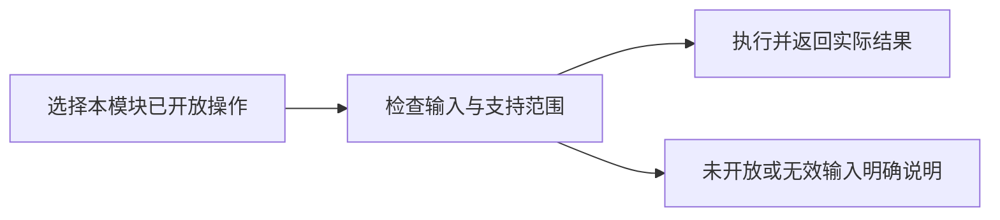

# reportDesigner

## 目录

- [一、reportDesigner](#一reportdesigner)
  - [1.1 背景与定位](#11-背景与定位)
  - [1.2 核心业务操作流程图](#12-核心业务操作流程图)
  - [1.3 业务状态机](#13-业务状态机)
  - [1.4 状态值说明](#14-状态值说明)
  - [1.5 功能点清单](#15-功能点清单)
  - [1.6 功能点详解](#16-功能点详解)

## 一、reportDesigner

### 1.1 背景与定位

保留本模块产品需求，现行行为与未实现范围分项说明。底层内核能力、数据结构占位和其它模块的交互不算本模块交付。本轮整理不补未实现功能。

### 1.2 核心业务操作流程图

### 1.3 业务状态机

本章不另建统一业务状态机；已有草稿、版本或异步输出的状态沿用对应已实现操作。未开放操作没有成功状态。

### 1.4 状态值说明

已实现表示已有实际调用链；部分实现表示仅支持详解列明的范围；未实现表示保留需求，不能据目录或类型声明调用完成。操作失败保留原有数据，不生成虚假成功结果。

### 1.5 功能点清单

1. 报告内容、布局、拖拽与撤销重做（已实现）
2. 报告引用已保存的任务可视化（已实现）

### 1.6 功能点详解

#### 1. 报告内容、布局、拖拽与撤销重做（已实现）

编排页使用 DndContext、章节/行/12 列块布局和 historyReducer；可编辑草稿并保存。

业务范围：报告内容、布局、拖拽、历史操作、草稿和乐观锁编排；与报告中心管理保持独立边界。

引用验收：素材库必须来自统一运行库中的已保存 Visualization；每个引用冻结 artifact、visualization、Spec 版本和内容哈希。

报告素材引用固定资产、配置修订、摘要和视口；后续配置修改或增加导出不影响已冻结报告。原报告编排能力保留，本期不扩展平台报告产品流程。

### 固定任务可视化引用

报告素材库在有context时查询当前任务配置资产。新增引用冻结project_id、task_id、visualization_id、revision、content_hash和view；领域校验拒绝非正整数修订，原SQLite引用格式继续读。导出与重试显式传入当前context，不把context或Trame URL写入文档。对应test_report_designer.py和test_vis_exports.py。

#### 2. 报告引用已保存的任务可视化（已实现）

素材库取得已保存可视化，报告通过 visIO materialize_reference 请求图片；需要任务上下文的输出在 Vis 内完成。
