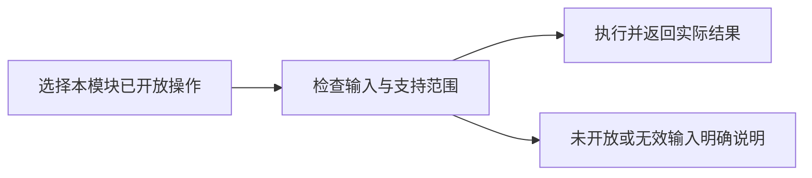

# reportManage

## 目录

- [一、reportManage](#一reportmanage)
  - [1.1 背景与定位](#11-背景与定位)
  - [1.2 核心业务操作流程图](#12-核心业务操作流程图)
  - [1.3 业务状态机](#13-业务状态机)
  - [1.4 状态值说明](#14-状态值说明)
  - [1.5 功能点清单](#15-功能点清单)
  - [1.6 功能点详解](#16-功能点详解)

## 一、reportManage

### 1.1 背景与定位

保留本模块产品需求，现行行为与未实现范围分项说明。底层内核能力、数据结构占位和其它模块的交互不算本模块交付。本轮整理不补未实现功能。

### 1.2 核心业务操作流程图

### 1.3 业务状态机

本章不另建统一业务状态机；已有草稿、版本或异步输出的状态沿用对应已实现操作。未开放操作没有成功状态。

### 1.4 状态值说明

已实现表示已有实际调用链；部分实现表示仅支持详解列明的范围；未实现表示保留需求，不能据目录或类型声明调用完成。操作失败保留原有数据，不生成虚假成功结果。

### 1.5 功能点清单

1. 报告新建、查询、复制、冻结及导出（已实现）
2. 报告删除、收藏及母版管理（未实现）

### 1.6 功能点详解

#### 1. 报告新建、查询、复制、冻结及导出（已实现）

独立 Vis 报告中心接通报告存储、草稿/固定版本、复制、Quarto HTML/PDF 异步输出与下载。

业务范围：报告 CRUD、查询、收藏、版本、母版、冻结、复制、导出和下载。详细功能以用户确认的功能模块清单为准。

恢复验收：切换运行库时必须保留当前报告，并通过模块 Repository 合并旧进程期间新增的报告；同 ID 不同内容必须拒绝覆盖。

报告数量以报告中心 API 返回为准，应用壳不得硬编码会过期的业务计数。

报告可引用固定的可视化资产、配置修订及视口。显式报告输出通过可视化输出接口请求图片；不保存临时会话 URL，不另建物理场截图实现。没有任务上下文时拒绝新物理场引用的导出；历史报告读取保持兼容。

#### 2. 报告删除、收藏及母版管理（未实现）

当前报告 API/公开门面没有删除或收藏操作，也没有母版库管理；新建的 analysis/validation/weekly/blank 是内置起步模板，不能等同可管理母版。
