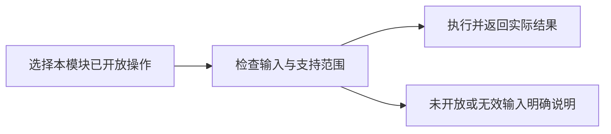

# visConvertor

## 目录

- [一、visConvertor](#一visconvertor)
  - [1.1 背景与定位](#11-背景与定位)
  - [1.2 核心业务操作流程图](#12-核心业务操作流程图)
  - [1.3 业务状态机](#13-业务状态机)
  - [1.4 状态值说明](#14-状态值说明)
  - [1.5 功能点清单](#15-功能点清单)
  - [1.6 功能点详解](#16-功能点详解)

## 一、visConvertor

### 1.1 背景与定位

保留本模块产品需求，现行行为与未实现范围分项说明。底层内核能力、数据结构占位和其它模块的交互不算本模块交付。本轮整理不补未实现功能。

### 1.2 核心业务操作流程图

### 1.3 业务状态机

本章不另建统一业务状态机；已有草稿、版本或异步输出的状态沿用对应已实现操作。未开放操作没有成功状态。

### 1.4 状态值说明

已实现表示已有实际调用链；部分实现表示仅支持详解列明的范围；未实现表示保留需求，不能据目录或类型声明调用完成。操作失败保留原有数据，不生成虚假成功结果。

### 1.5 功能点清单

1. STL 与兼容网格到 GLB（已实现）
2. STEP、DXF、CSV/JSON 到 GLB（未实现）

### 1.6 功能点详解

#### 1. STL 与兼容网格到 GLB（已实现）

转换器支持 VTU/VTS/VTM/VTP/STL/PLY/OBJ，经表面提取与三角化写 GLB，已接几何读取和报告导出调用。

业务范围：STEP、STL、DXF、CSV/JSON 及现有兼容几何到 GLB 的格式转换。实际支持状态必须由测试证明，不能按需求名称推断已实现。

#### 2. STEP、DXF、CSV/JSON 到 GLB（未实现）

转换器读入分发表无这些格式；未识别扩展名直接报 unsupported GEO source format。CSV/JSON 的表格/图表解析是另一项功能。
