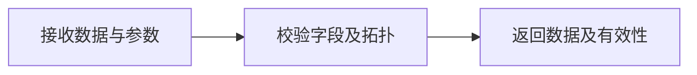

# VTK 计算与渲染原语

## 目录

- [一、VTK 计算与渲染原语](#一VTK 计算与渲染原语)
  - [1.1 背景与定位](#11-背景与定位)
  - [1.2 核心业务操作流程图](#12-核心业务操作流程图)
  - [1.3 业务状态机](#13-业务状态机)
  - [1.4 状态值说明](#14-状态值说明)
  - [1.5 功能点清单](#15-功能点清单)
  - [1.6 功能点详解](#16-功能点详解)

## 一、VTK 计算与渲染原语

### 1.1 背景与定位

提供无资产业务含义的 VTK、数值、缓存、内存与性能能力。会话、任务、URL、Trame 状态和数据库不属于本模块。

### 1.2 核心业务操作流程图

完整流程：接收数据与参数 → 校验字段及拓扑 → 执行计算 → 返回数据及有效性。

### 1.3 业务状态机

本章无业务状态；每次调用返回结果或明确异常，业务回滚由调用者管理。

### 1.4 状态值说明

成功表示本次操作完整交付；失败保持原可用结果。未完成或被取消不得标记为已完成。本章不额外建立全局状态或数据库。

### 1.5 功能点清单

1. 现行功能与使用约定

### 1.6 功能点详解

#### 1. 现行功能与使用约定

矢量符号支持箭头、圆锥及线段，内部仍按固定、矢量模长、标量绝对值缩放。箭头尺寸仅箭头形状校验，圆锥和线段忽略残留尺寸。节点间隔保留原行为；空间均匀采样按指定间距分箱，确定性选择距离箱中心最近的原节点，保持字段身份与输入数组不变。标量和矢量的单元数据先转换到节点再生成几何。切面另收皱折与三角化：默认皱折保留被切到的完整单元面，关闭皱折仍是平面切开并保留多边形交面，打开三角化才拆成三角。剖切另收皱折，打开后保留被切到的整格。导出用的三角化路径不动。沿线等距采样按两端点和分辨率取点，返回弧长、有效标记和各场数值。工作台线段提取不绑定拖动手柄，内核仍可计算线段几何。

等值计算保留实际生成标量；同一计算字段的显示不对插值向量重新求模。平面几何包含三轴箭头、三个旋转环与独立边框，拾取不包含平面内部；轴角变换按明确轴计算。

切面、平面剖切、表面提取、Glyph、流线、等值面、等高线、沿线采样与空间采样。等值面要求体单元，等高线要求表面或显式提取表面。矢量方向、分量和 point/cell 归属显式给出。流线由线段、球体、平面或外来表面种子积分；缺省按线段兼容旧起终点。平面预览只给出平面片、三轴手柄和旋转环，不切开网格。流线种子手柄几何仍保留在内核，本期工作台不绑定拖动。线段两端手柄只回填几何，不积分、不切开；线段提取工作台不绑定这些手柄。流线显示可将积分折线保持为线，或用圆管（半径、圆周面数 3–64）生成表面。

同拓扑复用几何时必须保留新时间步的点场、单元场和元信息；域外采样返回无效标记，同名 point/cell 字段通过归属区分。标量着色保留原字段，只生成所选分量或模长；同一输入的近期选择可复用，输入修改后失效，缓存有界并随输入释放。默认光照使用 VTK/ParaView `vtkLightKit`：主光强度 0.75，K:F=3、K:B=3.5、K:H=3，主光方位 50°/10°，补光 −75°/−10°，轮廓光 0°/±110°，共五盏灯；关掉 VTK 自动单头灯，避免可见背光面全黑。不改材质 Ambient/Diffuse，色标仍按物理量着色。阴影能力由实际渲染环境决定，默认关闭，仅 Linux 远程可开，单独验收。

流线内核只消费速度网格和已构造的种子点，不读文件、不认对象树。缺种子、非法方向或种子数为空时明确失败。积分长度按几何长度理解，不按格子数。种子先贴到速度网格最近处；表面场去掉法向分量后再积分。切面与剖切除原点和法向外另收皱折，切面还可选三角化。平面预览按包围盒生成可视平面与手柄；拖动算术只返回新的原点和法向，调用方决定是否提交切开。线段手柄只改几何。流线种子拖动手柄本期不接入调用方。
