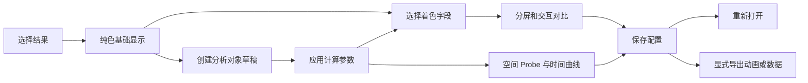
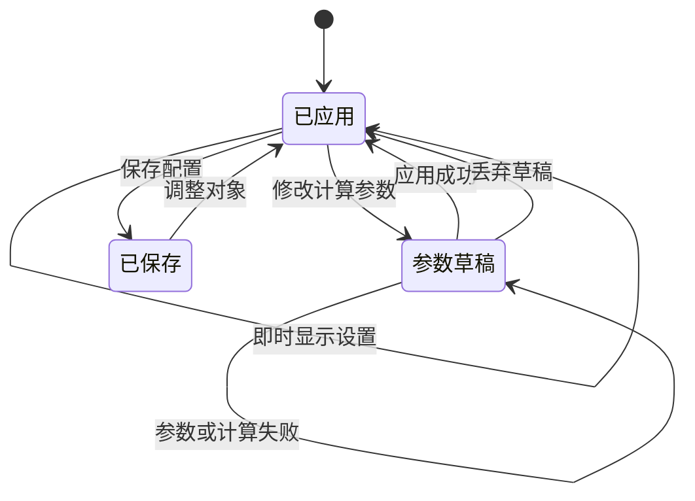

# 三维物理场工作台

## 目录

- [一、对象分析与结果展示](#一对象分析与结果展示)
  - [1.1 背景与定位](#11-背景与定位)
  - [1.2 核心业务操作流程图](#12-核心业务操作流程图)
  - [1.3 业务状态机](#13-业务状态机)
  - [1.4 状态值说明](#14-状态值说明)
  - [1.5 功能点清单](#15-功能点清单)
  - [1.6 功能点详解](#16-功能点详解)

## 一、对象分析与结果展示

### 1.1 背景与定位

面向仿真后处理，以可嵌入的独立工作台管理多个结果及分析对象。采用两行工具栏、左上资产树、左下单对象属性与中央视图。着色是显示属性，不是单独的云图创建操作；不预建压力场或温度场节点。多个布局、自动数据对齐和时间插值不在本期范围。

### 1.2 核心业务操作流程图

### 1.3 业务状态机

### 1.4 状态值说明

- 已应用：当前可用场景；显示设置即时生效。
- 参数草稿：尚未执行的计算设置；失败仍保留旧画面。
- 已保存：具有固定配置修订，可以重新打开或导出。
- 输出运行中、成功、失败、取消：由输出管理提供，独立于场景保存状态。

### 1.5 功能点清单

1. 结果与对象管理。
2. 计算和着色。
3. 固定空间 Probe。
4. 一个布局、多视图。
5. 时间播放与动画输出。
6. 配置恢复与独立嵌入。

### 1.6 功能点详解

#### 1. 结果与对象管理

导入结果自动创建纯色基础对象，支持会话内追加。切面、剖切、矢量、流线、等值面、等高线和 Probe 由用户创建；同一输入的未应用草稿只留一份，连点不嵌套、不重推整屏。分析对象可继续作为下游输入。支持搜索、显隐、重命名、复制和依赖删除；对象树显隐只改活动视图已有 actor，不重建映射、不重读网格。对象树每行提供删除图标，复制不复制源文件，删除不删除原数据。删除下游依赖需列出影响范围并确认，被流线当作种子的表面也计入依赖。

“导入结果”可搜索宿主返回的已登记来源；有名称时显示名称，否则显示资产标识。选择单文件即可追加，目录来源需明确成员；追加不新建会话，也不重置原对象及相机。宿主未提供文件名时不猜测名称。

#### 2. 计算和着色

单对象属性只显示当前对象参数。左栏采用上部对象树与下部属性表单，树略收、属性加高并自滚，标签和输入横向排列；原点、法向和空间坐标分为三个独立输入。嵌入预览贴合父框高度，不用整屏高度再叠一层。颜色、色标、透明度、表示模式和光照即时生效；切面法向等计算参数通过“应用”提交。切换对象保留草稿，保存或导出前处理草稿。计算字段和着色字段分开，例如流线按速度计算、按压力着色。字段归属与分量显式选择；范围与归一化统计独立。法向无量纲，未声明的单位不猜测。

流线起点可选线段、球体、平面或命名面。命名面来自对象树已算出的表面，或同一授权文件中带名称的二维块和文字分区；剖切是体，不作为面。新建流线按输入包围盒填写起点、半径和积分长度；积分前把种子贴到当前网格，表面场沿切向前进。线段、球体、平面的参数写在流线属性里，应用后在同视图画出种子，不能拖、不另建对象。命名面只标出实际采样点。缺起点类型的旧流线仍按线段起终点计算。

选中切面或剖切时显示可视平面、三向轴手柄和旋转环；可沿 X/Y/Z 平移原点，可点属性 X/Y/Z 把法向设成轴对齐，也可旋转法向。拖动只预览并回填数字，切开结果停在上一次成功应用。未选中时撤下附件。可视平面不进对象树、不进保存配置。本地与远程走同一条射线命令，不用服务端隐式平面控件冒充本地可用。

平面切面返回交线或切面；剖切保留所选半空间数据。等值面要求体数据，等高线要求表面或切面。域内空结果明确提示，错误参数保留上一次成功结果。

#### 3. 固定空间 Probe

通过表面点击或 XYZ 坐标指定位置，保存输入、位置、所选字段和标签显隐。查询同一空间位置的当前值及时间曲线；同名点场、单元场区分展示。重新打开 Probe 后，标签可选字段和网格信息继续来自输入对象。域外或缺帧显示无效，不以零填充。数值标签与标记跟随视图显示，标签按屏幕像素设定初始字号，在小视口内缩放定位并通过引线连接固定锚点；标签、方向轴与时间进入截图和动画。CSV 单分量字段输出数值单元格，缺失位置保持空值及无效标记，历史导出不改写。CSV 仅在明确导出时生成，“导出 CSV”直接预选 CSV 格式；通用图片/数据菜单仍默认图片。

#### 4. 一个布局、多视图

支持一至四个窗口。新增标签即新增窗口：先全幅，再横排两个，第三个出现在下方通栏，第四个形成田字格。每个窗体左上角是对应标签，窗体边框为白色底上的明确描边。各窗口共享处理对象，独立保存显隐、着色与图例。关闭窗口不删除对象。相机联动默认关闭，开启后全体窗口共用相机；跨结果要求明确共用坐标空间。方向轴、标准方向与适窗属于当前窗口。蓝色线性图标工具带提供直接操作；窄窗口把分析和标准方向收纳到菜单，菜单挂到页面根节点以免被工作台裁切，操作不因裁切而丢失。宿主嵌入时关闭后的对话框蒙层不得挡住三维窗口点击。鼠标轨道结束只回写活动相机，不重建对象树、不重读网格；容器尺寸变化只重定位注记。恢复视角与分屏后按可见结果调整近远裁剪范围，避免远距离相机截断结果；联动覆盖全部窗口的共同可见范围。

#### 5. 时间播放与动画输出

使用实际时间步，支持正反播放、逐帧、暂停及停止回首帧。多个结果精确匹配时间，缺帧明确提示。同拓扑可复用几何，字段始终使用当前帧。顶部动画入口默认逐帧生成 MP4，选择范围、方向、步长和输出视图；默认 1280×720、24 fps，不插值物理时间。实际操作 WebM 录制在导出菜单中。导出必须绑定已保存修订，支持进度、取消和成功下载。

#### 6. 配置恢复与独立嵌入

保存来源引用、对象参数和显示布局，不保存网格副本或自动截图。旧配置读取时兼容转换，历史修订与摘要保持原样，再次保存产生新修订。独立工作台与宿主共用功能，嵌入时移除外围留白与重复工具栏；导出状态作为可关闭提示显示，不挤占工作区；宿主选择项目任务及授权来源，共享表单处理资产保存和输出。保存不创建研究任务版本。阴影只在受支持的 Linux 远程环境开放，其验收与本机普通光照分开记录。

后处理宿主在Tab间切换只改变可见性，不销毁工作区。隐藏暂停当前播放但保持连接与心跳，返回更新视口尺寸；对象和各自未应用草稿保持。IPC追加来源前保存当前草稿，多个来源加载失败保留旧场景。来源追加按固定引用去重，离开宿主页才关闭；刷新后仍需显式保存的配置恢复。显式重开或宿主重建时先关闭旧会话再创建，避免占满并发后iframe没有会话地址。满员时回收已无心跳的短空闲会话；活动页面的续约不受影响。

物理场嵌入页面按父 iframe 高度布局：拉高 Ant Design App 包装层，不用 100dvh 再叠一层浏览器视口，并覆盖 Vuetify 默认 100vh，避免主体被压成只剩工具条。后处理宿主给三维页剩余视口高度；宿主切换Tab保持文档；显式重开新会话替换文档。验收同时检查内外iframe高度比例、真实工具栏和完整视口，不以存在canvas代替布局验收。
